---

## 7. المخططات الهيكلية والوظيفية

### 7.1 مخطط السياق

يوضح مخطط السياق النظرة الشاملة لنظام رحلتي VIP وتفاعلاته مع الكيانات الخارجية الأربعة الرئيسية. يعمل هذا المخطط كنقطة انطلاق لفهم حدود النظام ونقاط التفاعل مع البيئة المحيطة، ويشكل الأساس الذي تبنى عليه المخططات الأكثر تفصيلاً في المستويات التالية.

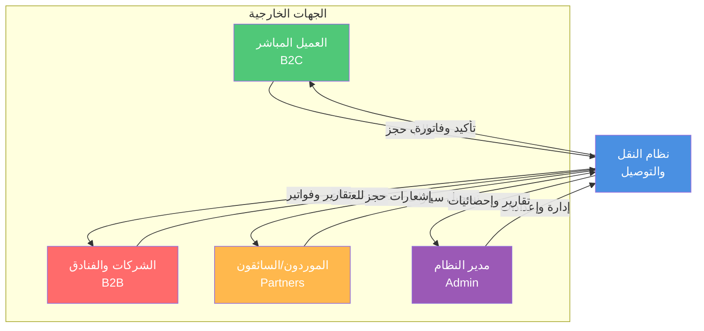

يمثل العميل المباشر الكيان الخارجي الأول الذي يتفاعل مع النظام بشكل مستقل لحجز خدمات النقل لاستخدامه الشخصي. يرسل هذا العميل إلى النظام طلبات حجز تتضمن تفاصيل الرحلة المطلوبة ونوع الخدمة المفضل وفئة المركبة والتاريخ والوقت المحددين، بالإضافة إلى معلومات الدفع اللازمة لإتمام المعاملة. يستقبل العميل من النظام تأكيداً فورياً للحجز يتضمن رقماً مرجعياً فريداً وملخصاً لتفاصيل الطلب، يتبعه لاحقاً إشعارات بالموافقة الإدارية ومعلومات السائق والمركبة المخصصة عند اقتراب موعد الخدمة، وأخيراً الفاتورة النهائية بعد إتمام الرحلة.

تمثل الشركات والفنادق الكيان الخارجي الثاني الذي يتعامل مع النظام نيابة عن عملائها أو ضيوفها. تقدم هذه المؤسسات طلبات حجز متعددة لصالح أطراف ثالثة، وتطلب تسهيلات دفع خاصة مثل الفواتير الموحدة والدفع الآجل ضمن حدود ائتمانية متفق عليها. يزود النظام هذه المؤسسات بتأكيدات فورية للحجوزات مع أرقام مرجعية يمكن تسليمها للعملاء النهائيين، وفواتير شهرية شاملة تجمع جميع المعاملات في وثيقة واحدة منظمة، بالإضافة إلى تقارير تحليلية تساعدهم على فهم أنماط استخدام الخدمة وإدارة ميزانياتهم بفعالية.

يشكل الموردون والسائقون الشركاء الكيان الخارجي الثالث الذي يزود النظام بالقدرات التشغيلية اللازمة. يقوم هؤلاء الموردون بتسجيل مركباتهم في المنصة مع كافة التفاصيل والمستندات المطلوبة، ويقبلون أو يرفضون الحجوزات المعروضة عليهم بناءً على توفرهم وجداولهم. يرسل النظام إلى الموردين إشعارات فورية بالحجوزات الجديدة التي تطابق مواصفات مركباتهم ومواقعهم، ويزودهم بكافة المعلومات اللازمة لتنفيذ الخدمة بنجاح بما في ذلك بيانات الاتصال بالعميل والمواقع التفصيلية والتعليمات الخاصة. يقدم النظام للموردين أيضاً كشوف حساب شهرية تفصيلية توضح المستحقات المالية والعمولات المطبقة والمدفوعات المنجزة والأرصدة المتبقية.

تمثل الإدارة الكيان الخارجي الرابع المسؤول عن الإشراف على العمليات التشغيلية والمالية للمنصة بأكملها. يرسل فريق الإدارة إلى النظام قرارات الموافقة أو الرفض على الحجوزات الواردة، ويدخل التعديلات على إعدادات التشغيل والتسعير والصلاحيات حسب الحاجة، ويصدر أوامر الربط بين الحجوزات والسائقين المتاحين. يزود النظام الإدارة بتقارير شاملة ومحدثة باستمرار عن جميع جوانب العمليات، وإحصائيات أداء تتضمن مؤشرات رئيسية مثل عدد الحجوزات والإيرادات ومعدلات الإتمام ومتوسطات التقييم، وتنبيهات فورية عن أي مشكلات تشغيلية أو استثناءات تتطلب تدخلاً إدارياً.

### 7.2 مخططات تدفق البيانات

#### 7.2.1 المستوى الصفري

يوسع مخطط تدفق البيانات من المستوى الصفري النظرة الشاملة التي يوفرها مخطط السياق من خلال تفكيك النظام إلى عملياته الأساسية الستة التي تعمل معاً لتقديم الوظائف الكاملة للمنصة. يوضح هذا المخطط كيفية تدفق البيانات بين الكيانات الخارجية والعمليات الداخلية ومخازن البيانات المختلفة، مما يوفر فهماً واضحاً للبنية المنطقية للنظام.

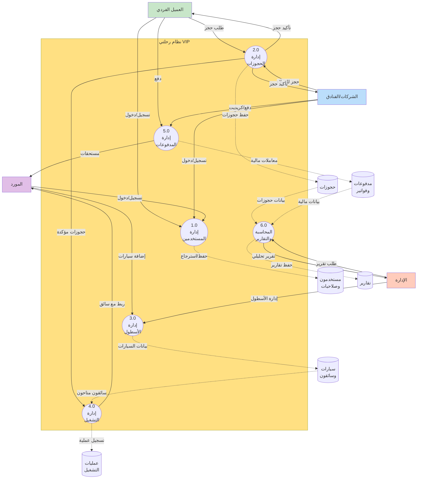

تتولى عملية إدارة الحسابات المسؤولية عن جميع الأنشطة المتعلقة بتسجيل المستخدمين من مختلف الفئات والمصادقة عليهم وإدارة ملفاتهم الشخصية. تستقبل هذه العملية طلبات التسجيل من العملاء الأفراد والشركات والموردين، وتتحقق من صحة المعلومات المقدمة وفرادتها، ثم تحفظ البيانات في مخزن المستخدمين والصلاحيات بعد التشفير المناسب للمعلومات الحساسة. تصدر العملية تأكيدات التسجيل إلى المستخدمين الجدد مع رموز التحقق اللازمة، وتدير عمليات تسجيل الدخول اللاحقة من خلال التحقق من بيانات الاعتماد وإصدار الرموز المميزة للجلسات النشطة.

تركز عملية إدارة الحجوزات على دورة حياة الحجز الكاملة من لحظة الإنشاء وحتى التأكيد والربط بالتشغيل. تستقبل هذه العملية طلبات الحجز من العملاء الأفراد والشركات مع كافة التفاصيل المطلوبة، وتتواصل مع عملية التسعير لحساب التكلفة الدقيقة بناءً على المعايير المختلفة، ثم تعرض السعر للعميل للموافقة عليه. عند قبول العميل للسعر، تحفظ العملية الحجز في مخزن الحجوزات بحالة انتظار التأكيد، وترسل التفاصيل إلى الإدارة للمراجعة. بعد الموافقة الإدارية، تحدث العملية حالة الحجز إلى مؤكد وتنقل المعلومات إلى عملية التشغيل للمعالجة اللاحقة.

تدير عملية التشغيل جميع الأنشطة المتعلقة بربط الحجوزات المؤكدة بالسائقين والمركبات المناسبة ومتابعة تنفيذ الخدمات. تستقبل هذه العملية الحجوزات المؤكدة من عملية إدارة الحجوزات، وتبحث في مخزن السيارات والسائقين عن المركبات المتاحة التي تطابق المواصفات المطلوبة والموقع الجغرافي، ثم تربط الحجز بالمورد الأنسب بناءً على خوارزميات محددة. تحفظ العملية معلومات الربط في مخزن عمليات التشغيل، وترسل إشعارات فورية إلى كل من المورد والعميل بتفاصيل الترتيبات النهائية. تتابع العملية حالة التنفيذ من خلال التحديثات التي يقدمها السائق، وتنقل الحجوزات المكتملة إلى المرحلة النهائية للمراجعة والإقفال.

تعالج عملية إدارة المدفوعات جميع المعاملات المالية بأنواعها المختلفة وتضمن سلامة العمليات المالية وتوافقها مع القواعد التجارية. تستقبل هذه العملية معلومات الدفع من العملاء بطرق متنوعة تشمل الدفع الإلكتروني عبر البوابات المعتمدة والتحويلات البنكية المرفقة بإثباتات والنقد المسجل من قبل السائقين، وتتحقق من صحة المعاملات ونجاحها. تحفظ العملية سجلات شاملة لجميع المعاملات في مخزن المدفوعات والفواتير، وتحسب المستحقات لكل طرف بناءً على نسب العمولات المتفق عليها. تولد العملية الفواتير الضريبية المتوافقة مع متطلبات الهيئة الحكومية، وتدير حسابات الكريديت للشركات بما في ذلك تتبع الحدود المستخدمة والمتاحة.

تشرف عملية إدارة السيارات على جميع الأنشطة المتعلقة بتسجيل المركبات ومراجعتها وتفعيلها وتتبع توفرها. تستقبل هذه العملية طلبات تسجيل المركبات من الموردين مع كافة المعلومات والمستندات المطلوبة، وتعرضها على الإدارة للمراجعة والموافقة. تحفظ العملية تفاصيل المركبات المعتمدة في مخزن السيارات والسائقين مع ربطها بالموردين المالكين، وتدير حالة كل مركبة من حيث التفعيل والتوفر الحالي. تزود العملية عملية التشغيل بمعلومات محدثة باستمرار عن المركبات المتاحة لاستخدامها في عملية الربط.

تركز عملية إنشاء التقارير على استخلاص رؤى ذات معنى من البيانات المتراكمة في مخازن النظام المختلفة وتقديمها بأشكال مفيدة وقابلة للفهم. تستقبل هذه العملية طلبات التقارير من الإدارة مع معايير محددة مثل الفترة الزمنية والمنطقة الجغرافية ونوع التحليل المطلوب، وتستعلم عن البيانات ذات الصلة من مخازن الحجوزات والمدفوعات والسيارات، ثم تعالجها وتحللها لاستخلاص الإحصائيات والاتجاهات والأنماط. تولد العملية التقارير بتنسيقات متعددة قابلة للطباعة والمشاركة، وتحفظ نسخاً منها في مخزن التقارير للرجوع إليها مستقبلاً.

#### 7.2.2 المستوى الأول

يوفر مخطط تدفق البيانات من المستوى الأول تفصيلاً أعمق لعمليات محددة من المستوى الصفري، مع التركيز على إدارة الحجوزات وإدارة التشغيل باعتبارهما العمليتين الأكثر تعقيداً وأهمية في النظام.

تتفرع عملية إدارة الحجوزات إلى ست عمليات فرعية متتالية تشكل معاً تدفق العمل الكامل للحجز. تبدأ الرحلة بعملية اختيار نوع الخدمة حيث يتصفح العميل الخيارات المتاحة ويختار النوع الأنسب لاحتياجاته من بين التوصيل والإيجار بالساعة والجولات المختلفة. تنقل هذه العملية اختيار العميل إلى العملية الفرعية التالية مع المعلومات السياقية اللازمة.

تتولى عملية اختيار نوع السيارة عرض الفئات المختلفة المتاحة للخدمة المختارة مع معلومات وافية عن كل فئة، وتسجل اختيار العميل للفئة المفضلة. تمرر هذه العملية المعلومات المجمعة حتى الآن إلى المرحلة التالية التي تطلب التفاصيل الدقيقة.

تركز عملية إدخال بيانات الحجز على جمع كافة المعلومات التفصيلية اللازمة لتنفيذ الخدمة، وتتكيف الحقول المطلوبة ديناميكياً بناءً على نوع الخدمة المختار. تتحقق هذه العملية من صحة واكتمال البيانات المدخلة قبل السماح بالمتابعة، وتقدم رسائل توجيهية واضحة عند وجود أخطاء أو نواقص.

تستلم عملية حساب السعر جميع تفاصيل الحجز المكتملة وتتواصل مع مخزن الأسعار لاسترجاع المعدلات المطبقة على الفئة والمنطقة والخدمة المحددة. تطبق العملية القواعد الحسابية المناسبة سواء كانت تعتمد على المسافة أو المدة أو سعراً ثابتاً، وتضيف النسب المئوية المقررة والضرائب، ثم تطبق أي خصومات مستحقة للعميل بناءً على ولائه أو عروض نشطة. تعرض النتيجة النهائية بشكل مفصل وشفاف للعميل مع توضيح مكونات السعر المختلفة.

تدير عملية إدارة السلة قائمة الحجوزات التي يرغب العميل في إجرائها، وتتيح إضافة حجوزات متعددة ومراجعتها وتعديلها وحذفها بمرونة. تحسب هذه العملية المجموع الكلي لجميع العناصر في السلة وتنشئ رقم حجز عام موحد يربطها معاً، مع الاحتفاظ بأرقام فرعية فريدة لكل حجز فردي لتسهيل الإدارة التفصيلية.

تتولى عملية تأكيد الحجز الخطوة النهائية في دورة الإنشاء، حيث تحفظ جميع التفاصيل في مخزن الحجوزات بحالة انتظار الموافقة الإدارية. تولد هذه العملية رسائل تأكيد فورية للعميل تتضمن الرقم المرجعي وملخص الطلب وتوقعات الخطوات التالية، وترسل إشعارات للإدارة بوصول حجز جديد يتطلب المراجعة.

تتفرع عملية إدارة التشغيل بدورها إلى عمليات فرعية تغطي مراحل التشغيل المختلفة من الاستقبال وحتى الإقفال. تستقبل عملية استقبال الحجوزات الطلبات المؤكدة من قبل الإدارة وتنظمها في قوائم حسب التاريخ والمنطقة والأولوية، مع عرض واضح لجميع التفاصيل الضرورية لاتخاذ قرارات الربط.

تطبق عملية الموافقة على التشغيل فحوصات نهائية للتأكد من استيفاء جميع المتطلبات قبل الانتقال إلى مرحلة الربط الفعلي، وتسجل موافقة المشرف المسؤول مع الوقت والتاريخ لأغراض التدقيق والمساءلة.

تنفذ عملية الفلترة والربط مع السائق الخوارزمية المعقدة التي تبحث عن أفضل تطابق بين متطلبات الحجز والموارد المتاحة، مع الأخذ في الاعتبار عوامل متعددة مثل القرب الجغرافي والتوفر الزمني ومطابقة المواصفات والتقييم التاريخي للسائق. تسجل العملية تفاصيل الربط في مخزن عمليات التشغيل وتحدث حالة المركبة لتعكس عدم توفرها خلال الفترة المحجوزة.

تولد عملية إرسال الإشعارات الرسائل المناسبة لكل طرف معني بناءً على قوالب محددة مسبقاً، وترسلها عبر القنوات المفضلة لكل مستخدم سواء كانت رسائل نصية أو واتساب أو إشعارات داخل التطبيق. تتضمن الرسائل كافة المعلومات التي يحتاجها كل طرف للاستعداد وتنفيذ الخدمة بنجاح.

تراقب عملية متابعة التنفيذ حالة الخدمات النشطة وتتلقى التحديثات من السائقين والعملاء، وتنبه المشرفين عند حدوث تأخيرات أو مشكلات تتطلب التدخل. تحفظ العملية سجلاً زمنياً كاملاً لجميع الأحداث والتحديثات المتعلقة بكل حجز لأغراض المراجعة وحل النزاعات المحتملة.

تدير عملية الإقفال النهائي المرحلة الختامية لدورة الحياة، حيث تتحقق من إتمام الخدمة واستلام الدفع وتطبيق الخصومات وحساب العمولات، ثم تقفل الحجز بشكل نهائي يمنع أي تعديلات لاحقة إلا بصلاحيات خاصة. تولد هذه العملية الفاتورة الضريبية النهائية وتحفظها في النظام، وتحدث الأرصدة المالية لجميع الأطراف لتعكس هذه المعاملة.

### 7.3 مخططات تدفق العمليات

#### 7.3.1 عملية الحجز للعميل المباشر

يوضح مخطط تدفق عملية الحجز للعميل المباشر المسار الكامل الذي يسلكه العميل الفردي من لحظة فتح التطبيق وحتى استلام تأكيد الحجز النهائي، مع توضيح جميع نقاط القرار والمسارات البديلة الممكنة.

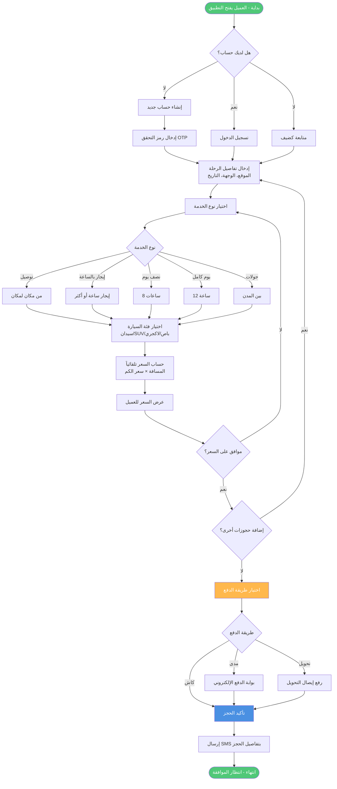

تبدأ الرحلة عندما يفتح العميل التطبيق ويواجه نقطة قرار أولى حول حالة تسجيله. إذا كان العميل مسجلاً مسبقاً ولديه حساب نشط، يدخل اسم المستخدم وكلمة المرور للوصول إلى حسابه الشخصي الذي يحفظ تفضيلاته وتاريخه وطرق الدفع المحفوظة. إذا لم يكن مسجلاً، يواجه خيارين رئيسيين إما المتابعة كضيف للحصول على خدمة سريعة دون التزام طويل الأمد، أو إنشاء حساب جديد للاستفادة من المزايا الإضافية مثل تتبع السجل وبرامج الولاء والحجز السريع في المرات القادمة.

عند اختيار إنشاء حساب جديد، ينتقل التدفق إلى مسار فرعي يتطلب إدخال المعلومات الأساسية ثم التحقق من رقم الجوال عبر رمز يصل في رسالة نصية قصيرة. يجب على العميل إدخال هذا الرمز خلال فترة صلاحيته القصيرة لإتمام التسجيل، وإلا سيحتاج إلى طلب رمز جديد. بعد التحقق الناجح، يندمج هذا المسار مع المسارات الأخرى للانتقال إلى مرحلة اختيار التفاصيل.

بغض النظر عن طريقة الوصول المختارة، يصل جميع العملاء إلى نقطة مشتركة حيث يطلب منهم اختيار المنطقة أو الفرع الذي سيبدأ منه الخدمة من قائمة المناطق المخدومة حالياً. يؤدي هذا الاختيار إلى تفعيل شاشة الخدمات التي تعرض جميع أنواع الخدمات المتاحة في تلك المنطقة المحددة مع الأسعار التقريبية لكل منها.

يصل العميل بعد ذلك إلى نقطة قرار حاسمة حول نوع الخدمة التي يحتاجها، ويتفرع التدفق إلى خمسة مسارات محتملة حسب الاختيار. إذا اختار خدمة التوصيل من مكان لمكان، ينتقل إلى شاشة متخصصة تطلب منه تحديد نقطة الانطلاق والوجهة بدقة باستخدام الخرائط التفاعلية، ويحسب النظام المسافة تلقائياً باستخدام واجهة خرائط جوجل ثم يطبق سعر الكيلومتر المحدد للوصول إلى السعر الأساسي. إذا اختار أحد خيارات الإيجار بالوقت سواء بالساعة أو لثماني ساعات أو لاثنتي عشرة ساعة، ينتقل مباشرة إلى عرض السعر الثابت المحدد مسبقاً لتلك الفئة من الخدمات في المنطقة المختارة. تندمج جميع هذه المسارات عند نقطة حساب السعر النهائي.

يطبق النظام في مرحلة حساب السعر جميع المعادلات والقواعد ذات الصلة، بما في ذلك إضافة النسبة المئوية المقررة التي تغطي التكاليف التشغيلية والهامش الربحي، وتطبيق الضرائب الحكومية المطلوبة، وخصم أي تخفيضات مستحقة للعميل بناءً على حسابه أو عروض نشطة. يعرض النظام السعر النهائي بشكل واضح مع تفصيل شفاف لمكوناته المختلفة، مما يتيح للعميل فهماً كاملاً لما يدفعه ولماذا.

يواجه العميل بعد ذلك نقطة قرار حول ما إذا كان راضياً عن السعر المعروض أم لا. إذا رفض السعر أو رغب في تعديل التفاصيل، يعود التدفق إلى نقطة اختيار الخدمة للسماح بإجراء تغييرات والحصول على عرض سعر جديد. إذا وافق على السعر، يواجه قراراً آخر حول ما إذا كان يرغب في إضافة حجوزات إضافية إلى نفس الطلب أم لا.

عند اختيار إضافة حجوزات متعددة، يعود التدفق إلى نقطة اختيار الخدمة للسماح بإنشاء حجز آخر يضاف إلى السلة الموحدة. يمكن تكرار هذه الحلقة عدة مرات حسب حاجة العميل حتى يكمل جميع الحجوزات المطلوبة. عند الانتهاء، ينتقل التدفق إلى عرض السلة الشاملة التي تجمع جميع الحجوزات المضافة مع رقم حجز عام موحد ومجموع إجمالي واضح.

يتأكد العميل من صحة جميع التفاصيل في السلة ثم ينقر على زر تأكيد الحجز للانتقال إلى مرحلة الدفع الحاسمة. 
يصل العميل إلى نقطة قرار مهمة حول طريقة الدفع المفضلة، ويتفرع التدفق إلى أربعة مسارات رئيسية حسب الاختيار. إذا اختار الدفع النقدي مع السائق، يسجل النظام هذا الخيار ويضع إشارة على الحجز بأن الدفع سيتم لاحقاً عند تقديم الخدمة، وينتقل مباشرة إلى مرحلة الإرسال للإدارة. إذا اختار الدفع الإلكتروني عبر بطاقات مدى أو فيزا، يوجهه النظام إلى بوابة الدفع الآمنة حيث يدخل تفاصيل البطاقة وتعالج المعاملة فوراً، وينتظر النظام استجابة البوابة لتحديد ما إذا نجحت العملية أم فشلت.

عند نجاح الدفع الإلكتروني، يحفظ النظام رقم المعاملة والإيصال الإلكتروني ويربطهما بالحجز، ثم يندمج هذا المسار مع مسار الدفع النقدي للانتقال المشترك إلى مرحلة الإرسال للإدارة. أما في حالة فشل الدفع الإلكتروني لأي سبب مثل عدم كفاية الرصيد أو خطأ في البيانات أو رفض من البنك، يعرض النظام رسالة توضح السبب ويسأل العميل عما إذا كان يرغب في المحاولة مرة أخرى بنفس الطريقة أو اختيار طريقة دفع بديلة. يعود التدفق في هذه الحالة إلى نقطة اختيار طريقة الدفع للسماح بخيار جديد.

إذا اختار العميل التحويل البنكي، يعرض النظام التفاصيل المصرفية الكاملة للشركة بما في ذلك اسم البنك ورقم الحساب ورمز الآيبان، ويطلب من العميل إجراء التحويل ثم رفع صورة من إيصال التحويل كإثبات. يحفظ النظام الإيصال المرفوع ويضع الحجز في حالة انتظار التحقق من الدفع، حيث سيراجع الفريق المالي الإيصال لاحقاً ويؤكد استلام المبلغ قبل المتابعة في معالجة الحجز. ينتقل هذا المسار أيضاً إلى مرحلة الإرسال للإدارة لكن مع إشارة خاصة تدل على انتظار التحقق المالي.

بالنسبة لخيار الدفع الآجل أو الكريديت، فهو متاح فقط للشركات والمؤسسات التي لديها حسابات معتمدة مع حدود ائتمانية محددة. يتحقق النظام تلقائياً من أن المبلغ المطلوب لا يتجاوز الحد المتاح، فإذا كان ضمن الحد المسموح، يسجل المعاملة على حساب الشركة ويخصم المبلغ من الحد المتاح، ثم يندمج مع المسارات الأخرى للانتقال إلى الإدارة. أما إذا تجاوز الحد المتاح، يعرض النظام رسالة توضح الموقف ويطلب من المستخدم اختيار طريقة دفع بديلة.

تندمج جميع المسارات الناجحة عند نقطة إرسال الحجز إلى الإدارة، حيث ينقل النظام جميع تفاصيل الطلب إلى شاشة استقبال الحجوزات التي يراقبها فريق التشغيل. يستلم العميل في نفس اللحظة رسالة نصية وإشعار داخل التطبيق يؤكد استلام طلبه ويزوده برقم مرجعي فريد يمكن استخدامه للاستفسار عن الحالة أو إجراء تعديلات لاحقاً.

يراجع مدير التشغيل أو المشرف المختص الحجز الوارد ويتخذ قراراً بالموافقة عليه أو رفضه بناءً على عدة عوامل مثل توفر الموارد ومعقولية الطلب وصحة المعلومات. إذا رفض الحجز لأي سبب، يدخل المشرف ملاحظات توضح السبب ويرسل النظام إشعاراً فورياً للعميل بالرفض مع شرح السبب، وينتهي التدفق عند هذه النقطة. في حالة الرفض لسبب يتعلق بالدفع المسبق، يتم أيضاً رد المبلغ إذا كان قد تم خصمه فعلاً.

أما إذا وافق المشرف على الحجز، فينقل النظام الطلب تلقائياً إلى قائمة الحجوزات المؤكدة ويرسل إشعاراً آخر للعميل يؤكد الموافقة النهائية ويطمئنه بأن طلبه قيد المعالجة وسيتم تعيين سائق له قبل موعد الخدمة بوقت كافٍ. ينتهي هذا الجزء من التدفق بانتظار مرحلة التشغيل اللاحقة، ويحفظ النظام سجلاً كاملاً لجميع الخطوات والقرارات لأغراض التتبع والمراجعة والتحليل المستقبلي.

#### 7.3.2 عملية التشغيل الإداري

يوضح مخطط تدفق عملية التشغيل الإداري المراحل المتعددة التي يمر بها الحجز بعد الموافقة الإدارية الأولية وحتى الإقفال النهائي، مع التركيز على الإجراءات التي يتخذها الفريق التشغيلي والقرارات الحرجة التي تؤثر على نجاح تقديم الخدمة.

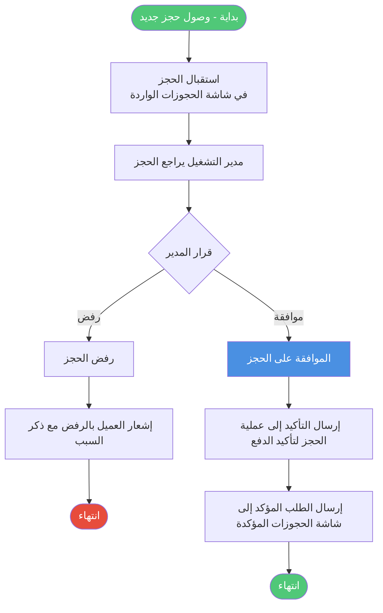

تبدأ العملية عند وصول حجز جديد إلى شاشة استقبال الحجوزات التي تعمل كنقطة دخول مركزية لجميع الطلبات الواردة من التطبيق والموقع الإلكتروني. يعرض النظام الحجوزات بترتيب زمني حسب وقت الاستلام، مع تمييز بصري واضح للحجوزات العاجلة أو ذات القيمة العالية أو التي تحمل متطلبات خاصة. يراجع المشرف المختص تفاصيل كل حجز بعناية، ويتحقق من اكتمال المعلومات ومعقولية الطلب وصحة بيانات الدفع إن وجدت.

يصل المشرف إلى نقطة قرار أولى حاسمة حول ما إذا كان سيوافق على الحجز أم سيرفضه. تعتمد هذه الموافقة على عدة معايير تشمل توفر الموارد المبدئي، ومطابقة الطلب لسياسات الشركة، وعدم وجود تعارض مع التزامات سابقة، وصحة معلومات الدفع خاصة بالنسبة للدفع الآجل. إذا وجد المشرف أي مشكلة تمنع الموافقة مثل عدم توفر مركبات من الفئة المطلوبة أو تجاوز حد الكريديت أو عدم تطابق تواريخ التوفر، يختار رفض الحجز ويدخل سبباً واضحاً ومفصلاً للرفض.

عند الرفض، يرسل النظام إشعاراً فورياً للعميل عبر رسالة نصية ورسالة داخل التطبيق توضح أن طلبه لم يتم قبوله مع ذكر السبب بلغة مهذبة ومفهومة. إذا كان الرفض لسبب يمكن معالجته مثل اختيار فئة مركبة غير متوفرة، يقترح الإشعار بدائل ممكنة ويوفر رابطاً سريعاً لتعديل الحجز وإعادة تقديمه. في حالة الدفع المسبق، يبدأ النظام تلقائياً عملية استرجاع المبلغ المدفوع إلى نفس الوسيلة التي استخدمت في الدفع، وينتهي التدفق عند هذه النقطة بتسجيل كامل للحجز المرفوض وأسبابه للتحليل المستقبلي.

أما إذا وافق المشرف على الحجز، فيضغط على زر الموافقة الواضح الذي ينقل الحجز فوراً إلى حالة جديدة ويسجل اسم الموافق والتاريخ والوقت الدقيق للموافقة. يرسل النظام إشعار تأكيد محدث للعميل يطمئنه بأن حجزه معتمد رسمياً وقيد المعالجة، وينتقل الحجز تلقائياً إلى قائمة الحجوزات المؤكدة التي تمثل المرحلة التالية في سلسلة التشغيل.

تعرض شاشة الحجوزات المؤكدة جميع الطلبات المعتمدة مرتبة حسب تاريخ ووقت الخدمة المطلوبة، مع أدوات فلترة قوية تسمح للمشرفين بتضييق القائمة حسب المنطقة أو الفئة أو التاريخ أو أي معيار آخر ذي صلة. تبقى الحجوزات في هذه القائمة حتى يحين الوقت المناسب لتجهيزها وربطها بالسائقين، وهو عادة قبل موعد الخدمة بفترة كافية تتراوح بين اثنتي عشرة وأربع وعشرين ساعة حسب نوع الخدمة وتعقيدها.

يراقب النظام جميع الحجوزات المؤكدة باستمرار ويتحقق من الوقت المتبقي لكل منها. عندما يدخل حجز محدد في النافذة الزمنية المناسبة للتجهيز، ينقله النظام تلقائياً إلى شاشة قيد التجهيز وينبه المشرف المسؤول عن المنطقة ذات الصلة. تعرض هذه الشاشة فقط الحجوزات التي يجب العمل عليها خلال الفترة القادمة القريبة، مما يساعد على تركيز الانتباه على الأولويات الفعلية دون تشتت.

يصل التدفق إلى نقطة قرار حرجة تتعلق بتوفر السائقين والمركبات. يبحث مشرف المنطقة في قاعدة البيانات عن المركبات المتاحة التي تطابق فئة الحجز والموقع الجغرافي والفترة الزمنية المطلوبة. إذا لم يجد أي خيارات متاحة في الوقت الحالي بسبب انشغال جميع المركبات المناسبة، يواجه قراراً حول كيفية التعامل مع هذا الموقف.

في حالة عدم توفر سائق مناسب، يمكن للمشرف وضع الحجز في قائمة انتظار خاصة مع إرسال إشعار للعميل يوضح الموقف بصراحة ويطمئنه بأن الفريق يعمل على إيجاد حل ويعتذر عن التأخير. يستمر النظام في البحث الدوري عن سائقين يصبحون متاحين، ويتم إعطاء الأولوية للحجوزات الأقدم في قائمة الانتظار. ينتهي هذا المسار مؤقتاً بانتظار تغير في الظروف، مع تسجيل كامل للموقف لتحليل أسباب نقص الموارد ومعالجتها على المدى الطويل.

أما إذا وجد المشرف سائقاً متاحاً ومناسباً، فينتقل التدفق إلى عملية الربط الفعلية. يختار المشرف السائق الأنسب من بين الخيارات المتاحة بناءً على عدة عوامل مثل القرب من موقع الانطلاق، والتقييم التاريخي، والتفضيلات الخاصة للعميل مثل الجنسية إن حددت، وعدد الرحلات المسندة مسبقاً لتحقيق توزيع عادل للعمل. يؤكد المشرف اختياره ويضغط على زر الربط الذي يقوم بعدة إجراءات متزامنة.

يسجل النظام تفاصيل الربط الكاملة في قاعدة البيانات مع ربط معرف الحجز بمعرف السائق والمركبة وتسجيل من قام بالربط ومتى. يحدث النظام حالة المركبة لتعكس انشغالها خلال الفترة المحجوزة، مما يمنع ربطها بحجوزات متداخلة زمنياً. يولد النظام إشعارات مخصصة لكل طرف معني بناءً على قوالب محددة مسبقاً تضمن تضمين جميع المعلومات الضرورية بلغة واضحة واحترافية.

تصل رسالة نصية ورسالة واتساب وإشعار داخل التطبيق إلى العميل تتضمن اسم السائق الكامل ورقم جواله ونوع المركبة وماركتها وموديلها ولونها ورقم اللوحة الكامل، مع جملة ترحيبية تطمئن العميل وتشجعه على التواصل مع السائق مباشرة إذا احتاج أي توضيحات. تصل في نفس الوقت رسائل مماثلة إلى السائق تتضمن اسم العميل ورقم جواله ونوع الخدمة المطلوبة وتفاصيل الموقع والوجهة والتاريخ والوقت المحددين، مع أي ملاحظات خاصة أدخلها العميل مثل رقم الرحلة أو رقم الغرفة أو احتياجات خاصة.

ينتقل الحجز بعد الربط الناجح تلقائياً إلى شاشة قيد التنفيذ التي تعرض فقط الحجوزات المجدولة لليوم الحالي أو الأربع والعشرين ساعة القادمة. توفر هذه الشاشة رؤية فورية لجميع الخدمات النشطة مع معلومات عن حالة كل منها مثل في الطريق إلى نقطة الانطلاق، أو بدأ الخدمة، أو قيد التنفيذ، أو اكتمل. يراقب مشرفو المناطق هذه الشاشة عن كثب للتأكد من سير جميع الخدمات بسلاسة والتدخل السريع عند حدوث أي مشكلات.

يبلغ السائق عن بدء الرحلة عند وصوله لنقطة الانطلاق واستلام العميل، مما يحدث حالة الحجز في النظام ويسجل التوقيت الفعلي للبداية. تستمر الخدمة وفق الخطة المحددة، ويمكن للسائق إرسال تحديثات أو طلبات مساعدة من خلال التطبيق إذا واجه أي تحديات أو تغييرات غير متوقعة. عند إتمام الخدمة والوصول إلى الوجهة النهائية أو انتهاء الفترة المحجوزة، يبلغ السائق بذلك من خلال الضغط على زر الإنهاء في تطبيقه، مما ينقل الحجز إلى المرحلة الأخيرة.

تظهر الحجوزات المكتملة في شاشة المراجعة والإقفال حيث يقوم المشرف المالي أو المحاسب بمراجعة نهائية شاملة قبل الإقفال الدائم. يتحقق المراجع من أن الدفع قد تم واستلم فعلاً، سواء كان نقداً سلمه السائق أو دفعاً إلكترونياً تم تأكيده أو تحويلاً بنكياً تم التحقق منه. يطبق المراجع أي خصومات مستحقة لم تطبق تلقائياً مسبقاً، ويحدد نسبة العمولة النهائية للمورد بناءً على الاتفاق المبرم معه.

يضغط المراجع على زر الإقفال النهائي الذي يقوم بسلسلة من الإجراءات التلقائية المتكاملة. يحسب النظام عمولة المورد الدقيقة بتطبيق النسبة المحددة على المبلغ الأساسي بعد الخصومات، ويحسب صافي ربح الشركة بطرح العمولة من المبلغ الإجمالي. يحدث النظام حسابات كلا الطرفين ليعكس هذه المعاملة، بإضافة المستحق للمورد في رصيده القابل للسحب وإضافة الربح لإيرادات الشركة. يولد النظام الفاتورة الضريبية النهائية بصيغة بي دي إف تتوافق مع متطلبات هيئة الزكاة والضريبة والجمارك، متضمنة جميع التفاصيل المطلوبة ورمز الاستجابة السريعة الذي يسمح بالتحقق الإلكتروني من صحة الفاتورة.

يقفل النظام الحجز بشكل نهائي ويمنع أي تعديلات لاحقة عليه إلا بصلاحيات خاصة جداً مقتصرة على مدير النظام أو المدير المالي في حالات استثنائية موثقة بعناية. يرسل النظام الفاتورة النهائية للعميل عبر البريد الإلكتروني إذا كان مسجلاً، أو يتيحها للتنزيل من خلال التطبيق أو الموقع. ينتهي التدفق بحفظ سجل كامل ودائم لجميع مراحل الحجز وجميع الإجراءات المتخذة بشأنه، مما يوفر مساراً تدقيقياً شفافاً يمكن الرجوع إليه عند الحاجة لحل نزاعات أو إجراء تحليلات أو الامتثال لمتطلبات تنظيمية.

#### 7.3.3 عملية الحجوزات المؤكدة

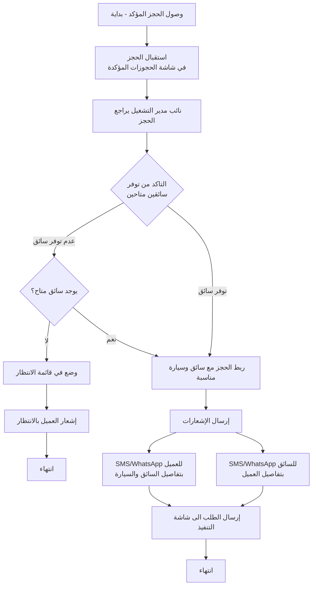

تبدأ هذه العملية عند وصول حجز مؤكد من الإدارة إلى شاشة الحجوزات المؤكدة، والتي تعمل كمستودع مؤقت لجميع الطلبات المعتمدة التي تنتظر دورها للتجهيز والربط بالسائقين. يراجع نائب مدير التشغيل أو المشرف المختص الحجز للتأكد من اكتمال جميع التفاصيل الضرورية واستعداده للمرحلة التالية.

يصل التدفق إلى نقطة التحقق الأولى من توفر السائقين المتاحين. يبحث المشرف في النظام عن مركبات تطابق المواصفات المطلوبة من حيث الفئة والموقع الجغرافي والتوفر الزمني، مع مراعاة أي تفضيلات خاصة أدخلها العميل. إذا وجد خيارات متاحة، ينتقل التدفق مباشرة إلى عملية الربط. أما إذا لم تتوفر خيارات مناسبة في الوقت الحالي، يواجه المشرف قراراً حول كيفية التعامل مع هذا الموقف.

في حالة عدم التوفر، يختار المشرف وضع الحجز في قائمة انتظار مخصصة مع تسجيل سبب التأخير والوقت المتوقع للتوفر. يرسل النظام إشعاراً تلقائياً للعميل يشرح الموقف بشفافية ويعتذر عن أي إزعاج، مع طمأنته بأن الفريق يعمل على إيجاد حل في أسرع وقت ممكن. ينتهي هذا المسار مؤقتاً مع استمرار المراقبة الدورية لتوفر الموارد.

عندما يتوفر سائق مناسب سواء فوراً أو بعد فترة انتظار، ينتقل التدفق إلى عملية الربط الفعلية. يختار المشرف السائق الأمثل من الخيارات المتاحة ويؤكد الربط، مما يسجل جميع التفاصيل في قاعدة البيانات ويحدث حالات جميع السجلات ذات الصلة. يقوم النظام بإرسال الإشعارات تلقائياً إلى كل من العميل والسائق عبر قنوات متعددة تتضمن الرسائل النصية القصيرة ورسائل واتساب والإشعارات داخل التطبيق، لضمان وصول المعلومات الحيوية بشكل موثوق وسريع.

تتضمن رسالة العميل الترحيبية جميع معلومات السائق الضرورية وتشجعه على حفظ رقم الجوال للتواصل المباشر عند الحاجة. تتضمن رسالة السائق جميع تفاصيل المهمة وتحثه على التواصل مع العميل لتأكيد الترتيبات النهائية وضمان الوضوح الكامل حول التوقعات والمتطلبات.

ينقل النظام الحجز تلقائياً بعد إرسال الإشعارات الناجح إلى شاشة قيد التنفيذ، مكملاً بذلك دور شاشة الحجوزات المؤكدة كمرحلة انتقالية حيوية بين التأكيد الإداري والتنفيذ الفعلي على أرض الواقع. ينتهي هذا الجزء من التدفق مع الانتقال السلس إلى مرحلة المتابعة التشغيلية اللاحقة.

#### 7.3.4 عملية متابعة التنفيذ

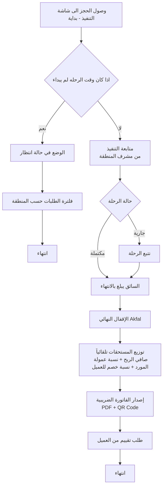

تبدأ هذه المرحلة الحرجة عندما يصل حجز مربوط بسائق إلى شاشة قيد التنفيذ، التي تعمل كمركز تحكم فوري لجميع الخدمات النشطة خلال الأربع والعشرين ساعة القادمة. يواجه النظام نقطة فحص زمنية مهمة تحدد ما إذا كان الوقت مناسباً لبدء المتابعة الفعلية أم أن الحجز لا يزال بعيداً زمنياً.

إذا كان وقت الرحلة المجدول لا يزال بعيداً ولم يدخل بعد في النافذة الزمنية النشطة، يضع النظام الحجز في حالة انتظار مع مراقبة دورية حتى يقترب الموعد. يطبق النظام فلترة تلقائية تعرض فقط الطلبات التي تقع ضمن إطار زمني ضيق يسهل إدارته، عادة الأربع والعشرين ساعة القادمة، مما يمنع إغراق المشرفين بمعلومات عن حجوزات بعيدة لا تتطلب اهتماماً فورياً. ينتهي هذا المسار مؤقتاً مع الاحتفاظ بالحجز في النظام حتى يحين وقته.

أما إذا دخل الحجز في النافذة الزمنية النشطة، فينتقل إلى مرحلة المتابعة التشغيلية الدقيقة من قبل مشرف المنطقة المختص. يتولى المشرف مراقبة الخدمة عن كثب من خلال الشاشة المخصصة التي تعرض حالة الحجز الفورية وتحديثات السائق وأي معلومات أخرى ذات صلة بالتنفيذ السلس.

يتتبع النظام حالة الرحلة من خلال عدة مراحل متتابعة تبدأ بمرحلة الاستعداد حيث يكون السائق في طريقه إلى نقطة الانطلاق المحددة. يمكن للسائق تحديث حالته من خلال التطبيق المخصص له، مما يوفر معلومات فورية للمشرف والعميل على حد سواء. عند وصول السائق واستلام العميل، يبلغ بذلك من خلال الضغط على زر واضح في التطبيق، مما يسجل وقت البداية الفعلي ويحول حالة الحجز إلى "جارية".

تستمر الرحلة وفق الخطة المرسومة، مع إمكانية إرسال تحديثات دورية أو عند حدوث أي تطورات مهمة. يراقب المشرف جميع الرحلات النشطة من خلال لوحة تحكم شاملة توفر رؤية فورية للوضع العام، وتنبهه تلقائياً عند حدوث تأخيرات غير مبررة أو انحرافات عن الخطة المتوقعة أو طلبات مساعدة من السائقين.

عند إتمام الخدمة بنجاح والوصول إلى الوجهة النهائية أو انتهاء الفترة الزمنية المحجوزة، يبلغ السائق بإنهاء المهمة من خلال تطبيقه. يسجل النظام وقت الإنهاء الدقيق ويحول الحجز تلقائياً إلى شاشة المراجعة والإقفال، مما يمثل الانتقال من مرحلة التنفيذ النشطة إلى مرحلة المعالجة المالية والإدارية النهائية.

يصل التدفق إلى مرحلة الإقفال المالي الحاسمة حيث يتولى المحاسب أو المشرف المالي مراجعة شاملة لجميع جوانب المعاملة. يتحقق المراجع أولاً من أن الدفع قد تم فعلاً واستلم بالطريقة المحددة عند الحجز، سواء كان نقداً سلمه السائق للصندوق أو دفعاً إلكترونياً تم تأكيده من البوابة أو تحويلاً بنكياً تم التحقق من وصوله أو كريديت مسجل على حساب الشركة.

يطبق المراجع بعد ذلك أي خصومات نهائية لم تطبق تلقائياً مسبقاً، والتي قد تتضمن تخفيضات خاصة للعملاء الأفراد المميزين أو خصومات تعاقدية للشركات والفنادق بناءً على حجم استخدامهم أو اتفاقيات خاصة مبرمة معهم. يحدد المراجع نسبة عمولة المورد النهائية بناءً على الاتفاق المسجل في النظام، والتي قد تختلف من مورد لآخر حسب شروط الشراكة والأداء التاريخي.

يحسب النظام تلقائياً المبالغ المالية الدقيقة لجميع الأطراف بتطبيق النسب والخصومات المحددة. يحسب مستحقات المورد بضرب المبلغ الأساسي بعد الخصومات في نسبة العمولة المتفق عليها، ويحسب صافي إيرادات الشركة بطرح عمولة المورد من المبلغ الإجمالي الذي دفعه أو سيدفعه العميل. يسجل النظام هذه الأرقام في السجلات المالية لكلا الطرفين، مضيفاً المستحقات لرصيد المورد القابل للسحب ومضيفاً الإيرادات لحسابات الشركة.

يولد النظام الفاتورة الضريبية النهائية المتوافقة تماماً مع متطلبات الفوترة الإلكترونية في المملكة العربية السعودية. تتضمن الفاتورة جميع العناصر المطلوبة نظامياً بما في ذلك معلومات الشركة الكاملة مع الرقم الضريبي، ومعلومات العميل إذا كان مسجلاً، وتفاصيل الخدمة المقدمة بوضوح، وتفصيل المبالغ قبل وبعد الضريبة، ورمز الاستجابة السريعة المشفر الذي يسمح للهيئة بالتحقق الإلكتروني الفوري من صحة الفاتورة وعدم التلاعب بها.

يقفل المراجع الحجز بشكل نهائي وغير قابل للتراجع من خلال الضغط على زر الإقفال النهائي، مما يحول حالة السجل إلى "مقفل" ويمنع أي تعديلات لاحقة عليه إلا بصلاحيات استثنائية محدودة جداً وموثقة بعناية. يسجل النظام من قام بالإقفال ومتى بالضبط، مما يوفر مساراً تدقيقياً كاملاً لكل إجراء.

يرسل النظام الفاتورة النهائية للعميل فوراً عبر البريد الإلكتروني إذا كان متوفراً، أو يتيحها للتنزيل من خلال حساب العميل في التطبيق أو الموقع الإلكتروني. يرسل النظام أيضاً طلباً مهذباً للعميل لتقييم الخدمة التي تلقاها، مع رابط مباشر لنموذج تقييم مبسط يستغرق دقيقة أو دقيقتين فقط لإكماله. تساعد هذه التقييمات على مراقبة جودة الخدمة وتحديد فرص التحسين وتقدير أداء السائقين والموردين بشكل موضوعي.

ينتهي التدفق بحفظ دائم لجميع البيانات والوثائق المتعلقة بالحجز في قاعدة البيانات، مع فهرسة مناسبة تسهل استرجاعها لاحقاً عند الحاجة لأغراض المحاسبة أو التدقيق أو حل النزاعات أو التحليل الإحصائي.

#### 7.3.5 عملية تسجيل مورد جديد

يوضح مخطط تدفق عملية تسجيل مورد جديد جميع الخطوات التفصيلية التي يمر بها السائق أو صاحب المركبة الراغب في الانضمام إلى شبكة رحلتي VIP كشريك، بدءاً من الوصول الأولي إلى منصة التسجيل وحتى الموافقة النهائية وتفعيل الحساب.

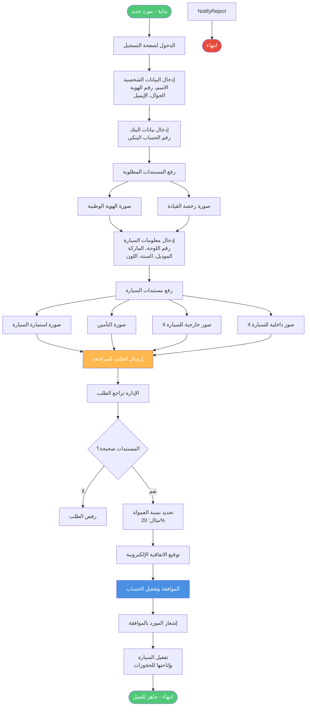

تبدأ الرحلة عندما يصل مورد محتمل إلى صفحة التسجيل المخصصة للشركاء، والتي يمكن الوصول إليها من خلال قسم خاص في الموقع الإلكتروني أو من خلال رابط مباشر يوزع في الحملات التسويقية الموجهة لجذب موردين جدد. تعرض الصفحة شرحاً موجزاً عن فوائد الشراكة ومتطلبات الانضمام وعملية الموافقة المتوقعة، مما يساعد المورد على تكوين توقعات واقعية قبل بدء العملية الفعلية.

يبدأ المورد بإدخال بياناته الشخصية الأساسية في نموذج مصمم بعناية ليكون واضحاً وسهل الاستخدام. تتضمن هذه البيانات الاسم الكامل كما يظهر في الهوية الوطنية، ورقم الهوية الوطنية الذي يستخدم للتحقق من الشخصية ومنع التسجيل المكرر، ورقم الجوال الذي سيستخدم كوسيلة اتصال رئيسية ومعرف للدخول، وعنوان البريد الإلكتروني للمراسلات الرسمية والفواتير.

يتحقق النظام فورياً من عدم استخدام رقم الهوية أو رقم الجوال سابقاً في تسجيلات أخرى، ويعرض رسالة تنبيه واضحة إذا وجد تطابقاً يشير إلى محاولة تسجيل مكررة. يطلب النموذج أيضاً تحديد نوع المورد سواء كان "داخلياً" يعمل بشكل وثيق مع الشركة أو "خارجياً" يعمل بشكل أكثر استقلالية، وهو تصنيف يؤثر على شروط الشراكة ونسب العمولات ومستويات الدعم المقدمة.

ينتقل المورد بعد ذلك إلى قسم المعلومات البنكية الذي يطلب اسم البنك ورقم الحساب البنكي الكامل ورمز الآيبان الدولي الذي سيستخدم لتحويل المستحقات المالية بشكل دوري. يتحقق النظام من صحة تنسيق رمز الآيبان رياضياً قبل قبوله، مما يقلل من احتمالية الأخطاء التي قد تؤدي لفشل التحويلات المستقبلية.

يصل التدفق إلى مرحلة حاسمة تتطلب رفع المستندات الثبوتية الضرورية للتحقق من هوية المورد وشرعية عمله. يطلب النظام صورة واضحة لوجهي الهوية الوطنية تظهر جميع المعلومات بوضوح، وصورة لرخصة القيادة السارية التي تثبت أهلية المورد لقيادة المركبات التي سيسجلها. يوفر النظام واجهة سلسة لرفع الصور إما من خلال التقاط صور فورية باستخدام كاميرا الجهاز أو اختيار صور موجودة مسبقاً في معرض الصور. يطبق النظام فحصاً تلقائياً للتأكد من وضوح الصور وقابليتها للقراءة، وينبه المستخدم إذا كانت الجودة غير كافية ويطلب إعادة التقاط الصورة.

ينتقل التدفق بعد ذلك إلى إدخال معلومات المركبة التفصيلية التي تشمل رقم اللوحة الكامل بأجزائه المختلفة، والماركة أو الشركة المصنعة من قائمة محددة مسبقاً، والموديل المحدد، وسنة الصنع، واللون الخارجي، وفئة المركبة مثل سيدان أو اس يو في أو باص أو لاكجري، وعدد المقاعد المتوفرة للركاب. يستخدم النظام هذه المعلومات لاحقاً في عملية مطابقة الحجوزات مع المركبات المناسبة، لذا من المهم جداً أن تكون دقيقة وصحيحة.

تتطلب المرحلة التالية رفع مستندات المركبة الرسمية التي تثبت ملكيتها وشرعية تشغيلها. يرفع المورد صورة واضحة لاستمارة المركبة السارية الصادرة من الإدارة العامة للمرور، وصورة لوثيقة التأمين الشامل السارية التي تغطي المسؤولية المدنية على الأقل. يتحقق النظام من تاريخ انتهاء صلاحية كلا الوثيقتين ويرفض المتابعة إذا كانتا منتهيتين، مع عرض رسالة واضحة تطلب تجديدهما أولاً.

تأتي بعد ذلك خطوة مهمة ومميزة تتطلب رفع ثماني صور عالية الجودة للمركبة تعرض حالتها ونظافتها ومستوى صيانتها. يجب على المورد التقاط أربع صور خارجية تغطي جميع جوانب المركبة من الأمام والخلف واليمين واليسار، وأربع صور داخلية تظهر المقاعد الأمامية والخلفية ولوحة القيادة والصندوق الخلفي. توفر هذه الصور للعملاء رؤية واقعية لما سيحصلون عليه، وتساعد فريق المراجعة على تقييم مدى مناسبة المركبة لمعايير الخدمة الفاخرة التي تلتزم بها المنصة.

يصل التدفق إلى المرحلة الختامية من التسجيل حيث يراجع المورد جميع المعلومات التي أدخلها ويؤكد صحتها واكتمالها. يعرض النظام ملخصاً شاملاً لجميع البيانات والمستندات المقدمة، مع إمكانية العودة لتعديل أي قسم قبل الإرسال النهائي. عند الرضا التام عن المعلومات المقدمة، يضغط المورد على زر واضح يحمل عنوان "إرسال للمراجعة" الذي يقوم بعدة إجراءات متزامنة.

يحفظ النظام جميع البيانات والمستندات في قاعدة البيانات بحالة "قيد المراجعة"، ويولد رقماً مرجعياً فريداً للطلب يمكن للمورد استخدامه للاستفسار عن حالة طلبه. يرسل النظام رسالة تأكيد فورية للمورد عبر الجوال والبريد الإلكتروني تؤكد استلام طلبه وتزوده بالرقم المرجعي وتقدير للوقت المتوقع للمراجعة والرد، وهو عادة من يومين إلى خمسة أيام عمل. ترسل رسالة إشعار أخرى لفريق المراجعة في الإدارة تنبههم بوصول طلب شريك جديد يتطلب اهتمامهم.

ينتقل التدفق من جانب المورد إلى جانب الإدارة حيث يقوم أحد أعضاء فريق المراجعة بفتح الطلب من خلال شاشة مخصصة تعرض جميع التفاصيل بشكل منظم وسهل المراجعة. يفحص المراجع جميع المعلومات المقدمة بعناية، ويتحقق من صحة أرقام الهوية والرخصة واستمارة المركبة، ويدقق في جودة ووضوح جميع الصور المرفوعة، ويقيم الحالة العامة للمركبة من خلال الصور الداخلية والخارجية.

يصل المراجع إلى نقطة قرار حاسمة حول ما إذا كان سيوافق على الطلب أم سيرفضه. إذا وجد أي مشكلات جوهرية مثل مستندات غير صحيحة أو منتهية الصلاحية، أو صور غير واضحة لا تسمح بالتقييم الدقيق، أو حالة سيئة للمركبة لا تتناسب مع معايير الخدمة الفاخرة، أو تناقضات في المعلومات المقدمة، يختار رفض الطلب ويدخل سبباً واضحاً ومفصلاً للرفض في حقل مخصص.

عند الرفض، يرسل النظام إشعاراً فورياً للمورد عبر جميع القنوات المتاحة يوضح أن طلبه لم يتم قبوله مع ذكر السبب بلغة مهذبة واحترافية. إذا كان سبب الرفض قابلاً للمعالجة مثل انتهاء صلاحية التأمين أو عدم وضوح بعض الصور، يشجع الإشعار المورد على معالجة المشكلة وإعادة تقديم الطلب بعد ذلك. ينتهي هذا المسار مع حفظ سجل كامل للطلب المرفوض وأسبابه لأغراض المراجعة والتحليل.

أما إذا وجد المراجع أن جميع المتطلبات مستوفاة والمعلومات صحيحة والمركبة تلبي المعايير المطلوبة، فينتقل إلى تحديد شروط الشراكة المحددة لهذا المورد. يحدد نسبة العمولة التي ستطبق على حجوزاته، والتي قد تختلف من مورد لآخر حسب نوع الشراكة وفئة المركبة وحجم الأسطول وعوامل أخرى ذات صلة. النسبة القياسية هي عشرون بالمائة، لكن يمكن تعديلها صعوداً أو هبوطاً حسب الظروف الخاصة.

يوافق المراجع رسمياً على الطلب من خلال الضغط على زر الموافقة، مما يحول حالة السجل من "قيد المراجعة" إلى "مقبول" ويسجل اسم الموافق والتاريخ والوقت. يفعل النظام حساب المورد تلقائياً ويمنحه الوصول إلى التطبيق أو البوابة المخصصة للشركاء، ويسجل المركبة في قاعدة البيانات بحالة "نشطة" ومتاحة لربطها بالحجوزات الواردة.

يرسل النظام إشعار قبول مبهج للمورد الجديد عبر رسالة نصية ورسالة واتساب وبريد إلكتروني، يهنئه على قبوله في شبكة رحلتي VIP ويزوده ببيانات الدخول الأولية ونسبة العمولة المحددة له ورابط لتنزيل تطبيق الشركاء إذا لم يكن مثبتاً مسبقاً، وتعليمات مختصرة حول كيفية البدء في استقبال الحجوزات.

تصبح المركبة المسجلة متاحة فوراً في النظام لربطها بالحجوزات المناسبة، وينتهي التدفق بنجاح مع إضافة شريك جديد إلى الشبكة يوسع القدرات التشغيلية للمنصة ويزيد من قدرتها على تلبية الطلب المتنامي على الخدمات.

#### 7.3.6 عملية الدفع

يفصل مخطط تدفق عملية الدفع جميع السيناريوهات والمسارات المختلفة التي يمكن أن يسلكها العميل عند إتمام دفع حجزه، مع توضيح التعامل مع كل طريقة دفع والتحديات المحتملة المرتبطة بها.

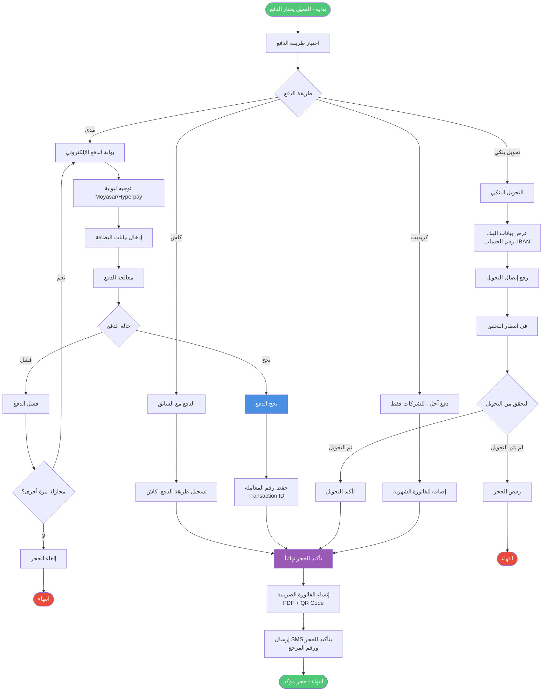

تبدأ عملية الدفع بعد أن يراجع العميل تفاصيل حجزه النهائية في السلة ويؤكد رغبته في المتابعة. يعرض النظام شاشة اختيار طريقة الدفع التي تقدم أربعة خيارات رئيسية مصممة لتلبية احتياجات وتفضيلات مختلفة للعملاء، مع شرح موجز لكل خيار ومتى يكون الأنسب.

يصل التدفق إلى نقطة قرار رئيسية حيث يختار العميل طريقة الدفع المفضلة لديه من بين الخيارات المتاحة. إذا اختار الدفع النقدي مع السائق، وهو خيار شائع خاصة بين العملاء الذين يفضلون عدم مشاركة معلومات مالية إلكترونياً أو الذين لا يملكون بطاقات إلكترونية، يسجل النظام هذا الاختيار في قاعدة البيانات ويضع إشارة واضحة على الحجز بأن الدفع سيتم نقداً عند تقديم الخدمة.

ينتقل هذا المسار مباشرة إلى مرحلة تأكيد الحجز دون الحاجة لأي معالجة مالية فورية، حيث أن الدفع الفعلي سيتم لاحقاً. يرسل النظام تأكيداً للعميل يوضح أن حجزه قد تم استلامه بنجاح وأنه سيحتاج إلى دفع المبلغ المحدد نقداً للسائق عند أو بعد تقديم الخدمة. يتلقى السائق أيضاً إشعاراً واضحاً بأن هذا الحجز يتطلب تحصيل نقدي، مع تذكير بضرورة تسليم المبلغ للإدارة في نهاية نوبة العمل أو في أقرب وقت ممكن.

إذا اختار العميل الدفع الإلكتروني عبر بطاقات مدى أو فيزا، وهو الخيار المفضل للعديد من العملاء لسرعته وأمانه، يوجهه النظام فوراً إلى بوابة الدفع الإلكترونية الآمنة والمتكاملة مع المنصة. تعمل هذه البوابة التي توفرها شركة مختصة مثل مويسر أو هايبر باي كوسيط موثوق يعالج المعاملة دون أن يحتاج نظام رحلتي VIP لتخزين تفاصيل البطاقات الحساسة، مما يقلل من المخاطر الأمنية والمسؤوليات التنظيمية.

يدخل العميل تفاصيل بطاقته في نموذج آمن ومشفر تماماً توفره البوابة، بما في ذلك رقم البطاقة وتاريخ الانتهاء ورمز التحقق الموجود على ظهر البطاقة. تتحقق البوابة من صحة البيانات المدخلة وتحاول معالجة المعاملة من خلال التواصل مع البنك المصدر للبطاقة. تستغرق هذه العملية عادة بضع ثوان فقط، لكن يعرض النظام شاشة انتظار واضحة تطلب من العميل عدم إغلاق النافذة أو الضغط على زر الرجوع لتجنب تعطيل المعاملة.

تستلم البوابة رداً من البنك يحدد ما إذا نجحت المعاملة أم فشلت، ويصل التدفق إلى نقطة فرعية حاسمة. في حالة نجاح المعاملة، تصدر البوابة رقم معاملة فريداً ووقت الدفع الدقيق وإيصالاً إلكترونياً يثبت إتمام العملية. يحفظ النظام جميع هذه المعلومات في سجل الحجز ويربطها به بشكل دائم، مما يوفر إثباتاً واضحاً للدفع يمكن الرجوع إليه عند الحاجة. يندمج هذا المسار الناجح مع مسار الدفع النقدي للانتقال المشترك إلى مرحلة تأكيد الحجز النهائية.

أما في حالة فشل المعاملة الإلكترونية، فتوفر البوابة سبباً محدداً للفشل قد يتضمن عدم كفاية الرصيد في الحساب المرتبط بالبطاقة، أو انتهاء صلاحية البطاقة، أو خطأ في إدخال بيانات البطاقة مثل رمز التحقق، أو رفض من البنك لأسباب أمنية، أو مشكلة تقنية مؤقتة في التواصل مع النظام البنكي. يعرض النظام رسالة واضحة ومفهومة للعميل توضح سبب الفشل وتقترح الحلول المناسبة حسب طبيعة المشكلة.

يواجه العميل في هذه الحالة خياراً حول ما إذا كان يرغب في المحاولة مرة أخرى أم اختيار طريقة دفع بديلة. إذا اختار المحاولة مرة أخرى وكان السبب متعلقاً بخطأ في الإدخال، يعود إلى نموذج البطاقة لتصحيح المعلومات وإعادة المحاولة. إذا اختار طريقة بديلة أو كان سبب الفشل يشير إلى استحالة نجاح المحاولة الإلكترونية مثل عدم كفاية الرصيد، يعود التدفق إلى نقطة اختيار طريقة الدفع الرئيسية للسماح باختيار مختلف.

بالنسبة لخيار التحويل البنكي، الذي يناسب العملاء الذين يفضلون الدفع من حساباتهم البنكية مباشرة دون استخدام بطاقات، يعرض النظام شاشة مفصلة تتضمن جميع المعلومات المصرفية اللازمة لإتمام التحويل. تشمل هذه المعلومات اسم الشركة القانوني الكامل، واسم البنك الذي تحتفظ فيه بحساباتها، ورقم الحساب البنكي الدقيق، ورمز الآيبان الدولي الذي يضمن وصول التحويل بشكل صحيح، والمبلغ المحدد المطلوب تحويله.

يقوم العميل بإجراء التحويل من خلال تطبيق البنك الإلكتروني الخاص به أو بزيارة أحد فروع البنك أو أجهزة الصراف الآلي التي توفر خدمة التحويل. بعد إتمام التحويل، يحصل العميل على إيصال إلكتروني أو ورقي يثبت العملية ويتضمن تفاصيلها المهمة. يطلب النظام من العميل التقاط صورة لهذا الإيصال أو رفع نسخة إلكترونية منه كإثبات للدفع.

يوفر النظام واجهة سلسة لرفع صورة الإيصال إما من خلال التقاط صورة مباشرة باستخدام كاميرا الجهاز أو اختيار صورة موجودة مسبقاً. يتحقق النظام من وضوح الصورة وقابليتها للقراءة قبل قبولها، وينبه المستخدم إذا كانت الجودة غير كافية. بعد رفع الإيصال بنجاح، يضع النظام الحجز في حالة خاصة تسمى انتظار التحقق من الدفع، حيث سيقوم الفريق المالي لاحقاً بمراجعة الإيصال والتأكد من وصول المبلغ فعلاً إلى حساب الشركة قبل المتابعة في معالجة الحجز.

يرسل النظام تأكيداً أولياً للعميل يوضح أن طلبه قد تم استلامه بنجاح وأن فريق المحاسبة سيتحقق من الدفع خلال فترة زمنية محددة عادة لا تتجاوز يوم عمل واحد، وسيتم إرسال تأكيد نهائي بمجرد التحقق من وصول المبلغ. يندمج هذا المسار مع المسارات الأخرى للانتقال إلى الإدارة، لكن مع إشارة خاصة تميزه كحجز في انتظار التحقق المالي.

يختلف خيار الدفع الآجل أو الكريديت عن الخيارات السابقة في كونه متاحاً حصرياً للعملاء المؤسسيين الذين وقعوا اتفاقيات مسبقة مع الشركة ومنحوا حدوداً ائتمانية محددة. عند اختيار هذا الخيار، يتحقق النظام تلقائياً من هوية المستخدم وصلاحيته لاستخدام الكريديت، ويسترجع معلومات حساب الشركة بما في ذلك الحد الائتماني الإجمالي الممنوح والمبلغ المستخدم حالياً والرصيد المتاح.

يصل التدفق إلى فحص حاسم لتحديد ما إذا كان المبلغ المطلوب للحجز الحالي يقع ضمن الحد المتاح أم يتجاوزه. يحسب النظام ذلك بطرح المبلغ المستخدم حالياً من الحد الإجمالي للحصول على الرصيد المتاح، ثم يقارنه بمبلغ الحجز الجديد. إذا كان المبلغ المطلوب أكبر من الرصيد المتاح، يعرض النظام رسالة واضحة توضح الموقف وتخبر المستخدم بالحد المتاح الفعلي، وتطلب منه إما تقليل قيمة الحجز إذا كان ذلك ممكناً أو اختيار طريقة دفع بديلة. يعود التدفق في هذه الحالة إلى نقطة اختيار طريقة الدفع.

أما إذا كان المبلغ المطلوب ضمن الحد المتاح، فيسجل النظام المعاملة على حساب الشركة ويخصم المبلغ من الرصيد المتاح فوراً لضمان عدم تجاوز الحد من خلال حجوزات متزامنة. يحفظ النظام تفاصيل المعاملة الكاملة في سجل حساب الشركة، وسيتم تضمينها في الفاتورة الشهرية الموحدة التي تصدر في نهاية دورة الفوترة المتفق عليها. يندمج هذا المسار الناجح مع المسارات الأخرى للمتابعة.

تتلاقى جميع المسارات الناجحة من طرق الدفع المختلفة عند نقطة واحدة حيث يرسل النظام الحجز المكتمل إلى شاشة استقبال الحجوزات في لوحة التحكم الإدارية. يستلم العميل في نفس اللحظة رسالة تأكيد شاملة عبر رسالة نصية قصيرة وإشعار داخل التطبيق وبريد إلكتروني إذا كان متوفراً، تتضمن رقم الحجز المرجعي الفريد وملخص تفاصيل الطلب وطريقة الدفع المستخدمة والمبلغ الإجمالي وتوقعات الخطوات التالية.

ينتقل الحجز إلى قائمة الحجوزات الواردة التي يراقبها فريق التشغيل، في انتظار المراجعة والموافقة الإدارية كما تم توضيحه في مخططات التدفق السابقة. ينتهي هذا الجزء من عملية الحجز الشاملة بنجاح، مع حفظ سجل كامل لجميع خطوات الدفع والقرارات المتخذة والنتائج، مما يوفر مساراً تدقيقياً واضحاً لأغراض المحاسبة وحل النزاعات المحتملة والامتثال للمتطلبات التنظيمية.

### 7.4 المخططات التسلسلية

#### 7.4.1 حجز عميل مباشر

يوضح المخطط التسلسلي لحجز عميل مباشر التفاعلات الزمنية بين المكونات المختلفة للنظام والأطراف المعنية خلال عملية حجز نموذجية من البداية وحتى النهاية، مع التركيز على تسلسل الرسائل والاستجابات بين الكيانات المشاركة.

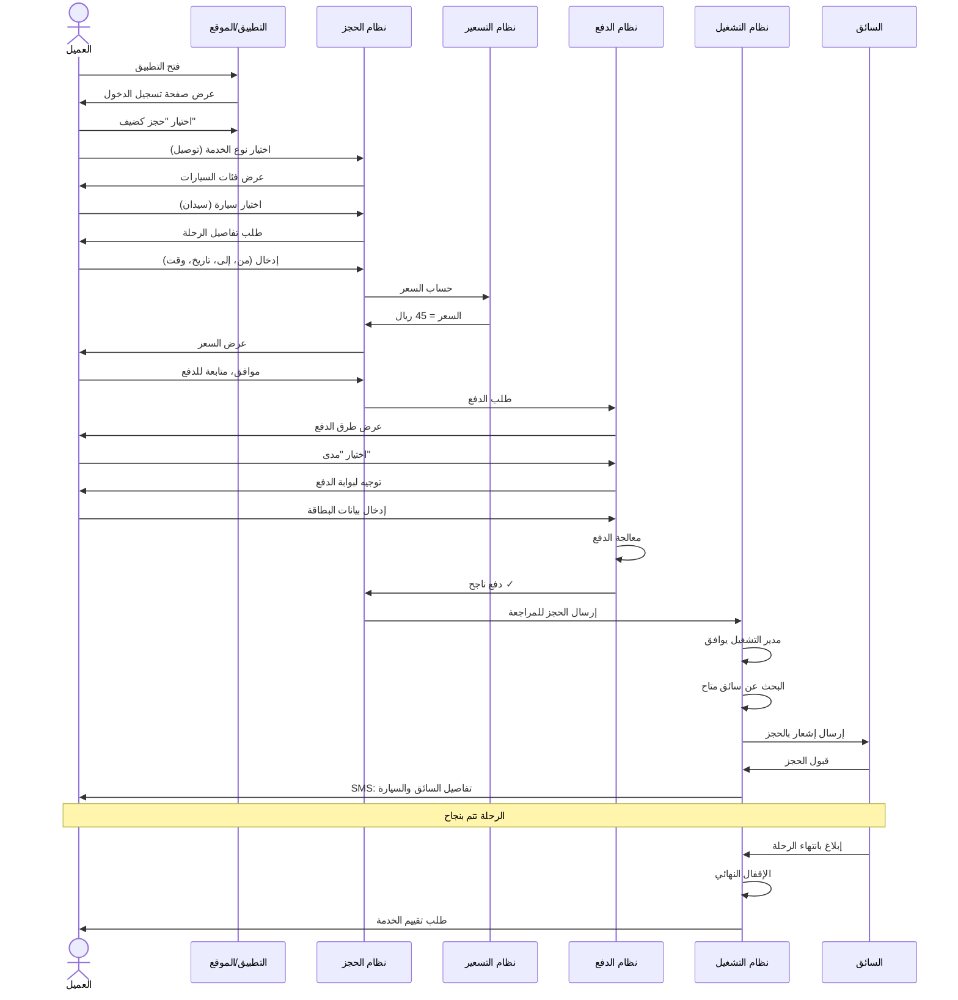

تبدأ السلسلة عندما يفتح العميل التطبيق أو الموقع الإلكتروني، مما يرسل طلباً إلى واجهة المستخدم لعرض الشاشة الرئيسية. تستجيب الواجهة بعرض شاشة السيارات المتحركة التي تستعرض جميع الفئات المتاحة بطريقة جذابة بصرياً. يتفاعل العميل مع هذه الشاشة ويختار سيارة معينة ثم ينقر على زر أطلب الآن، مما يرسل طلباً للانتقال إلى شاشة الخدمات.

تستجيب واجهة المستخدم بعرض شاشة اختيار الخدمة التي تقدم الخيارات المختلفة. يختار العميل المنطقة أولاً ثم نوع الخدمة المطلوب، وهذا الاختيار يرسل إلى نظام الحجز الذي يبدأ في بناء سجل الحجز الجديد. إذا اختار العميل خدمة التوصيل، يطلب منه النظام إدخال الموقع والوجهة، وترسل هذه المعلومات إلى واجهة برمجية لخرائط جوجل لحساب المسافة بينهما.

تعالج خرائط جوجل الطلب وتحسب المسافة الدقيقة مع مراعاة طبيعة الطرق والمسارات المتاحة، وترجع النتيجة إلى نظام الحجز. يرسل نظام الحجز طلباً إلى نظام التسعير لحساب السعر النهائي، متضمناً المعلومات الضرورية مثل المسافة المحسوبة وفئة السيارة المختارة والمنطقة وتاريخ الخدمة.

يسترجع نظام التسعير المعدلات المناسبة من قاعدة البيانات، ويطبق المعادلات المحددة لحساب السعر الأساسي، ثم يضيف النسبة المئوية المقررة والضرائب، ويطبق أي خصومات مستحقة للعميل. يرجع السعر النهائي المحسوب إلى نظام الحجز، الذي يعرضه بدوره للعميل من خلال واجهة المستخدم بشكل واضح ومفصل.

يراجع العميل السعر ويوافق عليه، ثم يختار إضافة الحجز إلى السلة أو المتابعة مباشرة للدفع حسب ما إذا كان يخطط لحجوزات إضافية. عند الجاهزية للدفع، يختار العميل طريقة الدفع المفضلة، ولنفترض في هذا السيناريو أنه اختار الدفع بالبطاقة الإلكترونية. يرسل نظام الحجز طلباً إلى نظام الدفع لبدء معاملة إلكترونية.

يوجه نظام الدفع العميل إلى بوابة الدفع الخارجية الآمنة، حيث يدخل تفاصيل بطاقته. تعالج البوابة المعلومات وتتواصل مع البنك المصدر للتحقق من صحة البطاقة ومعالجة الخصم. يرد البنك بتأكيد النجاح أو الفشل، وتعيد البوابة هذه النتيجة إلى نظام الدفع الخاص بالمنصة.

عند نجاح الدفع، يحفظ نظام الدفع رقم المعاملة والإيصال الإلكتروني، ويخبر نظام الحجز بنجاح العملية. يحفظ نظام الحجز جميع تفاصيل الطلب في قاعدة البيانات بحالة في انتظار الموافقة الإدارية، ويرسل إشعاراً فورياً إلى نظام التشغيل بوصول حجز جديد يتطلب المراجعة. يرسل نظام الحجز أيضاً معلومات التأكيد إلى نظام الإشعارات.

يولد نظام الإشعارات رسائل مناسبة بناءً على قوالب محددة مسبقاً، ويرسلها إلى العميل عبر خدمات الرسائل النصية وواتساب. يستلم العميل تأكيداً أولياً بنجاح عملية الحجز والدفع مع رقم مرجعي وملخص التفاصيل، وتوقعات بشأن الخطوات التالية والإطار الزمني المتوقع للموافقة الإدارية.

في نفس الوقت، يرسل نظام التشغيل إشعاراً لمدير التشغيل أو المشرف المختص بوصول حجز جديد يتطلب الانتباه. يفتح المشرف الحجز من خلال لوحة التحكم الإدارية، ويراجع جميع التفاصيل بعناية، ثم يتخذ قرار الموافقة بالنقر على الزر المخصص. يسجل نظام التشغيل هذه الموافقة ويحدث حالة الحجز في قاعدة البيانات إلى مؤكد.

يخبر نظام التشغيل نظام الإشعارات بالموافقة، فيولد الأخير رسائل تأكيد محدثة ويرسلها للعميل تخبره بقبول حجزه رسمياً. يبحث نظام التشغيل في قاعدة البيانات عن سائقين متاحين يطابقون المتطلبات، ويختار المشرف السائق الأنسب ويربط الحجز به. يحفظ النظام تفاصيل الربط ويحدث حالات السجلات ذات الصلة.

يرسل نظام التشغيل طلبات إلى نظام الإشعارات لإرسال رسائل لكل من العميل والسائق بتفاصيل الترتيبات النهائية. يولد نظام الإشعارات رسائل مخصصة لكل طرف ويرسلها عبر القنوات المناسبة. يستلم العميل معلومات السائق الكاملة، بينما يستلم السائق تفاصيل المهمة وبيانات العميل اللازمة.

تتم الرحلة بنجاح وفق الخطة المحددة، ويبلغ السائق بإتمام الخدمة من خلال تطبيقه. يسجل نظام التشغيل الإتمام وينقل الحجز إلى مرحلة المراجعة والإقفال. يقوم المحاسب أو المشرف المالي بمراجعة نهائية شاملة، ويتحقق من الدفع ويطبق الخصومات ويحدد العمولات، ثم يقفل الحجز بشكل نهائي.

يطلب نظام التشغيل من قاعدة البيانات تحديث جميع الأرصدة المالية لتعكس هذه المعاملة المكتملة. يولد النظام الفاتورة الضريبية النهائية بصيغة بي دي إف ويحفظها، ويرسل طلباً لنظام الإشعارات لإرسالها للعميل مع طلب تقييم الخدمة. ينتهي التسلسل بإرسال الفاتورة والتقييم للعميل، مكملاً بذلك دورة الحجز الكاملة من البداية وحتى النهاية.

#### 7.4.2 تسجيل مورد جديد

يعرض المخطط التسلسلي لتسجيل مورد جديد التفاعلات الزمنية بين المورد المحتمل ونظام التسجيل وقاعدة البيانات وفريق المراجعة الإدارية ونظام الإشعارات، مع التركيز على تدفق المعلومات والقرارات من لحظة بدء التسجيل وحتى التفعيل النهائي للحساب.

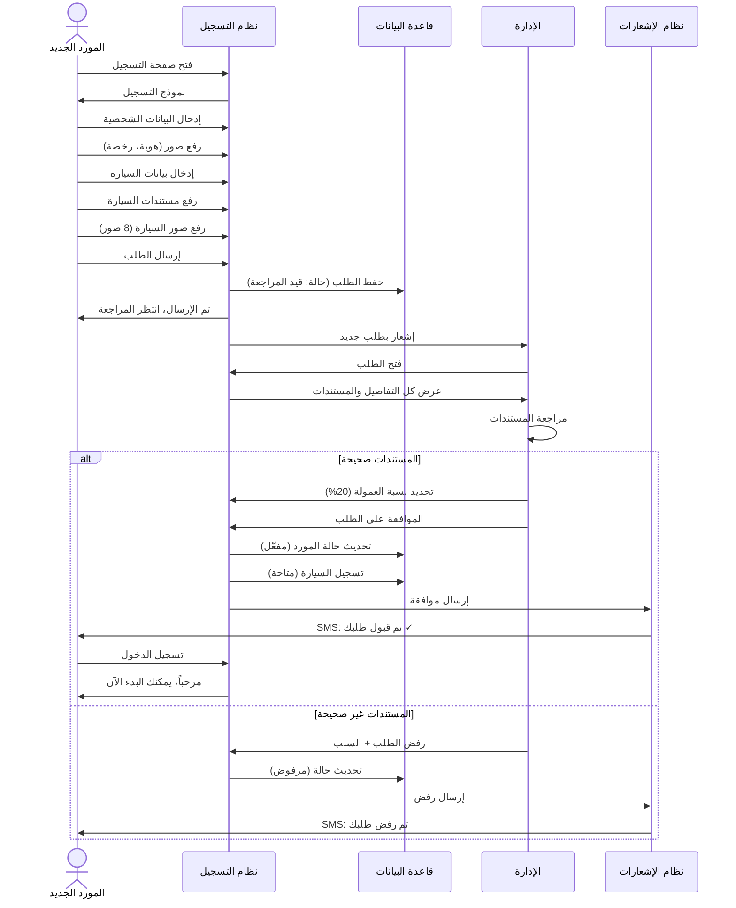

يبدأ التسلسل عندما يصل المورد المحتمل إلى صفحة التسجيل المخصصة للشركاء، مما يرسل طلباً لنظام التسجيل لعرض النموذج الأولي. يستجيب النظام بعرض شاشة ترحيبية توضح فوائد الانضمام والمتطلبات الأساسية، ثم يقدم النموذج الفعلي لإدخال البيانات.

يبدأ المورد بإدخال معلوماته الشخصية في الحقول المخصصة، بما في ذلك الاسم ورقم الهوية ورقم الجوال والبريد الإلكتروني ونوع الشراكة المفضل. بعد إكمال هذا القسم، يرسل النظام طلباً لقاعدة البيانات للتحقق من عدم وجود تسجيلات سابقة بنفس رقم الهوية أو رقم الجوال.

تستعلم قاعدة البيانات عن السجلات الموجودة وترجع النتيجة إلى نظام التسجيل. إذا وجد تطابق، يعرض النظام رسالة تنبيه واضحة للمورد تخبره بأن المعلومات مستخدمة مسبقاً وتمنع المتابعة. إذا لم يوجد تطابق، يسمح النظام بالمتابعة إلى القسم التالي.

يدخل المورد معلوماته البنكية بما في ذلك اسم البنك ورقم الحساب ورمز الآيبان. يتحقق نظام التسجيل من صحة تنسيق الآيبان رياضياً قبل قبوله، ويعرض رسالة خطأ إذا كان التنسيق غير صحيح ويطلب التصحيح. بعد التحقق الناجح، ينتقل النموذج إلى قسم تفاصيل المركبة.

يدخل المورد جميع معلومات المركبة التفصيلية، ثم ينتقل إلى رفع المستندات المطلوبة. لكل مستند يرفعه المورد، يرسل نظام التسجيل الملف إلى نظام التخزين السحابي الذي يحفظه بشكل آمن ويرجع رابطاً للوصول إليه. يحفظ نظام التسجيل هذا الرابط مع بقية معلومات الطلب.

يصل المورد إلى مرحلة رفع صور المركبة الثمانية المطلوبة، وتتكرر عملية الرفع والحفظ لكل صورة. يتحقق النظام من جودة كل صورة ووضوحها قبل قبولها، وينبه المورد إذا كانت أي صورة غير مقبولة ويطلب إعادة التقاطها.

بعد إكمال جميع الأقسام بنجاح، يراجع المورد الملخص الشامل ويؤكد صحة المعلومات، ثم يضغط على زر إرسال للمراجعة. يرسل نظام التسجيل جميع البيانات إلى قاعدة البيانات لحفظها بحالة قيد المراجعة، وتؤكد قاعدة البيانات نجاح الحفظ وتولد رقماً مرجعياً فريداً للطلب.

يرسل نظام التسجيل طلباً لنظام الإشعارات لإبلاغ كل من المورد والإدارة بالطلب الجديد. يولد نظام الإشعارات رسالتين مختلفتين، الأولى للمورد تؤكد استلام طلبه وتزوده بالرقم المرجعي والتوقعات الزمنية، والثانية للإدارة تنبههم بوصول طلب شريك جديد يتطلب المراجعة. ترسل كلتا الرسالتين عبر القنوات المناسبة.

يفتح أحد أعضاء فريق المراجعة الطلب من خلال لوحة التحكم الإدارية، مما يرسل طلباً لنظام التسجيل لاسترجاع جميع التفاصيل. يستعلم نظام التسجيل عن البيانات من قاعدة البيانات ويسترجع روابط المستندات والصور من نظام التخزين، ثم يعرض كل شيء بشكل منظم وسهل المراجعة.

يفحص المراجع جميع المعلومات بعناية ويقيم مدى استيفاء الطلب للمعايير المطلوبة، ثم يتخذ قراراً إما بالموافقة أو الرفض. لنفترض في هذا السيناريو أن المراجع وافق على الطلب بعد التحقق من صحة جميع المعلومات ومناسبة المركبة للمعايير المطلوبة.

يدخل المراجع نسبة العمولة المحددة لهذا المورد، ثم يضغط على زر الموافقة. يرسل نظام التسجيل طلباً لقاعدة البيانات لتحديث حالة المورد إلى مقبول وتسجيل نسبة العمولة والموافق والتاريخ، وتؤكد قاعدة البيانات إتمام التحديث بنجاح. يرسل النظام طلباً آخر لقاعدة البيانات لتسجيل المركبة بحالة نشطة ومتاحة للربط بالحجوزات.

يرسل نظام التسجيل طلباً لنظام الإشعارات لإبلاغ المورد بالقبول. يولد نظام الإشعارات رسالة مبهجة تهنئ المورد على قبوله وتزوده ببيانات الدخول ونسبة العمولة المحددة وتعليمات البدء، وترسلها عبر جميع القنوات المتاحة. ينتهي التسلسل باستلام المورد الجديد للتأكيد وجاهزيته لبدء استقبال الحجوزات من خلال المنصة.

#### 7.4.3 حجز موظف فندق لعميل

يوضح المخطط التسلسلي لحجز موظف فندق نيابة عن عميل التفاعلات المميزة التي تحدث في سياق العملاء المؤسسيين، مع التركيز على كيفية تعامل النظام مع الحجز بالنيابة والدفع الآجل وإدارة الحدود الائتمانية.

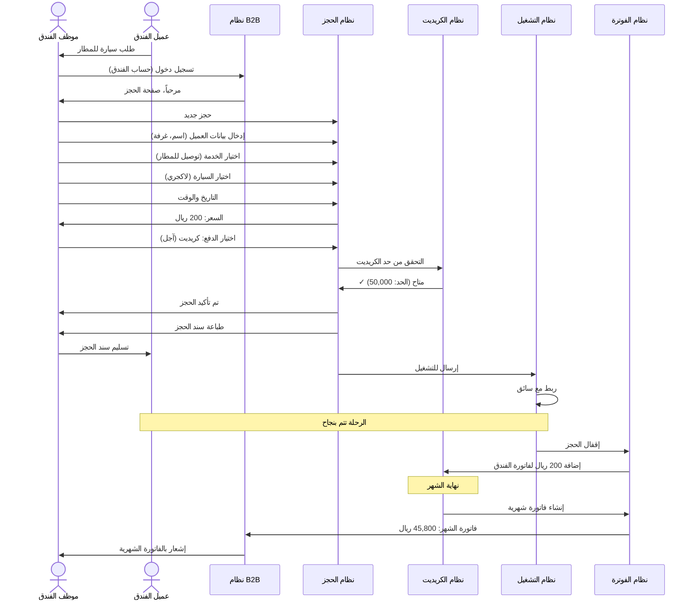

يبدأ التسلسل عندما يتواصل ضيف الفندق مع موظف الاستقبال أو الكونسيرج طالباً خدمة نقل إلى المطار أو وجهة أخرى. يسجل الموظف دخوله إلى نظام رحلتي VIP باستخدام حساب الفندق المؤسسي، مما يرسل طلب مصادقة إلى نظام إدارة الحسابات.

يتحقق نظام الحسابات من بيانات الاعتماد المقدمة ومن أن الحساب نشط ولديه الصلاحيات المناسبة للحجز نيابة عن الضيوف، ثم يصدر رمزاً مميزاً للجلسة ويسمح بالوصول إلى واجهة الحجز المؤسسية. تعرض هذه الواجهة المخصصة معلومات إضافية ذات صلة بالفنادق مثل الرصيد الائتماني المتاح وعدد الحجوزات النشطة والفواتير المعلقة.

يبدأ الموظف بإنشاء حجز جديد ويدخل معلومات العميل النهائي وهو ضيف الفندق، بما في ذلك الاسم الكامل ورقم الغرفة الذي سيستخدم لتحديد الموقع والاتصال عند الحاجة، ورقم الجوال للتواصل المباشر، ورقم الرحلة الجوية إذا كانت الوجهة مطاراً لتمكين تتبع حالة الرحلة والتنسيق الدقيق للتوقيت.

يختار الموظف نوع الخدمة المطلوب من القائمة المتاحة، ولنفترض في هذا السيناريو أنه اختار خدمة التوصيل إلى المطار. يدخل تفاصيل الرحلة بما في ذلك نقطة الانطلاق وهي الفندق والوجهة وهي مطار الملك عبدالعزيز الدولي، والتاريخ والوقت المطلوبين، ويختار فئة المركبة المناسبة وهي في هذا المثال سيارة فاخرة لاكجري تناسب مستوى الخدمة المتوقع.

يرسل نظام الحجز هذه المعلومات إلى نظام التسعير لحساب السعر النهائي. يستعلم نظام التسعير عن معدلات الأسعار من قاعدة البيانات، ويحسب المسافة باستخدام خرائط جوجل، ثم يطبق نسبة الخصم الخاصة بالفندق بناءً على الاتفاق المبرم معه. لنفترض أن السعر الأساسي كان مئتي ريال وأن الفندق يحصل على خصم عشرة بالمائة، فيصبح السعر النهائي مئة وثمانين ريالاً.

يعرض نظام الحجز السعر المحسوب للموظف مع التفصيل الكامل بما في ذلك السعر الأساسي ونسبة الخصم المطبقة والسعر النهائي. يوافق الموظف على السعر ويتابع إلى مرحلة اختيار طريقة الدفع، حيث يختار الدفع الآجل أو الكريديت الذي يمثل الطريقة المفضلة للعملاء المؤسسيين.

يرسل نظام الحجز طلباً إلى نظام إدارة الكريديت للتحقق من توفر الحد الائتماني الكافي لهذا الحجز. يستعلم نظام الكريديت عن تفاصيل حساب الفندق من قاعدة البيانات، بما في ذلك الحد الإجمالي الممنوح والمبلغ المستخدم حالياً والرصيد المتاح.

لنفترض أن الفندق لديه حد ائتماني إجمالي قدره خمسون ألف ريال، وقد استخدم منه حتى الآن عشرة آلاف ريال في حجوزات سابقة خلال الشهر الجاري، مما يترك رصيداً متاحاً قدره أربعون ألف ريال. بما أن الحجز الحالي بقيمة مئة وثمانين ريالاً فقط، فإنه يقع بوضوح ضمن الحد المتاح.

يرد نظام الكريديت إلى نظام الحجز بالموافقة على استخدام الكريديت لهذه المعاملة. يرسل نظام الحجز طلباً لقاعدة البيانات لتسجيل الحجز بجميع تفاصيله وطريقة الدفع الآجلة، ولزيادة المبلغ المستخدم من حد الكريديت بقيمة الحجز الجديد. تؤكد قاعدة البيانات إتمام جميع التحديثات بنجاح وتولد رقماً مرجعياً فريداً للحجز.

يرسل نظام الحجز طلباً لنظام الإشعارات لإرسال تأكيد للموظف يمكنه طباعته أو إرساله للضيف. يولد نظام الإشعارات سند حجز يتضمن الرقم المرجعي وتفاصيل الخدمة الكاملة ومعلومات الدفع، ويعرضه للموظف على الشاشة مع خيارات للطباعة أو الإرسال الإلكتروني.

يطبع الموظف نسخة من سند الحجز ويسلمها للضيف، مما يكمل تفاعله المباشر مع النظام. يرسل نظام الحجز الحجز الجديد إلى نظام التشغيل لإدراجه في قائمة الحجوزات الواردة التي تنتظر المراجعة الإدارية، تماماً كأي حجز آخر.

تجري العملية بعد ذلك كما في السيناريوهات السابقة، حيث يراجع المشرف الحجز ويوافق عليه، ثم يبحث نظام التشغيل عن سائق متاح ويربط الحجز به. يرسل نظام الإشعارات رسائل لكل من الضيف مباشرة على رقم جواله وللسائق بتفاصيل الترتيبات النهائية.

تتم الرحلة بنجاح وفق الخطة، وعند الإتمام يقفل الحجز مالياً بالطريقة المعتادة. الفرق الرئيسي هنا هو أن المبلغ لا يدفع فوراً بل يسجل في حساب الفندق كمستحق ضمن الفاتورة الشهرية.

في نهاية دورة الفوترة المتفق عليها، عادة نهاية كل شهر، يرسل نظام المحاسبة طلباً لقاعدة البيانات لاسترجاع جميع معاملات الفندق خلال الفترة. يستعلم عن جميع الحجوزات المكتملة والمقفلة التي تم إجراؤها بالكريديت، ويجمع المبالغ ويحسب الإجمالي.

يولد نظام المحاسبة فاتورة شهرية موحدة شاملة تتضمن جدولاً تفصيلياً لجميع المعاملات مع التواريخ والأرقام المرجعية وأسماء الضيوف والخدمات المقدمة والمبالغ، بالإضافة إلى المجموع الكلي المستحق. في هذا المثال، لنفترض أن الفاتورة الشهرية بلغت خمسة وأربعين ألفاً وثمانمئة ريال تشمل جميع حجوزات الشهر بما فيها هذا الحجز.

يرسل نظام المحاسبة الفاتورة إلى نظام الإشعارات الذي يرسلها للفندق عبر البريد الإلكتروني وأيضاً يتيحها للتنزيل من خلال حساب الفندق في النظام. يستلم القسم المالي في الفندق الفاتورة ويراجعها ويعالج الدفع وفق شروط الاتفاق، عادة خلال أسبوعين من تاريخ الإصدار.

بعد استلام الدفع وتأكيده، يرسل القسم المالي في رحلتي VIP طلباً لنظام الكريديت لإعادة تعيين العداد وتحرير الحد المستخدم ليصبح متاحاً مرة أخرى لحجوزات الشهر الجديد. ينتهي التسلسل بتحديث قاعدة البيانات وإرسال إشعار للفندق يؤكد استلام الدفع ويوضح الحد الائتماني المتاح للدورة القادمة.

### 7.5 حالات الاستخدام

#### 7.5.1 مخطط حالات الاستخدام العام

```mermaid
graph TB
    subgraph Actors[الجهات الفاعلة]
        Client[العميل المباشر]
        BusinessUser[موظف الشركة/الفندق]
        Partner[المورد/السائق]
        OpManager[مدير التشغيل]
        Supervisor[مشرف المنطقة]
        Admin[مدير النظام]
    end
    
    subgraph System[نظام النقل والتوصيل]
        subgraph ClientUC[حالات العميل]
            UC1[تسجيل حساب جديد]
            UC2[الحجز كضيف]
            UC3[اختيار نوع الخدمة]
            UC4[اختيار نوع السيارة]
            UC5[إدخال بيانات الحجز]
            UC6[عرض السعر]
            UC7[الدفع]
            UC8[إضافة حجوزات متعددة]
            UC9[عرض الحجوزات السابقة]
        end
        
        subgraph BusinessUC[حالات الشركات]
            UC10[طلب حساب شركة]
            UC11[الحجز باسم العملاء]
            UC12[طلب كريديت]
            UC13[عرض الفواتير الشهرية]
        end
        
        subgraph PartnerUC[حالات الموردين]
            UC14[التسجيل كمورد]
            UC15[إرفاق المستندات]
            UC16[تسجيل سيارة جديدة]
            UC17[استلام إشعارات الحجز]
            UC18[تأكيد/رفض الحجز]
            UC19[عرض كشف الحساب]
            UC20[متابعة المستحقات]
        end
        
        subgraph OperationUC[حالات التشغيل]
            UC21[استقبال الحجوزات]
            UC22[الموافقة على الحجز]
            UC23[فلترة الحجوزات]
            UC24[ربط حجز مع سائق]
            UC25[إرسال الإشعارات]
            UC26[متابعة التنفيذ]
            UC27[الإقفال النهائي]
            UC28[متابعة الرحلات الجوية]
        end
        
        subgraph AdminUC[حالات الإدارة]
            UC29[إدارة المستخدمين]
            UC30[إدارة السيارات]
            UC31[إدارة الأسعار]
            UC32[عرض التقارير]
            UC33[إدارة الصلاحيات]
            UC34[تخصيص الهوية البصرية]
            UC35[إدارة اللغات]
        end
    end
    
    Client --> UC1
    Client --> UC2
    Client --> UC3
    Client --> UC4
    Client --> UC5
    Client --> UC6
    Client --> UC7
    Client --> UC8
    Client --> UC9
    
    BusinessUser --> UC10
    BusinessUser --> UC11
    BusinessUser --> UC12
    BusinessUser --> UC13
    
    Partner --> UC14
    Partner --> UC15
    Partner --> UC16
    Partner --> UC17
    Partner --> UC18
    Partner --> UC19
    Partner --> UC20
    
    OpManager --> UC21
    OpManager --> UC22
    OpManager --> UC23
    OpManager --> UC24
    OpManager --> UC25
    
    Supervisor --> UC26
    Supervisor --> UC28
    
    OpManager --> UC27
    
    Admin --> UC29
    Admin --> UC30
    Admin --> UC31
    Admin --> UC32
    Admin --> UC33
    Admin --> UC34
    Admin --> UC35
    
    UC7 -.->|يتضمن| UC6
    UC8 -.->|يتضمن| UC3
    UC8 -.->|يتضمن| UC4
    UC11 -.->|يشبه| UC3
    UC24 -.->|يتطلب| UC23
    UC25 -.->|يتبع| UC24
    UC27 -.->|يتطلب| UC26
```

يوفر مخطط حالات الاستخدام العام رؤية شاملة لجميع الوظائف الرئيسية التي يقدمها نظام رحلتي VIP، مجمعة حسب الفئات المستخدمة لها، مع توضيح العلاقات بين الحالات المختلفة والجهات الفاعلة التي تتفاعل معها.

يتفاعل مع النظام أربع فئات رئيسية من الجهات الفاعلة، كل منها لها مجموعة محددة من حالات الاستخدام التي تعكس احتياجاتها وأدوارها. تمثل الفئة الأولى العميل المباشر أو الفرد الذي يحجز لنفسه، وترتبط هذه الفئة بتسع حالات استخدام أساسية تغطي دورة حياة تفاعله الكاملة مع المنصة.

تبدأ حالات استخدام العميل المباشر بتسجيل حساب جديد الذي يتيح للعميل إنشاء ملف شخصي دائم يحفظ معلوماته وتفضيلاته. توفر حالة الحجز كضيف بديلاً أسرع للعملاء الذين يفضلون عدم إنشاء حساب والحصول على خدمة فورية لمرة واحدة. تشكل حالة اختيار نوع الخدمة نقطة قرار حاسمة حيث يحدد العميل طبيعة الخدمة المطلوبة من بين الخيارات المتاحة.

تتيح حالة اختيار نوع السيارة للعميل تحديد فئة المركبة التي تناسب احتياجاته وميزانيته، بينما توفر حالة إدخال بيانات الحجز الحقول الضرورية لإدخال التفاصيل التي تمكن من تنفيذ الخدمة بنجاح. تعرض حالة عرض السعر التكلفة المحسوبة بشفافية كاملة قبل الالتزام، مما يمنح العميل القدرة على اتخاذ قرار مستنير.

تدير حالة الدفع عملية إتمام المعاملة المالية بطرق متعددة تناسب تفضيلات مختلفة، بينما تتيح حالة إضافة حجوزات متعددة للعملاء الذين يخططون لرحلات متعددة إدارتها من مكان واحد. أخيراً، توفر حالة عرض الحجوزات السابقة للعملاء المسجلين إمكانية الوصول إلى سجلهم الكامل للمراجعة أو إعادة الحجز بسهولة.

تمثل الفئة الثانية موظفي الشركات والفنادق الذين يحجزون نيابة عن عملائهم أو ضيوفهم، وترتبط بأربع حالات استخدام متخصصة. تبدأ بحالة طلب حساب شركة التي تتيح للمؤسسات التقدم للحصول على حساب مؤسسي بميزات خاصة. تمكن حالة الحجز باسم العملاء الموظفين من إنشاء حجوزات لصالح أطراف ثالثة مع ربطها بحساب المؤسسة.

توفر حالة طلب كريديت آلية للشركات المعتمدة للحصول على حد ائتماني يسمح بالدفع الآجل، بينما تتيح حالة عرض الفواتير الشهرية للمؤسسات مراجعة تفاصيل استخدامها الشهري وتخطيط مدفوعاتها.

تتفاعل الفئة الثالثة وهي الموردون والسائقون الشركاء مع سبع حالات استخدام تغطي دورة حياة شراكتهم. تبدأ بحالة التسجيل كمورد التي تتيح لمالكي المركبات الانضمام إلى الشبكة، وتتبعها حالة إرفاق المستندات التي تجمع الإثباتات الضرورية للتحقق والموافقة.

تتيح حالة تسجيل سيارة جديدة للموردين إضافة مركبات إضافية إلى ملفهم بعد الموافقة الأولية، بينما توفر حالة استلام إشعارات الحجز آلية فورية لإبلاغ الموردين بالحجوزات المتاحة التي تطابق مواصفات مركباتهم. تمكن حالة تأكيد أو رفض الحجز الموردين من ممارسة السيطرة على جداولهم من خلال قبول أو رفض المهام المعروضة.

توفر حالة عرض كشف الحساب شفافية كاملة حول المعاملات المالية والمستحقات، بينما تمكن حالة متابعة المستحقات الموردين من تتبع حالة دفعاتهم المنتظرة والمكتملة.

تتعامل الفئة الرابعة وهي الإدارة مع سبع حالات استخدام قوية تمنحها السيطرة الكاملة على العمليات. تبدأ بحالة إدارة المستخدمين التي تتيح إضافة وتعديل وحذف حسابات المستخدمين من جميع الفئات، وتتبعها حالة إدارة السيارات التي توفر رؤية شاملة وتحكماً في جميع المركبات المسجلة.

تمكن حالة إدارة الأسعار الإدارة من تحديث معدلات الأسعار حسب الفئات والمناطق والخدمات، بينما توفر حالة عرض التقارير وصولاً إلى تحليلات شاملة عن جميع جوانب العمليات. تتيح حالة إدارة الصلاحيات تخصيص مستويات الوصول لكل مستخدم إداري حسب دوره ومسؤولياته.

توفر حالة تخصيص الهوية البصرية أدوات لتعديل شعار الشركة وألوانها وعناصر العلامة التجارية الأخرى، بينما تمكن حالة إدارة اللغات الإدارة من إضافة أو تعديل الترجمات لدعم لغات إضافية مستقبلاً.

تربط عدة علاقات بين حالات الاستخدام المختلفة توضح التبعيات والتضمينات. على سبيل المثال، تتضمن حالة الدفع دائماً حالة عرض السعر كخطوة سابقة ضرورية، بينما تتضمن حالة إضافة حجوزات متعددة تكرار حالات اختيار نوع الخدمة واختيار نوع السيارة. تشبه حالة الحجز باسم العملاء للشركات بشكل كبير حالة اختيار نوع الخدمة للعملاء الأفراد من حيث الوظيفة الأساسية.

تتطلب حالة ربط حجز مع سائق إتمام حالة فلترة الحجوزات أولاً لتحديد الخيارات المتاحة، وتتبعها دائماً حالة إرسال الإشعارات لإبلاغ الأطراف المعنية. تتطلب حالة الإقفال النهائي إتمام حالة متابعة التنفيذ أولاً للتأكد من اكتمال الخدمة الفعلية.

يوفر هذا المخطط الشامل فهماً واضحاً لنطاق النظام الكامل والوظائف المتاحة لكل فئة من المستخدمين، مما يساعد على ضمان تغطية جميع المتطلبات الوظيفية وعدم إغفال أي حاجة مهمة.

#### 7.5.2 حالات الاستخدام التفصيلية

تقدم حالات الاستخدام التفصيلية وصفاً نصياً شاملاً لكل حالة مهمة، متضمنة الممثلين المعنيين والشروط المسبقة والتدفق الأساسي والتدفقات البديلة والاستثناءات والشروط اللاحقة، مما يوفر فهماً عميقاً لكيفية تفاعل المستخدمين مع النظام في سيناريوهات مختلفة.

**حالة الاستخدام 1: تسجيل حساب جديد (عميل مباشر)**

**المعرف:** UC-C-001  
**الاسم:** تسجيل حساب جديد  
**الممثل الرئيسي:** عميل مباشر جديد  
**مستوى:** هدف المستخدم  
**الأولوية:** عالية

**الشروط المسبقة:**
- يمتلك العميل جهازاً ذكياً أو حاسوباً متصلاً بالإنترنت
- لم يسجل العميل مسبقاً بنفس رقم الجوال

**الشروط اللاحقة عند النجاح:**
- تم إنشاء حساب نشط للعميل في النظام
- تم التحقق من رقم جوال العميل
- يمكن للعميل تسجيل الدخول واستخدام جميع ميزات الحساب المسجل

**التدفق الأساسي:**
1. يفتح العميل التطبيق أو الموقع الإلكتروني
2. يختار العميل خيار "إنشاء حساب جديد"
3. يعرض النظام نموذج التسجيل
4. يدخل العميل الاسم الكامل (عربي أو إنجليزي)
5. يدخل العميل رقم الجوال (بتنسيق سعودي صحيح)
6. يدخل العميل عنوان بريد إلكتروني اختياري
7. يدخل العميل كلمة مرور تلبي معايير القوة المحددة
8. يؤكد العميل كلمة المرور بإعادة إدخالها
9. يوافق العميل على الشروط والأحكام
10. يضغط العميل على زر "تسجيل"
11. يتحقق النظام من عدم استخدام رقم الجوال مسبقاً
12. يحفظ النظام بيانات العميل بحالة "غير محقق"
13. يولد النظام رمز تحقق مكون من ستة أرقام
14. يرسل النظام الرمز عبر رسالة نصية قصيرة إلى رقم الجوال
15. يعرض النظام شاشة إدخال رمز التحقق
16. يدخل العميل الرمز المستلم
17. يتحقق النظام من صحة الرمز
18. يحدث النظام حالة الحساب إلى "نشط ومحقق"
19. يصدر النظام رمزاً مميزاً للجلسة ويسجل دخول العميل تلقائياً
20. يعرض النظام رسالة ترحيب ويوجه العميل للصفحة الرئيسية

**التدفقات البديلة:**

*3أ. العميل يختار التسجيل عبر حساب جوجل أو أبل:*
- 3أ1. يختار العميل خيار "تسجيل بواسطة جوجل/أبل"
- 3أ2. يوجه النظام العميل لصفحة مصادقة الطرف الثالث
- 3أ3. يوافق العميل على مشاركة معلوماته الأساسية
- 3أ4. يستلم النظام المعلومات من الطرف الثالث
- 3أ5. يتابع التدفق من الخطوة 11

*11أ. رقم الجوال مستخدم مسبقاً:*
- 11أ1. يعرض النظام رسالة "رقم الجوال مسجل مسبقاً"
- 11أ2. يقترح النظام تسجيل الدخول أو استرجاع كلمة المرور
- 11أ3. ينتهي التدفق

*16أ. الرمز المدخل غير صحيح:*
- 16أ1. يعرض النظام رسالة خطأ
- 16أ2. يسمح بمحاولتين إضافيتين
- 16أ3. إذا فشلت جميع المحاولات، يعود لإرسال رمز جديد

*16ب. انتهت صلاحية الرمز (أكثر من 5 دقائق):*
- 16ب1. يعرض النظام رسالة انتهاء الصلاحية
- 16ب2. يوفر خيار "إرسال رمز جديد"
- 16ب3. يتابع من الخطوة 13

**الاستثناءات:**

*في أي وقت. انقطاع الاتصال بالإنترنت:*
- يعرض النظام رسالة خطأ واضحة
- يحفظ البيانات المدخلة مؤقتاً إن أمكن
- يطلب من العميل المحاولة مرة أخرى عند عودة الاتصال

*الخطوة 14. فشل إرسال الرسالة النصية:*
- يحاول النظام الإرسال مرة أخرى بعد 30 ثانية
- إذا فشل مرتين، يقترح إرسال الرمز عبر مكالمة صوتية
- يسجل الخطأ للمراجعة الفنية

**القواعد التجارية:**
- BR001: يجب أن تحتوي كلمة المرور على 8 أحرف على الأقل بما في ذلك حرف كبير وحرف صغير ورقم
- BR002: رمز التحقق صالح لمدة 5 دقائق فقط
- BR003: لا يسمح بأكثر من 3 محاولات خاطئة لإدخال رمز التحقق
- BR004: كل رقم جوال يمكن ربطه بحساب واحد فقط

**المتطلبات الخاصة:**
- NFR001: يجب أن تكتمل عملية التسجيل بأكملها في أقل من دقيقتين في ظروف الشبكة العادية
- NFR002: يجب تشفير كلمة المرور باستخدام خوارزمية Bcrypt قبل الحفظ
- NFR003: يجب أن تكون جميع الحقول والرسائل متاحة باللغتين العربية والإنجليزية

**ملاحظات:**
- يجب أن تكون واجهة التسجيل بسيطة وخالية من التعقيدات لتشجيع التسجيل
- يمكن إضافة معلومات اختيارية إضافية لاحقاً من خلال الملف الشخصي
- يتم حفظ تاريخ ووقت التسجيل لأغراض التحليل والدعم

---

**حالة الاستخدام 2: إنشاء حجز جديد (عميل مباشر)**

**المعرف:** UC-C-002  
**الاسم:** إنشاء حجز جديد  
**الممثل الرئيسي:** عميل مباشر (مسجل أو ضيف)  
**مستوى:** هدف المستخدم  
**الأولوية:** حرجة

**الشروط المسبقة:**
- العميل قام بتسجيل الدخول أو اختار المتابعة كضيف
- توجد خدمات متاحة في المنطقة المطلوبة
- توجد مركبات متاحة من الفئة المطلوبة

**الشروط اللاحقة عند النجاح:**
- تم إنشاء حجز جديد في النظام بحالة "في انتظار الموافقة"
- تم تسجيل الدفع أو تحديد طريقة الدفع
- استلم العميل رقماً مرجعياً فريداً للحجز
- تم إرسال إشعار للإدارة بالحجز الجديد
- تم إرسال تأكيد أولي للعميل

**التدفق الأساسي:**
1. يفتح العميل صفحة الحجز الرئيسية
2. يعرض النظام شاشة السيارات المتحركة بجميع الفئات المتاحة
3. يتصفح العميل الفئات ويختار السيارة المفضلة
4. يضغط العميل على زر "أطلب الآن"
5. يعرض النظام شاشة اختيار المنطقة
6. يختار العميل المنطقة أو الفرع (جدة، مكة، الرياض، العلا)
7. يعرض النظام شاشة اختيار نوع الخدمة
8. يختار العميل نوع الخدمة المطلوب (توصيل، بالساعة، 8 ساعات، 12 ساعة، ساعة زائدة)
9. يعرض النظام شاشة إدخال تفاصيل الحجز المناسبة لنوع الخدمة المختار
10. يدخل العميل نقطة الانطلاق باستخدام البحث أو الخريطة
11. إذا كانت الخدمة "توصيل"، يدخل العميل الوجهة أيضاً
12. يحسب النظام المسافة تلقائياً باستخدام Google Maps API
13. يدخل العميل التاريخ والوقت المطلوب
14. يدخل العميل عدد الركاب
15. يدخل العميل المعلومات الاختيارية (رقم الرحلة، رقم الغرفة، ملاحظات)
16. يختار العميل جنسية السائق المفضلة إن أراد
17. يضغط العميل على زر "حساب السعر"
18. يرسل النظام البيانات لنظام التسعير
19. يحسب نظام التسعير السعر بناءً على المسافة/المدة والفئة والمنطقة
20. يطبق النظام النسبة المقررة والضرائب والخصومات إن وجدت
21. يعرض النظام السعر النهائي المفصل للعميل
22. يوافق العميل على السعر ويضغط "إضافة للسلة" أو "احجز الآن"
23. إذا اختار "احجز الآن"، ينتقل مباشرة للدفع
24. إذا اختار "إضافة للسلة"، يسأل النظام عن رغبته في إضافة حجوزات أخرى
25. إذا رغب في إضافة المزيد، يعود للخطوة 7
26. عند الانتهاء من جميع الحجوزات، يعرض النظام السلة الكاملة
27. يراجع العميل جميع الحجوزات في السلة
28. يضغط العميل على "متابعة للدفع"
29. يعرض النظام خيارات الدفع المتاحة
30. يختار العميل طريقة الدفع (كاش، مدى/فيزا، تحويل، كريديت)
31. يعالج النظام الدفع حسب الطريقة المختارة
32. عند نجاح الدفع أو تسجيل طريقته، يحفظ النظام الحجز
33. يولد النظام رقماً مرجعياً فريداً (أو أرقاماً للحجوزات المتعددة)
34. يرسل النظام الحجز لقائمة الحجوزات الواردة في لوحة التحكم
35. يرسل النظام إشعار تأكيد للعميل عبر SMS وإشعار التطبيق
36. يعرض النظام شاشة التأكيد النهائي مع الرقم المرجعي

**التدفقات البديلة:**

*1أ. العميل يصل عبر رابط مباشر لفئة سيارة معينة:*
- 1أ1. يعرض النظام تفاصيل تلك الفئة مباشرة
- 1أ2. يتابع من الخطوة 4

*8أ. العميل يختار خدمة بسعر ثابت (بالساعة، 8 ساعات، 12 ساعة):*
- 8أ1. لا يطلب النظام الوجهة (اختيارية فقط)
- 8أ2. لا يحسب المسافة
- 8أ3. يستخدم السعر الثابت المحدد مسبقاً
- 8أ4. يتابع من الخطوة 13

*21أ. العميل غير راضٍ عن السعر:*
- 21أ1. يختار العميل "تعديل التفاصيل" أو "اختيار فئة أخرى"
- 21أ2. يعود للخطوة المناسبة حسب اختياره
- 21أ3. يعاد حساب السعر

*24أ. العميل اختار "إضافة للسلة" ولا يرغب في المزيد:*
- 24أ1. يضغط على "متابعة للدفع"
- 24أ2. يتابع من الخطوة 26

*30أ. العميل يختار الدفع الإلكتروني بالبطاقة:*
- 30أ1. يوجه النظام للبوابة الآمنة
- 30أ2. يدخل العميل بيانات البطاقة
- 30أ3. تعالج البوابة الدفع
- 30أ4. إذا نجح، يتابع من الخطوة 32
- 30أ5. إذا فشل، يعرض السبب ويعود للخطوة 29

*30ب. العميل يختار التحويل البنكي:*
- 30ب1. يعرض النظام معلومات الحساب البنكي
- 30ب2. يطلب من العميل رفع إيصال التحويل
- 30ب3. يحفظ الإيصال ويضع الحجز في "انتظار التحقق"
- 30ب4. يتابع من الخطوة 32

*30ج. العميل يختار الكريديت (للشركات فقط):*
- 30ج1. يتحقق النظام من الحد المتاح
- 30ج2. إذا كان كافياً، يسجل على الحساب ويتابع
- 30ج3. إذا كان غير كافٍ، يعرض رسالة ويعود للخطوة 29

**الاستثناءات:**

*الخطوة 12. فشل الاتصال بـ Google Maps:*
- يعرض النظام رسالة خطأ مؤقتة
- يعيد المحاولة تلقائياً بعد ثوانٍ
- إذا فشل مرتين، يطلب من العميل إدخال المسافة التقديرية يدوياً
- يضع علامة على الحجز للمراجعة الإدارية

*الخطوة 18-20. خطأ في حساب السعر:*
- يسجل النظام الخطأ للمراجعة الفنية
- يعرض رسالة اعتذار للعميل
- يطلب المحاولة مرة أخرى أو الاتصال بالدعم

*الخطوة 31. فشل معالجة الدفع الإلكتروني:*
- يعرض سبب الفشل (رصيد غير كافٍ، بيانات خاطئة، إلخ)
- يسمح بمحاولتين إضافيتين
- يقترح طرق دفع بديلة

*في أي وقت. انقطاع الاتصال:*
- يحفظ النظام التقدم محلياً إن أمكن
- يستعيد البيانات عند عودة الاتصال
- يطلب من العميل المتابعة من حيث توقف

**القواعد التجارية:**
- BR010: الحد الأدنى للحجز المسبق هو 2 ساعة قبل موعد الخدمة
- BR011: لا يمكن حجز خدمات في تواريخ ماضية
- BR012: يحسب سعر خدمة التوصيل بـ (المسافة × سعر الكيلومتر × نسبة المنطقة) + الضرائب - الخصومات
- BR013: تطبق الخصومات تلقائياً بناءً على مستوى ولاء العميل
- BR014: الحد الأقصى للحجوزات في سلة واحدة هو 10 حجوزات
- BR015: يجب أن يكون عدد الركاب ضمن سعة المركبة المختارة

**المتطلبات الخاصة:**
- NFR010: يجب أن تستجيب واجهة الحجز في أقل من 1 ثانية لكل إدخال
- NFR011: يجب حساب المسافة بدقة ±5% من المسافة الفعلية
- NFR012: يجب حفظ بيانات السلة محلياً لمدة 24 ساعة
- NFR013: يجب أن تدعم الواجهة اللمس المتعدد على الأجهزة المحمولة
- NFR014: يجب تشفير جميع بيانات الدفع أثناء النقل والتخزين

**ملاحظات:**
- تعتبر هذه أهم حالة استخدام في النظام بأكمله
- يجب أن تكون العملية سلسة وخالية من التعقيدات
- كل خطوة إضافية تقلل من معدل الإكمال، لذا يجب التقليل منها
- يجب اختبار هذه الحالة بشكل مكثف مع مستخدمين حقيقيين