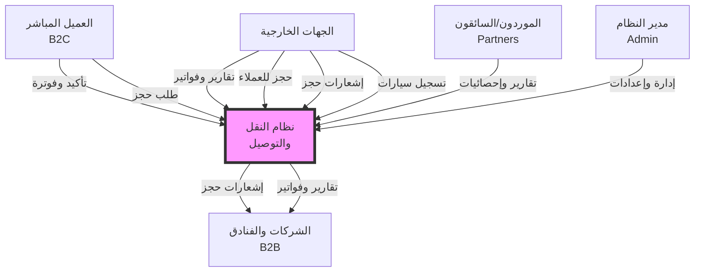
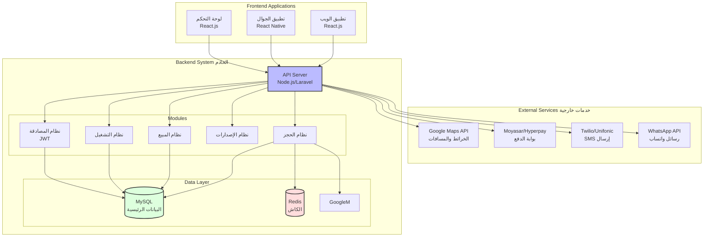
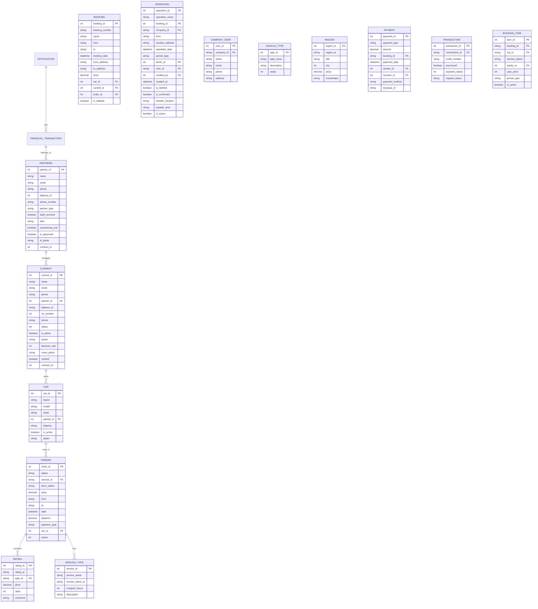
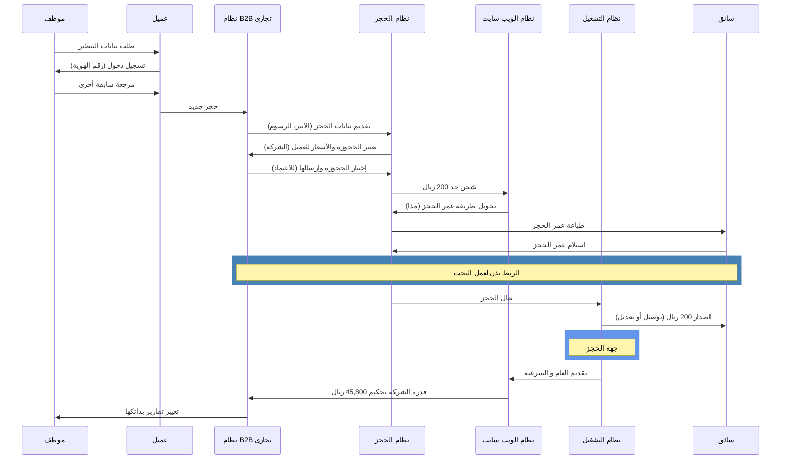
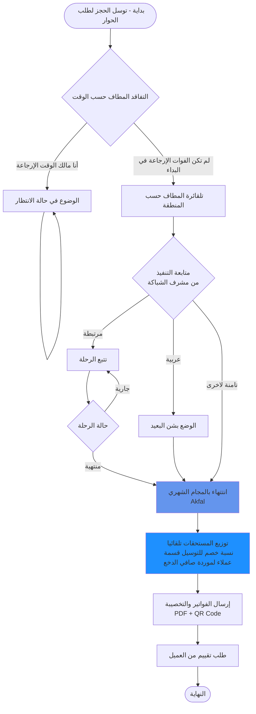
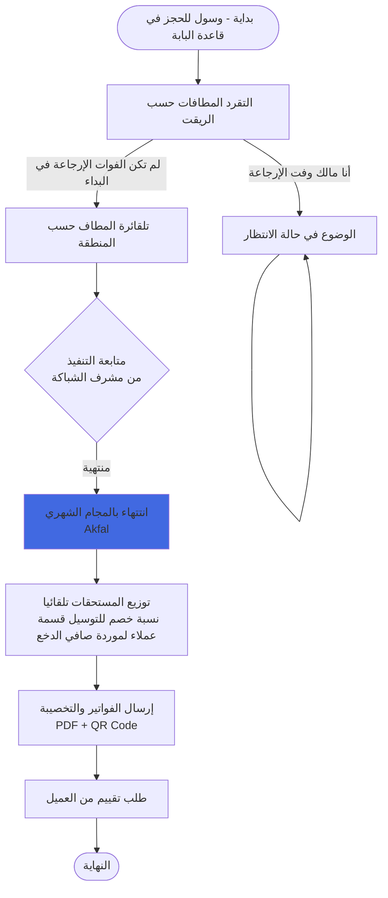
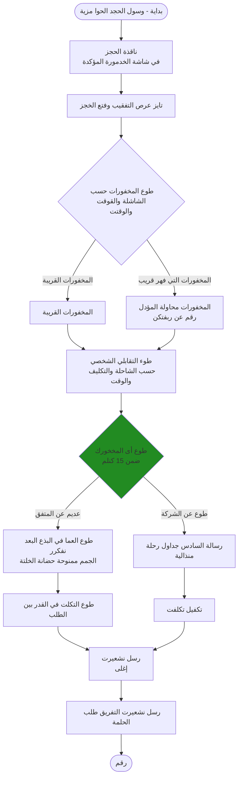
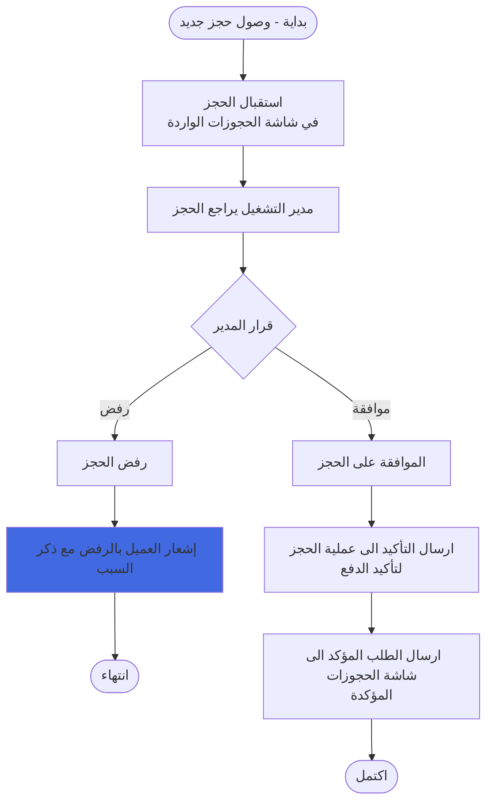
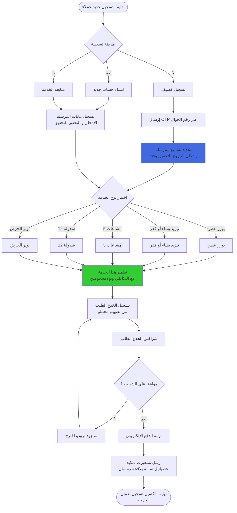

# Transportation and Logistics System Documentation

## System Architecture Diagrams

### 1. Context Diagram - System Overview

### 2. Technical Architecture

### 3. Database Schema

### 4. Booking Flow - Sequence Diagram

### 5. Sales Booking Process

### 6. Route Planning Flowchart

### 7. Trip Search in Database

### 8. Route Arrival - Tracking Flow

### 9. New Booking Arrival

### 10. Customer Registration Flow

---