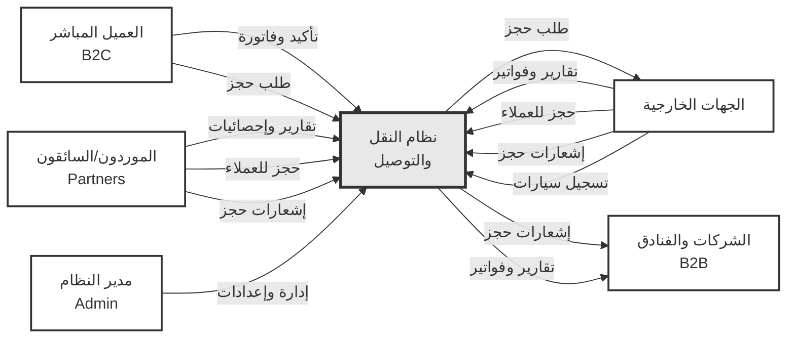
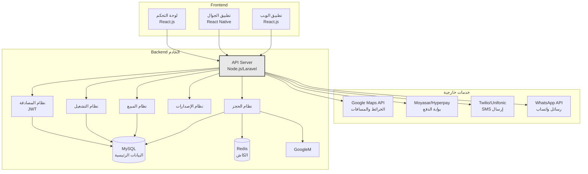
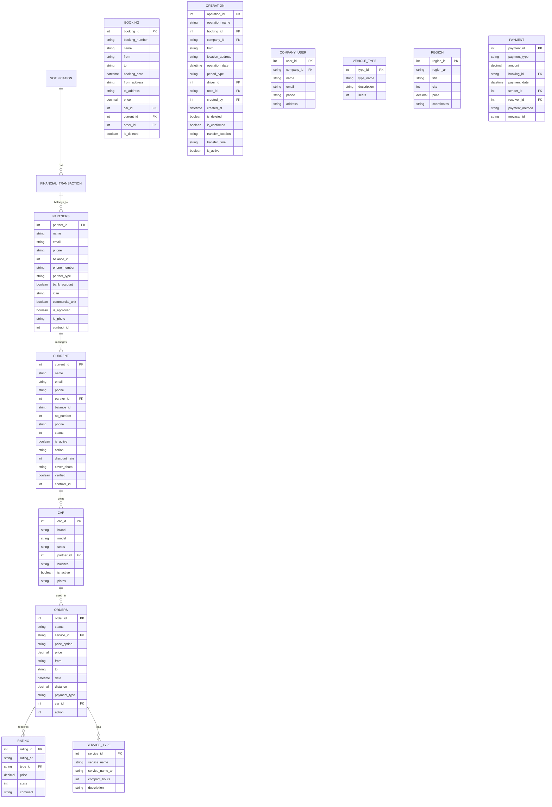
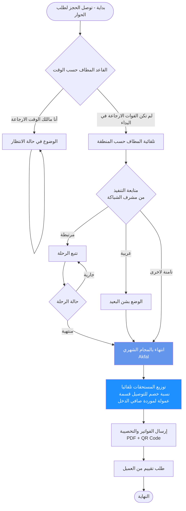
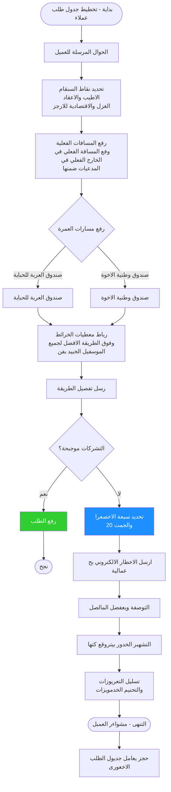
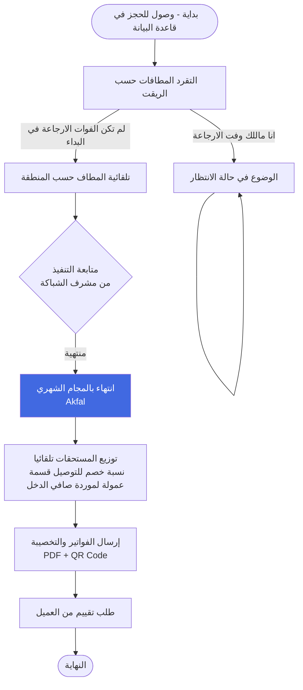
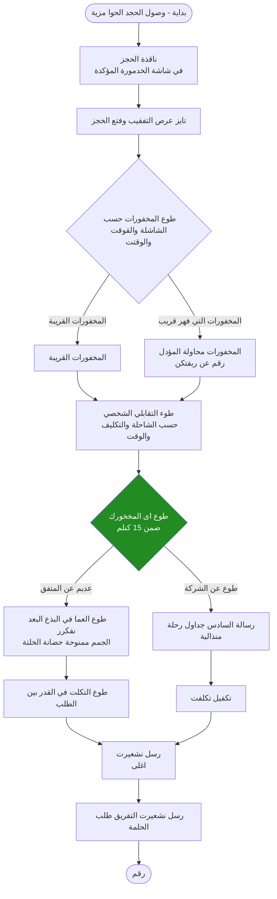
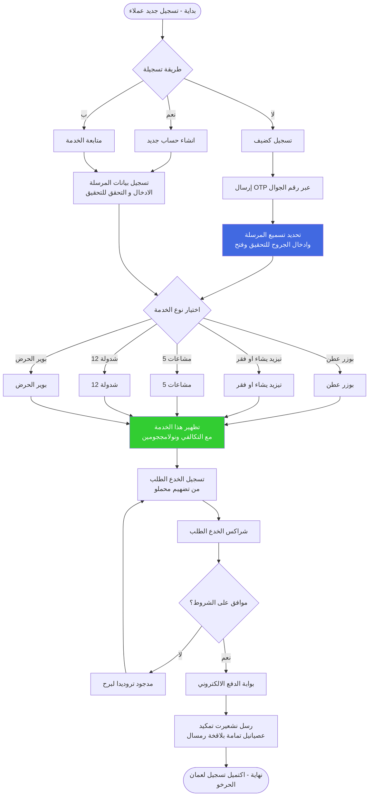

# نظام النقل والتوصيل - المخططات الكاملة

---

## 1. مخطط السياق (Context Diagram)

---

## 2. البنية التقنية (Technical Architecture)

---

## 3. قاعدة البيانات (Database Schema)

---

## 4. مخطط تسلسل الحجز (Booking Sequence)

---

## 5. عملية البيع والحجز (Sales Process)

---

## 6. تخطيط المسارات (Route Planning)

---

## 7. البحث عن الرحلة (Trip Search)

---

## 8. تتبع وصول المسار (Route Arrival Tracking)

---

## 9. وصول حجز جديد (New Booking Arrival)

---

## 10. تسجيل عميل جديد (Customer Registration)

---
