<div dir="rtl">
  <h2 style="text-align: center;">  تحليل وتصميم نظام - رحلتي VIP</h2>
  <hr>


**الإصدار:** 3.0   
**تاريخ الإعداد:** أكتوبر 2025  
**حالة الوثيقة:** معتمدة للتطوير

---

## 1. المقدمة التنفيذية (Executive Summary)

### 1.1 نبذة عن المشروع

يمثل نظام رحلتي VIP حلاً تقنياً متكاملاً ومتقدماً لإدارة خدمات النقل والتوصيل الفاخرة في السوق السعودي، حيث تم تصميمه ليكون منصة شاملة تربط بين ثلاث فئات رئيسية من المستخدمين ضمن بيئة رقمية موحدة ومتماسكة. يستهدف النظام معالجة التحديات الحالية في قطاع النقل الفاخر من خلال توفير حل تقني يجمع بين الكفاءة التشغيلية والشفافية المالية وسهولة الاستخدام.

تم تطوير هذا النظام استجابة لحاجة السوق المحلي إلى منصة متخصصة تتجاوز القيود التي تفرضها التطبيقات التقليدية للنقل العام، حيث يركز على تقديم خدمات راقية تلبي احتياجات شريحة العملاء المميزين والشركات والفنادق، مع توفير آليات عمل احترافية للموردين والسائقين الشركاء. يتميز النظام بقدرته على إدارة أنواع متعددة من الخدمات تتراوح بين التوصيل من نقطة لأخرى والإيجار بالساعة والجولات السياحية الممتدة، مع دعم كامل لعمليات الدفع المتنوعة بما في ذلك الدفع الآجل للعملاء المؤسسيين.

### 1.2 الأهداف الاستراتيجية

يسعى نظام رحلتي VIP إلى تحقيق مجموعة من الأهداف الاستراتيجية المتكاملة التي تضمن نجاحه واستدامته على المدى الطويل. تتمحور هذه الأهداف حول ثلاثة محاور رئيسية تشمل التميز التشغيلي والنمو المستدام والابتكار التقني.

على المستوى التشغيلي، يهدف النظام إلى تحقيق أتمتة شاملة لعمليات إدارة الحجوزات والتشغيل، مما يقلل من الحاجة إلى التدخل اليدوي ويخفض معدلات الأخطاء البشرية إلى أدنى حد ممكن. تشمل هذه الأتمتة جميع مراحل رحلة العميل من لحظة إنشاء الحجز وحتى إتمام الخدمة وإصدار الفاتورة الضريبية، مع تطبيق آليات ذكية لربط الحجوزات بالسائقين المتاحين وإرسال الإشعارات الفورية لجميع الأطراف المعنية.

يركز النظام أيضاً على تقديم تجربة استخدام استثنائية للعملاء من خلال واجهات بديهية وسلسة تمكنهم من إتمام حجوزاتهم في دقائق معدودة، مع توفير شفافية كاملة في الأسعار ومعلومات السائقين والسيارات. يمتد هذا الالتزام بالتميز ليشمل الشركات والفنادق من خلال توفير آليات دفع مرنة وتقارير تفصيلية تساعدهم على إدارة نفقاتهم بكفاءة.

فيما يتعلق بالنمو والاستدامة، تم تصميم النظام بمعمارية مرنة تسمح بالتوسع الجغرافي السريع لتغطية مناطق جديدة في المملكة ودول الخليج مستقبلاً، مع إمكانية إضافة أنواع جديدة من الخدمات والمركبات دون الحاجة إلى إعادة هيكلة جوهرية. تدعم هذه المرونة أيضاً قابلية التوسع الرأسي لاستيعاب أعداد متزايدة من المستخدمين المتزامنين مع الحفاظ على مستويات الأداء المطلوبة.

من الناحية المالية، يستهدف النظام بناء نموذج عمل مستدام يحقق توازناً عادلاً بين العوائد للمنصة والموردين، مع توفير قيمة حقيقية للعملاء من خلال أسعار تنافسية وخدمات عالية الجودة. يتضمن ذلك نظاماً شفافاً لتوزيع العمولات وآليات واضحة للفوترة والمحاسبة تضمن حقوق جميع الأطراف.

### 1.3 نطاق الوثيقة

تمثل هذه الوثيقة المرجع الهندسي الشامل لنظام رحلتي VIP، حيث تغطي جميع جوانب التحليل والتصميم بمستوى من التفصيل يكفي لتمكين فريق التطوير من الانتقال المباشر إلى مرحلة التنفيذ دون الحاجة إلى افتراضات إضافية أو قرارات تصميمية غير موثقة.

تبدأ الوثيقة بتحليل شامل للمشكلات الحالية في السوق والفجوات التي تعاني منها الأنظمة الموجودة، مما يوفر سياقاً واضحاً للحلول المقترحة. ينتقل التحليل بعد ذلك إلى تحديد دقيق للمتطلبات الوظيفية لكل فئة من فئات المستخدمين، مع تفصيل السيناريوهات المختلفة التي يجب أن يدعمها النظام والقواعد التجارية التي تحكم كل عملية.

تشمل الوثيقة أيضاً مجموعة متكاملة من المخططات الهندسية التي توضح بنية النظام من زوايا متعددة، بدءاً من مخططات السياق التي توضح تفاعل النظام مع الجهات الخارجية، مروراً بمخططات تدفق البيانات التي تفصل العمليات الداخلية، ووصولاً إلى المخططات التسلسلية التي توضح التفاعلات الزمنية بين المكونات المختلفة. تم إعداد هذه المخططات باستخدام معايير صناعية معترف بها لضمان وضوحها وقابليتها للفهم من قبل جميع أصحاب المصلحة.

يحظى تصميم قاعدة البيانات باهتمام خاص في هذه الوثيقة، حيث تم توثيقه من خلال قاموس بيانات شامل يصف كل جدول وعمود بدقة، مع توضيح العلاقات والقيود والفهارس المطلوبة. يتجاوز هذا التوثيق مجرد سرد التعريفات التقنية ليشمل الأساس المنطقي لقرارات التصميم واعتبارات الأداء والتحسين.

تخصص الوثيقة حيزاً كبيراً لشرح اختيارات المكدس التقني المعتمد، حيث تقدم تبريرات مفصلة لكل تقنية مختارة في سياق متطلبات النظام من حيث الأداء والأمان والقابلية للصيانة والتوسع. تتضمن هذه التبريرات مقارنات مع البدائل المتاحة وتوضيحاً للمفاضلات التقنية التي أدت إلى القرارات النهائية.

### 1.4 المخرجات المتوقعة

تهدف هذه الوثيقة إلى إنتاج مجموعة من المخرجات العملية التي تخدم مراحل مختلفة من دورة حياة المشروع. يتمثل المخرج الأساسي في توفير مواصفات واضحة وقابلة للتنفيذ يمكن لفريق التطوير الاعتماد عليها بثقة عند كتابة الأكواد البرمجية، دون الحاجة إلى العودة المتكررة لطلب التوضيحات أو اتخاذ قرارات تصميمية مرتجلة.

توفر الوثيقة أيضاً أساساً قوياً لعملية تقدير الجهود والتكاليف، حيث يمكن لمدير المشروع الاعتماد على مستوى التفصيل المتوفر لإنشاء جداول زمنية واقعية وتخصيص الموارد بشكل فعال. تساعد المعلومات الواردة في الوثيقة على تحديد التبعيات بين المهام المختلفة والمسار الحرج للمشروع، مما يسهل المتابعة والتحكم في التنفيذ.

على صعيد ضمان الجودة، تقدم الوثيقة معايير واضحة للقبول يمكن بناء خطة الاختبار عليها، حيث يمكن لفريق الجودة استخلاص حالات الاختبار مباشرة من المتطلبات الوظيفية والسيناريوهات الموثقة. تساعد هذه المعايير أيضاً في إعداد برامج اختبار قبول المستخدم بشكل منهجي وشامل.

تعمل الوثيقة كوسيلة اتصال فعالة بين الفريق التقني وأصحاب المصلحة غير التقنيين، حيث توفر مستويات متعددة من التفاصيل تناسب احتياجات كل طرف. يمكن للإدارة العليا الاطلاع على المقدمة التنفيذية والأهداف الاستراتيجية لفهم التوجه العام، بينما يجد الفريق التقني التفاصيل الكاملة التي يحتاجها في الأقسام المتخصصة.

### 1.5 الجمهور المستهدف للوثيقة

تم إعداد هذه الوثيقة لتخدم مجموعة متنوعة من أصحاب المصلحة في المشروع، حيث يجد كل طرف المعلومات التي يحتاجها بمستوى التفصيل المناسب.

يمثل فريق التطوير البرمجي الجمهور الأساسي للوثيقة، حيث يشمل ذلك مطوري الواجهات الأمامية الذين سيجدون مواصفات تفصيلية للشاشات والتفاعلات المطلوبة، ومطوري الواجهات الخلفية الذين سيعتمدون على مواصفات قاعدة البيانات وتصميم الخدمات، ومطوري التطبيقات المحمولة الذين سيستفيدون من تصميم تجربة المستخدم والتكامل مع الخدمات الخلفية.

يحتاج مهندسو المعمارية ومسؤولو البنية التحتية إلى الوثيقة لفهم المعمارية الكلية للنظام ومتطلبات الأجهزة والشبكات والأمان، مما يمكنهم من إعداد البيئات المطلوبة وتكوين الخدمات السحابية بشكل صحيح. تساعدهم التفاصيل المتعلقة بالمكدس التقني والتكامل مع الخدمات الخارجية على اتخاذ قرارات صحيحة بشأن البنية التحتية.

يعتمد فريق ضمان الجودة على الوثيقة كمصدر أساسي لاستخلاص حالات الاختبار وإعداد خطط الاختبار الشاملة التي تغطي جميع السيناريوهات المطلوبة. توفر المتطلبات الوظيفية وغير الوظيفية معايير واضحة للتحقق من صحة النظام المنفذ.

يستفيد مدراء المشاريع من الوثيقة في التخطيط والجدولة وتتبع التقدم، حيث توفر لهم رؤية واضحة لنطاق العمل والتبعيات بين المكونات المختلفة. تساعدهم هذه المعلومات على إدارة المخاطر واتخاذ قرارات مستنيرة عند ظهور أي تغييرات أو تحديات.

تقدم الوثيقة للمحللين التجاريين وممثلي العملاء فهماً واضحاً لكيفية ترجمة المتطلبات التجارية إلى حلول تقنية، مما يساعدهم على التحقق من أن التصميم يلبي الاحتياجات الفعلية للأعمال. يمكنهم استخدام المخططات التوضيحية والسيناريوهات الموثقة للتواصل مع أصحاب المصلحة التجاريين وشرح كيفية عمل النظام.

أخيراً، توفر الوثيقة للإدارة العليا والمستثمرين رؤية استراتيجية شاملة للمشروع من خلال المقدمة التنفيذية والأهداف الاستراتيجية ومؤشرات الأداء المتوقعة، مما يساعدهم على اتخاذ قرارات استثمارية مستنيرة وفهم العائد المتوقع على الاستثمار.

---

## 2. نظرة عامة على النظام (System Overview)

### 2.1 الهوية والعلامة التجارية

يحمل النظام هوية تجارية متميزة تحت اسم "رحلتي VIP"، وهو اسم تم اختياره بعناية ليعكس جوهر الخدمة المقدمة ويتواصل بفعالية مع الشريحة المستهدفة. يجمع الاسم بين البساطة والوضوح، حيث يشير مصطلح "رحلتي" إلى الطابع الشخصي للخدمة وارتباطها المباشر باحتياجات العميل، بينما يضيف مصطلح "VIP" بعداً من الفخامة والتميز يميز الخدمة عن خدمات النقل العادية.

تتمحور الهوية البصرية للنظام حول اللون البرتقالي الذهبي كلون رئيسي، وهو اختيار استراتيجي يحمل دلالات نفسية وثقافية مهمة. يرمز هذا اللون إلى الدفء والحيوية والطاقة الإيجابية، كما يوحي بالفخامة والرقي دون المبالغة في الرسمية. يتميز هذا اللون أيضاً بقدرته على جذب الانتباه والتميز في السوق المزدحم بتطبيقات النقل التي تعتمد في معظمها على الألوان الباردة أو المحايدة.

يرافق الهوية البصرية شعار تسويقي واضح المعنى يقول "استقبل طلبات عملائك بكل سهولة - قم بإدارة سياراتك والسيارات الخارجية". يستهدف هذا الشعار بشكل مباشر شركات النقل وأصحاب الأساطيل، موضحاً القيمة الأساسية التي يقدمها النظام من حيث تبسيط العمليات وتوحيد إدارة الأسطول الداخلي والشراكات الخارجية في منصة واحدة.

يمتد تطبيق الهوية البصرية ليشمل جميع نقاط التواصل مع المستخدمين، بدءاً من واجهات التطبيقات المحمولة والموقع الإلكتروني، مروراً بلوحة التحكم الإدارية، ووصولاً إلى الفواتير والمستندات الرسمية والمواد التسويقية. تضمن هذه الوحدة البصرية بناء صورة ذهنية قوية ومتسقة للعلامة التجارية في أذهان المستخدمين.

### 2.2 الفئات المستهدفة

يخدم نظام رحلتي VIP أربع فئات رئيسية من المستخدمين، كل منها له احتياجاته الخاصة وتوقعاته المختلفة من النظام. تم تصميم النظام بمعمارية مرنة تسمح بتلبية متطلبات هذه الفئات المتنوعة دون تعقيد غير ضروري أو تداخل في الوظائف.

تمثل الفئة الأولى العملاء الأفراد أو ما يعرف بسوق العملاء المباشرين، وهم الأفراد الذين يحتاجون إلى خدمات النقل الفاخر لاستخداماتهم الشخصية. يتراوح هؤلاء العملاء بين رجال الأعمال الذين يبحثون عن وسيلة نقل مريحة لاجتماعاتهم، والسياح الباحثين عن تجربة راقية أثناء زيارتهم للمملكة، والعائلات التي ترغب في رحلات مريحة وآمنة. تتميز هذه الفئة بحاجتها إلى سهولة الحجز السريع والشفافية في الأسعار ومرونة في خيارات الدفع.

تشمل الفئة الثانية الشركات والفنادق والمؤسسات السياحية، وهي الفئة التي تمثل سوق الأعمال. تحتاج هذه المؤسسات إلى آليات خاصة لإدارة حجوزات عملائها أو موظفيها، مع تفضيل قوي لأنظمة الدفع الآجل والفوترة الموحدة. تقدر هذه الفئة بشكل خاص التقارير التفصيلية وإمكانية التكامل مع أنظمتها الداخلية والخصومات المؤسسية. يمكن لموظفي هذه المؤسسات إنشاء حجوزات نيابة عن عملائهم أو ضيوفهم دون الحاجة إلى تدخل مباشر من العميل النهائي.

الفئة الثالثة تضم الموردين والشركاء الذين يمتلكون أساطيل من المركبات الفاخرة ويرغبون في تأجيرها من خلال المنصة. يشمل هذا الطيف من الأفراد الذين يملكون سيارة أو سيارتين إلى الشركات الصغيرة والمتوسطة التي تدير أساطيل كبيرة. تحتاج هذه الفئة إلى نظام واضح لاستقبال الحجوزات وإدارتها، مع شفافية كاملة في احتساب العمولات والمستحقات المالية. يقدر الموردون بشكل خاص السرعة في استلام إشعارات الحجوزات الجديدة والمرونة في قبولها أو رفضها حسب جداولهم.

أما الفئة الرابعة فهي الفريق الإداري الذي يدير النظام بأكمله، ويشمل مدراء التشغيل ومشرفي المناطق والمحاسبين وفريق الدعم الفني. تحتاج هذه الفئة إلى أدوات قوية للمراقبة والتحكم في جميع جوانب العمليات، مع القدرة على التدخل عند الحاجة لحل المشكلات أو معالجة الحالات الاستثنائية. تتطلب طبيعة عملهم صلاحيات متدرجة ومخصصة حسب الأدوار، مع آليات واضحة للمساءلة وتتبع الإجراءات.

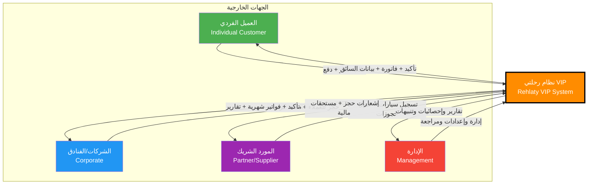

### 2.3 المميزات الرئيسية للنظام

يتميز نظام رحلتي VIP بمجموعة من الخصائص الفريدة التي تجعله حلاً شاملاً ومتطوراً لإدارة خدمات النقل الفاخر. تم تصميم هذه المميزات بناءً على دراسة معمقة لاحتياجات السوق والتحديات التي تواجه الأنظمة الحالية.

يوفر النظام للعملاء إمكانية الحجز المباشر دون الحاجة إلى التواصل مع موظفين أو انتظار الموافقات، مما يختصر الوقت ويحسن التجربة بشكل كبير. يمكن للعميل إتمام حجزه بالكامل من خلال واجهة بديهية تستغرق دقائق معدودة، بدءاً من اختيار نوع الخدمة والمركبة، مروراً بتحديد التفاصيل، ووصولاً إلى الدفع الآمن. يحصل العميل على تأكيد فوري لحجزه مع جميع التفاصيل اللازمة، ثم يتلقى لاحقاً معلومات السائق والمركبة المخصصة له.

تمتد مرونة النظام لتشمل إمكانية اختيار العميل لجنسية السائق المفضلة، وهي ميزة تلبي تفضيلات ثقافية ولغوية مهمة لشريحة كبيرة من المستخدمين في السوق السعودي. تساهم هذه الخاصية في تحسين تجربة العميل بشكل ملموس، خاصة للعملاء الذين يفضلون التواصل بلغة معينة أو لديهم راحة أكبر مع ثقافات محددة.

يدعم النظام آلية فريدة لإضافة حجوزات متعددة ضمن طلب واحد موحد برقم مرجعي مشترك، مما يسهل على العملاء الذين يخططون لرحلات متعددة في نفس اليوم أو على مدار عدة أيام. تساعد هذه الميزة أيضاً في تبسيط عمليات الدفع والفوترة، حيث يمكن للعميل الدفع مرة واحدة لجميع الحجوزات أو اختيار طرق دفع مختلفة لكل حجز حسب الحاجة.

من ناحية التشغيل، يعمل النظام على تقليل الاعتماد على التدخل البشري من خلال أتمتة معظم العمليات الروتينية. يتم حساب الأسعار تلقائياً بناءً على المسافة ونوع الخدمة وفئة المركبة والمنطقة الجغرافية، مع تطبيق الخصومات والعمولات وفق قواعد محددة مسبقاً. يقوم النظام بالبحث التلقائي عن السائقين المتاحين وربطهم بالحجوزات حسب معايير محددة، ثم يرسل الإشعارات لجميع الأطراف دون تدخل يدوي.

يوفر النظام نموذج تسجيل مبسط للعملاء الجدد، مع آليات ذكية لمنع تكرار البيانات عند الحجوزات اللاحقة. يحتفظ النظام بمعلومات العميل الأساسية والعناوين المفضلة وطرق الدفع المحفوظة، مما يجعل عملية الحجز في المرات القادمة أسرع بكثير. تخضع جميع البيانات المخزنة لمعايير صارمة للأمان والخصوصية.

تتنوع خيارات الدفع المدعومة لتشمل الدفع النقدي مع السائق، والتحويل البنكي المباشر مع إمكانية رفع إثبات الدفع، والدفع الإلكتروني عبر بطاقات مدى وفيزا من خلال بوابات دفع محلية آمنة، بالإضافة إلى نظام الدفع الآجل المخصص للشركات والمؤسسات مع حدود ائتمانية قابلة للإدارة. تتيح هذه المرونة للعملاء اختيار الطريقة الأنسب لظروفهم وتفضيلاتهم.

يتكامل النظام مع خدمات الرسائل القصيرة وتطبيق واتساب لإرسال إشعارات فورية في جميع المراحل الحرجة من رحلة العميل. يتلقى العميل تأكيداً عند إنشاء الحجز، وإشعاراً عند موافقة الإدارة، وتفاصيل السائق والمركبة قبل موعد الخدمة، وطلباً للتقييم بعد إتمام الرحلة. تساهم هذه الإشعارات في بناء ثقة العميل وتقليل القلق المرتبط بعدم اليقين، كما تساعد في تقليل معدلات الإلغاء وعدم الحضور.

يتميز النظام بقدرته على إدارة الأسطول الداخلي والشراكات الخارجية بنفس الكفاءة من خلال واجهة موحدة. يمكن للشركة المشغلة إضافة سياراتها الخاصة وإدارتها مباشرة، بينما تتيح المنصة أيضاً لموردين خارجيين تسجيل سياراتهم والمشاركة في تقديم الخدمات. يطبق النظام قواعد واضحة للأولوية عند توزيع الحجوزات، مع إمكانية تخصيص هذه القواعد حسب استراتيجية العمل.

توفر لوحة التحكم الإدارية رؤية شاملة وفورية لجميع جوانب العمليات من خلال لوحات معلومات تفاعلية تعرض المؤشرات الرئيسية مثل عدد الحجوزات النشطة والإيرادات اليومية ومعدلات إتمام الخدمات ومتوسط التقييمات. تمكن هذه الرؤية المدراء من اتخاذ قرارات سريعة ومستنيرة استجابة للتغيرات في الطلب أو أي مشكلات تشغيلية.

يدعم النظام إدارة متقدمة للمواسم الخاصة مثل شهر رمضان وموسم الحج والعمرة والإجازات الرسمية، حيث يمكن تعديل الأسعار وإعطاء أولوية خاصة لأنواع معينة من الخدمات وتفعيل قواعد تشغيلية استثنائية. تساعد هذه المرونة على تحقيق أقصى استفادة من فترات الذروة مع الحفاظ على جودة الخدمة.

### 2.4 نموذج الأعمال

يقوم نموذج الأعمال لنظام رحلتي VIP على مبدأ المنصة متعددة الأطراف التي تربط بين العملاء والموردين مع تقديم قيمة مضافة لكل طرف. تتمحور الاستراتيجية المالية حول توليد إيرادات مستدامة من مصادر متنوعة مع الحفاظ على تنافسية الأسعار للعملاء وعدالة العوائد للموردين.

يمثل نظام العمولات المصدر الرئيسي للإيرادات، حيث تحتجز المنصة نسبة محددة من قيمة كل حجز مكتمل. تتراوح هذه النسبة عادة بين خمسة عشر وخمسة وعشرين بالمائة حسب عدة عوامل تشمل فئة المركبة ونوع الخدمة وحجم الشراكة مع المورد. تتميز هذه الآلية بالشفافية الكاملة، حيث يعرف كل مورد نسبة عمولته المحددة منذ البداية ويمكنه حساب عائده المتوقع بدقة قبل قبول أي حجز.

تطبق المنصة سياسة تسعير ديناميكية تأخذ في الاعتبار عدة متغيرات لضمان تحقيق التوازن بين العرض والطلب. تشمل هذه المتغيرات المسافة المقطوعة ومدة الخدمة ونوع المركبة والمنطقة الجغرافية ووقت الخدمة ومستوى الطلب الحالي. يسمح هذا النموذج بالاستجابة المرنة لظروف السوق مع الحفاظ على معايير واضحة تمنع التلاعب أو المبالغة في الأسعار.

بالنسبة للشركات والفنادق التي تمثل شريحة العملاء المؤسسيين، يوفر النظام حوافز خاصة تشجع على الاستخدام المكثف والولاء طويل الأمد. تشمل هذه الحوافز خصومات متدرجة تزداد مع حجم الاستخدام الشهري، وإمكانية الوصول إلى ميزات متقدمة مثل التقارير التفصيلية وواجهات برمجية للتكامل مع أنظمتهم الداخلية، وأولوية في الحصول على المركبات خلال أوقات الذروة.

يعتمد النظام على نموذج الدفع الآجل للشركات كأداة لبناء علاقات طويلة الأمد وزيادة حجم المعاملات. تحصل الشركات المعتمدة على حدود ائتمانية محددة تسمح لها بحجز الخدمات وتأجيل الدفع حتى نهاية الشهر أو حسب اتفاقيات خاصة. تخضع هذه الحدود للمراجعة الدورية بناءً على سجل الدفع والأداء، مما يحفز على الانضباط المالي والاستخدام المسؤول.

تساهم رسوم الإلغاء المتأخر في حماية مصالح الموردين وتعويضهم عن الفرص الضائعة. عندما يقوم عميل بإلغاء حجز بعد المدة المسموح بها للإلغاء المجاني، يتم احتساب نسبة من قيمة الحجز كرسوم إلغاء تذهب جزئياً للمورد وجزئياً للمنصة. تطبق هذه السياسة بمرونة مع مراعاة الظروف الاستثنائية وتاريخ العميل مع المنصة.

تتجه المنصة مستقبلاً نحو تقديم خدمات إضافية مدفوعة تشمل باقات VIP الممتازة التي توفر امتيازات خاصة مثل الأولوية في الحجز والوصول إلى أفضل السائقين والمركبات، وخدمات الكونسيرج الشخصي، والتأمين الشامل على الرحلات، واستقبال مخصص في المطارات والفنادق. تمثل هذه الخدمات فرصة لزيادة متوسط قيمة العميل وتعميق العلاقة معه.

### 2.5 القيمة المضافة والتمايز التنافسي

يتميز نظام رحلتي VIP عن المنافسين من خلال عدة عوامل استراتيجية تمنحه موقعاً فريداً في السوق. تتجاوز هذه الميزات التنافسية مجرد الوظائف التقنية لتشمل القيمة الحقيقية المقدمة لكل فئة من المستخدمين والنموذج التشغيلي المبتكر.

تكمن إحدى أهم نقاط التمايز في التركيز الواضح على قطاع النقل الفاخر بدلاً من محاولة خدمة جميع الشرائح. يتيح هذا التخصص فهماً عميقاً لاحتياجات العملاء المستهدفين وتصميم تجربة متكاملة تلبي توقعاتهم العالية من حيث جودة المركبات والسائقين والخدمة بشكل عام. ينعكس هذا التركيز في كل جانب من جوانب المنصة، من معايير اختيار الموردين إلى تصميم الواجهات وأسلوب التواصل.

يوفر النظام حلاً متكاملاً للشركات والفنادق يفوق بكثير ما تقدمه منصات النقل التقليدية. بدلاً من إجبار هذه المؤسسات على استخدام نفس الواجهة المصممة للأفراد، يقدم رحلتي VIP بوابة مخصصة تتيح لموظفيهم إدارة حجوزات متعددة لعملائهم أو ضيوفهم بكفاءة، مع تتبع النفقات وإنشاء تقارير مفصلة وتلقي فواتير موحدة. تمثل هذه القدرات قيمة كبيرة للمؤسسات التي تتعامل مع أعداد كبيرة من الحجوزات شهرياً.

يتفوق النظام في إدارة الشراكات مع الموردين من خلال توفير منصة احترافية تساعدهم على تنمية أعمالهم. بدلاً من اعتبارهم مجرد مقدمي خدمة قابلين للاستبدال، يعاملهم النظام كشركاء حقيقيين من خلال توفير أدوات لإدارة أساطيلهم وتحليل أدائهم وفهم احتياجات السوق. تساعد هذه المعاملة على جذب موردين ذوي جودة عالية والاحتفاظ بهم على المدى الطويل.

تمثل شفافية التسعير والمحاسبة ركيزة أساسية للتمايز. يعرف كل طرف بالضبط كيف يتم حساب الأسعار وما هي العمولات المطبقة وكيف تتم معالجة المدفوعات. تبني هذه الشفافية الثقة وتقلل من النزاعات وتسهل التخطيط المالي لجميع الأطراف. يمكن للعميل رؤية تفاصيل كاملة لفاتورته قبل تأكيد الحجز، بينما يستطيع المورد حساب عائده المتوقع بدقة من أي حجز.

يتجاوز نظام رحلتي VIP المنافسين في مجال التكامل والأتمتة. بينما تعتمد العديد من المنصات على تدخل يدوي كبير في مراحل مختلفة من عملية الحجز والتشغيل، يعمل رحلتي VIP على أتمتة معظم هذه العمليات دون التضحية بالجودة أو المرونة. يتضمن ذلك حساب المسافات والأسعار تلقائياً، وربط الحجوزات بالسائقين المناسبين، وإرسال الإشعارات في الأوقات الصحيحة، ومعالجة المدفوعات والعمولات، وإنشاء الفواتير الضريبية.

تساهم القدرة على دعم أنواع متعددة من الخدمات من خلال منصة واحدة في تعزيز الميزة التنافسية. يمكن للعملاء حجز توصيلة بسيطة من المطار، أو استئجار سيارة لعدة ساعات، أو حجز جولة سياحية ليوم كامل، كل ذلك من خلال نفس التطبيق بنفس السهولة. تتيح هذه المرونة للمنصة تلبية احتياجات أوسع وزيادة تكرار استخدام العملاء.

---

## 3. تحليل المشكلة والحلول المقترحة

### 3.1 المشكلات الحالية في السوق السعودي

يعاني قطاع النقل والتوصيل الفاخر في المملكة العربية السعودية من عدة تحديات جوهرية تعيق كفاءته وتحد من جودة الخدمات المقدمة. تنبع هذه المشكلات من الاعتماد على أساليب تشغيل تقليدية أو استخدام أنظمة غير مصممة خصيصاً لطبيعة هذا القطاع المتخصص.

تمثل إحدى المشكلات الرئيسية غياب منصة موحدة تجمع بين إدارة الأسطول الداخلي والشراكات مع موردين خارجيين. تضطر معظم الشركات العاملة في هذا المجال إلى استخدام أنظمة منفصلة لإدارة سياراتها الخاصة والتنسيق مع الشركاء، مما يؤدي إلى تعقيد العمليات وزيادة احتمالية الأخطاء وصعوبة الحصول على رؤية شاملة للأداء. يستهلك هذا التشتت وقتاً وجهداً كبيرين من الفرق الإدارية ويحد من قدرة الشركة على التوسع بكفاءة.

تواجه الشركات والفنادق التي تحتاج إلى خدمات نقل منتظمة لعملائها أو ضيوفها صعوبات كبيرة في إدارة هذه الاحتياجات. لا توفر معظم تطبيقات النقل المتاحة آليات مناسبة للحسابات المؤسسية، مما يضطر هذه الجهات إما إلى الاعتماد على الاتصال الهاتفي التقليدي مع شركات النقل أو استخدام تطبيقات فردية لا تتيح التحكم المركزي أو إصدار فواتير موحدة. تؤدي هذه القيود إلى صعوبة في تتبع النفقات وإعداد الميزانيات ومطابقة الحسابات.

يشكل غياب نظام دفع آجل موثوق عقبة كبيرة أمام تطوير العلاقات طويلة الأمد مع العملاء المؤسسيين. تفضل معظم الشركات والفنادق تأجيل الدفع حتى نهاية الشهر وتلقي فاتورة موحدة تشمل جميع معاملاتهم، لكن قلة من مقدمي خدمات النقل قادرون على توفير هذه المرونة بطريقة منظمة وآمنة. يحد هذا القصور من قدرة مقدمي الخدمات على جذب عملاء مؤسسيين كبار قد يمثلون مصدر إيرادات مستقر ومهم.

تعاني عمليات ربط الحجوزات بالسائقين والمركبات المناسبة من الارتجالية والعشوائية في كثير من الحالات. يعتمد المشرفون على الاتصالات الهاتفية أو تطبيقات المراسلة العادية للبحث عن سائقين متاحين، مما يستهلك وقتاً طويلاً ويزيد من احتمالية الأخطاء في مطابقة الحجوزات مع المركبات المناسبة. يصبح هذا التحدي أكثر حدة خلال أوقات الذروة أو المواسم الخاصة عندما يزداد حجم الحجوزات بشكل كبير.

تفتقر معظم الأنظمة المستخدمة حالياً إلى آليات فعالة لمتابعة دورة حياة الحجز الكاملة من لحظة الطلب وحتى إتمام الخدمة وإقفال الحساب. يؤدي هذا النقص إلى فقدان الحجوزات أو نسيانها، وصعوبة تحديد مسؤولية المشكلات عند حدوثها، وتأخير في معالجة الشكاوى أو طلبات التعديل. تزداد هذه المشكلة تعقيداً عندما تتضمن الحجوزات عدة مراحل أو تمتد لعدة أيام.

تمثل عمليات المحاسبة وإصدار الفواتير نقطة ألم رئيسية لمعظم مشغلي خدمات النقل الفاخر. يتطلب إعداد الفواتير الضريبية المتوافقة مع متطلبات هيئة الزكاة والضريبة والجمارك وقتاً وجهداً كبيرين، خاصة عند التعامل مع أعداد كبيرة من المعاملات. كما تواجه الشركات صعوبة في حساب وتوزيع العمولات المستحقة للموردين الشركاء بشكل دقيق وفي الوقت المناسب، مما قد يؤدي إلى نزاعات وتأخير في المدفوعات.

يشكل التعامل مع المواسم الخاصة مثل شهر رمضان وموسم الحج والعمرة تحدياً كبيراً. تشهد هذه الفترات ارتفاعاً حاداً في الطلب يفوق القدرة الاستيعابية المعتادة، بينما تفتقر معظم الأنظمة إلى آليات مرنة لإدارة قوائم الانتظار أو تعديل الأسعار أو إعطاء أولويات خاصة لأنواع معينة من الخدمات. يؤدي هذا إلى فقدان فرص تجارية كبيرة وتجربة سيئة للعملاء.

تعاني العمليات التشغيلية من نقص في الشفافية والمساءلة، حيث يصعب تتبع من قام بأي إجراء ومتى ولماذا. يعقد هذا النقص عملية حل المشكلات وتحليل الأداء وتحسين العمليات، كما يفتح المجال لممارسات غير مناسبة أو أخطاء متكررة دون إمكانية تحديد مصدرها ومعالجتها.

### 3.2 الفجوات في الأنظمة الموجودة

بالإضافة إلى المشكلات العامة في السوق، تعاني الأنظمة والتطبيقات الموجودة حالياً من فجوات محددة تحد من قدرتها على تلبية احتياجات قطاع النقل الفاخر بشكل كامل.

تركز معظم تطبيقات النقل المتاحة في السوق على خدمة العملاء الأفراد فقط، مع إهمال شبه كامل لاحتياجات القطاع المؤسسي. تعامل هذه التطبيقات جميع المستخدمين بنفس الطريقة دون تمييز بين الفرد الذي يحجز رحلة عرضية والفندق الذي يحتاج إلى عشرات الحجوزات يومياً. يؤدي هذا النهج الموحد إلى تجربة مستخدم غير ملائمة للمؤسسات وفقدان ميزات أساسية تحتاجها لإدارة عملياتها بكفاءة.

تفتقر الأنظمة الموجودة إلى قدرات متقدمة لإدارة الموردين والشركاء. تعامل معظم المنصات السائقين كأفراد مستقلين دون توفير أدوات لهم لإدارة أساطيل متعددة من المركبات أو تتبع أدائهم المالي أو التخطيط لعملياتهم. تحد هذه القيود من قدرة الموردين الأكبر حجماً على المشاركة بفعالية في المنصة، مما يقلل من المعروض المتاح من المركبات الفاخرة.

يعاني معظم الأنظمة من نقص في التكامل مع أنظمة المحاسبة والفوترة. تتطلب هذه الأنظمة إدخالاً يدوياً للبيانات في برامج محاسبة منفصلة، مما يزيد من احتمالية الأخطاء ويستهلك وقتاً ثميناً من الفرق المحاسبية. كما أن معظمها لا يولد فواتير ضريبية متوافقة تلقائياً، مما يضيف عبئاً إدارياً كبيراً على المشغلين.

تفتقر الأنظمة الموجودة إلى قدرات تحليلية متقدمة تساعد على فهم أنماط الاستخدام وتحديد فرص التحسين. توفر معظمها تقارير أساسية فقط دون إمكانية إجراء تحليلات معمقة حول الأداء التشغيلي أو الربحية أو رضا العملاء أو كفاءة الموردين. يحد هذا النقص من قدرة الإدارة على اتخاذ قرارات استراتيجية مستنيرة بناءً على البيانات.

لا توفر معظم الأنظمة مرونة كافية في تخصيص قواعد العمل والتسعير. تفرض هذه الأنظمة نماذج تشغيل موحدة قد لا تناسب جميع الأسواق أو استراتيجيات العمل المختلفة، مما يضطر المشغلين إما إلى التكيف مع قيود النظام أو البحث عن حلول بديلة. تعيق هذه الجمودية القدرة على الابتكار والتميز في السوق.

تعاني واجهات معظم التطبيقات من عدم ملاءمتها الكاملة للثقافة المحلية واللغة العربية. رغم أن بعضها يوفر ترجمة عربية، إلا أن هذه الترجمات غالباً ما تكون حرفية وغير طبيعية، ولا تأخذ في الاعتبار التفضيلات الثقافية للمستخدمين السعوديين. تؤثر هذه الفجوة سلباً على تجربة المستخدم وتقلل من معدلات اعتماد النظام.

### 3.3 الحل المقترح ومكوناته

يقدم نظام رحلتي VIP حلاً شاملاً ومتكاملاً يعالج المشكلات المحددة والفجوات الموجودة من خلال معمارية متطورة ومجموعة غنية من الوظائف المصممة خصيصاً لقطاع النقل الفاخر في السوق السعودي.

يتكون الحل من ثلاثة مكونات رئيسية متكاملة تعمل معاً لتوفير تجربة سلسة وفعالة لجميع أطراف المنظومة. يشمل المكون الأول مجموعة من التطبيقات التي تواجه المستخدمين، تتضمن تطبيقات محمولة أصلية لنظامي iOS وأندرويد توفر للعملاء والموردين إمكانية الوصول الكامل إلى الخدمات من أجهزتهم المحمولة، وموقعاً إلكترونياً احترافياً يعمل كواجهة بديلة للعملاء الذين يفضلون استخدام الحواسيب الشخصية ويوفر أيضاً معلومات تسويقية شاملة عن الخدمات، ولوحة تحكم إدارية متقدمة تمكن الفريق التشغيلي من إدارة جميع جوانب العمل بكفاءة.

يركز المكون الثاني على الأنظمة الأساسية التي تشكل العمود الفقري للمنصة. يشمل هذا نظاماً متطوراً لإدارة الحجوزات يغطي كامل دورة الحياة من إنشاء الحجز وحتى إقفاله النهائي، مع دعم لأنواع متعددة من الخدمات وآليات مرنة للتعديل والإلغاء. يتكامل هذا مع نظام شامل لإدارة الأسطول يتتبع جميع المركبات المتاحة سواء كانت مملوكة للشركة أو لشركاء خارجيين، مع معلومات تفصيلية عن كل مركبة وحالتها وتوفرها.

يدير نظام الدفع المتعدد القنوات جميع المعاملات المالية بأمان وشفافية، مع دعم لطرق الدفع المختلفة بما في ذلك النقد والتحويلات البنكية والبطاقات الإلكترونية والدفع الآجل. يتكامل هذا النظام مع بوابات دفع محلية موثوقة لضمان أمان المعاملات وسرعة معالجتها، مع الاحتفاظ بسجل كامل لجميع العمليات المالية.

يشكل نظام التشغيل قلب المنصة، حيث يدير عملية ربط الحجوزات بالسائقين والمركبات المناسبة من خلال خوارزميات ذكية تأخذ في الاعتبار عوامل متعددة مثل الموقع والتوفر ونوع المركبة المطلوب وتقييم السائق وتاريخ أدائه. يتم تنفيذ هذه العملية بشكل شبه تلقائي مع الحفاظ على إمكانية التدخل اليدوي عند الحاجة، مما يوازن بين الكفاءة والمرونة.

يوفر نظام المحاسبة المتكامل حلاً شاملاً لجميع العمليات المالية والمحاسبية. يحسب هذا النظام العمولات المستحقة لكل طرف تلقائياً بناءً على القواعد المحددة، ويولد الفواتير الضريبية المتوافقة مع متطلبات هيئة الزكاة والضريبة والجمارك بما في ذلك رموز الاستجابة السريعة المطلوبة، ويدير الدورة المحاسبية الكاملة من إنشاء الفاتورة وحتى تسوية الحسابات. يوفر النظام أيضاً كشوف حسابات تفصيلية لكل مورد تتضمن جميع معاملاته المالية والمبالغ المستحقة له والمدفوعات التي تلقاها.

يشكل المكون الثالث مجموعة من الأنظمة الداعمة التي تعزز فعالية المنصة. يدير نظام الإشعارات جميع الاتصالات مع المستخدمين عبر قنوات متعددة تشمل الرسائل القصيرة ورسائل واتساب والإشعارات داخل التطبيق والبريد الإلكتروني. يضمن هذا النظام وصول المعلومات المهمة إلى الأطراف المعنية في الوقت المناسب وبالطريقة المفضلة لكل مستخدم.

يوفر نظام التقارير والتحليلات رؤى عميقة حول جميع جوانب العمليات. يمكن للمدراء إنشاء تقارير مخصصة تغطي فترات زمنية محددة ومناطق جغرافية معينة أو موردين محددين، مع إمكانية تصدير هذه التقارير بتنسيقات متعددة للمشاركة أو المعالجة الإضافية. يشمل النظام أيضاً لوحات معلومات تفاعلية تعرض المؤشرات الحيوية بشكل بصري يسهل فهمه واستخلاص الدروس منه.

يدير نظام الصلاحيات والمستخدمين الوصول إلى مختلف أجزاء المنصة بناءً على أدوار محددة بدقة. يمكن تخصيص الصلاحيات بمرونة لتتناسب مع الهيكل التنظيمي للشركة المشغلة، مع تسجيل كامل لجميع الإجراءات المهمة لضمان المساءلة والشفافية. يدعم النظام إنشاء أدوار مخصصة مع صلاحيات محددة على مستوى كل وحدة وظيفية، مما يسمح بتطبيق مبدأ الحد الأدنى من الصلاحيات لكل مستخدم.

تتكامل جميع هذه المكونات بسلاسة من خلال معمارية خدمية موجهة تضمن المرونة وسهولة الصيانة والتوسع المستقبلي. تتواصل المكونات المختلفة عبر واجهات برمجية محددة بوضوح، مما يسمح بتحديث أو استبدال أي مكون دون التأثير على بقية النظام. تطبق المعمارية مبادئ الفصل بين الاهتمامات وإخفاء التفاصيل التنفيذية، مما يسهل على فرق التطوير المختلفة العمل بشكل متوازٍ على مكونات مختلفة دون تعارض.

### 3.4 دراسة الأنظمة المنافسة

تم إجراء دراسة تحليلية شاملة للأنظمة المنافسة في السوق السعودي والإقليمي لفهم نقاط القوة والضعف والفرص المتاحة للتميز. تركزت الدراسة على ثلاثة أنظمة رئيسية تمثل نماذج مختلفة في هذا القطاع.

يمثل نظام أوبر النموذج العالمي الرائد في مجال خدمات النقل التشاركي، وقد أحدث تحولاً جذرياً في هذه الصناعة منذ إطلاقه. يتميز النظام بواجهة مستخدم بسيطة وسلسة للغاية تتيح للعملاء حجز رحلة في ثوانٍ معدودة، مع نظام متطور لتتبع المركبة في الوقت الفعلي يمنح العملاء شعوراً بالأمان والسيطرة. يعتمد أوبر على نموذج تقييم ثنائي الاتجاه قوي يضمن جودة الخدمة من الطرفين، حيث يقيم العملاء السائقين والعكس، مما يخلق دافعاً قوياً للحفاظ على معايير عالية. يدعم النظام طرق دفع متعددة ويتكامل مع أنظمة الدفع الإلكتروني بكفاءة عالية.

رغم هذه المزايا القوية، يعاني أوبر من عدة قيود تحد من ملاءمته لقطاع النقل الفاخر المتخصص. يركز النموذج التشغيلي بشكل أساسي على خدمة الأفراد دون توفير حلول مناسبة للعملاء المؤسسيين الذين يحتاجون إلى ميزات خاصة مثل الفوترة الموحدة والدفع الآجل والتقارير التفصيلية. لا يوفر أوبر أيضاً أدوات متقدمة لإدارة الأساطيل للسائقين الذين يملكون أو يديرون عدة مركبات، مما يجعله أقل جاذبية للموردين الأكبر حجماً. كما أن نموذج التسعير الديناميكي الذي يطبقه أوبر، رغم فعاليته في موازنة العرض والطلب، قد يؤدي إلى ارتفاعات حادة في الأسعار تزعج بعض العملاء وتضر بالثقة على المدى الطويل.

يمثل نظام كريم اللاعب الإقليمي الأبرز الذي نجح في التكيف مع خصوصيات السوق الخليجي. يتميز كريم بواجهات معربة بشكل جيد تراعي الثقافة المحلية بدرجة أفضل من المنافسين العالميين، مع دعم قوي للغة العربية ليس فقط في الواجهات ولكن أيضاً في التعامل مع العناوين والمواقع المحلية. يوفر النظام أيضاً خيارات دفع محلية تشمل الدفع النقدي الذي يفضله شريحة كبيرة من المستخدمين في المنطقة، وقد نجح في بناء قاعدة سائقين محليين قوية تفهم البيئة التشغيلية بشكل أفضل.

مع ذلك، يشترك كريم مع أوبر في نفس القيود الهيكلية المتعلقة بخدمة القطاع المؤسسي وإدارة الموردين. يبقى التركيز الأساسي على خدمة الأفراد، مع قدرات محدودة للشركات التي تحتاج إلى حلول متخصصة. لا يوفر كريم أيضاً نظاماً متكاملاً لإدارة الحسابات الائتمانية أو الفوترة الموحدة بالطريقة التي تحتاجها المؤسسات الكبيرة، مما يحد من قدرته على جذب هذا القطاع المربح والاحتفاظ به.

يمثل نظام ليمو محاولة محلية للتركيز على قطاع النقل الفاخر في السوق السعودي. يتميز هذا النظام بتخصصه الواضح في خدمات النقل الراقية، مما يجذب شريحة من العملاء الباحثين عن تجربة متميزة. يحرص ليمو على اختيار السائقين والمركبات بمعايير أعلى من تطبيقات النقل العامة، مما ينعكس إيجاباً على جودة الخدمة المقدمة.

رغم هذا التركيز المفيد، يعاني ليمو من محدودية في تنوع الخدمات المقدمة ونطاقها الجغرافي. لا يوفر النظام نفس الاتساع في أنواع الخدمات أو القدرة على إدارة عمليات معقدة تشمل حجوزات متعددة أو جولات ممتدة. كما أن القدرات التقنية والتحليلية للمنصة تبقى محدودة مقارنة باللاعبين العالميين، مع واجهات تفتقر أحياناً إلى السلاسة والحداثة المتوقعة من تطبيق معاصر.

من خلال هذا التحليل المقارن، يتضح أن نظام رحلتي VIP يملأ فجوة واضحة في السوق من خلال الجمع بين التخصص في قطاع النقل الفاخر مع توفير حلول شاملة للعملاء المؤسسيين والموردين، مع معمارية تقنية حديثة تضمن الأداء العالي والقابلية للتوسع والصيانة على المدى الطويل.

### 3.5 تحليل SWOT

يوفر تحليل SWOT رؤية استراتيجية متوازنة تساعد على فهم الموقع الحالي للنظام والفرص والتهديدات المحيطة به، مما يمكن من وضع استراتيجيات فعالة لتعظيم النجاح وتقليل المخاطر.

تتمثل نقاط القوة الأساسية للنظام في تخصصه الواضح في قطاع النقل الفاخر، مما يتيح فهماً عميقاً لاحتياجات هذه السوق المتميزة وتصميم حلول مخصصة تلبيها بدقة. يشكل النظام المتكامل للعملاء المؤسسيين نقطة تميز حاسمة، حيث يملأ فجوة واضحة في السوق ويفتح قطاعاً مربحاً ومستقراً من العملاء. تمثل المعمارية التقنية المتطورة المبنية على تقنيات حديثة ومثبتة نقطة قوة جوهرية تضمن القدرة على التوسع والتطور مع احتياجات السوق المتغيرة. يتميز النظام أيضاً بشموليته في إدارة الأسطول الداخلي والشراكات الخارجية من منصة واحدة، مما يبسط العمليات ويحسن الكفاءة بشكل كبير.

توفر الشفافية الكاملة في التسعير والمحاسبة ميزة تنافسية مهمة تبني الثقة مع جميع الأطراف. يدعم النظام آليات دفع متنوعة ومرنة تشمل الدفع الآجل للمؤسسات، مما يلبي احتياجات شرائح واسعة من العملاء. تساهم القدرات التحليلية المتقدمة والتقارير الشاملة في تمكين الإدارة من اتخاذ قرارات مستنيرة بناءً على البيانات الفعلية. يستفيد النظام من فهم عميق للسوق المحلي والثقافة السعودية، مما ينعكس في تصميم الواجهات وتدفق العمليات وخيارات الخدمة المقدمة.

تتضمن نقاط الضعف الحاجة إلى بناء قاعدة مستخدمين من الصفر، وهي عملية تستهلك وقتاً ومواردَ كبيرة وتتطلب جهوداً تسويقية مكثفة. يواجه النظام أيضاً تحدي جذب عدد كافٍ من الموردين والمركبات الفاخرة لضمان توفر الخدمة بشكل موثوق في جميع الأوقات، خاصة في المراحل الأولى من الإطلاق. تمثل التكاليف الأولية المرتفعة للتطوير والتسويق وبناء البنية التحتية عبئاً مالياً يجب إدارته بحكمة. يحتاج النظام إلى وقت لبناء سمعة قوية في سوق تنافسي يضم لاعبين راسخين يتمتعون بثقة واسعة من المستخدمين.

قد يتطلب التعقيد النسبي للنظام بسبب شموليته وقتاً أطول لتدريب الفريق الإداري والتشغيلي على استخدامه بكفاءة كاملة. يشكل الاعتماد على خدمات خارجية مثل بوابات الدفع وخرائط جوجل نقطة اعتماد تحمل بعض المخاطر المتعلقة بالتكاليف والتوفر، رغم أن هذا الاعتماد يقلل من تكاليف التطوير ويسرع وقت الوصول إلى السوق.

تتمثل الفرص الرئيسية في النمو المتسارع للسوق السعودي للنقل الفاخر مدفوعاً بارتفاع مستويات الدخل وزيادة السياحة وتطور أنماط الاستهلاك. توفر رؤية المملكة 2030 وتركيزها على تطوير القطاع السياحي فرصة استراتيجية كبيرة، حيث يزداد الطلب على خدمات النقل الراقية لخدمة السياح الأجانب والمحليين. يشهد قطاع الفعاليات والمؤتمرات نمواً قوياً، مما يخلق طلباً متزايداً على خدمات النقل المؤسسية.

تتيح التقنيات الحديثة فرصاً للابتكار المستمر من خلال دمج الذكاء الاصطناعي والتعلم الآلي لتحسين عمليات الربط والتسعير والتوقع. يمكن التوسع الجغرافي لتغطية مدن ومناطق جديدة في المملكة ثم التوسع الإقليمي لدول الخليج المجاورة. تمثل إمكانية إضافة خدمات جديدة مثل تأجير الطائرات الخاصة أو اليخوت أو الخدمات السياحية المتكاملة فرصاً لزيادة القيمة المقدمة للعملاء وتنويع مصادر الإيرادات.

يمكن بناء شراكات استراتيجية مع الفنادق الفاخرة والمنتجعات السياحية وشركات الطيران لتوفير خدمات متكاملة. توفر التحول الرقمي المتسارع في المنطقة بيئة مواتية لتبني الحلول التقنية المبتكرة، مع ازدياد ثقة المستخدمين في التطبيقات المحمولة وطرق الدفع الإلكتروني.

تشمل التهديدات المنافسة القوية من لاعبين راسخين يملكون موارد ضخمة وقواعد مستخدمين كبيرة، مما يجعل اختراق السوق أكثر صعوبة. قد تدخل شركات عالمية أو إقليمية جديدة إلى السوق السعودي بعروض تنافسية قوية. يمثل احتمال تغير الأطر التنظيمية أو فرض قيود جديدة على خدمات النقل التشاركي تهديداً يجب مراقبته والاستعداد له.

تشكل التقلبات الاقتصادية وتأثيرها على القدرة الشرائية للعملاء وحجم الإنفاق على الخدمات الفاخرة مخاطر محتملة. قد تؤثر الأحداث الاستثنائية مثل الأوبئة أو الأزمات الإقليمية سلباً على قطاع السياحة والسفر. يمكن أن تؤدي التطورات التقنية السريعة إلى ظهور نماذج أعمال جديدة أو تقنيات مدمرة تغير قواعد اللعبة في الصناعة.

تمثل المخاطر السيبرانية المتزايدة وإمكانية حدوث اختراقات أمنية تهديداً خطيراً للثقة والسمعة. قد يواجه النظام صعوبة في جذب والاحتفاظ بموردين وسائقين ذوي جودة عالية في ظل المنافسة على هذا المورد المحدود.

يساعد هذا التحليل الشامل على وضع استراتيجيات واضحة لتعظيم نقاط القوة واستغلال الفرص، مع العمل على معالجة نقاط الضعف والاستعداد للتهديدات المحتملة من خلال خطط طوارئ واضحة وآليات مرنة للاستجابة السريعة للتغيرات في بيئة العمل.

---

## 4. منهجية التحليل والتصميم

### 4.1 نموذج التطوير المعتمد

تم اختيار نموذج الشلال المعدل مع عناصر من المنهجية الرشيقة كإطار عمل للتطوير، وذلك بعد دراسة متأنية لطبيعة المشروع ومتطلباته والبيئة التشغيلية المحيطة به. يجمع هذا النموذج الهجين بين وضوح وانضباط نموذج الشلال التقليدي ومرونة واستجابة المنهجية الرشيقة، مما يوفر أفضل ما في العالمين.

يتبع النموذج مراحل متتالية واضحة تبدأ بمرحلة التخطيط الشامل حيث يتم تحديد نطاق المشروع وأهدافه ومواردة المطلوبة والقيود المفروضة. تتضمن هذه المرحلة دراسة الجدوى التجارية والتقنية وإعداد خطة المشروع التفصيلية وتشكيل الفريق وتحديد أدوار ومسؤوليات كل عضو. تستغرق هذه المرحلة الحرجة وقتاً كافياً لضمان بناء أساس قوي للمشروع، حيث أن القرارات المتخذة هنا تؤثر على جميع المراحل اللاحقة.

تنتقل العملية بعد ذلك إلى مرحلة التحليل المتعمق التي تركز على فهم المتطلبات بدقة وتوثيقها بشكل شامل. تتضمن هذه المرحلة جلسات مكثفة مع أصحاب المصلحة لاستخلاص المتطلبات الوظيفية وغير الوظيفية، مع إعداد مخططات وثائق تفصيلية توضح تدفقات العمل وقواعد الأعمال والتفاعلات بين المكونات المختلفة. يتم التحقق من المتطلبات والموافقة عليها رسمياً قبل الانتقال إلى المرحلة التالية، مما يقلل من احتمالية التغييرات الجوهرية لاحقاً.

تأتي مرحلة التصميم المعماري والتفصيلي لترجمة المتطلبات إلى مواصفات تقنية قابلة للتنفيذ. يشمل ذلك تصميم معمارية النظام الكلية وتحديد المكونات الرئيسية وعلاقاتها، وتصميم قاعدة البيانات بكل تفاصيلها، وتصميم واجهات برمجية واضحة للتواصل بين المكونات، وتصميم واجهات المستخدم مع مراعاة أفضل ممارسات تجربة المستخدم. تخضع جميع هذه التصاميم لمراجعات فنية دقيقة لضمان جودتها وقابليتها للتنفيذ والصيانة.

في مرحلة التطوير والبناء، يتم تحويل التصاميم إلى أكواد برمجية فعلية. هنا يظهر العنصر الرشيق في المنهجية، حيث يتم تقسيم العمل إلى دورات تطوير قصيرة تستمر أسبوعين إلى أربعة أسابيع لكل منها. ينتج عن كل دورة إصدار قابل للعمل من مجموعة فرعية من الوظائف، مما يتيح الحصول على تغذية راجعة مبكرة واكتشاف المشكلات قبل أن تتفاقم. يلتزم المطورون بمعايير برمجية محددة ويخضع الكود لمراجعات نظيرية منتظمة لضمان جودته وتوافقه مع المعايير المعتمدة.

تسير مرحلة الاختبار والتحقق بالتوازي مع التطوير بدلاً من انتظار اكتماله. يكتب المطورون اختبارات وحدة لكل قطعة كود يطورونها، بينما يعمل فريق ضمان الجودة على إعداد وتنفيذ اختبارات التكامل والنظام. تتضمن هذه المرحلة أنواعاً متعددة من الاختبارات تشمل الاختبارات الوظيفية للتحقق من تنفيذ المتطلبات بشكل صحيح، واختبارات الأداء لضمان استجابة النظام ضمن الحدود المقبولة، واختبارات الأمان لاكتشاف الثغرات المحتملة، واختبارات قابلية الاستخدام للتأكد من سهولة التعامل مع الواجهات.

تشهد مرحلة النشر والإطلاق نقل النظام من بيئة التطوير إلى بيئة الإنتاج الحية. يتم ذلك بشكل تدريجي ومدروس، حيث يبدأ بنشر النظام في بيئة تجريبية مشابهة للإنتاج لاختبار عملية النشر نفسها وتدريب المستخدمين الأوائل. يتبع ذلك إطلاق تجريبي محدود النطاق لمجموعة صغيرة من المستخدمين الحقيقيين، مما يتيح اكتشاف ومعالجة أي مشكلات قبل الإطلاق الكامل. يصاحب الإطلاق خطة اتصال واضحة وبرنامج تدريبي شامل لجميع الفئات المستخدمة.

تستمر مرحلة الصيانة والتحسين طوال عمر النظام، وتشمل إصلاح الأخطاء المكتشفة، وإضافة ميزات جديدة بناءً على احتياجات المستخدمين المتطورة، وتحسين الأداء والأمان، وتحديث التقنيات الأساسية لمواكبة التطورات. يتم التعامل مع هذه المرحلة بمنهجية رشيقة بحتة، حيث تنظم التحسينات والإضافات في دورات منتظمة مع أولويات واضحة.

### 4.2 مبررات اختيار المنهجية

جاء قرار اعتماد النموذج الهجين بعد تقييم شامل لعدة عوامل تتعلق بطبيعة المشروع ومتطلبات أصحاب المصلحة والقيود المفروضة والمخاطر المتوقعة.

يتطلب المشروع مستوى عالياً من الوضوح والتوثيق نظراً لتعقيده وتعدد أطرافه المعنية. يوفر نموذج الشلال المعدل هذا المستوى من التوثيق من خلال مراحل واضحة ومخرجات محددة لكل مرحلة، مما يسهل التواصل بين الفريق التقني وأصحاب المصلحة غير التقنيين ويضمن توافق التوقعات. تساعد هذه الوثائق الشاملة أيضاً في تسهيل عملية التسليم والصيانة المستقبلية، حيث يمكن للفرق الجديدة أو المطورين الجدد فهم النظام بسرعة من خلال الرجوع إلى الوثائق الموجودة.

تستفيد طبيعة المشروع من التخطيط المسبق الشامل الذي يوفره نموذج الشلال. بالنظر إلى أن النظام يتعامل مع معاملات مالية حساسة ويتطلب تكاملاً مع أنظمة خارجية متعددة ويخضع لمتطلبات تنظيمية صارمة، فإن التصميم الدقيق والمراجعة الشاملة قبل البدء في التطوير يقللان بشكل كبير من احتمالية حدوث مشكلات جوهرية في مراحل متأخرة. يتيح هذا التخطيط أيضاً تقدير التكاليف والجداول الزمنية بدقة أكبر، مما يساعد في إدارة توقعات أصحاب المصلحة وتأمين الموارد اللازمة.

في نفس الوقت، تضيف العناصر الرشيقة المرونة اللازمة للاستجابة للتغييرات والتعلم من التجربة العملية. من خلال تقسيم التطوير إلى دورات قصيرة مع تسليمات منتظمة، يمكن للفريق الحصول على تغذية راجعة مبكرة من المستخدمين الحقيقيين وتعديل المسار حسب الحاجة دون الحاجة إلى انتظار اكتمال المشروع بأكمله. تساعد هذه المرونة على اكتشاف سوء الفهم في المتطلبات أو التحديات التقنية غير المتوقعة مبكراً، مما يقلل من تكلفة معالجتها بشكل كبير.

يتناسب النموذج الهجين بشكل جيد مع مستوى خبرة الفريق المتوقع وثقافة العمل السائدة في المنطقة. بينما قد يكون نموذج رشيق بحت يتطلب مستوى عالياً من النضج في إدارة المشاريع وثقافة تنظيمية خاصة قد لا تكون متوفرة، فإن النموذج المعتمد يوفر هيكلاً واضحاً ومراحل محددة يسهل على الجميع فهمها والعمل ضمنها، مع الاحتفاظ بما يكفي من المرونة للتكيف مع الظروف المتغيرة.

يساعد النموذج في إدارة المخاطر بشكل فعال من خلال توفير نقاط مراجعة واضحة في نهاية كل مرحلة. يمكن للإدارة والفريق التقني تقييم التقدم والمخاطر واتخاذ قرارات مستنيرة حول الاستمرار أو تعديل المسار أو حتى إيقاف المشروع إذا ظهرت مشكلات جوهرية لا يمكن حلها. توفر الدورات القصيرة في مرحلة التطوير فرصاً إضافية لتقييم المخاطر واتخاذ إجراءات تصحيحية قبل أن تتفاقم المشكلات.

يتماشى النموذج المختار مع طبيعة المشروع الذي يحتوي على متطلبات محددة نسبياً يمكن تحديدها بدقة في البداية. رغم أن بعض التفاصيل قد تحتاج إلى تعديل بناءً على التجربة العملية، إلا أن الإطار العام والمتطلبات الأساسية واضحة ومستقرة، مما يجعل التخطيط المسبق الشامل ممكناً ومفيداً. تتيح العناصر الرشيقة التعامل مع المتطلبات الأقل وضوحاً أو تلك التي قد تتطور مع الوقت دون تعطيل المشروع بأكمله.

### 4.3 دورة حياة تطوير النظام

تمر عملية تطوير نظام رحلتي VIP بست مراحل رئيسية متكاملة تشكل معاً دورة حياة كاملة تبدأ من الفكرة الأولية وتستمر حتى التشغيل المستقر والتحسين المستمر. تم تصميم هذه الدورة لضمان أن كل جانب من جوانب النظام يحظى بالاهتمام والمعالجة الكافيين، مع توفير آليات للمراجعة والتحقق في كل مرحلة.

تبدأ الدورة بمرحلة التخطيط والتحضير التي تستغرق عدة أسابيع من العمل المكثف لوضع الأساس المتين للمشروع. تتضمن هذه المرحلة إجراء دراسة جدوى شاملة تقيم الجوانب التجارية والتقنية والمالية للمشروع، مع تحديد العوائد المتوقعة والمخاطر المحتملة. يتم خلال هذه المرحلة تشكيل فريق المشروع واختيار الأعضاء بعناية بناءً على المهارات والخبرات المطلوبة، مع تحديد واضح للأدوار والمسؤوليات والعلاقات التنظيمية. تنتهي المرحلة بإعداد خطة مشروع تفصيلية تحدد الجدول الزمني والموارد المطلوبة والميزانية ومعايير النجاح، مع الحصول على الموافقة الرسمية من أصحاب المصلحة للانتقال إلى المرحلة التالية.

تركز مرحلة التحليل على الفهم العميق لاحتياجات المستخدمين ومتطلبات النظام. يعمل المحللون عن كرب مع ممثلين عن كل فئة من فئات المستخدمين من خلال جلسات عمل مكثفة وورش تفاعلية لاستخلاص المتطلبات الوظيفية التي تحدد ما يجب أن يفعله النظام، والمتطلبات غير الوظيفية التي تحدد كيف يجب أن يعمل من حيث الأداء والأمان والموثوقية وقابلية الاستخدام. يتم توثيق هذه المتطلبات بأشكال متعددة تشمل النصوص التفصيلية ومخططات تدفق البيانات وحالات الاستخدام وسيناريوهات المستخدم، مما يوفر رؤية شاملة ومتعددة الأبعاد للنظام المطلوب. تخضع جميع المتطلبات لمراجعة دقيقة للتحقق من اكتمالها واتساقها وإمكانية تنفيذها، مع تحديد الأولويات لضمان تطوير الوظائف الأكثر أهمية أولاً.

تحول مرحلة التصميم المتطلبات المجردة إلى مواصفات تقنية ملموسة يمكن للمطورين تنفيذها مباشرة. يبدأ التصميم بالمستوى المعماري العالي الذي يحدد المكونات الرئيسية للنظام وكيفية تفاعلها وتوزيعها عبر الطبقات المختلفة، مع اتخاذ قرارات استراتيجية حول التقنيات والأطر المستخدمة ونماذج النشر والتكامل. ينتقل التصميم بعد ذلك إلى المستوى التفصيلي حيث يتم تحديد بنية كل مكون بدقة، بما في ذلك الفئات والواجهات والخوارزميات والبروتوكولات. يحظى تصميم قاعدة البيانات باهتمام خاص، حيث يتم تحديد الجداول والعلاقات والقيود والفهارس بما يضمن الأداء الأمثل وسلامة البيانات. يشمل التصميم أيضاً الواجهات التي سيتعامل معها المستخدمون، حيث يتم إعداد نماذج أولية تفاعلية تمر بعدة جولات من المراجعة والتحسين بناءً على ملاحظات المستخدمين المحتملين.

تشهد مرحلة التطوير والبناء تحويل التصاميم إلى برمجيات عاملة من خلال كتابة الأكواد البرمجية واختبارها ودمجها. يعمل المطورون في دورات قصيرة تسمى سبرنت، كل منها يستمر أسبوعين إلى أربعة أسابيع وينتج عنه إصدار قابل للعمل من مجموعة من الوظائف. يبدأ كل سبرنت باجتماع تخطيطي يحدد الأهداف والمهام، ويتخلله اجتماعات يومية قصيرة للتنسيق وحل المشكلات، وينتهي باجتماع مراجعة يعرض الإنجازات واجتماع استرجاع يناقش الدروس المستفادة. يلتزم المطورون بمعايير برمجية صارمة تشمل قواعد التسمية وبنية الكود والتعليقات التوضيحية، مع استخدام أدوات تحليل الكود التلقائية للتحقق من الالتزام بهذه المعايير. يخضع كل جزء من الكود لمراجعة من قبل مطور آخر على الأقل قبل دمجه في الإصدار الرئيسي، مما يساعد على اكتشاف الأخطاء مبكراً وتبادل المعرفة بين أعضاء الفريق.

تسير مرحلة الاختبار والتحقق جنباً إلى جنب مع التطوير وفق نهج الاختبار المستمر. يكتب المطورون اختبارات وحدة تلقائية لكل دالة أو صنف يطورونه، وتعمل هذه الاختبارات كشبكة أمان تكشف أي تراجع في الوظائف عند إجراء تعديلات لاحقة. يعمل فريق ضمان الجودة المتخصص على إعداد وتنفيذ اختبارات تكامل تتحقق من تفاعل المكونات المختلفة بشكل صحيح، واختبارات نظام شاملة تتحقق من تنفيذ المتطلبات بالكامل. تتضمن هذه المرحلة أيضاً اختبارات أداء تحت أحمال مختلفة لضمان استجابة النظام ضمن الحدود المقبولة، واختبارات أمان شاملة تشمل محاولات اختراق أخلاقية لاكتشاف الثغرات قبل أن يستغلها أطراف ضارة. تجري اختبارات قبول المستخدم من قبل ممثلين عن المستخدمين الحقيقيين في بيئة مشابهة للإنتاج، حيث يقومون بتنفيذ سيناريوهات واقعية ويقدمون ملاحظاتهم حول مدى تلبية النظام لاحتياجاتهم.

تنقل مرحلة النشر والإطلاق النظام من بيئة التطوير المحكومة إلى بيئة الإنتاج الحية التي سيستخدمها العملاء الحقيقيون. يتم ذلك بشكل تدريجي ومخطط بعناية لتقليل المخاطر وضمان انتقال سلس. يبدأ النشر بإعداد البنية التحتية الإنتاجية وتكوينها بما في ذلك الخوادم وقواعد البيانات وشبكات التوصيل وأنظمة المراقبة. يتم نشر النسخة النهائية من النظام في بيئة تجريبية مطابقة للإنتاج لإجراء اختبار نهائي شامل يتضمن التحقق من جميع عمليات النشر والتكوينات والتكاملات. يتبع ذلك إطلاق تجريبي محدود يتيح لمجموعة صغيرة من المستخدمين الوصول إلى النظام الحي، مما يوفر فرصة لاكتشاف أي مشكلات في بيئة حقيقية قبل الإطلاق الكامل. يصاحب الإطلاق التدريجي برنامج تدريبي شامل للمستخدمين الإداريين والتشغيليين، وحملة توعية للعملاء المحتملين، وتجهيز فريق دعم فني متكامل للتعامل مع الاستفسارات والمشكلات.

تستمر دورة الحياة بعد الإطلاق من خلال مرحلة الصيانة والتحسين المستمر التي تمتد طوال عمر النظام. تتضمن هذه المرحلة مراقبة مستمرة للأداء والموثوقية والأمان من خلال أنظمة آلية تنبه الفريق إلى أي مشكلات فور ظهورها. يتم جمع التغذية الراجعة من المستخدمين بشكل منهجي من خلال قنوات متعددة تشمل الدعم الفني والاستبيانات والتحليلات داخل التطبيق، وتحلل هذه الملاحظات لتحديد فرص التحسين والميزات الجديدة المطلوبة. تعالج الأخطاء المكتشفة بأولويات واضحة حسب تأثيرها وحدتها، مع إصدار تحديثات منتظمة تتضمن الإصلاحات والتحسينات. تنظم التطويرات الكبيرة والميزات الجديدة في إصدارات رئيسية تصدر وفق جدول منتظم، عادة كل ثلاثة إلى ستة أشهر، مع مراعاة التوافق مع الإصدارات السابقة وتوفير فترات انتقالية مناسبة عند إجراء تغييرات جوهرية.

### 4.4 أدوات ومعايير التحليل المستخدمة

يعتمد المشروع على مجموعة متنوعة من الأدوات والتقنيات والمعايير المعترف بها صناعياً لضمان جودة التحليل والتصميم وفعالية التواصل بين أعضاء الفريق وأصحاب المصلحة.

تستخدم مخططات تدفق البيانات لتوضيح كيفية انتقال المعلومات عبر النظام وتحولها من خلال العمليات المختلفة. توفر هذه المخططات رؤية واضحة لمسارات البيانات من مصادرها الأولية وحتى وجهاتها النهائية، مع توضيح العمليات التي تعالجها ومخازن البيانات التي تحفظها والجهات الخارجية التي تتفاعل معها. يتم إعداد هذه المخططات على مستويات متعددة من التفصيل، بدءاً من مخطط السياق الذي يوضح النظام ككل وتفاعلاته مع البيئة الخارجية، وصولاً إلى المخططات التفصيلية التي تشرح العمليات الفرعية بدقة.

تعتمد حالات الاستخدام كأداة رئيسية لتوثيق المتطلبات الوظيفية من منظور المستخدم. تصف كل حالة استخدام سيناريو محدد يريد المستخدم تحقيقه، مع توضيح الخطوات التفصيلية والبدائل المحتملة والاستثناءات التي قد تحدث. تساعد هذه الأداة على ضمان أن جميع احتياجات المستخدمين مفهومة ومغطاة، وتوفر أساساً واضحاً لإعداد حالات الاختبار لاحقاً. يتم ترتيب حالات الاستخدام في مخططات شاملة توضح العلاقات بينها وتجمعها في وحدات منطقية حسب الوظائف أو الأدوار.

تستخدم المخططات التسلسلية لتوضيح التفاعلات الزمنية بين مكونات النظام المختلفة أو بين النظام والجهات الخارجية. توضح هذه المخططات تسلسل الرسائل المتبادلة بين الكائنات أو الخدمات، مما يساعد على فهم ديناميكية العمليات وتحديد نقاط التكامل والتبعيات. تفيد هذه المخططات بشكل خاص في تصميم واجهات برمجية واضحة والتحقق من صحة تدفق العمليات المعقدة.

يعتمد تصميم قاعدة البيانات على مخططات الارتباط بين الكيانات التي توضح البنية المنطقية للبيانات والعلاقات بينها. تحدد هذه المخططات الجداول والأعمدة والمفاتيح الأساسية والأجنبية والقيود المختلفة، مما يوفر خريطة واضحة لبنية قاعدة البيانات. يتم إعداد هذه المخططات وفق المعايير المعترف بها مثل نماذج شين أو كرو فوت، ويتم تطبيعها عادة إلى الصورة الثالثة على الأقل لضمان سلامة البيانات وتقليل التكرار، مع السماح ببعض التخفيف من التطبيع في حالات محددة لتحسين الأداء عند الضرورة.

تستخدم أدوات النمذجة المرئية مثل Mermaid لإنشاء مجموعة المخططات المختلفة بطريقة احترافية ومتسقة. توفر هذه الأدوات إمكانية إنشاء مخططات معيارية يسهل فهمها وتحديثها، مع دعم لتحويلها إلى تنسيقات مختلفة للتضمين في الوثائق أو العروض التقديمية. تسمح طبيعة هذه الأدوات النصية بتتبع التغييرات عبر الزمن من خلال أنظمة التحكم بالإصدارات، مما يسهل التعاون بين أعضاء الفريق.

يستخدم قاموس البيانات كمرجع شامل يوثق كل عنصر بيانات في النظام بدقة. يتضمن القاموس وصفاً تفصيلياً لكل حقل في قاعدة البيانات يشمل اسمه ونوعه وحجمه وقيمته الافتراضية والقيود عليه ومعناه التجاري. يساعد هذا القاموس على ضمان الفهم الموحد للبيانات بين جميع أعضاء الفريق ويقلل من الالتباس والأخطاء الناتجة عن سوء الفهم.

تطبق معايير توثيق واضحة على جميع مخرجات التحليل والتصميم. تتبع الوثائق قوالب موحدة تتضمن أقساماً ثابتة للغرض والنطاق والمصطلحات والافتراضات والمتطلبات والتصميم، مما يسهل على القراء العثور على المعلومات التي يحتاجونها. تخضع جميع الوثائق للمراجعة والموافقة الرسمية قبل اعتمادها، ويتم الاحتفاظ بسجل كامل للإصدارات والتغييرات على مر الزمن.

### 4.5 المراجع والمعايير المتبعة

يستند تحليل وتصميم نظام رحلتي VIP إلى مجموعة غنية من المراجع الأكاديمية والمعايير الصناعية والممارسات المثبتة التي توفر أساساً نظرياً قوياً وتوجيهات عملية مجربة.

تشكل منهجيات تحليل وتصميم النظم الكلاسيكية الأساس النظري للمشروع، حيث يتم الاستفادة من المبادئ والأدوات التي طورها رواد هذا المجال على مدى عقود. توفر هذه المنهجيات إطاراً منهجياً لفهم الأنظمة المعقدة وتفكيكها إلى مكونات قابلة للإدارة، مع توضيح العلاقات والتفاعلات بينها. تساعد هذه المبادئ على تجنب الأخطاء الشائعة والاستفادة من التجارب المتراكمة في تطوير أنظمة مشابهة.

تستلهم المعمارية التقنية للنظام من أفضل الممارسات في تطوير تطبيقات الويب والجوال المتقدمة، مع الاستفادة من تجارب الشركات الرائدة في هذا المجال. توفر مدونات الهندسة لشركات مثل أوبر وإير بي إن بي وسبوتيفاي رؤى قيمة حول كيفية بناء أنظمة قابلة للتوسع وموثوقة تخدم ملايين المستخدمين. يتم تكييف هذه الدروس مع السياق الخاص بمشروع رحلتي VIP ومتطلباته الفريدة، دون محاولة النسخ المباشر الذي قد لا يناسب حجم أو طبيعة المشروع.

تلتزم جميع جوانب التصميم بمعايير أمان المعلومات المعترف بها دولياً. يطبق النظام متطلبات معيار أمان بيانات صناعة بطاقات الدفع الذي يحدد معايير صارمة لحماية معلومات حاملي البطاقات الائتمانية. تشمل هذه المتطلبات تشفير البيانات الحساسة أثناء النقل والتخزين، وتطبيق آليات مصادقة قوية، وإجراء اختبارات أمنية منتظمة، والاحتفاظ بسجلات تدقيق شاملة. 

يستفيد النظام أيضاً من إرشادات مشروع أمان تطبيقات الويب المفتوح الذي يحدد أكثر عشرة تهديدات شيوعاً لتطبيقات الويب ويوفر توجيهات واضحة حول كيفية الوقاية منها. تشمل هذه التهديدات حقن الأوامر واختراق المصادقة وكشف البيانات الحساسة ومشكلات التحكم بالوصول، وقد تم تصميم النظام بطريقة تعالج كل من هذه التهديدات بشكل استباقي من خلال ضوابط أمنية متعددة الطبقات.

تلتزم واجهات المستخدم بإرشادات إمكانية الوصول لمحتوى الويب التي تضمن قابلية استخدام التطبيقات من قبل الأشخاص ذوي الإعاقات المختلفة. تتضمن هذه الإرشادات متطلبات لدعم قارئات الشاشة ولوحات المفاتيح البديلة، واستخدام تباين ألوان كافٍ، وتوفير نصوص بديلة للمحتوى البصري، وتصميم واجهات يمكن التنقل فيها بطرق متعددة. يضمن الالتزام بهذه المعايير أن النظام قابل للاستخدام من قبل أوسع شريحة ممكنة من المستخدمين، كما يعكس التزاماً أخلاقياً بالشمولية والمساواة.

تستند عمليات تطوير البرمجيات إلى منهجيات ومعايير صناعية مثبتة تشمل مبادئ التطوير الرشيق ومبادئ البرمجة الكائنية التوجه ونماذج التصميم المعمارية. توفر هذه المعايير لغة مشتركة يفهمها جميع المطورين المحترفين وتساعد على إنتاج كود عالي الجودة قابل للقراءة والصيانة والتوسع. يطبق الفريق مبادئ التصميم الجيد مثل المسؤولية الواحدة والانفتاح على التوسع والانغلاق عن التعديل والاعتماد على التجريدات بدلاً من التفاصيل الملموسة، مما ينتج عنه بنية برمجية مرنة ومتينة.

تستفيد عملية التصميم من الدراسات الأكاديمية والأبحاث المنشورة حول أنظمة مشابهة، خاصة تلك التي تتناول تصميم أنظمة تأجير السيارات وإدارة الأساطيل وتطبيقات النقل التشاركي. توفر هذه الدراسات رؤى قيمة حول التحديات الشائعة والحلول المثبتة والدروس المستفادة من تجارب سابقة. يتم تحليل هذه المراجع بشكل نقدي وتكييف الدروس المستفادة منها لتناسب السياق الخاص بنظام رحلتي VIP، مع مراعاة الاختلافات في حجم العمليات ونوع الخدمات المقدمة والبيئة التنظيمية المحلية.

تلتزم عمليات إدارة البيانات بأفضل الممارسات في تصميم قواعد البيانات العلائقية، بما في ذلك مبادئ التطبيع لتقليل التكرار وضمان سلامة البيانات، واستخدام المفاتيح الطبيعية والاصطناعية بحكمة، وتطبيق القيود المناسبة لفرض قواعد الأعمال على مستوى قاعدة البيانات. يستفيد التصميم من التجارب المتراكمة في تحسين أداء قواعد البيانات من خلال الاستخدام الذكي للفهارس والتقسيم والتخزين المؤقت والاستعلامات المحسنة.

تسترشد عمليات التكامل مع الأنظمة الخارجية بمعايير صناعية واضحة لتصميم واجهات برمجية متينة وقابلة للصيانة. يتبع النظام نمط المعمارية الموجهة بالموارد الذي يوفر طريقة موحدة ومفهومة للتفاعل مع الموارد المختلفة من خلال الواجهات البرمجية. تلتزم جميع الواجهات البرمجية بالمبادئ الأساسية لهذه المعمارية، بما في ذلك استخدام الأفعال القياسية بشكل صحيح، وتصميم موارد هرمية منطقية، وإرجاع رموز حالة مناسبة، واستخدام تنسيقات بيانات قياسية مثل جيسون.

---

## 5. المتطلبات الوظيفية

### 5.1 متطلبات العملاء المباشرين (B2C)

#### 5.1.1 التسجيل والمصادقة

يوفر النظام للعملاء الأفراد آليات مرنة ومتعددة للوصول إلى الخدمات، مع موازنة دقيقة بين سهولة الاستخدام والأمان المطلوب. يمكن للعميل اختيار إنشاء حساب دائم يحفظ معلوماته ويسهل عليه الحجوزات المستقبلية، أو المتابعة كضيف دون تسجيل للحصول على خدمة سريعة لمرة واحدة.

عند اختيار إنشاء حساب جديد، يطلب النظام من العميل معلومات أساسية تتضمن الاسم الكامل باللغة العربية أو الإنجليزية حسب تفضيله، ورقم الجوال الذي سيستخدم كمعرف أساسي ووسيلة اتصال رئيسية، وعنوان بريد إلكتروني اختياري يمكن استخدامه لتلقي الفواتير والتحديثات، وكلمة مرور قوية تلبي معايير أمنية محددة تتضمن الحد الأدنى من الطول والتنوع في الأحرف. يقوم النظام بالتحقق فوراً من عدم استخدام رقم الجوال سابقاً لمنع التسجيل المكرر، ويعرض رسائل توجيهية واضحة إذا كانت كلمة المرور لا تلبي المعايير المطلوبة.

بعد إدخال المعلومات الأساسية وقبولها، ينتقل النظام إلى خطوة التحقق من رقم الجوال من خلال إرسال رمز تحقق مكون من ستة أرقام عبر رسالة نصية قصيرة. يبقى هذا الرمز صالحاً لمدة خمس دقائق فقط لأسباب أمنية، ويمكن للعميل طلب إرسال رمز جديد إذا انتهت صلاحية الأول أو لم يستلمه. يتحقق النظام من الرمز المدخل ويقارنه مع الرمز المرسل، ولا يسمح بأكثر من ثلاث محاولات خاطئة قبل أن يطلب من العميل البدء من جديد كإجراء وقائي ضد محاولات التخمين الآلي.

بمجرد التحقق الناجح من رقم الجوال، يصبح الحساب نشطاً وجاهزاً للاستخدام الفوري. يستلم العميل رسالة ترحيبية تشرح الخطوات التالية وتوفر روابط سريعة لبدء أول حجز. يحفظ النظام تاريخ ووقت التسجيل لأغراض التحليل والدعم الفني.

يوفر النظام للعملاء المسجلين آلية بسيطة لتسجيل الدخول في الزيارات اللاحقة من خلال إدخال رقم الجوال وكلمة المرور. يتحقق النظام من صحة البيانات المدخلة ويصدر رمزاً مميزاً آمناً يستخدم للحفاظ على الجلسة النشطة دون الحاجة لإعادة إدخال كلمة المرور عند كل إجراء. تنتهي صلاحية هذا الرمز تلقائياً بعد فترة من عدم النشاط أو عند تسجيل الخروج الصريح، مما يوازن بين الراحة والأمان.

في حال نسيان كلمة المرور، يوفر النظام عملية استرجاع آمنة تبدأ بإدخال رقم الجوال المسجل، ثم إرسال رمز تحقق إلى نفس الرقم، وأخيراً إنشاء كلمة مرور جديدة. تضمن هذه العملية أن الشخص الذي يطلب إعادة تعيين كلمة المرور لديه وصول فعلي إلى رقم الجوال المسجل، مما يحمي من محاولات الاستيلاء غير المصرح بها على الحسابات.

بالنسبة للعملاء الذين يفضلون عدم إنشاء حساب، يتيح النظام خيار المتابعة كضيف يوفر وصولاً سريعاً إلى وظيفة الحجز الأساسية. يطلب النظام في هذه الحالة الحد الأدنى من المعلومات الضرورية لإتمام الحجز، وهي الاسم ورقم الجوال الذي سيستخدم للتواصل حول هذا الحجز المحدد. لا يحفظ النظام هذه المعلومات بشكل دائم ولا يربطها بحساب مستخدم، مما يوفر درجة عالية من الخصوصية للعملاء الذين يفضلون ذلك. مع ذلك، يعرض النظام رسالة تشجيعية توضح فوائد إنشاء حساب مثل سرعة الحجوزات المستقبلية والوصول إلى السجل والعروض الخاصة.

#### 5.1.2 عملية الحجز

تمثل عملية الحجز جوهر تجربة العميل مع النظام، وقد تم تصميمها بعناية فائقة لتكون بديهية وسريعة ومرنة في نفس الوقت. تبدأ العملية بعرض شاشة متحركة جذابة بصرياً تستعرض جميع فئات المركبات المتاحة، حيث تظهر كل مركبة بصورة عالية الجودة واسمها وفئتها ووصف مختصر لمميزاتها. يمكن للعميل التمرير عبر هذه الخيارات بحركات بديهية، والنقر على أي مركبة لعرض تفاصيل أكثر تشمل صوراً إضافية من زوايا مختلفة، ومواصفات تقنية مثل عدد المقاعد ونوع المحرك، ووسائل الراحة المتوفرة داخل المركبة.

عندما يحدد العميل المركبة التي يفضلها، ينقر على زر واضح يحمل عنوان "أطلب الآن" لبدء عملية الحجز الفعلية. ينتقل النظام إلى شاشة جديدة تطلب من العميل اختيار المنطقة أو الفرع الذي سيبدأ منه الخدمة. تعرض هذه الشاشة قائمة بالمناطق المخدومة حالياً، والتي تشمل جدة ومكة المكرمة والرياض والعلا في المرحلة الأولى، مع خطط للتوسع لتغطية مناطق إضافية مستقبلاً. يعرض كل خيار بوضوح مع أيقونة مميزة ووصف مختصر للمنطقة، مما يسهل على العميل التعرف السريع على الخيار الصحيح.

بعد اختيار المنطقة، ينتقل النظام إلى شاشة اختيار نوع الخدمة، وهي خطوة حاسمة تحدد طبيعة الحجز وطريقة حساب تكلفته. تعرض الشاشة خمسة خيارات رئيسية مرتبة بشكل منطقي من الأبسط إلى الأكثر شمولاً. يظهر خيار التوصيل من مكان إلى مكان أولاً، وهو الأنسب للرحلات المباشرة مثل التوصيل من المطار إلى الفندق أو من المنزل إلى العمل، ويتم تسعير هذه الخدمة بناءً على المسافة الفعلية المقطوعة. يأتي بعد ذلك خيار الإيجار بالساعة الذي يناسب العملاء الذين يحتاجون إلى المركبة لفترة قصيرة مع مرونة في الوجهات، ويتم تسعيره بسعر ثابت لكل ساعة. يوفر خيار الجولة السياحية لثماني ساعات باقة متكاملة مثالية لاستكشاف معالم المدينة أو المنطقة المحيطة براحة تامة وسعر مجمع مغرٍ. يقدم خيار إيجار اليوم الكامل لاثنتي عشرة ساعة قيمة ممتازة للعملاء الذين يخططون ليوم طويل من الأنشطة ويحتاجون إلى توفر المركبة طوال الوقت. أخيراً، يتيح خيار الساعة الزائدة أو ساعة الانتظار للعملاء تمديد أي من الخدمات السابقة عند الحاجة، ويتم تسعيره بشكل منفصل لكل ساعة إضافية.

لكل خيار من هذه الخيارات، يعرض النظام بطاقة واضحة تتضمن أيقونة مميزة وعنواناً وصفياً ووصفاً مختصراً يوضح متى يكون هذا الخيار الأنسب، مع عرض مبدئي للسعر أو نطاق السعر المتوقع. يساعد هذا العرض الشامل العميل على اتخاذ قرار مستنير بسرعة دون الحاجة للبحث عن معلومات إضافية أو الاتصال بخدمة العملاء.

عند اختيار خدمة التوصيل من مكان إلى مكان، ينتقل النظام إلى شاشة متخصصة تستخدم تكاملاً متقدماً مع خرائط جوجل لتوفير تجربة سلسة في تحديد المواقع. تعرض الشاشة حقلين رئيسيين، الأول لنقطة الانطلاق والثاني للوجهة، وكلاهما مزود بوظيفة بحث ذكية واقتراحات تلقائية. يمكن للعميل البدء بكتابة اسم المكان أو العنوان، ويعرض النظام فوراً قائمة بالاقتراحات المطابقة مستمدة من قاعدة بيانات خرائط جوجل الضخمة. يمكن أيضاً تحديد الموقع بالنقر على الخريطة التفاعلية مباشرة، أو استخدام الموقع الحالي للجهاز إذا منح العميل الإذن اللازم. بمجرد تحديد كلا الموقعين، يقوم النظام تلقائياً بحساب المسافة بينهما باستخدام خوارزميات جوجل المتقدمة التي تأخذ في الاعتبار طبيعة الطرق والمسارات المتاحة، ويعرض النتيجة بوضوح للعميل مع رسم المسار المقترح على الخريطة.

بالنسبة للخدمات الأخرى ذات الأسعار الثابتة، لا تكون معرفة الوجهة ضرورية لحساب السعر، لكن النظام يطلب من العميل تحديد نقطة الانطلاق على الأقل لضمان توفر الخدمة في تلك المنطقة وتسهيل تنسيق اللقاء مع السائق لاحقاً. يمكن للعميل أيضاً إضافة ملاحظات حول الوجهات المخطط لها أو طبيعة الجولة لمساعدة السائق على الاستعداد بشكل أفضل.

تطلب الشاشة التالية من العميل إدخال معلومات إضافية ضرورية لإتمام الحجز وتنسيق الخدمة. يشمل ذلك التاريخ المطلوب للخدمة الذي يختاره العميل من تقويم تفاعلي يظهر الأيام المتاحة بوضوح ويمنع اختيار تواريخ ماضية أو محجوزة بالكامل. يحدد العميل أيضاً الوقت المفضل بدقة الساعة والدقيقة من خلال قائمة منسدلة أو عجلة اختيار بديهية. يطلب النظام عدد الركاب لضمان أن المركبة المختارة تستوعبهم جميعاً بشكل مريح، وينبه العميل إذا تجاوز العدد سعة المركبة مع اقتراح فئات أكبر عند الحاجة.

توفر الشاشة أيضاً حقولاً اختيارية تتيح للعميل إضافة معلومات قد تكون مفيدة في سياقات معينة. يمكن إدخال رقم رحلة جوية إذا كانت نقطة الانطلاق أو الوجهة مطاراً، مما يساعد السائق على تتبع حالة الرحلة والوصول في الوقت المناسب حتى لو تأخرت أو قدمت الرحلة. بالنسبة لحجوزات الفنادق، يمكن إدخال رقم الغرفة لتسهيل عملية استدعاء الضيف عند وصول السائق. يتيح حقل الملاحظات الإضافية للعميل كتابة أي طلبات خاصة أو معلومات يعتقد أنها ستساعد على تحسين جودة الخدمة، مثل تفضيلات لغوية أو احتياجات خاصة تتعلق بكبار السن أو الأطفال أو ذوي الإعاقات.

ميزة فريدة يوفرها النظام هي إمكانية اختيار جنسية السائق المفضلة، وهو خيار يلبي تفضيلات ثقافية ولغوية واضحة في السوق السعودي. يعرض النظام قائمة بالجنسيات المتوفرة حالياً ضمن شبكة السائقين، ويمكن للعميل اختيار جنسية محددة إذا كان يفضل التواصل بلغة معينة أو يشعر براحة أكبر مع ثقافة محددة، أو تركها مفتوحة إذا لم يكن لديه تفضيل معين.

بمجرد إكمال جميع المعلومات المطلوبة، ينتقل النظام فوراً إلى عملية حساب السعر. بالنسبة لخدمة التوصيل، يضرب النظام المسافة المحسوبة بسعر الكيلومتر الواحد المحدد لفئة المركبة المختارة في المنطقة المعنية، ثم يضيف نسبة مئوية ثابتة تغطي التكاليف التشغيلية والهامش الربحي. يأخذ الحساب في الاعتبار أيضاً أي خصومات مستحقة للعميل بناءً على برامج الولاء أو العروض الترويجية النشطة، ويطبقها تلقائياً على السعر النهائي. بالنسبة للخدمات ذات الأسعار الثابتة، يسترجع النظام السعر المحدد مسبقاً من جدول الأسعار ويطبق أي خصومات ذات صلة.

يعرض النظام السعر المحسوب بوضوح تام في مربع بارز يسهل رؤيته وفهمه. يتضمن العرض تفصيلاً شفافاً يوضح المكونات المختلفة للسعر، مثل السعر الأساسي المحسوب من المسافة أو المدة، والنسبة المضافة التي تشمل التكاليف التشغيلية، وأي ضرائب مطبقة، والخصومات إن وجدت، ليصل إلى المبلغ الإجمالي النهائي الذي سيدفعه العميل. يساعد هذا المستوى من الشفافية على بناء الثقة ويقلل من احتمالية المفاجآت غير السارة أو النزاعات حول الفوترة.

يوفر النظام للعملاء مرونة كبيرة في إدارة حجوزاتهم من خلال ميزة السلة التي تعمل بشكل مشابه لسلة التسوق في متاجر التجارة الإلكترونية. إذا كان العميل راضياً عن السعر وتفاصيل الحجز، يمكنه اختيار إضافة هذا الحجز إلى السلة ثم المتابعة لإضافة حجوزات إضافية إذا كان يخطط لرحلات متعددة. تسمح هذه الميزة للعملاء الذين يحتاجون إلى عدة رحلات في نفس اليوم أو على مدار عدة أيام بإدارة جميع حجوزاتهم من مكان واحد والدفع لها مجتمعة أو بشكل منفصل حسب التفضيل.

تعرض شاشة السلة قائمة شاملة بجميع الحجوزات المضافة، مع تفاصيل مختصرة لكل منها تتضمن نوع الخدمة والتاريخ والوقت والموقع والسعر. يمكن للعميل مراجعة كل حجز بالنقر عليه لرؤية التفاصيل الكاملة، أو تعديله إذا رغب في تغيير بعض المعلومات، أو حذفه بالكامل إذا غير رأيه. يحسب النظام المجموع الإجمالي لجميع الحجوزات في السلة ويعرضه بوضوح في أسفل الشاشة، مع تفصيل يوضح المجموع الفرعي قبل الضرائب، ومبلغ الضرائب، والخصومات المطبقة على مستوى السلة إن وجدت، والمبلغ الإجمالي النهائي.

ينشئ النظام رقم حجز عام موحد لجميع العناصر في السلة، مما يسهل على العميل والفريق الإداري تتبع هذه المجموعة من الحجوزات المرتبطة. يتم عرض هذا الرقم بوضوح ويمكن للعميل استخدامه للاستفسار عن حالة أي من الحجوزات أو لإجراء تعديلات لاحقة. ينشئ النظام أيضاً أرقاماً فرعية فريدة لكل حجز فردي ضمن المجموعة، مما يوفر مستويين من التتبع لمرونة أكبر في الإدارة.

عندما يكون العميل جاهزاً لإتمام الحجز، ينقر على زر واضح يحمل عنوان "متابعة للدفع" أو "تأكيد الحجز" حسب طريقة الدفع المختارة. ينتقل النظام بعد ذلك إلى مرحلة اختيار طريقة الدفع ومعالجتها، والتي سيتم تفصيلها في القسم التالي.

#### 5.1.3 إدارة الحجوزات

بعد إتمام عملية الحجز والدفع بنجاح، يوفر النظام للعميل مجموعة شاملة من الأدوات لإدارة حجوزاته ومتابعة حالتها من لحظة التأكيد وحتى إتمام الخدمة. تتمحور هذه القدرات حول توفير شفافية كاملة وتحكم معقول للعميل مع الحفاظ على سلامة العمليات التشغيلية.

### عرض الحجوزات

يتمكن العميل من الوصول إلى قائمة شاملة بجميع حجوزاته عبر واجهة منظمة تصنف الحجوزات حسب حالتها الزمنية والتشغيلية. تشمل هذه التصنيفات الحجوزات النشطة التي لم يحن موعدها بعد، والحجوزات قيد التنفيذ التي تجري في الوقت الحالي، والحجوزات المكتملة التي أنهيت بنجاح، بالإضافة إلى الحجوزات الملغاة مع توضيح أسباب الإلغاء.

يعرض النظام لكل حجز معلومات تفصيلية تشمل رقم الحجز الفريد، نوع الخدمة المطلوبة، تاريخ ووقت الخدمة المحدد، تفاصيل المسار من نقطة الانطلاق إلى الوجهة، فئة السيارة المحجوزة، التكلفة الإجمالية مع تفصيل الخصومات إن وجدت، طريقة الدفع المستخدمة، وحالة الحجز الحالية.

### تتبع حالة الحجز

يمر كل حجز بسلسلة من الحالات المحددة التي تعكس تقدم العملية التشغيلية. تبدأ الرحلة بحالة "في انتظار التأكيد" مباشرة بعد إتمام عملية الحجز، حيث يقوم فريق التشغيل بمراجعة الطلب والتحقق من توفر الموارد. عند موافقة الإدارة، ينتقل الحجز إلى حالة "مؤكد" ويصبح ملزماً لكلا الطرفين.

عندما يقترب موعد الخدمة وتتوفر المعلومات الكافية، ينتقل الحجز إلى حالة "قيد التجهيز" التي تشير إلى أن النظام يبحث عن سائق مناسب لتنفيذ الخدمة. بمجرد ربط الحجز مع سائق وسيارة محددة، تتغير الحالة إلى "تم التعيين" ويتلقى العميل إشعاراً يحتوي على معلومات السائق والسيارة الكاملة.

في يوم تنفيذ الخدمة، عندما يبدأ السائق رحلته نحو نقطة الالتقاء، يتحول الحجز إلى حالة "قيد التنفيذ" التي تمكن العميل من تتبع موقع السيارة على الخريطة. بعد إتمام الخدمة بنجاح، ينتقل الحجز إلى حالة "مكتمل" ويطلب النظام من العميل تقديم تقييمه للخدمة.

### التواصل مع السائق

فور تعيين سائق للحجز، يحصل العميل على قناة اتصال مباشرة معه عبر النظام. تشمل معلومات السائق المتاحة اسمه الكامل، صورته الشخصية للتعرف عليه، رقم هاتفه للاتصال المباشر، تقييمه العام من العملاء السابقين، بالإضافة إلى تفاصيل السيارة المخصصة التي تتضمن الماركة والموديل واللون ورقم اللوحة.

يوفر النظام زر اتصال مباشر يمكن العميل من الاتصال بالسائق عبر الهاتف دون الحاجة لحفظ الرقم أو الخروج من التطبيق. هذه الميزة ضرورية لتنسيق تفاصيل الالتقاء الدقيقة، خاصة في الأماكن المزدحمة أو المطارات الكبيرة.

### تتبع الرحلة في الوقت الفعلي

عندما يكون الحجز في حالة "قيد التنفيذ"، يفعل النظام ميزة التتبع المباشر التي تمكن العميل من متابعة موقع السيارة على خريطة تفاعلية. يظهر على الخريطة موقع السيارة الحالي محدثاً بشكل مستمر، المسار المتوقع، الوقت المقدر للوصول، والمسافة المتبقية. هذه الشفافية تمنح العميل راحة البال وتساعده على التحضير للوصول في الوقت المناسب.

يعمل نظام التتبع من خلال تكامل مع خدمات تحديد المواقع GPS في هاتف السائق، مع مراعاة جميع اعتبارات الخصوصية والأمان. لا يمكن للعميل الوصول إلى تتبع موقع السائق إلا خلال فترة تنفيذ حجزه المحدد، ويتوقف التتبع تلقائياً بمجرد انتهاء الخدمة.

### طلبات التعديل

يدرك النظام أن خطط السفر قد تتغير، لذا يوفر آلية مرنة لتعديل تفاصيل الحجز ضمن ضوابط محددة. يمكن للعميل طلب تعديل تاريخ أو وقت الخدمة، تغيير نقطة الانطلاق أو الوجهة، أو تعديل فئة السيارة المحجوزة، شريطة أن يتم ذلك قبل فترة زمنية معقولة من موعد الخدمة المحدد.

تختلف قواعد التعديل بناءً على الحالة الحالية للحجز والوقت المتبقي حتى تنفيذه. بالنسبة للحجوزات التي لا تزال في مرحلة "مؤكد" ولم يتم تعيين سائق لها بعد، يمكن إجراء التعديلات بمرونة أكبر دون رسوم إضافية. أما الحجوزات التي تم تعيين سائق لها أو تلك التي اقترب موعدها، فقد تخضع لشروط خاصة أو رسوم تعديل معقولة لتغطية التكاليف التشغيلية.

عند طلب التعديل، يرسل النظام الطلب إلى فريق التشغيل للمراجعة والموافقة. يتلقى العميل إشعاراً فورياً بحالة طلبه، سواء تمت الموافقة عليه أو رفضه مع توضيح الأسباب. في حال الموافقة، يحدث النظام تفاصيل الحجز تلقائياً ويرسل إشعارات للسائق المعين إن وجد، مع إعادة حساب التكلفة إذا تطلب التعديل ذلك.

### سياسات وإجراءات الإلغاء

يحق للعميل إلغاء حجزه وفق سياسة إلغاء واضحة ومعلنة تراعي التوازن بين حقوق العميل والتكاليف التشغيلية للنظام. تتدرج هذه السياسة بناءً على الوقت المتبقي حتى موعد الخدمة المحدد.

عند إلغاء الحجز قبل أربع وعشرين ساعة على الأقل من موعد الخدمة، يحصل العميل على استرداد كامل للمبلغ المدفوع دون أي خصومات، باستثناء رسوم المعالجة المصرفية إن وجدت والتي تحددها بوابات الدفع الخارجية. أما الإلغاء خلال الأربع والعشرين ساعة الأخيرة قبل الموعد، فيخضع لرسوم إلغاء تتراوح بين عشرين إلى خمسين بالمائة من قيمة الحجز، وذلك لتغطية التكاليف التشغيلية المترتبة على التنسيق مع السائق وحجز الموارد.

في حالات محددة، يمكن إلغاء الحجز بعد بدء تنفيذ الخدمة، مثل تأخر السائق المفرط أو مشاكل جوهرية في جودة الخدمة المقدمة. في هذه الحالات، يدرس فريق خدمة العملاء كل حالة على حدة لتحديد المسؤولية وآلية الاسترداد المناسبة. يحتفظ النظام بسجل كامل لجميع طلبات الإلغاء وأسبابها ونتائجها لضمان الشفافية والمساءلة.

### الإشعارات والتنبيهات

يعتمد النظام على نظام إشعارات متطور يبقي العميل على اطلاع دائم بجميع التطورات المتعلقة بحجزه. تصل هذه الإشعارات عبر قنوات متعددة تشمل الإشعارات الفورية داخل التطبيق، الرسائل النصية القصيرة، ورسائل WhatsApp للأحداث الهامة.

يتلقى العميل إشعاراً فورياً عند تأكيد حجزه من قبل الإدارة، يتبعه إشعار آخر عند تعيين سائق للحجز يتضمن معلومات السائق والسيارة الكاملة. قبل موعد الخدمة بأربع وعشرين ساعة، يرسل النظام تذكيراً للعميل بتفاصيل حجزه القادم. عندما يبدأ السائق التوجه نحو نقطة الالتقاء، يصل إشعار آخر مع الوقت المقدر للوصول.

في حال حدوث أي تأخير أو تغيير في الخطة، يبلغ النظام العميل فوراً مع شرح الأسباب والإجراءات المتخذة. هذا المستوى من التواصل يعزز ثقة العميل ويقلل من القلق المرتبط بترتيبات السفر.

### الوصول إلى الفواتير والإيصالات

يحتفظ النظام بسجل مالي دقيق لجميع المعاملات المتعلقة بكل حجز. يمكن للعميل الوصول في أي وقت إلى فاتورته الضريبية الرسمية بصيغة PDF، والتي تتضمن جميع التفاصيل المطلوبة قانونياً مثل الرقم الضريبي للشركة، تفاصيل الخدمة المقدمة، قيمة الضريبة المضافة، والمبلغ الإجمالي.

تحتوي الفاتورة على رمز QR قابل للمسح يمكن من خلاله التحقق من صحتها إلكترونياً عبر منصة هيئة الزكاة والضريبة والجمارك السعودية. هذا يضمن امتثال النظام الكامل للمتطلبات التنظيمية ويسهل على العملاء من الشركات والأفراد استخدام الفواتير للأغراض المحاسبية أو الضريبية.

بالنسبة للمدفوعات الإلكترونية، يوفر النظام أيضاً إيصالات الدفع من بوابة الدفع المستخدمة، والتي تحتوي على رقم المعاملة ورقم الموافقة البنكية وتفاصيل البطاقة المستخدمة (الأرقام الأخيرة فقط لأغراض الأمان).

---

## 5.1.4 التقييم والتغذية الراجعة

يشكل نظام التقييم ركيزة أساسية لضمان جودة الخدمة المستمرة وتحسين تجربة العملاء. بعد إتمام كل خدمة بنجاح، يطلب النظام من العميل تقديم تقييمه الشامل لتجربته، مما يوفر بيانات قيمة لتطوير الخدمة ومحاسبة مقدميها.

### آلية التقييم

يظهر طلب التقييم للعميل تلقائياً بعد انتهاء الرحلة وإقفال الحجز من قبل النظام. يتضمن نموذج التقييم ثلاثة محاور رئيسية يقيم فيها العميل تجربته بمقياس من نجمة واحدة إلى خمس نجوم. المحور الأول يتعلق بأداء السائق ويشمل التزامه بالموعد، مهارات القيادة، الاحترافية في التعامل، والمظهر العام. المحور الثاني يقيم حالة السيارة من حيث النظافة، الراحة، وسلامة التجهيزات. أما المحور الثالث فيركز على جودة الخدمة الإجمالية بما في ذلك سلاسة عملية الحجز، دقة المعلومات المقدمة، والالتزام بالمسار المتفق عليه.

بالإضافة إلى التقييم النجمي، يوفر النظام حقلاً نصياً اختيارياً يمكن للعميل من خلاله كتابة ملاحظات تفصيلية أو مقترحات للتحسين. هذه التعليقات النصية توفر سياقاً قيماً يساعد في فهم أسباب التقييمات المنخفضة أو تسليط الضوء على جوانب التميز في الخدمة.

### استخدام بيانات التقييم

تعالج بيانات التقييم بشكل فوري ومنهجي لخدمة أغراض متعددة. على المستوى الفردي، يحسب النظام متوسطاً عاماً لتقييم كل سائق بناءً على جميع رحلاته، ويعرض هذا التقييم للعملاء عند تعيينه لحجوزات جديدة، مما يعزز الثقة والشفافية. السائقون الذين يحافظون على تقييمات عالية يحصلون على أولوية في استقبال الحجوزات ومكافآت تشجيعية، بينما تخضع التقييمات المنخفضة المتكررة للتحقيق والتدخل التصحيحي.

على المستوى الجماعي، تحلل بيانات التقييم لاكتشاف الأنماط والاتجاهات العامة. إذا أظهرت منطقة جغرافية معينة أو نوع خدمة محدد تقييمات منخفضة بشكل منهجي، يعمل فريق الإدارة على دراسة الأسباب الجذرية واتخاذ إجراءات تصحيحية. قد تشمل هذه الإجراءات تدريباً إضافياً للسائقين، تحسينات في إجراءات التشغيل، أو تعديلات على معايير قبول السيارات.

### الشكاوى والنزاعات

في حالات التجارب السلبية الشديدة، يوفر النظام قناة مخصصة لتقديم الشكاوى الرسمية إلى فريق خدمة العملاء. عند تلقي شكوى، يفتح النظام تذكرة دعم تتبع بشكل منهجي حتى حلها. يراجع الموظف المختص جميع تفاصيل الحجز بما في ذلك سجل المواقع GPS، سجل الاتصالات، والتقييمات السابقة للسائق.

بناءً على نتائج التحقيق، قد تتخذ الإدارة إجراءات تتراوح من الاعتذار البسيط إلى استرداد كامل للمبلغ، أو حتى إيقاف السائق عن العمل في الحالات الخطيرة. يتلقى العميل تحديثات منتظمة حول حالة شكواه وإشعاراً نهائياً بالإجراءات المتخذة.

### حوافز المشاركة

لتشجيع العملاء على المشاركة في نظام التقييم، يقدم النظام حوافز بسيطة مثل نقاط ولاء يمكن تجميعها واستخدامها للحصول على خصومات على الحجوزات المستقبلية. العملاء الذين يقدمون تقييمات تفصيلية ومفيدة بانتظام قد يحصلون على امتيازات خاصة مثل أولوية الحجز في المواسم المزدحمة أو عروض حصرية.

---

## 5.2 متطلبات الشركات والفنادق (B2B)

يوفر النظام حزمة متكاملة من الخدمات المصممة خصيصاً لتلبية احتياجات المؤسسات التجارية، بما في ذلك الفنادق، شركات السياحة، الشركات الكبرى، والمكاتب الحكومية. تتميز هذه الخدمات بمرونة أكبر، آليات دفع متطورة، وأدوات إدارية تناسب طبيعة العمل المؤسسي.

### 5.2.1 إدارة الحسابات المؤسسية

تبدأ علاقة المؤسسة مع النظام بعملية تسجيل متخصصة تختلف جوهرياً عن تسجيل العملاء الأفراد. يتطلب إنشاء حساب مؤسسي تقديم وثائق رسمية تثبت الوضع القانوني للمؤسسة، وتشمل هذه المستندات السجل التجاري الساري، شهادة الزكاة والضريبة، بطاقة هوية المفوض بالتوقيع، وخطاب تفويض رسمي يحدد الموظفين المخولين باستخدام النظام نيابة عن المؤسسة.

بعد تقديم الطلب، يقوم فريق الإدارة بمراجعة شاملة للمستندات والتحقق من صحتها عبر القنوات الرسمية المتاحة. تستغرق هذه المراجعة عادة من يوم إلى ثلاثة أيام عمل. في حال الموافقة، يفعل الحساب المؤسسي بجميع ميزاته المتقدمة، ويتلقى المفوضون بيانات الوصول الخاصة بهم.

يتميز الحساب المؤسسي بهيكلية هرمية تسمح بإنشاء حسابات فرعية متعددة لموظفي المؤسسة المختلفين. يمكن لمدير الحساب الرئيسي تعيين صلاحيات مختلفة لكل مستخدم فرعي، بحيث يستطيع بعضهم إنشاء حجوزات فقط بينما يملك آخرون صلاحيات إضافية مثل الموافقة على الحجوزات أو الوصول إلى التقارير المالية.

### 5.2.2 نظام الكريديت والدفع الآجل

تمثل خدمة الكريديت إحدى أهم المميزات التي يقدمها النظام للمؤسسات، حيث تتيح لها إجراء الحجوزات دون الحاجة للدفع الفوري في كل مرة. بدلاً من ذلك، تضاف قيمة كل حجز إلى رصيد المؤسسة المستحق، وتصدر فاتورة موحدة في نهاية كل شهر تجمع جميع المعاملات خلال تلك الفترة.

عند الموافقة على حساب مؤسسي، تحدد الإدارة حد ائتماني أولي بناءً على حجم المؤسسة، طبيعة نشاطها، والعقد المبرم بين الطرفين. يتراوح هذا الحد عادة بين عشرة آلاف إلى مئتي ألف ريال سعودي للمؤسسات الصغيرة والمتوسطة، ويمكن أن يصل إلى مبالغ أعلى بكثير للمؤسسات الكبرى والفنادق الخمس نجوم ذات الاحتياجات الواسعة.

يراقب النظام باستمرار الرصيد المستخدم من حد الائتمان لكل مؤسسة. عندما يقترب الرصيد المستحق من الحد المسموح به، يرسل النظام تنبيهات تلقائية إلى مدير الحساب لتجنب تجاوز الحد وتعليق الخدمة. في حال تجاوز الحد الائتماني، يتوقف النظام عن قبول حجوزات جديدة بطريقة الكريديت حتى تسوية الرصيد المستحق أو زيادة الحد الائتماني بعد مراجعة إدارية.

تطبق شروط سداد واضحة ومعلنة في العقد، تتضمن عادة مهلة سداد قدرها ثلاثون يوماً من تاريخ إصدار الفاتورة الشهرية. في حال التأخر عن السداد، قد تطبق غرامات تأخير معقولة أو تعلق خدمة الكريديت حتى تسوية المستحقات، مع الاحتفاظ بإمكانية الحجز بطرق الدفع الفوري الأخرى.

### 5.2.3 الفوترة الشهرية

في نهاية كل شهر ميلادي، يولد النظام تلقائياً فاتورة موحدة لكل مؤسسة تجمع جميع حجوزاتها خلال الشهر المنصرم. تتميز هذه الفاتورة بالتفصيل والوضوح، حيث تسرد كل حجز على حدة مع رقمه الفريد، تاريخ ووقت الخدمة، نوع الخدمة المقدمة، فئة السيارة المستخدمة، اسم العميل النهائي أو رقم الغرفة في حالة الفنادق، قيمة الحجز قبل الخصم، نسبة الخصم المطبقة إن وجدت، والقيمة النهائية بعد الخصم.

في نهاية الفاتورة، تظهر الإجماليات بوضوح تام تشمل القيمة الإجمالية لجميع الحجوزات، إجمالي الخصومات الممنوحة، المبلغ الخاضع للضريبة، قيمة ضريبة القيمة المضافة المحتسبة بنسبة خمسة عشر بالمائة وفق الأنظمة السعودية، والمبلغ النهائي الإجمالي المستحق.

تصدر الفاتورة بصيغة PDF احترافية تحمل شعار النظام ومعلومات المؤسسة كاملة، وتتضمن جميع البيانات الضريبية المطلوبة قانوناً بما في ذلك الرقم الضريبي لكلا الطرفين ورمز QR للتحقق الإلكتروني. يمكن للمؤسسة تحميل الفاتورة مباشرة من النظام أو استلامها عبر البريد الإلكتروني، كما يمكن طلب نسخة ورقية رسمية مختومة إذا تطلب الأمر ذلك.

### 5.2.4 التقارير المخصصة

يدرك النظام أن المؤسسات تحتاج إلى رؤية واضحة لأنماط استخدامها للخدمة وتكاليفها التشغيلية. لذا يوفر لوحة تحكم متقدمة تعرض مجموعة شاملة من التقارير التحليلية القابلة للتخصيص.

يمكن للمؤسسة الوصول إلى تقارير استخدام تفصيلية تبين عدد الحجوزات خلال أي فترة زمنية محددة، موزعة حسب أنواع الخدمات المختلفة، الموظفين المستخدمين، أو المناطق الجغرافية. تساعد هذه البيانات في تحسين التخطيط والميزانية وتحديد الاتجاهات الموسمية.

تقارير التكلفة توفر تحليلاً تفصيلياً للإنفاق الشهري والسنوي، مع مقارنة بفترات سابقة لرصد الزيادات أو الانخفاضات. يمكن فلترة هذه التقارير حسب مراكز التكلفة المختلفة داخل المؤسسة، مما يسهل على إدارات الحسابات توزيع التكاليف بدقة.

تشمل التقارير المتاحة أيضاً تحليلات أداء تقيس مستوى الخدمة المقدمة من خلال متوسطات التقييمات، معدلات الالتزام بالمواعيد، وأوقات الاستجابة. هذه المعلومات ضرورية للمؤسسات التي تقدم خدمات النقل كجزء من تجربة عملائها، مثل الفنادق التي تحرص على ضمان رضا نزلائها الكامل.

جميع التقارير قابلة للتصدير بصيغ متعددة تشمل PDF للمشاركة والطباعة، Excel للتحليل المتقدم والمعالجة، وCSV للتكامل مع أنظمة محاسبية أخرى. كما يمكن جدولة إرسال تقارير معينة بشكل دوري تلقائي إلى عناوين بريد إلكتروني محددة، مما يوفر الوقت ويضمن متابعة منتظمة للبيانات الهامة.

### إدارة موظفي المؤسسة

يتيح النظام للمؤسسات إنشاء عدد غير محدود من حسابات المستخدمين الفرعية لموظفيها المختلفين، كل منها بصلاحيات محددة بعناية تتناسب مع دوره الوظيفي. على سبيل المثال، قد يحصل موظفو الاستقبال في الفندق على صلاحية إنشاء حجوزات للنزلاء فقط، بينما يمكن لمدير خدمات الضيوف الوصول إلى سجلات الحجوزات السابقة والتقارير، ويملك المدير المالي صلاحيات الوصول الكاملة لجميع البيانات المالية والفواتير.

يحتفظ النظام بسجل تدقيق كامل لجميع الإجراءات التي يقوم بها كل مستخدم، مما يعزز المساءلة ويساعد في حل أي خلافات محتملة. يمكن لمدير الحساب الرئيسي مراجعة هذا السجل في أي وقت لمتابعة نشاط الموظفين وضمان الاستخدام السليم للنظام.

### الخصومات والعروض المؤسسية

تستفيد المؤسسات من هيكل تسعير تفضيلي يعكس حجم أعمالها والتزامها طويل الأمد مع النظام. تحدد نسبة الخصم المطبقة على كل حجز بناءً على عدة عوامل، أبرزها الحجم الإجمالي للحجوزات الشهرية، مدة العقد المبرم، ونوع الخدمات المستخدمة.

تتدرج نسب الخصم عادة من خمسة بالمائة للمؤسسات الصغيرة ذات الاستخدام المحدود، وقد تصل إلى عشرين بالمائة أو أكثر للفنادق الكبرى وشركات السياحة التي تولد أحجام حجز كبيرة ومنتظمة. تراجع هذه النسب دورياً وتعدل بناءً على أداء المؤسسة الفعلي، مما يحفز على زيادة الاستخدام.

بالإضافة إلى الخصومات المستمرة، قد يقدم النظام عروضاً موسمية خاصة للمؤسسات خلال فترات الذروة أو المناسبات، أو باقات مخصصة تجمع عدد معين من الحجوزات بسعر مجمع مخفض. هذه المرونة في التسعير تجعل النظام خياراً تنافسياً للمؤسسات مقارنة بترتيبات النقل التقليدية.

### دعم متخصص للمؤسسات

تحظى المؤسسات بقناة دعم مخصصة ذات أولوية تضمن حل أي مشكلات بسرعة وكفاءة. يخصص لكل مؤسسة كبرى مدير حساب شخصي يكون نقطة الاتصال الأساسية، يفهم احتياجاتها المحددة ويعمل بشكل استباقي على تحسين استفادتها من النظام.

يتوفر الدعم المؤسسي على مدار ساعات عمل ممتدة تغطي جميع الاحتياجات التشغيلية، مع خط ساخن للطوارئ خارج أوقات الدوام الرسمي للحالات العاجلة. تعطى استفسارات وشكاوى المؤسسات أولوية في المعالجة مع التزام بأزمنة استجابة محددة في اتفاقية مستوى الخدمة.

---

## 5.3 متطلبات الموردين والسائقين (Partners)

يمثل الموردون والسائقون الشركاء العمود الفقري التشغيلي للنظام، حيث يقدمون الخدمة الفعلية للعملاء على الأرض. لذا صمم النظام بعناية فائقة ليلبي احتياجاتهم الخاصة ويضمن تجربة عمل سلسة ومجزية.

### 5.3.1 التسجيل والاعتماد

تتسم عملية تسجيل مورد جديد بالشمولية والدقة لضمان جودة الخدمة وسلامة العملاء. تبدأ الرحلة بتقديم طلب تسجيل إلكتروني عبر قسم مخصص في الموقع أو التطبيق، يتضمن معلومات شخصية أساسية عن المورد تشمل الاسم الكامل، رقم الهوية الوطنية، تاريخ الميلاد، مكان الإقامة الحالي، وبيانات الاتصال المتعددة.

يطلب النظام إرفاق مجموعة محددة من المستندات الرسمية بصيغ صور واضحة عالية الجودة. تشمل هذه المستندات صورة من الهوية الوطنية سارية المفعول تظهر الوجهين بوضوح، صورة من رخصة القيادة السارية التي تثبت أهلية المورد لقيادة المركبات بشكل قانوني، وكشف حساب بنكي حديث أو خطاب من البنك يثبت معلومات الحساب البنكي لتسهيل تحويل المستحقات المالية لاحقاً.

بالنسبة لكل سيارة يرغب المورد في تسجيلها، يلزم تقديم مستندات إضافية تتعلق بالمركبة. تشمل هذه الوثائق صورة استمارة السيارة (رخصة السير) الحديثة التي تثبت الملكية أو حق الاستخدام القانوني، وثيقة التأمين الشامل سارية المفعول التي تغطي مسؤولية الطرف الثالث على الأقل، وشهادة الفحص الفني الدوري إن كانت مطلوبة حسب عمر المركبة.

لضمان الشفافية والثقة، يطلب النظام أيضاً رفع مجموعة من الصور الفوتوغرافية للسيارة. يجب أن تشمل هذه الصور أربع لقطات خارجية تغطي جميع جوانب المركبة من الأمام والخلف والجانبين، بالإضافة إلى أربع لقطات داخلية توضح نظافة السيارة وحالة المقاعد ولوحة القيادة وصندوق الأمتعة. تساعد هذه الصور العملاء على رؤية السيارة قبل الحجز وتمكن الإدارة من التحقق من استيفاء معايير الجودة المطلوبة.

بمجرد إرسال الطلب كاملاً، يدخل في مرحلة المراجعة الإدارية التي تستغرق عادة من يومين إلى خمسة أيام عمل. خلال هذه الفترة، يتحقق فريق متخصص من صحة جميع المستندات المقدمة والتأكد من مطابقتها للمتطلبات. قد يتصل الفريق بالمورد لطلب توضيحات أو مستندات إضافية إذا لزم الأمر.

في حال الموافقة المبدئية، يحدد موعد لمقابلة شخصية قصيرة مع المورد لمناقشة تفاصيل العمل وشرح آليات النظام وتوقيع الاتفاقية الرسمية. خلال هذا اللقاء، تحدد نسبة العمولة التي سيحصل عليها النظام من كل حجز بناءً على فئة السيارة وخبرة المورد والشروط التفاوضية، وتتراوح عادة بين خمسة عشر إلى خمسة وعشرين بالمائة من قيمة كل رحلة.

بعد إتمام جميع الإجراءات بنجاح، يفعل حساب المورد ويحصل على بيانات الوصول الخاصة به، وتصبح سياراته متاحة لاستقبال الحجوزات عبر النظام.

### 5.3.2 إدارة الأسطول

يوفر النظام للموردين لوحة تحكم شاملة لإدارة أسطولهم من السيارات بكفاءة ومرونة. يمكن للمورد الذي يملك عدة مركبات إضافتها جميعاً إلى حسابه وإدارتها من مكان واحد، مما يسهل تتبع أداء كل سيارة وحجوزاتها ومستحقاتها المالية بشكل منفصل.

عند إضافة سيارة جديدة، يدخل المورد مواصفاتها التفصيلية التي تشمل رقم اللوحة الفريد، اسم الماركة والطراز، سنة الصنع، اللون الخارجي، فئة السيارة (سيدان، SUV، باص صغير، أو لاكجري)، وعدد المقاعد المتاحة للركاب. تساعد هذه المعلومات النظام على مطابقة السيارة مع الحجوزات المناسبة وتمكين العملاء من اختيار المركبة التي تناسب احتياجاتهم.

يستطيع المورد في أي وقت تحديث معلومات السيارة أو تعديل صورها، كما يمكنه تعليق سيارة معينة مؤقتاً إذا كانت بحاجة لصيانة أو غير متاحة لفترة محددة. عند التعليق، يوقف النظام تلقائياً إسناد حجوزات جديدة لهذه السيارة مع الاحتفاظ بالحجوزات المؤكدة سابقاً، ويعيد تفعيلها تلقائياً عندما يلغي المورد حالة التعليق.

يعرض النظام أيضاً تذكيرات استباقية عند اقتراب انتهاء صلاحية المستندات المهمة مثل التأمين أو الفحص الفني، مما يمنح المورد وقتاً كافياً لتجديدها قبل تعليق السيارة تلقائياً لعدم الامتثال. هذا النظام الآلي يضمن أن جميع المركبات العاملة على المنصة تلتزم دائماً بالمتطلبات القانونية والتأمينية.

### 5.3.3 استقبال وإدارة الحجوزات

تصل إشعارات الحجوزات الجديدة إلى الموردين فوراً عبر قنوات متعددة تشمل الإشعارات الفورية داخل التطبيق، الرسائل النصية، ورسائل WhatsApp لضمان استلامها في أسرع وقت ممكن. يحتوي كل إشعار على معلومات أساسية عن الحجز تتيح للمورد اتخاذ قرار سريع بقبوله أو رفضه.

تتضمن تفاصيل الحجز المعروضة للمورد رقم الحجز الفريد للمتابعة، تاريخ ووقت الخدمة المطلوبة، نوع الخدمة (توصيل من مكان لمكان، إيجار بالساعة، يوم كامل، أو غيرها)، موقع الانطلاق والوجهة المطلوبة مع روابط مباشرة لخرائط Google، المسافة التقديرية والمدة المتوقعة للرحلة، فئة السيارة المطلوبة، القيمة الإجمالية للحجز، ونصيب المورد بعد خصم عمولة النظام.

يملك المورد نافذة زمنية محددة للرد على إشعار الحجز، تتراوح عادة بين عشر إلى ثلاثين دقيقة حسب مدى إلحاح الحجز. إذا لم يرد خلال هذه المدة، يعتبر النظام أنه رفض ضمنياً ويرسل الحجز تلقائياً إلى موردين آخرين متاحين لضمان عدم تأخير خدمة العميل.

عند قبول الحجز، يتلقى المورد معلومات الاتصال بالعميل ويصبح ملزماً بتنفيذ الخدمة في الموعد المحدد. في المقابل، لا يترتب على رفض الحجز أي عقوبات مباشرة، لكن النظام يراقب معدلات القبول لكل مورد، وقد تؤثر معدلات الرفض المرتفعة جداً سلباً على أولوية استلام حجوزات مستقبلية.

يوفر النظام للموردين أيضاً خيار تحديد توفرهم مسبقاً عبر جدول زمني مرن. يمكن للمورد تحديد الأيام والساعات التي يكون فيها متاحاً للعمل، والفترات التي يفضل فيها عدم استلام حجوزات، مثل أوقات الراحة أو المناسبات الشخصية. يحترم النظام هذه التفضيلات ويتجنب إرسال إشعارات خلال الأوقات المحجوبة، مما يوازن بين احتياجات العمل وراحة المورد.

### 5.3.4 النظام المالي والمستحقات

تمثل الشفافية المالية الكاملة أحد الأعمدة الأساسية لثقة الموردين بالنظام. لذا يحتفظ النظام بسجل مالي دقيق ومفصل لجميع معاملات كل مورد، متاح للمراجعة في أي وقت عبر قسم كشف الحساب في التطبيق.

يعرض كشف الحساب جميع الرحلات المكتملة مع تفاصيلها المالية، تشمل رقم الحجز وتاريخه، اسم العميل أو رمز تعريفي مجهول للخصوصية، القيمة الإجمالية للحجز، نسبة العمولة المطبقة، قيمة العمولة المخصومة، والمبلغ الصافي المستحق للمورد. يمكن فلترة هذه البيانات حسب نطاقات زمنية محددة أو حسب حالة الدفع (مستحق، مدفوع، أو قيد المعالجة).

في نهاية كل أسبوع أو شهر حسب الاتفاق المبرم، يحسب النظام تلقائياً إجمالي المستحقات لكل مورد ويبدأ عملية التحويل المالي. تحول المبالغ مباشرة إلى الحساب البنكي المسجل للمورد عبر نظام سداد أو التحويلات البنكية المحلية، وتستغرق العملية عادة من يوم إلى ثلاثة أيام عمل حسب البنك المستقبل.

يتلقى المورد إشعاراً تلقائياً فور تنفيذ التحويل المالي، يتضمن رقم مرجعي للتحويل، المبلغ المحول، عدد الرحلات المشمولة في هذه الدفعة، والرصيد المتبقي إن وجد. كما يمكن للمورد تحميل كشف حساب تفصيلي بصيغة PDF أو Excel لأغراض المحاسبة الشخصية.

في حالات نادرة، قد تنشأ خلافات حول مستحقات معينة، مثل إلغاء حجز بعد بدء الرحلة أو شكاوى من العملاء. يوفر النظام آلية واضحة لحل هذه النزاعات عبر تقديم طلب مراجعة موثق يدرسه فريق متخصص بناءً على سجلات النظام والأدلة المتاحة. تتخذ القرارات بشكل عادل وشفاف مع تفسير واضح للمورد.

### إحصائيات الأداء

يعرض النظام للموردين لوحة معلومات تفاعلية تلخص أداءهم التشغيلي والمالي عبر مؤشرات واضحة وسهلة الفهم. تشمل هذه المؤشرات عدد الرحلات المكتملة خلال اليوم أو الأسبوع أو الشهر الحالي، إجمالي الإيرادات المحققة خلال نفس الفترات، متوسط تقييم العملاء من خمس نجوم، معدل قبول الحجوزات الواردة، ومعدل الإلغاءات إن وجدت.

تساعد هذه الإحصائيات الموردين على فهم أدائهم بشكل موضوعي وتحديد نقاط القوة والضعف. المورد الذي يحافظ على تقييمات عالية ومعدلات قبول جيدة يستفيد من أولوية أعلى في استلام حجوزات جديدة، بينما توفر التقييمات المنخفضة فرصة للتحسين مع دعم من فريق النظام.

يمكن مقارنة هذه الإحصائيات بفترات سابقة لرصد الاتجاهات والتطور، كما توفر رؤى حول أفضل أوقات العمل والخدمات الأكثر ربحية، مما يساعد الموردين على تحسين استراتيجياتهم التشغيلية وزيادة إيراداتهم.

---

## 5.4 متطلبات الإدارة (Admin)

يشكل نظام الإدارة القلب النابض الذي ينسق جميع عمليات المنصة ويضمن سير العمل بسلاسة. صمم بعناية فائقة ليوفر للفريق الإداري أدوات قوية ومرنة لإدارة كل جانب من جوانب النظام.

### 5.4.1 إدارة الحجوزات متعددة المراحل

تمر الحجوزات عبر سلسلة من الشاشات المتخصصة تعكس مراحل دورة حياتها التشغيلية، كل منها مصممة لخدمة غرض محدد وتمكين الفريق المناسب من أداء مهامه بكفاءة.

#### شاشة استقبال الحجوزات

تعد هذه الشاشة نقطة الدخول الأولى لجميع الحجوزات الواردة من العملاء عبر التطبيق أو الموقع. تعرض الحجوزات الجديدة فور إنشائها بشكل لحظي، مرتبة ترتيباً زمنياً مع تمييز بصري للحجوزات العاجلة التي يقترب موعدها.

يستطيع مدير التشغيل أو الموظف المخول فتح كل حجز لمراجعة تفاصيله الكاملة قبل اتخاذ قرار الموافقة أو الرفض. تشمل المعلومات المعروضة بيانات العميل وطريقة الدفع المختارة وحالة الدفع الحالية ونوع الخدمة المطلوبة والمسار المحدد والتوقيت المطلوب.

تركز المراجعة على التحقق من اكتمال المعلومات وصحتها، التأكد من استلام الدفع أو تأكيده في حال الطرق الإلكترونية، والتحقق من جدوى تنفيذ الحجز ضمن الإمكانيات المتاحة. في حال وجود أي استفسارات أو مشاكل، يمكن للموظف التواصل مباشرة مع العميل عبر الهاتف أو رسالة نصية من داخل النظام.

عند الموافقة على الحجز، ينتقل فوراً إلى شاشة الحجوزات المؤكدة ويرسل النظام تلقائياً إشعار تأكيد نهائي للعميل عبر SMS وWhatsApp يحتوي على رقم الحجز وتفاصيله الكاملة. أما في حالات الرفض، التي تكون نادرة وتحدث عادة لأسباب تقنية أو قانونية، يطلب من الموظف إدخال سبب واضح للرفض يبلغ به العميل مع إعادة المبلغ المدفوع إن وجد.

#### شاشة الحجوزات المؤكدة

بمجرد تأكيد الحجز، ينتقل إلى هذه الشاشة التي تعمل كمستودع مركزي لجميع الحجوزات المعتمدة في انتظار التجهيز. تعرض الشاشة جدولاً شاملاً يمكن فرزه وفلترته بطرق متعددة لتسهيل التنظيم والتخطيط.

توفر أدوات الفلترة المتقدمة إمكانية حصر الحجوزات حسب منطقة الخدمة (جدة، مكة، الرياض، أو العلا)، نطاق زمني محدد (يوم واحد، أسبوع، شهر)، فئة السيارة المطلوبة، نوع العميل (فردي أو مؤسسي)، أو حالة الدفع. هذه المرونة ضرورية لمديري المناطق المختلفة الذين يحتاجون للتركيز على حجوزات منطقتهم فقط.

تبقى الحجوزات في هذه الشاشة حتى اقتراب موعدها، عندما تنتقل تلقائياً إلى شاشة التجهيز. يمكن للموظفين خلال هذه المرحلة إضافة ملاحظات داخلية عن الحجز، مثل طلبات خاصة من العميل أو تعليمات معينة للسائق، مما يضمن توصيل جميع المعلومات الهامة.

#### شاشة قيد التجهيز

تعرض هذه الشاشة حصرياً الحجوزات التي يقترب موعد تنفيذها، عادة خلال الأربع والعشرين ساعة القادمة. تركز على المهمة الحاسمة المتمثلة في ربط كل حجز مع سائق وسيارة مناسبين لضمان تنفيذ الخدمة في الوقت المحدد.

يوفر النظام محرك بحث متطور يساعد الموظف على إيجاد السائقين المتاحين بسرعة. يأخذ البحث في الاعتبار عدة معايير تشمل توفر السائق في الوقت المطلوب، موقعه الجغرافي الحالي بالنسبة لموقع الحجز، فئة السيارة التي يملكها ومطابقتها للمطلوب، تقييمه العام من العملاء السابقين، وتفضيلاته المسجلة بخصوص أنواع الخدمات.

عندما يحدد الموظف سائقاً مناسباً، ينقر على زر الربط فيحدث النظام تلقائياً عدة إجراءات متزامنة. يحفظ ارتباط الحجز بالسائق والسيارة المحددة في قاعدة البيانات، يحجز وقت السائق لمنع ربطه بحجوزات متضاربة، يرسل إشعاراً فورياً للسائق يحتوي على تفاصيل الحجز الكاملة بما في ذلك معلومات الاتصال بالعميل، ويرسل في نفس الوقت إشعاراً للعميل يتضمن بيانات السائق والسيارة (الاسم، الصورة، رقم الهاتف، نوع السيارة، اللون، رقم اللوحة).

إذا لم يتوفر أي سائق مناسب في الوقت الحالي،يضع الموظف الحجز في قائمة انتظار ويرسل إشعاراً للعميل يوضح أن النظام يعمل على تأمين سائق له وسيتم إبلاغه فور توفر أحد. يراقب النظام قائمة الانتظار باستمرار ويحاول تلقائياً ربط الحجوزات المعلقة عندما يصبح سائقون جدد متاحين.

#### شاشة قيد التنفيذ

تنتقل الحجوزات إلى هذه الشاشة بمجرد وصول موعد تنفيذها المحدد، وتبقى فيها طوال فترة تقديم الخدمة حتى إتمامها. تعمل هذه الشاشة كغرفة عمليات مصغرة تتيح للمشرفين متابعة الخدمات الجارية في الوقت الفعلي والتدخل السريع عند الحاجة.

يعرض النظام خريطة تفاعلية تظهر مواقع جميع السيارات النشطة حالياً، مع إمكانية النقر على أي منها لعرض تفاصيل الحجز المرتبط بها. يمكن للمشرف متابعة تقدم كل رحلة، التحقق من التزام السائق بالمسار المخطط، والتواصل معه أو مع العميل مباشرة في حال ظهور أي مشاكل أو استفسارات.

تتضمن الشاشة أيضاً تنبيهات تلقائية لحالات معينة تستدعي الانتباه، مثل تأخر السائق عن الوصول لنقطة الالتقاء بأكثر من عشر دقائق، أو توقف السيارة لفترة طويلة في منتصف الرحلة دون سبب واضح، أو محاولة العميل الاتصال المتكرر بخدمة الدعم أثناء الرحلة. هذه التنبيهات تمكن الفريق من المبادرة بحل المشكلات قبل تفاقمها.

عندما يبلغ السائق النظام بإتمام الخدمة عبر زر مخصص في تطبيقه، ينتقل الحجز تلقائياً إلى المرحلة التالية للمراجعة والإقفال النهائي.

#### شاشة المراجعة والإقفال

تمثل هذه الشاشة المحطة الأخيرة في دورة حياة الحجز، حيث تتم المراجعة المالية النهائية والإقفال الرسمي للعملية. تعرض الشاشة جميع الحجوزات المكتملة التي تنتظر الإقفال، سواء من اليوم الحالي أو من فترات سابقة لم تقفل بعد.

يفتح الموظف المسؤول كل حجز لمراجعة تفاصيله المالية بدقة. يتحقق أولاً من تأكيد استلام الدفع الكامل من العميل، سواء كان نقداً مع السائق يجب تأكيد تسليمه، أو عبر بوابة الدفع الإلكتروني مع التحقق من نجاح المعاملة، أو تحويلاً بنكياً مع التأكد من وصول المبلغ، أو كريديت تمت إضافته لفاتورة المؤسسة الشهرية.

بعد التحقق من الدفع، يطبق الموظف أي خصومات مستحقة لم تحسب تلقائياً، مثل خصومات الولاء للعملاء المميزين أو تعويضات عن تأخير أو مشاكل حدثت خلال تقديم الخدمة. يحدد أيضاً نسبة العمولة النهائية للمورد بناءً على الاتفاق المبرم معه والتي قد تختلف قليلاً عن النسبة الافتراضية في حالات خاصة.

عندما يتأكد من صحة جميع البيانات المالية، يضغط الموظف على زر الإقفال النهائي. تحدث عند هذه النقطة سلسلة من العمليات الحاسمة بشكل تلقائي. يقفل الحجز نهائياً في قاعدة البيانات بحيث لا يمكن تعديل أي من بياناته المالية لاحقاً إلا من قبل مدير النظام الأعلى بصلاحيات استثنائية. يحسب النظام تلقائياً عمولة المورد بناءً على النسبة المحددة ويضيف المبلغ إلى رصيده المستحق. يحسب في المقابل صافي ربح الشركة من الحجز ويسجله في الحسابات المالية. ينشئ النظام فاتورة ضريبية رسمية بصيغة PDF تحتوي على جميع التفاصيل المطلوبة قانوناً بما فيها رمز QR للتحقق الإلكتروني، وترسل نسخة منها للعميل عبر البريد الإلكتروني وتبقى متاحة للتحميل من حسابه. يرسل النظام أيضاً طلباً للعميل لتقييم تجربته مع الخدمة إذا لم يكن قد فعل ذلك بعد.

يتم الإقفال النهائي عادة في نفس يوم تنفيذ الخدمة أو في اليوم التالي على أقصى تقدير، مما يضمن دقة الحسابات المالية وسرعة معالجة مستحقات الموردين.

#### شاشة فتح حجز مقفل

في حالات استثنائية نادرة، قد تظهر الحاجة لتعديل حجز تم إقفاله نهائياً، مثل اكتشاف خطأ في الحسابات أو ظهور معلومات جديدة تستوجب التصحيح. نظراً لحساسية هذا الإجراء وتأثيره على النزاهة المالية، تقتصر صلاحية فتح الحجوزات المقفلة على مدير النظام الأعلى أو عدد محدود جداً من المسؤولين الكبار.

توفر هذه الشاشة محرك بحث يتيح الوصول السريع إلى أي حجز مقفل عبر رقمه أو معايير أخرى. عند فتح حجز مقفل، يطلب النظام إلزامياً إدخال سبب تفصيلي للفتح يسجل في سجل التدقيق. بعد إجراء التعديلات اللازمة، يعاد إقفال الحجز مجدداً مع تسجيل جميع التغييرات التي أجريت ومن أجراها ومتى، مما يضمن شفافية كاملة وقابلية للمساءلة.

### 5.4.2 إدارة التشغيل

يمتد نطاق إدارة التشغيل ليشمل جوانب متعددة تتجاوز الحجوزات الفردية لتغطي الصورة الكلية للعمليات اليومية.

#### لوحة التحكم الرئيسية

تعرض اللوحة الرئيسية نظرة عامة شاملة على حالة النظام الحالية عبر مجموعة من المؤشرات والإحصائيات الحية. تظهر في الجزء العلوي بطاقات ملخصة تعرض الأرقام الأساسية مثل عدد الحجوزات الجديدة اليوم، عدد الحجوزات قيد التنفيذ الآن، عدد السائقين المتاحين حالياً موزعين حسب المناطق، وإجمالي الإيرادات المحققة خلال اليوم أو الأسبوع أو الشهر الحالي.

تحت هذه البطاقات، تعرض رسوم بيانية تفاعلية توضح اتجاهات الأداء عبر الزمن، مثل منحنى عدد الحجوزات اليومية خلال الشهر الحالي مقارنة بالشهر السابق، أو توزيع الحجوزات حسب أنواع الخدمات المختلفة. هذه الرؤى البصرية تساعد الإدارة على فهم الأنماط وتوقع الاحتياجات المستقبلية.

تتضمن اللوحة أيضاً قسماً للتنبيهات يعرض أي مشاكل أو حالات تستدعي الانتباه الفوري، مثل شكاوى عملاء معلقة دون حل، حجوزات في قائمة الانتظار لفترة طويلة، أو مستندات موردين قاربت على الانتهاء. يمكن النقر مباشرة على أي تنبيه للانتقال إلى التفاصيل واتخاذ الإجراء المناسب.

#### إدارة توفر الموارد

يوفر النظام واجهة متخصصة لإدارة توفر السيارات والسائقين عبر المناطق المختلفة. يمكن للموظفين المخولين عرض جميع الموارد المتاحة في الوقت الفعلي، مع القدرة على تعليق سيارة أو سائق مؤقتاً لأسباب تشغيلية أو فنية، أو إعادة تفعيلها عند جاهزيتها مجدداً.

يساعد هذا النظام في التخطيط الاستراتيجي للموارد، خاصة خلال المواسم المزدحمة حيث يمكن تحويل موارد من منطقة أقل انشغالاً إلى أخرى تشهد طلباً مرتفعاً. كما يتيح تتبع معدلات الاستغلال لكل مورد أو سيارة، مما يساعد في تحديد القدرات الفائضة أو الحاجة لتوسيع الأسطول.

#### إدارة الحالات الطارئة

على الرغم من التخطيط الدقيق، قد تحدث مواقف غير متوقعة تتطلب تدخلاً سريعاً. يوفر النظام آليات للتعامل مع هذه الحالات بكفاءة، مثل إعادة تعيين حجز لسائق آخر في حال تعطل السيارة الأصلية، أو ترتيب سيارة بديلة عاجلة لعميل تأخر سائقه بشكل مفرط.

يحتفظ النظام بسجل تفصيلي لجميع الحالات الطارئة وكيفية معالجتها، مما يساعد في تحسين الإجراءات الوقائية وتقليل تكرار المشاكل مستقبلاً.

### 5.4.3 النظام المحاسبي

يشكل النظام المحاسبي المدمج عنصراً حيوياً يضمن دقة التسجيل المالي والامتثال للمتطلبات الضريبية والتنظيمية.

#### المعاملات المالية

يسجل النظام تلقائياً كل معاملة مالية تحدث عبر المنصة في دفتر حسابات رقمي شامل. تشمل هذه المعاملات المدفوعات الواردة من العملاء بجميع طرقها، المستحقات المسجلة للموردين، العمولات المحتسبة للنظام، والمصروفات التشغيلية المختلفة. لكل معاملة رقم مرجعي فريد وختم زمني دقيق يسمح بتتبعها ومطابقتها عند الحاجة.

يفصل النظام الحسابات بوضوح بين الفئات المختلفة، مع دفاتر فرعية مستقلة للعملاء الأفراد، الحسابات المؤسسية، وكل مورد على حدة. هذا الفصل يسهل المراجعة ويمنع الخلط بين المعاملات المختلفة.

#### الفوترة الضريبية

يلتزم النظام بالكامل بمتطلبات هيئة الزكاة والضريبة والجمارك السعودية فيما يخص الفوترة الإلكترونية. تصدر جميع الفواتير وفق المواصفات الرسمية المحددة، وتتضمن العناصر الإلزامية مثل اسم المنشأة ورقمها الضريبي، بيانات العميل، تاريخ ووقت إصدار الفاتورة، رقم الفاتورة المتسلسل، تفاصيل الخدمة المقدمة، قيمة الخدمة، ضريبة القيمة المضافة المحتسبة بنسبة خمسة عشر بالمائة، والمبلغ الإجمالي النهائي.

تحتوي كل فاتورة على رمز QR ثنائي الأبعاد مشفر يتضمن معلومات الفاتورة الأساسية مشفرة بصيغة Base64، مما يتيح للعملاء والجهات الرقابية التحقق من صحة الفاتورة إلكترونياً عبر تطبيقات الهيئة الرسمية. يحفظ النظام نسخة من كل فاتورة مصدرة لمدة لا تقل عن عشر سنوات وفق المتطلبات القانونية.

#### التسويات المالية

في نهاية كل فترة محاسبية، يسهل النظام عملية التسوية المالية من خلال تقارير مفصلة تطابق بين المبالغ المحصلة فعلياً والمبالغ المسجلة في الحسابات. يبرز النظام أي فروقات أو معاملات معلقة تحتاج لمتابعة، ويوفر أدوات لتسويتها بشكل منظم.

بالنسبة للموردين، يولد النظام كشوف حساب دورية توضح إجمالي المستحقات، المبالغ المدفوعة سابقاً، والرصيد الحالي المستحق. عند إجراء دفعة جديدة، تسجل في النظام مع ربطها بالحجوزات المعنية، وتحدث أرصدة الموردين تلقائياً.

أما بالنسبة للشركات والمؤسسات، يتتبع النظام أرصدة الكريديت المستحقة ويصدر تنبيهات عند اقتراب مواعيد السداد أو تجاوزها. يسهل أيضاً تسجيل المدفوعات الواردة منها وربطها بفواتيرها المعنية.

### 5.4.4 التقارير والتحليلات

يوفر النظام مكتبة غنية من التقارير الجاهزة والقابلة للتخصيص التي تخدم احتياجات إدارية وتحليلية متنوعة.

#### تقارير الحجوزات

تعرض هذه التقارير إحصائيات تفصيلية عن الحجوزات خلال أي فترة زمنية محددة. يمكن تصنيف البيانات حسب نوع الخدمة لمعرفة أكثر الخدمات طلباً، أو حسب المنطقة لفهم التوزيع الجغرافي للطلب، أو حسب فئة السيارة لتخطيط احتياجات الأسطول المستقبلية.

تشمل المقاييس المتاحة عدد الحجوزات الإجمالي، معدل نمو الحجوزات مقارنة بفترات سابقة، معدل إتمام الحجوزات بنجاح، ومعدل الإلغاءات مع تحليل أسباب الإلغاء الشائعة. هذه البيانات توجه قرارات التوسع وتحسين الخدمة.

#### تقارير الإيرادات

تحلل هذه التقارير الأداء المالي للنظام من زوايا متعددة. يعرض تقرير الإيرادات الأساسي إجمالي المبالغ المحصلة موزعة حسب طرق الدفع المختلفة، مما يساعد في تتبع السيولة النقدية والتخطيط المالي.

تقارير أخرى تقارن الإيرادات الفعلية بالأهداف المحددة مسبقاً، مع تسليط الضوء على الفجوات والإنجازات. يمكن أيضاً تحليل متوسط قيمة الحجز وتتبع تطوره عبر الزمن، وهو مؤشر هام على نجاح استراتيجيات رفع القيمة والترقية للفئات الأعلى.

#### تقارير أداء الموردين

تقيم هذه التقارير أداء كل مورد بناءً على معايير موضوعية متعددة. تشمل المقاييس عدد الرحلات المنفذة، متوسط التقييم من العملاء، معدل قبول الحجوزات الواردة، معدل الإلغاءات، ومعدل الالتزام بالمواعيد المحددة.

يساعد هذا التقييم المنهجي في تحديد الموردين المتميزين الذين يستحقون تقديراً ومكافآت، وكذلك تحديد الموردين الذين يحتاجون لتحسين أدائهم أو توجيه إضافي. قد يستخدم أيضاً كأساس لقرارات تجديد العقود أو منح أفضليات في استقبال الحجوزات.

#### تقارير رضا العملاء

تجمع هذه التقارير وتحلل بيانات التقييمات والتعليقات المقدمة من العملاء بعد كل رحلة. تحسب المتوسطات العامة لكل محاور التقييم (السائق، السيارة، الخدمة الإجمالية) وتتبع اتجاهاتها عبر الزمن.

تبرز التقارير أيضاً التعليقات النصية الشائعة، سواء الإيجابية أو السلبية، مما يوفر رؤى نوعية قيمة حول تجربة العملاء الفعلية. قد تكشف هذه التحليلات عن مشاكل نظامية تحتاج لمعالجة أو نقاط قوة يمكن البناء عليها في التسويق.

#### تقارير مخصصة

بالإضافة للتقارير الجاهزة، يوفر النظام منشئ تقارير مرن يتيح لمستخدمي النظام المتقدمين إنشاء تقارير مخصصة تماماً حسب احتياجاتهم الفريدة. يمكن اختيار الحقول المطلوبة، معايير الفلترة، طريقة التجميع، وشكل العرض، ثم حفظ التقرير المخصص لإعادة استخدامه مستقبلاً أو جدولة إنشائه بشكل دوري تلقائي.

جميع التقارير قابلة للتصدير بصيغ متعددة تناسب استخدامات مختلفة. صيغة PDF مناسبة للطباعة والمشاركة الرسمية، بينما تتيح صيغة Excel إجراء تحليلات إضافية ومعالجة البيانات، وتسهل صيغة CSV التكامل مع أنظمة محاسبية أو إدارية أخرى تستخدمها المنشأة.

### 5.4.5 إدارة الصلاحيات

يدرك النظام أن المنشآت تحتاج لفرق إدارية متعددة الأدوار، لكل منها احتياجات ومسؤوليات مختلفة. لذا يوفر نظاماً متطوراً لإدارة المستخدمين الإداريين والتحكم الدقيق في صلاحياتهم.

#### إنشاء حسابات المستخدمين

يستطيع مدير النظام الأعلى إنشاء عدد غير محدود من حسابات المستخدمين الإداريين، كل منها بمعلومات اعتماد فريدة تشمل اسم المستخدم وكلمة المرور. يدخل أيضاً المعلومات الأساسية عن كل مستخدم مثل اسمه الكامل، دوره الوظيفي، رقم هاتفه، وعنوان بريده الإلكتروني.

يحدد لكل مستخدم دور أساسي من مجموعة أدوار معرفة مسبقاً، مثل مدير التشغيل، نائب مدير التشغيل، موظف استقبال الحجوزات، مشرف منطقة، محاسب، أو مسؤول دعم فني. لكل دور مجموعة افتراضية من الصلاحيات تناسب مهامه النموذجية، لكن يمكن تخصيصها بشكل فردي لكل مستخدم حسب الحاجة.

#### مصفوفة الصلاحيات

تعرض مصفوفة الصلاحيات جدولاً شاملاً يوضح لكل مستخدم أو دور ما هي الإجراءات المسموح له بتنفيذها على كلوحدة من وحدات النظام. تتدرج مستويات الصلاحيات من العرض فقط، مروراً بالإضافة والتعديل، وصولاً إلى الحذف والموافقة وفتح السجلات المقفلة.

على سبيل المثال، قد يملك موظف استقبال الحجوزات صلاحية عرض الحجوزات الواردة والموافقة عليها أو رفضها، لكن دون القدرة على حذف حجوزات أو الوصول إلى البيانات المالية التفصيلية. في المقابل، يملك المحاسب صلاحية الوصول الكاملة لجميع التقارير المالية وإجراء عمليات الإقفال، لكن دون القدرة على الموافقة على حجوزات جديدة أو تعديل بيانات الموردين. أما مشرف المنطقة فيستطيع عرض ومتابعة الحجوزات قيد التنفيذ في منطقته المخصصة فقط دون الوصول لمناطق أخرى.

تضمن هذه المرونة في تحديد الصلاحيات أن كل مستخدم يملك ما يحتاجه بالضبط لأداء مهامه دون وصول غير ضروري لمعلومات حساسة أو قدرة على إجراء تغييرات خارج نطاق مسؤوليته. يقلل هذا التحديد الدقيق للصلاحيات من مخاطر الأخطاء غير المقصودة والتلاعب المتعمد على حد سواء.

#### سجل التدقيق

يحتفظ النظام بسجل تدقيق شامل وغير قابل للتعديل لجميع الإجراءات الهامة التي يقوم بها المستخدمون الإداريون. يتضمن كل إدخال في السجل اسم المستخدم الذي أجرى الإجراء، نوع الإجراء المنفذ، السجلات أو البيانات المتأثرة، التغييرات الدقيقة التي حدثت مع القيم القديمة والجديدة، والختم الزمني الدقيق لوقت التنفيذ.

يوفر هذا السجل أداة قوية للمساءلة والتحقيق عند الحاجة. في حال اكتشاف خطأ أو تضارب في البيانات، يمكن تتبع مصدره بدقة لفهم ما حدث ومن المسؤول. يساعد أيضاً في اكتشاف محاولات الاستخدام غير المصرح به أو أنماط غير طبيعية قد تشير لمشاكل أمنية.

يمكن لمدير النظام البحث في سجل التدقيق حسب معايير متعددة، مثل اسم مستخدم محدد لمراجعة جميع إجراءاته، أو نوع إجراء معين عبر جميع المستخدمين، أو نطاق زمني محدد، أو سجلات متعلقة بحجز أو مورد معين. توفر هذه القدرة البحثية المتقدمة شفافية كاملة حول من فعل ماذا ومتى.

#### إدارة الجلسات والأمان

يطبق النظام معايير أمنية صارمة لحماية الحسابات الإدارية من الوصول غير المصرح به. تنتهي صلاحية الجلسات تلقائياً بعد فترة معينة من عدم النشاط، عادة ثلاثين دقيقة، مما يمنع استخدام حسابات متروكة مفتوحة. يطلب من المستخدمين تسجيل الدخول مجدداً للمتابعة، مما يضمن أن الشخص المستخدم للنظام هو فعلاً صاحب الحساب.

تفرض سياسة كلمات المرور قواعد قوة صارمة تتطلب حداً أدنى من الطول وتنوعاً في أنواع الأحرف المستخدمة. يلزم النظام المستخدمين بتغيير كلماتهم بشكل دوري كل تسعين يوماً، مع منع إعادة استخدام كلمات المرور القديمة. بالنسبة للحسابات ذات الصلاحيات العالية، يفعل النظام المصادقة الثنائية إلزامياً، حيث يطلب رمز تحقق إضافي يرسل عبر رسالة نصية أو تطبيق مصادقة عند كل تسجيل دخول.

يسجل النظام أيضاً محاولات تسجيل الدخول الفاشلة، ويقفل الحساب مؤقتاً بعد عدة محاولات خاطئة متتالية لمنع هجمات التخمين. يبلغ مدير النظام فوراً بأي نشاط مشبوه يستدعي التحقيق.

---

## 5.5 المتطلبات المشتركة عبر جميع الفئات

بالإضافة للمتطلبات الخاصة بكل فئة مستخدمين، يشترك الجميع في مجموعة من المتطلبات الأساسية التي تشكل الأساس التقني والوظيفي للنظام بأكمله.

### إدارة الحسابات والمصادقة

يوفر النظام آليات موحدة وآمنة لإدارة الحسابات عبر جميع الفئات. تبدأ العملية بالتسجيل الأولي حيث يدخل المستخدم معلوماته الأساسية ويختار كلمة مرور قوية تلتزم بمعايير الأمان المحددة. يتحقق النظام فوراً من عدم تكرار رقم الجوال أو البريد الإلكتروني لضمان فرادة كل حساب.

لتأكيد ملكية رقم الجوال المسجل، يرسل النظام رمز تحقق عشوائي عبر رسالة نصية قصيرة. يدخل المستخدم هذا الرمز خلال فترة صلاحية محدودة، عادة خمس دقائق، لتفعيل حسابه. تضمن هذه الخطوة أن المستخدم يملك فعلاً وسيلة الاتصال المسجلة ويقلل من إنشاء حسابات وهمية.

بعد التحقق الناجح، يصبح المستخدم قادراً على تسجيل الدخول باستخدام رقم الجوال أو البريد الإلكتروني مع كلمة المرور. يستخدم النظام تقنية JSON Web Tokens لإدارة الجلسات بشكل آمن وفعال، مما يتيح للمستخدمين البقاء مسجلين دخولهم عبر جلسات متعددة دون الحاجة لإدخال بيانات الاعتماد مراراً.

في حال نسيان كلمة المرور، يوفر النظام آلية استرجاع آمنة ترسل رابط إعادة تعيين مؤقت عبر البريد الإلكتروني أو رمز تحقق عبر رسالة نصية. يملك المستخدم فترة محدودة لاستخدام هذا الرابط أو الرمز قبل انتهاء صلاحيته، مما يمنع استغلال روابط قديمة في اختراق الحسابات.

### إدارة الإشعارات والتنبيهات

يعتمد النظام على بنية إشعارات متطورة تضمن وصول المعلومات الهامة للمستخدمين في الوقت المناسب عبر القنوات المفضلة لديهم. يدعم النظام أربع قنوات رئيسية للإشعارات هي الإشعارات الفورية داخل التطبيق، الرسائل النصية القصيرة، رسائل WhatsApp عبر واجهة الأعمال الرسمية، والبريد الإلكتروني.

يحدد النظام تلقائياً القناة أو القنوات المناسبة لكل نوع إشعار بناءً على أهميته وإلحاحه. الإشعارات العاجلة جداً مثل تأكيد الحجز أو إسناد رحلة لسائق ترسل عبر قنوات متعددة في آن واحد لضمان الوصول السريع. أما الإشعارات الأقل إلحاحاً مثل التقارير الشهرية أو التذكيرات العامة فترسل عبر البريد الإلكتروني فقط لتجنب إزعاج المستخدمين.

يستطيع كل مستخدم تخصيص تفضيلاته للإشعارات من خلال إعدادات حسابه، حيث يمكنه اختيار القنوات المفضلة لكل نوع إشعار أو حتى إيقاف بعض الإشعارات غير الضرورية بالنسبة له. مع ذلك، تبقى بعض الإشعارات الحاسمة إلزامية لا يمكن إيقافها لضمان عمل النظام السليم.

يحفظ النظام سجلاً كاملاً بجميع الإشعارات المرسلة لكل مستخدم مع حالتها، سواء تم تسليمها بنجاح أو فشلت محاولة الإرسال. يعيد النظام محاولة إرسال الإشعارات الفاشلة تلقائياً بعد فترات متزايدة، ويبلغ الفريق التقني في حال استمرار الفشل لاتخاذ الإجراءات اللازمة.

### الدعم متعدد اللغات

صمم النظام منذ البداية ليدعم التعدد اللغوي، مع التركيز الأساسي على اللغتين العربية والإنجليزية لخدمة السوق السعودي المتنوع. تترجم جميع واجهات المستخدم، الرسائل، والإشعارات بالكامل إلى كلتا اللغتين بجودة عالية تراعي السياق والمصطلحات التقنية الدقيقة.

يختار المستخدم لغته المفضلة عند التسجيل أو في أي وقت لاحق من خلال إعدادات الحساب. يحفظ النظام هذا التفضيل ويطبقه تلقائياً عبر جميع جلسات المستخدم على مختلف الأجهزة. تظهر جميع المحتويات، من النصوص الثابتة في الواجهات إلى المحتوى الديناميكي مثل أسماء الخدمات ورسائل الحالة، باللغة المختارة.

بالنسبة للبيانات المدخلة من المستخدمين مثل أسماء الخدمات أو وصف المشاكل، يخزن النظام نسخاً متعددة اللغات عند الحاجة، أو يعتمد على ترجمة آلية ذكية للمحتوى الذي لا يتطلب دقة فائقة. أما المستندات الرسمية مثل الفواتير الضريبية فتصدر ثنائية اللغة لضمان الامتثال التنظيمي وسهولة الاستخدام من قبل جميع الأطراف.

بنيت البنية التقنية للنظام بطريقة تسهل إضافة لغات إضافية مستقبلاً دون الحاجة لتعديلات جوهرية في الكود البرمجي، مما يفتح المجال للتوسع لأسواق إقليمية أخرى عند الحاجة.

### التوافق مع مختلف الأجهزة والمنصات

يعمل النظام بكفاءة عالية عبر طيف واسع من الأجهزة وأنظمة التشغيل لضمان إمكانية الوصول الشاملة. بالنسبة لتطبيقات الهواتف الذكية، يدعم النظام أحدث إصدارات نظامي iOS ابتداءً من الإصدار الثالث عشر، وAndroid ابتداءً من الإصدار الثامن. يضمن هذا الدعم تغطية الغالبية الساحقة من الهواتف المستخدمة حالياً في السوق السعودي.

تتكيف واجهات التطبيق تلقائياً مع أحجام الشاشات المختلفة، من الهواتف الصغيرة بشاشات خمس بوصات إلى الأجهزة اللوحية الكبيرة بشاشات اثنتي عشرة بوصة فأكثر. يعاد ترتيب العناصر وتحجيمها بذكاء للحفاظ على سهولة الاستخدام وجماليات التصميم عبر جميع الأحجام.

أما بالنسبة للوصول عبر متصفحات الإنترنت على أجهزة الحاسوب، فيدعم النظام جميع المتصفحات الحديثة الرئيسية بما في ذلك Google Chrome وMozilla Firefox وApple Safari وMicrosoft Edge. يستخدم النظام تقنيات ويب قياسية ومستقرة تضمن التوافق التام دون الحاجة لإضافات خاصة أو تثبيت برامج إضافية.

يكتشف النظام تلقائياً نوع الجهاز المستخدم وينسق الواجهة وفقاً لذلك، مع إعطاء الأولوية لتجربة اللمس على الأجهزة المحمولة واستغلال المساحة الأكبر والإمكانيات المتقدمة للحواسيب المكتبية واللوحية.

### إمكانية الوصول للجميع

يلتزم النظام بمعايير إمكانية الوصول الدولية لضمان قدرة الأشخاص ذوي الإعاقات المختلفة على استخدامه بفعالية. تشمل هذه الالتزامات توفير نصوص بديلة وصفية لجميع الصور والرموز المرئية، مما يمكن قارئات الشاشة من وصف المحتوى للمستخدمين ضعاف البصر. يدعم النظام أيضاً التنقل الكامل بواسطة لوحة المفاتيح دون الحاجة الإلزامية للفأرة، وهو أمر حيوي لبعض المستخدمين.

تراعي خيارات الألوان المستخدمة معايير التباين الكافي لضمان وضوح النصوص والعناصر التفاعلية حتى للأشخاص الذين يعانون من ضعف في تمييز الألوان. يمكن تكبير حجم النصوص دون أن يؤدي ذلك لكسر في تنسيق الصفحات أو تداخل العناصر.

بالنسبة للمحتوى الصوتي أو المرئي المستخدم في التطبيق، توفر نصوص توضيحية وترجمات عند الحاجة لخدمة الصم وضعاف السمع. تصمم جميع العناصر التفاعلية مثل الأزرار والروابط بحجم كافٍ يسهل الضغط عليها حتى للأشخاص الذين يعانون من صعوبات في الحركة الدقيقة.

لا تمثل هذه الميزات مجرد امتثال قانوني، بل تعكس التزاماً حقيقياً بتوفير خدمة شاملة لجميع شرائح المجتمع السعودي دون استثناء.

---
# 6. المتطلبات غير الوظيفية (Non-Functional Requirements)

تمثل المتطلبات غير الوظيفية الخصائص النوعية والمعايير التقنية التي يجب أن يلتزم بها النظام لضمان تقديم خدمة متميزة وموثوقة وآمنة. على عكس المتطلبات الوظيفية التي تحدد ما يفعله النظام، تحدد المتطلبات غير الوظيفية كيف يؤدي النظام وظائفه ومدى جودة هذا الأداء. تشكل هذه المتطلبات العمود الفقري للتصميم التقني وتؤثر بشكل مباشر على تجربة المستخدم ونجاح النظام على المدى الطويل.

---

## 6.1 متطلبات الأداء (Performance Requirements)

يعد الأداء العالي والاستجابة السريعة من العوامل الحاسمة لنجاح أي نظام رقمي حديث، خاصة في مجال خدمات النقل حيث يتوقع العملاء سرعة في الحجز والتأكيد. تم تحديد معايير أداء صارمة يجب أن يلتزم بها النظام في جميع الأحوال.

### زمن الاستجابة للصفحات والواجهات

يشترط ألا يتجاوز الوقت اللازم لتحميل أي صفحة أو واجهة في النظام ثانيتين من لحظة طلبها، وذلك في ظروف الاتصال الطبيعية بسرعة إنترنت متوسطة لا تقل عن ثلاثة ميغابت في الثانية. يقاس هذا الزمن من لحظة نقر المستخدم على رابط أو زر حتى عرض المحتوى الكامل والقابل للتفاعل على الشاشة. تنطبق هذه المعايير على جميع أنواع الصفحات، سواء كانت بسيطة مثل صفحة تسجيل الدخول أو معقدة مثل لوحة التحكم الإدارية المحملة بالبيانات والرسوم البيانية.

لتحقيق هذا الهدف، يعتمد النظام على تقنيات تحسين الأداء المتقدمة تشمل الضغط التلقائي للموارد الساكنة مثل الصور والنصوص، التحميل الكسول للمحتوى غير المرئي فوراً، والتخزين المؤقت الذكي للبيانات المتكررة. تعطى الأولوية لتحميل المحتوى الأساسي الذي يحتاجه المستخدم فوراً، بينما يجري تحميل العناصر الثانوية في الخلفية دون إعاقة التفاعل.

### أداء واجهات البرمجة

تمثل واجهات البرمجة التطبيقية الجسر الذي يربط بين الواجهات الأمامية وقاعدة البيانات، وبالتالي فإن سرعتها تؤثر مباشرة على تجربة المستخدم الكلية. يجب ألا يتجاوز زمن الاستجابة لأي استدعاء لواجهة برمجية خمسمائة ميللي ثانية في المتوسط، مقاساً من لحظة وصول الطلب إلى الخادم حتى إرسال الاستجابة الكاملة.

ينطبق هذا المعيار على العمليات البسيطة مثل جلب معلومات مستخدم أو قائمة السيارات المتاحة. أما العمليات الأكثر تعقيداً التي تتطلب معالجة حسابية مكثفة أو الوصول لخدمات خارجية مثل حساب المسافة عبر خرائط Google، فيسمح لها بزمن استجابة يصل إلى ثانيتين كحد أقصى. تراقب هذه الأزمنة باستمرار وتثير تنبيهات تلقائية للفريق التقني عند تجاوزها المعايير المحددة.

### القدرة الاستيعابية للمستخدمين المتزامنين

صمم النظام ليتعامل بكفاءة مع خمسة آلاف مستخدم نشط في نفس اللحظة دون تدهور ملحوظ في الأداء. يعني هذا أن النظام قادر على معالجة آلاف الطلبات المتزامنة للصفحات والبيانات، إجراء مئات عمليات الحجز في الدقيقة الواحدة، وإدارة عشرات الحجوزات قيد التنفيذ بالتتبع المباشر، كل ذلك في نفس الوقت.

تتحقق هذه القدرة من خلال بنية معمارية قابلة للتوسع الأفقي، حيث يمكن إضافة خوادم تطبيق جديدة بسهولة لتوزيع الحمل عندما يزداد عدد المستخدمين. يستخدم النظام موازن أحمال ذكي يوجه كل طلب إلى الخادم الأقل انشغالاً في اللحظة الراهنة، مما يضمن استغلالاً أمثل لجميع الموارد المتاحة. تجرى اختبارات ضغط دورية تحاكي أحمال عمل عالية للتحقق من قدرة النظام على الصمود وتحديد نقاط الاختناق المحتملة قبل أن تؤثر على المستخدمين الفعليين.

### أداء قاعدة البيانات

تشكل قاعدة البيانات القلب النابض للنظام، وبالتالي فإن أداءها يؤثر على كل جانب من جوانب العمل. يجب أن تستجيب قاعدة البيانات لاستعلامات القراءة البسيطة في أقل من مائة ميللي ثانية، وللاستعلامات المعقدة التي تشمل عمليات ربط متعددة بين الجداول أو حسابات تجميعية في أقل من خمسمائة ميللي ثانية. أما عمليات الكتابة والتحديث فيجب إتمامها في أقل من مائتي ميللي ثانية لضمان تحديث فوري للبيانات.

لتحقيق هذا الأداء، تستخدم فهارس محسنة بعناية على جميع الأعمدة التي تستخدم بكثرة في عمليات البحث والربط. تقسم الجداول الكبيرة التي تحتوي على ملايين السجلات إلى أقسام أصغر بناءً على التاريخ أو المنطقة، مما يسرع الاستعلامات التي تركز على نطاقات محددة. يستخدم أيضاً نظام تخزين مؤقت متقدم يحفظ نتائج الاستعلامات المتكررة في ذاكرة الوصول السريع لتجنب تكرار نفس العمليات على قاعدة البيانات.

تراقب أداء قاعدة البيانات بشكل مستمر من خلال أدوات متخصصة تتبع أزمنة الاستعلامات الفردية وتحدد الاستعلامات البطيئة التي تحتاج لتحسين. تجرى عمليات صيانة دورية تشمل إعادة بناء الفهارس وتحديث إحصائيات الجداول لضمان بقاء المحسن على دراية بتوزيع البيانات الفعلي.

### أداء العمليات الحرجة

بعض العمليات في النظام تعتبر حرجة للغاية من منظور تجربة المستخدم ويجب أن تتم بسرعة استثنائية. على سبيل المثال، يجب أن تكتمل عملية حساب سعر الحجز وعرضه للعميل في أقل من ثانية واحدة من لحظة إدخاله للمعلومات المطلوبة، حتى لو تطلب ذلك استدعاء خدمة خرائط Google لحساب المسافة. يحقق ذلك من خلال تنفيذ العمليات بشكل متوازٍ حيثما أمكن، وتخزين معلومات مسبقة الحساب للمسارات الشائعة.

تتم عملية تسجيل الدخول والمصادقة بالكامل في أقل من ثانية عند إدخال بيانات صحيحة، مما يتجنب الإحباط الذي يشعر به المستخدمون عند التأخير في هذه المرحلة الحرجة. تعالج عمليات الدفع الإلكتروني والتواصل مع بوابات الدفع الخارجية في أقل من ثلاث ثوانٍ في المتوسط، علماً بأن جزءاً من هذا الزمن يعتمد على أداء خدمة البوابة الخارجية نفسها.

### التحسين المستمر للأداء

لا يعتبر الأداء هدفاً يحقق مرة واحدة ثم يترك، بل هو عملية مستمرة من المراقبة والتحسين. يستخدم النظام أدوات مراقبة أداء حديثة تسجل وتحلل أزمنة الاستجابة لجميع المكونات بشكل مستمر. تولد هذه الأدوات تقارير دورية تسلط الضوء على أي تدهور في الأداء أو نقاط بطيئة تحتاج للانتباه.

عندما يزداد حجم البيانات أو عدد المستخدمين بمرور الزمن، قد تظهر مشاكل أداء جديدة لم تكن موجودة سابقاً. لذا يجري الفريق التقني مراجعات أداء ربع سنوية شاملة تشمل اختبارات حمل محاكية وتحليل شامل لاستعلامات قاعدة البيانات وأنماط استخدام الخادم. تطبق التحسينات اللازمة بشكل استباقي قبل أن يلاحظ المستخدمون أي تأثير سلبي.

---

## 6.2 متطلبات الأمان (Security Requirements)

يحتل الأمان موقعاً محورياً في تصميم النظام، نظراً لحساسية البيانات الشخصية والمالية التي يعالجها. تم تطبيق أفضل الممارسات الأمنية الدولية عبر جميع طبقات النظام لحماية المعلومات ومنع الوصول غير المصرح به.

### تشفير البيانات أثناء النقل

تنتقل جميع البيانات بين متصفح المستخدم أو تطبيقه والخوادم عبر قنوات مشفرة باستخدام بروتوكول الأمان SSL/TLS في إصداره الثالث عشر أو أحدث، وهو المعيار الصناعي الحالي للتشفير القوي. يضمن هذا التشفير أن أي طرف ثالث يعترض حركة البيانات على الشبكة لن يتمكن من قراءة محتواها أو التلاعب به. يشمل ذلك جميع أنواع البيانات من معلومات تسجيل الدخول البسيطة إلى تفاصيل الحجوزات الحساسة ومعلومات الدفع الكاملة.

يستخدم النظام شهادات SSL صالحة صادرة عن جهات تصديق معترف بها عالمياً، مع تجديد تلقائي قبل انتهاء صلاحيتها لتجنب أي انقطاع في الحماية. تفرض إعدادات الخادم استخدام التشفير فقط ولا تسمح بالاتصالات غير المشفرة تحت أي ظرف، حتى لو حاول عميل قديم طلب ذلك. يعيد النظام توجيه أي محاولة اتصال عبر HTTP البسيط تلقائياً إلى HTTPS الآمن.

### حماية البيانات أثناء التخزين

لا يقتصر التشفير على البيانات المنقولة، بل يمتد ليشمل البيانات المخزنة في قواعد البيانات والأنظمة الخلفية. تشفر جميع المعلومات الحساسة بشكل خاص باستخدام خوارزميات تشفير متماثل قوية مثل AES بمفتاح طوله مئتان وستة وخمسون بت. تشمل البيانات المشفرة في قاعدة البيانات أرقام الهويات الوطنية، معلومات الحسابات البنكية للموردين، وأي بيانات شخصية أخرى تعتبر حساسة بموجب أنظمة حماية البيانات.

تحفظ مفاتيح التشفير نفسها في مكان آمن منفصل عن البيانات المشفرة، ويستخدم نظام إدارة مفاتيح متخصص يسمح بتدوير المفاتيح دورياً دون الحاجة لفك تشفير وإعادة تشفير جميع البيانات يدوياً. يقتصر الوصول إلى مفاتيح التشفير على عدد محدود جداً من المسؤولين التقنيين الكبار، ويسجل كل وصول في سجلات تدقيق لا يمكن تعديلها.

### تخزين كلمات المرور بشكل آمن

لا يحفظ النظام كلمات مرور المستخدمين بأي شكل من الأشكال يمكن من خلاله استرجاعها أو قراءتها، حتى من قبل مديري النظام أنفسهم. بدلاً من ذلك، يستخدم تقنية التجزئة أحادية الاتجاه مع إضافة ملح عشوائي لكل كلمة مرور. تطبق خوارزمية Bcrypt أو Argon2 القوية التي تتطلب موارد حسابية كبيرة، مما يجعل محاولات تخمين كلمات المرور من خلال التجزئات المحفوظة بطيئة للغاية وغير عملية.

عندما يحاول مستخدم تسجيل الدخول، يحسب النظام تجزئة لكلمة المرور المدخلة باستخدام نفس الخوارزمية والملح الخاص بذلك المستخدم، ثم يقارن الناتج بالتجزئة المحفوظة. إذا تطابقت التجزئتان، تكون كلمة المرور صحيحة دون أن يحتاج النظام في أي لحظة لمعرفة كلمة المرور الفعلية. هذا النهج يحمي المستخدمين حتى في السيناريو النادر جداً الذي قد تتعرض فيه قاعدة البيانات نفسها للاختراق.

### الحماية من الهجمات الشائعة

يطبق النظام دفاعات متعددة الطبقات ضد أنواع الهجمات الإلكترونية الشائعة التي تستهدف تطبيقات الويب. يحمي من هجمات حقن SQL من خلال استخدام استعلامات معلمية حصرياً بدلاً من بناء استعلامات ديناميكية من مدخلات المستخدم. يفحص النظام ويطهر جميع المدخلات القادمة من المستخدمين لإزالة أي أكواد برمجية محتملة قبل معالجتها أو عرضها، مما يمنع هجمات XSS التي تحاول حقن سكربتات ضارة في صفحات الويب.

تطبق آليات حماية ضد هجمات CSRF التي تحاول خداع المستخدمين المصادق عليهم لتنفيذ إجراءات غير مقصودة. يولد النظام رموز عشوائية فريدة لكل جلسة ويتحقق منها عند كل طلب يغير حالة البيانات، مما يضمن أن الطلب صادر فعلاً من تطبيق النظام الشرعي وليس من موقع خارجي ضار.

يحد النظام من عدد الطلبات التي يمكن لأي مستخدم أو عنوان IP إرسالها خلال فترة زمنية معينة، مما يحمي من هجمات حجب الخدمة ومحاولات التخمين الآلية لكلمات المرور. عند تجاوز الحد المسموح، يحجب النظام الطلبات الإضافية مؤقتاً ويسجل الحدث للمراجعة.

### المصادقة متعددة العوامل

تفرض المصادقة الثنائية إلزامياً على جميع الحسابات الإدارية ذات الصلاحيات العالية، وتتاح اختيارياً للمستخدمين الآخرين الذين يرغبون في طبقة حماية إضافية. عند تفعيل هذه الميزة، لا يكفي إدخال كلمة المرور الصحيحة للوصول للحساب، بل يطلب أيضاً رمز تحقق مؤقت إضافي يتغير كل ثلاثين ثانية.

يمكن توليد هذا الرمز من خلال تطبيق مصادقة متخصص على هاتف المستخدم مثل Google Authenticator أو Microsoft Authenticator، أو استلامه عبر رسالة نصية قصيرة إلى رقم الجوال المسجل. حتى لو تمكن شخص غير مصرح من معرفة كلمة مرور حساب ما، لن يستطيع الوصول إليه دون امتلاك الهاتف أيضاً، مما يرفع مستوى الأمان بشكل كبير.

### صلاحيات الوصول المحددة بدقة

يطبق النظام مبدأ الامتياز الأدنى، حيث يحصل كل مستخدم أو عملية على الحد الأدنى من الصلاحيات اللازمة لأداء مهامه المشروعة فقط. لا يستطيع أي مستخدم، مهما كانت صلاحياته، الوصول إلى أي معلومات أو تنفيذ أي إجراءات خارج نطاق دوره المحدد. حتى على مستوى قاعدة البيانات، يستخدم النظام حسابات منفصلة بصلاحيات محدودة للعمليات المختلفة بدلاً من حساب إداري واحد يملك سيطرة كاملة.

تراجع الصلاحيات دورياً للتأكد من بقائها ملائمة. عندما ينتقل موظف إداري لدور مختلف أو يغادر المنشأة، تلغى صلاحياته فوراً ويحجب وصوله للنظام. يسجل كل استخدام للصلاحيات الحساسة مثل فتح حجز مقفل أو الوصول لمعلومات مالية تفصيلية في سجلات مراجعة دائمة.

### الامتثال للمعايير التنظيمية

يلتزم النظام بمتطلبات نظام حماية البيانات الشخصية السعودي الصادر عن الهيئة السعودية للبيانات والذكاء الاصطناعي، والذي يحدد كيفية جمع ومعالجة وحفظ البيانات الشخصية. يطلب النظام موافقة صريحة من المستخدمين على سياسة الخصوصية قبل جمع أي معلومات شخصية، ويوضح بشفافية كيف ستستخدم هذه المعلومات.

يمنح النظام المستخدمين حقوقهم المنصوص عليها تنظيمياً، بما في ذلك الحق في الوصول إلى بياناتهم الشخصية وتنزيل نسخة منها، طلب تصحيح معلومات غير دقيقة، وطلب حذف حساباتهم وبياناتهم المرتبطة مع مراعاة الالتزامات القانونية بحفظ بعض السجلات المالية.

بالنسبة لمعالجة معلومات الدفع، يلتزم النظام بمعيار أمان بيانات صناعة بطاقات الدفع PCI DSS. نظراً لحساسية هذا المجال، يعتمد النظام بشكل أساسي على بوابات دفع خارجية معتمدة تتولى معالجة وحفظ معلومات البطاقات، بحيث لا تمر هذه المعلومات عبر خوادم النظام إطلاقاً ولا تخزن فيها. يقتصر دور النظام على توجيه المستخدم لبوابة الدفع الآمنة واستلام تأكيد نجاح أو فشل العملية دون الوصول للتفاصيل الحساسة.

### التدريب الأمني والوعي

يدرك النظام أن الأمان لا يعتمد فقط على التقنية، بل أيضاً على وعي وممارسات المستخدمين البشريين. لذا يخضع جميع أفراد الفريق الإداري والتقني لتدريب أمني دوري يغطي أفضل الممارسات وأحدث التهديدات. يشمل التدريب التعرف على محاولات الهندسة الاجتماعية والتصيد الإلكتروني، إجراءات التعامل الآمن مع المعلومات الحساسة، وكيفية الإبلاغ عن الحوادث الأمنية المشتبه بها.

تجرى محاكاة دورية لسيناريوهات الاختراق واختبارات التصيد لتقييم مدى استعداد الفريق وتحديد نقاط الضعف التي تحتاج لتعزيز إضافي. يعزز الوعي الأمني كثقافة مؤسسية حيث يشعر كل فرد بالمسؤولية تجاه حماية البيانات ويبقى يقظاً للمخاطر المحتملة.

---

## 6.3 متطلبات قابلية الاستخدام (Usability Requirements)

تمثل سهولة الاستخدام وجودة تجربة المستخدم عوامل حاسمة في نجاح النظام وتبنيه من قبل الفئات المستهدفة. صمم النظام بعناية فائقة ليكون بديهياً وسهل التعلم حتى للمستخدمين غير التقنيين.

### البساطة والوضوح في التصميم

تتميز واجهات النظام بتصميم نظيف وبسيط يركز على الوظائف الأساسية دون ازدحام أو تعقيد غير ضروري. تنظم العناصر بشكل منطقي يعكس تدفق العمل الطبيعي، حيث يجد المستخدم الخيارات والمعلومات التي يحتاجها في المكان الذي يتوقع وجودها فيه. تستخدم مساحة بيضاء كافية بين العناصر لتسهيل القراءة والتركيز، وتوجه الألوان والتباين انتباه المستخدم نحو العناصر الأكثر أهمية.

تكتب جميع التسميات والتعليمات بلغة واضحة ومباشرة تتجنب المصطلحات التقنية المعقدة. عندما يكون استخدام مصطلح تقني ضرورياً، يرافقه شرح مبسط أو أيقونة مساعدة يمكن النقر عليها للحصول على توضيح إضافي. تظهر رسائل التأكيد والأخطاء بصياغة ودية ومفيدة توجه المستخدم نحو الحل بدلاً من مجرد الإشارة للمشكلة.

### منحنى التعلم المنخفض

يستطيع مستخدم جديد تماماً إنجاز عملية حجز كاملة بنجاح خلال دقائق معدودة من فتح التطبيق للمرة الأولى، دون الحاجة لقراءة دليل استخدام أو مشاهدة فيديوهات تعليمية. يحقق ذلك من خلال تدفق منطقي متسلسل يأخذ المستخدم خطوة بخطوة عبر العملية، مع مؤشرات واضحة لموقعه الحالي والخطوات المتبقية.

توفر تلميحات سياقية قصيرة عند الحاجة توضح الغرض من كل حقل أو خيار. بالنسبة للمستخدمين الإداريين الجدد، تقدم جولة تعريفية اختيارية تسلط الضوء على المميزات الرئيسية وكيفية الوصول إليها. مع ذلك، صممت الواجهات بحيث تكون الجولة مفيدة لكن غير ضرورية، فالتصميم الواضح والبديهي يكفي لمعظم المستخدمين لاكتشاف الوظائف بأنفسهم.

### الاتساق عبر جميع الواجهات

يحافظ النظام على اتساق تام في جميع جوانب الواجهة عبر مختلف الأقسام والشاشات. تظهر العناصر المتشابهة وظيفياً بنفس الشكل البصري والسلوك التفاعلي أينما وجدت. على سبيل المثال، تبدو جميع الأزرار الأساسية للإجراءات الإيجابية (مثل "تأكيد" أو "حفظ") بنفس اللون البرتقالي الذهبي الخاص بالعلامة التجارية، بينما تأخذ الإجراءات السلبية أو الإلغاء لوناً رمادياً محايداً.

تتبع آليات التنقل نفس المنطق عبر جميع الأقسام، حيث يوجد زر الرجوع دائماً في نفس الموضع، وتفتح القوائم المنسدلة بنفس الطريقة، وتظهر رسائل التأكيد بنفس التنسيق. يقلل هذا الاتساق من العبء المعرفي على المستخدم ويسمح له بنقل ما تعلمه في قسم ما لباقي أقسام النظام دون حاجة لإعادة التعلم.

### التغذية الراجعة الفورية والواضحة

يستجيب النظام لكل إجراء يقوم به المستخدم بتغذية راجعة فورية وواضحة تؤكد أن الإجراء تم تسجيله وتبين نتيجته. عند النقر على أي زر، يتغير مظهره فوراً ليعكس الحالة الجديدة، سواء كانت معالجة جارية أو إتمام ناجح أو فشل يتطلب انتباه. تظهر مؤشرات التحميل المتحركة عندما تتطلب عملية ما بضع ثوانٍ، مما يطمئن المستخدم أن النظام يعمل ويمنعه من النقر المتكرر أو الإحباط.

تظهر رسائل النجاح بشكل بارز لكن غير متطفل، عادة في شكل إشعار أخضر اللون ينبثق لبضع ثوانٍ ثم يختفي تلقائياً. أما رسائل الخطأ فتبقى ظاهرة حتى يقرأها المستخدم ويتخذ إجراءً، وتكون مصحوبة بلون تحذيري ونص يشرح المشكلة ويقترح الحل.

عند ملء نماذج طويلة، يوفر النظام تحققاً فورياً من صحة كل حقل بمجرد الانتقال منه، بدلاً من الانتظار حتى إرسال النموذج الكامل. يمكن هذا النهج المستخدم من تصحيح الأخطاء تدريجياً أثناء الإدخال بدلاً من مفاجأته بقائمة طويلة من الأخطاء في النهاية.

### تقليل الأخطاء ومعالجتها برشاقة

يطبق النظام مبدأ "الوقاية خير من العلاج" من خلال تصميم واجهات تقلل احتمالية وقوع الأخطاء من الأساس. يستخدم قوائم منسدلة محددة الخيارات بدلاً من حقول نصية حرة عندما يكون ذلك ممكناً، مما يمنع إدخال قيم غير صالحة. يعطل الأزرار التي لا يمكن استخدامها في السياق الحالي بدلاً من إظهار رسالة خطأ عند النقر عليها.

يطلب النظام تأكيداً إضافياً قبل تنفيذ أي إجراء حاسم لا يمكن التراجع عنه بسهولة، مثل حذف حساب أو إلغاء حجز مؤكد. توضح رسالة التأكيد بدقة عواقب الإجراء وتطلب من المستخدم التفكير مرتين قبل المتابعة. يسهل النظام أيضاً التراجع عن الإجراءات العادية عبر أزرار واضحة وإمكانية الرجوع للخلف دون فقدان البيانات المدخلة.

عندما يحدث خطأ رغم كل الاحتياطات، تظهر رسالة واضحة ومحددة تشرح ما حدث بالضبط وما يمكن للمستخدم فعله لحل المشكلة. تتجنب الرسائل المصطلحات التقنية الغامضة مثل "Error 500" أو "Null Pointer Exception" وتستخدم بدلاً منها لغة بشرية مفهومة. في الحالات النادرة التي لا يستطيع فيها المستخدم حل المشكلة بنفسه، توفر الرسالة رابطاً مباشراً للتواصل مع الدعم الفني مع رقم مرجعي يسهل التحقيق.

### دعم المستخدمين ذوي الخبرات المختلفة

يوازن النظام بذكاء بين احتياجات المستخدمين المبتدئين الذين يحتاجون للإرشاد والمستخدمين المتقدمين الذين يفضلون الكفاءة والسرعة. يوفر مسارات تفاعل مفصلة بخطوات واضحة للمبتدئين، مع اختصارات ومسارات سريعة للمستخدمين الأكثر خبرة.

على سبيل المثال، يمكن للعميل المتكرر الذي يحفظ نموذج الحجز جيداً استخدام خيار "الحجز السريع" الذي يعرض جميع الحقول الضرورية في شاشة واحدة مع قيم افتراضية ذكية مستمدة من حجوزاته السابقة. في المقابل، يأخذ المستخدم الجديد عبر معالج متعدد الخطوات يركز على حقل واحد أو اثنين في كل صفحة مع شروحات مساعدة.

بالنسبة للمستخدمين الإداريين الذين يقضون ساعات يومياً في النظام، يدعم النظام اختصارات لوحة مفاتيح للإجراءات الشائعة، ويتذكر تفضيلات الفلترة والترتيب التي يستخدمونها غالباً. كما يوفر وضع "العرض المكثف" الذي يعرض معلومات أكثر في مساحة أصغر للمستخدمين الذين يفضلون الكفاءة على البساطة البصرية.

### إمكانية التخصيص الشخصي

يسمح النظام لكل مستخدم بتخصيص بعض جوانب تجربته وفق تفضيلاته الشخصية دون التأثير على الوظيفة الأساسية. يمكن اختيار اللغة المفضلة، حجم الخط الذي يناسب نظره، ومظهر الألوان (فاتح أو داكن). بالنسبة للمستخدمين الإداريين، يمكن تخصيص ترتيب الأعمدة في الجداول، اختيار الأعمدة المعروضة من بين عدة خيارات، وحفظ عوامل فلترة مخصصة يستخدمونها بانتظام.

يحفظ النظام هذه التفضيلات تلقائياً ويطبقها عبر جميع الأجهزة والجلسات، بحيث لا يحتاج المستخدم لإعادة ضبطها في كل مرة. هذا المستوى من التخصيص يجعل النظام يبدو وكأنه صمم خصيصاً لكل فرد، مما يعزز الراحة والكفاءة.

### اختبار قابلية الاستخدام

لا تعتمد قابلية الاستخدام على افتراضات المصممين فقط، بل تخضع لاختبارات منهجية مع مستخدمين فعليين. تجرى جلسات اختبار قابلية الاستخدام دورياً حيث يطلب من مستخدمين من الفئات المستهدفة إنجاز مهام محددة بينما يراقب الباحثون أداءهم ويسجلون الصعوبات والارتباك. تستخدم نتائج هذه الاختبارات لتحديد نقاط الألم وتحسين التصميم بشكل متكرر.

يجمع النظام أيضاً مقاييس استخدام مجهولة الهوية تظهر كيف يتفاعل المستخدمون فعلياً مع الواجهات، مثل أكثر الميزات استخداماً، المسارات الشائعة للتنقل، والنقاط التي يتخلى فيها المستخدمون عن إكمال مهامهم. تحلل هذه البيانات بانتظام للكشف عن فرص التحسين التي قد لا تظهر في الاختبارات المباشرة.

---

## 6.4 متطلبات الموثوقية (Reliability Requirements)

تمثل الموثوقية التزاماً بأن يكون النظام متاحاً ويعمل بشكل صحيح كلما احتاجه المستخدمون، دون انقطاعات غير متوقعة أو فقدان للبيانات.

### نسبة التوفر المستهدفة

يستهدف النظام نسبة توفر لا تقل عن تسعة وتسعين وتسعة من عشرة بالمائة على مدار السنة، وهو ما يعادل توقفاً أقصى قدره ثماني ساعات وسبع وأربعين دقيقة خلال السنة الكاملة، أو ما يقارب ثلاث وأربعين دقيقة شهرياً. يقاس التوفر من منظور المستخدم النهائي، بمعنى أن النظام يعتبر متوفراً فقط عندما يستطيع المستخدمون الفعليون الوصول إليه واستخدام وظائفه الأساسية دون مشاكل جوهرية.

تستثنى من هذا الحساب فترات الصيانة المجدولة مسبقاً والمعلن عنها للمستخدمين، شريطة ألا تتجاوز أربع ساعات شهرياً وأن تتم في أوقات منخفضة الاستخدام مثل منتصف الليل أو الساعات الأولى من الفجر. حتى خلال هذه الفترات، يعرض النظام صفحة صيانة واضحة توضح سبب عدم التوفر والوقت المتوقع للعودة بدلاً من ظهور أخطاء غامضة.

### معالجة الأعطال تلقائياً

صمم النظام ليتعامل مع الأعطال والمشاكل الفنية المحتملة بأقل تأثير ممكن على المستخدمين. تستخدم آليات كشف وتعافي تلقائي تراقب صحة جميع المكونات باستمرار وتتخذ إجراءات تصحيحية فوراً عند اكتشاف مشكلة.

عند فشل أحد خوادم التطبيق، يوجه موازن الأحمال الطلبات الجديدة تلقائياً للخوادم السليمة المتبقية دون أي تدخل يدوي، بينما يحاول النظام إعادة تشغيل الخادم المتعطل تلقائياً في الخلفية. إذا فشلت إعادة التشغيل، يبلغ النظام الفريق التقني فوراً لاتخاذ إجراءات يدوية مع الحفاظ على عمل النظام بالخوادم المتبقية.

بالنسبة لقاعدة البيانات، يحتفظ النظام بنسخ متزامنة مستمرة على خوادم منفصلة. في حال فشل الخادم الأساسي، يرقى تلقائياً أحد الخوادم الثانوية ليصبح الأساسي الجديد خلال ثوانٍ معدودة، مع فقدان أدنى للبيانات (عادة بضع ثوانٍ من المعاملات الأخيرة فقط). يكتشف التطبيق التغيير تلقائياً ويعيد توجيه اتصالاته للخادم الجديد دون حاجة لتدخل أو إعادة تشغيل.

### استراتيجية النسخ الاحتياطي الشاملة

تنفذ عمليات نسخ احتياطي متعددة المستويات لضمان إمكانية استرجاع البيانات في أي سيناريو كارثي محتمل. تجري نسخ احتياطي كامل لقاعدة البيانات بالكامل مرة أسبوعياً، عادة في عطلة نهاية الأسبوع خلال ساعات الاستخدام المنخفض. تكمل بنسخ احتياطي تراكمي يومي يحفظ فقط التغييرات منذ آخر نسخ كامل، مما يوازن بين الحماية وحجم التخزين المطلوب.

بالإضافة لذلك، تحفظ سجلات المعاملات باستمرار بطريقة تسمح باسترجاع حالة قاعدة البيانات عند أي لحظة زمنية بدقة دقيقة واحدة. تخزن جميع النسخ الاحتياطية في مواقع جغرافية متعددة، بحيث تبقى نسخة على نفس الخادم للاسترجاع السريع، ونسخة أخرى في موقع سحابي مختلف داخل نفس المنطقة، ونسخة ثالثة في منطقة جغرافية مختلفة تماماً كحماية من الكوارث الإقليمية.

يحتفظ بالنسخ الاحتياطية اليومية لمدة شهر، والنسخ الأسبوعية لمدة ثلاثة أشهر، والنسخ الشهرية لمدة عام كامل، والنسخ السنوية لمدة عشر سنوات وفق المتطلبات التنظيمية. تخضع عملية النسخ الاحتياطي نفسها للمراقبة، وتطلق تنبيهات فورية للفريق التقني في حال فشل أي عملية نسخ.

### اختبار الاسترجاع دورياً

لا يكفي إجراء النسخ الاحتياطي فقط، بل يجب التأكد بانتظام من إمكانية استرجاع البيانات منها بنجاح. تجرى اختبارات استرجاع شهرية حيث يستعاد أحدث نسخ احتياطي كامل على بيئة اختبار منفصلة، وتتحقق سلامة البيانات ودقتها. تقيس هذه الاختبارات أيضاً الزمن المطلوب للاسترجاع لضمان الالتزام بأهداف وقت الاسترجاع المحددة.

كل ربع سنة، تجرى تمرينات استرجاع كوارث كاملة تحاكي سيناريوهات واقعية مثل فشل كامل لمركز البيانات الأساسي. يختبر الفريق قدرته على الاسترجاع الكامل للنظام على بنية تحتية بديلة خلال الإطار الزمني المستهدف. توثق نتائج هذه التمرينات بعناية، وتستخدم الدروس المستفادة لتحسين خطط الاسترجاع وتدريب الفريق.

### أهداف وقت الاسترجاع ونقطة الاسترجاع

حدد النظام هدفين حاسمين للتعافي من الكوارث. هدف وقت الاسترجاع RTO يحدد الحد الأقصى للوقت المقبول لاستعادة النظام للعمل الكامل بعد حدوث عطل كبير، وقد حدد بأربع ساعات. يعني هذا أنه حتى في أسوأ السيناريوهات، يجب أن يعود النظام للعمل خلال أربع ساعات من بدء إجراءات الاسترجاع.

أما هدف نقطة الاسترجاع RPO فيحدد الحد الأقصى لكمية البيانات المقبول فقدانها، وقد حدد بساعة واحدة. يعني هذا أنه حتى في أسوأ الحالات، لن يفقد النظام أكثر من ساعة واحدة من المعاملات الأخيرة قبل الكارثة. تحقق هذه الأهداف من خلال مزيج من النسخ المتماثل المستمر والنسخ الاحتياطي المتكرر والبنية التحتية الموزعة جغرافياً.

### معالجة الأخطاء البرمجية

رغم أفضل جهود الاختبار، قد تظهر أخطاء برمجية في النظام الحي. للتقليل من تأثيرها، يطبق النظام معالجة أخطاء شاملة في كل مستوى. تلتقط جميع الاستثناءات والأخطاء غير المتوقعة وتعالج برشاقة بدلاً من السماح لها بإيقاف البرنامج. يسجل النظام تفاصيل الخطأ الكاملة بما في ذلك رسالة الخطأ، مكان حدوثه في الكود، وحالة النظام في تلك اللحظة، بينما يعرض للمستخدم رسالة واضحة ومفيدة دون تفاصيل تقنية مربكة.

يرسل النظام تنبيهات فورية للفريق التقني عند حدوث أخطاء حرجة أو عند تكرار نفس الخطأ عدة مرات، مما يسمح بالتدخل السريع قبل أن تؤثر المشكلة على عدد كبير من المستخدمين. يحلل الفريق سجلات الأخطاء بانتظام لتحديد الأنماط والمشاكل المتكررة التي تحتاج لمعالجة دائمة في التحديثات القادمة.

---

## 6.5 متطلبات قابلية التوسع (Scalability Requirements)

صمم النظام منذ البداية ليتعامل مع النمو المستمر في عدد المستخدمين وحجم البيانات دون الحاجة لإعادة هندسة جذرية.

### التوسع الأفقي للخوادم

تعتمد بنية النظام على نموذج التوسع الأفقي حيث يمكن زيادة القدرة الاستيعابية بإضافة خوادم جديدة بدلاً من الاعتماد على ترقية خادم واحد لمواصفات أعلى. يسمح هذا النهج بتوسع تدريجي ومرن يتناسب مع النمو الفعلي للأعمال.

عند زيادة عدد المستخدمين أو الطلبات، يمكن إضافة خوادم تطبيق جديدة للمزرعة الموجودة خلال دقائق. يكتشف موازن الأحمال الخوادم الجديدة تلقائياً ويبدأ بتوزيع الطلبات عليها فوراً دون حاجة لإيقاف النظام أو إعادة تكوين يدوي. بالمثل، يمكن إزالة خوادم من المزرعة خلال فترات الاستخدام المنخفض لتقليل التكاليف، مع ضمان بقاء عدد كافٍ دائماً لتلبية الحد الأدنى من المتطلبات.

تطبق نفس الفلسفة على قاعدة البيانات من خلال استخدام تقنيات التجزئة والتقسيم التي توزع البيانات عبر عدة خوادم بناءً على معايير محددة مثل المنطقة الجغرافية أو النطاق الزمني. يتوسع كل جزء بشكل مستقل حسب حاجته، مما يوفر قابلية توسع شبه خطية مع نمو حجم البيانات.

### التوسع الجغرافي

مع نمو الأعمال لمناطق جغرافية جديدة، يدعم النظام إضافة فروع جديدة بسهولة دون تعقيد بنيوي. تضاف بيانات المناطق الجديدة كسجلات في جدول المناطق، وتحدد أسعارها الخاصة في جدول التسعير، وتربط حجوزاتها بالفرع المناسب. لا تتطلب هذه الإضافات أي تعديلات على الكود البرمجي أو البنية التقنية الأساسية.

للمناطق البعيدة جغرافياً أو ذات الحجم الكبير، يمكن نشر نسخ محلية من البنية التحتية تخدم تلك المناطق بشكل أساسي مع مزامنة دورية للبيانات المشتركة. يقلل هذا النهج من زمن الاستجابة للمستخدمين في تلك المناطق ويوفر مرونة أكبر في الامتثال للمتطلبات التنظيمية المحلية المتعلقة بموقع تخزين البيانات.

### إدارة نمو قاعدة البيانات

مع مرور السنوات وتراكم ملايين الحجوزات والمعاملات، ينمو حجم قاعدة البيانات بشكل طبيعي. للحفاظ على الأداء رغم هذا النمو، يطبق النظام استراتيجية تقسيم زمني للجداول الكبيرة. تقسم جداول الحجوزات والعمليات والمعاملات المالية بناءً على التاريخ، بحيث تحفظ بيانات كل شهر أو ربع سنة في قسم منفصل.

تركز معظم الاستعلامات على البيانات الحديثة، لذا يمكنها البحث في قسم صغير محدد بدلاً من مسح الجدول الكامل الذي قد يحتوي على عشرات الملايين من السجلات. تحفظ البيانات القديمة التي تصل لعمر معين (مثل سنتين) في أرشيف منفصل بتنسيق محسن للتخزين طويل الأمد والاستعلامات النادرة، مما يحرر موارد قاعدة البيانات الرئيسية للبيانات النشطة.

### قابلية التوسع الوظيفي

بجانب القابلية للتوسع التقني، صمم النظام ليسمح بإضافة أنواع خدمات جديدة أو فئات سيارات جديدة أو طرق دفع إضافية دون تعديلات جوهرية في الكود البرمجي. تعامل هذه العناصر كبيانات قابلة للتكوين وليست منطقاً مبرمجاً بشكل صلب، مما يمنح المنشأة مرونة كبيرة في التكيف مع متطلبات السوق المتغيرة.

على سبيل المثال، لإضافة نوع خدمة جديد مثل "إيجار أسبوعي"، يكفي إضافة سجل في جدول أنواع الخدمات مع تحديد معلماته، وتعريف أسعاره في جدول التسعير. يلتقط التطبيق الخدمة الجديدة تلقائياً ويعرضها للعملاء دون الحاجة لنشر نسخة محدثة من الكود.

---

## 6.6 متطلبات التوافق (Compatibility Requirements)

يعمل النظام بسلاسة عبر طيف واسع من البيئات التقنية لضمان إمكانية الوصول الشاملة.

### توافق المتصفحات

يدعم الموقع الإلكتروني ولوحة التحكم الإدارية أحدث ثلاث إصدارات رئيسية من جميع المتصفحات الشائعة، وتحديداً Google Chrome وMozilla Firefox وApple Safari وMicrosoft Edge. يضمن هذا النطاق تغطية أكثر من تسعة وتسعين بالمائة من المستخدمين الفعليين.

يستخدم النظام تقنيات ويب قياسية معتمدة من W3C ويتجنب الاعتماد على ميزات تجريبية أو خاصة بمتصفح واحد فقط. يخضع النظام لاختبارات توافق منتظمة عبر جميع المتصفحات المدعومة للتأكد من تطابق المظهر والوظيفة. عندما توجد اختلافات طفيفة لا يمكن تجنبها بين المتصفحات، يطبق النظام حلولاً بديلة تضمن تجربة متسقة قدر الإمكان.

بالنسبة للمتصفحات القديمة جداً التي لا تدعم التقنيات الحديثة الأساسية، يعرض النظام رسالة واضحة تطلب من المستخدم تحديث متصفحه لأسباب تتعلق بالأمان والأداء، مع روابط مباشرة لتنزيل الإصدارات الحديثة المجانية.

### توافق أنظمة التشغيل المحمولة

تدعم تطبيقات الهواتف الذكية نطاقاً واسعاً من إصدارات أنظمة التشغيل المحمولة. بالنسبة لنظام iOS، يعمل التطبيق على الإصدار الثالث عشر فما فوق، وهو ما يغطي الأجهزة التي صدرت منذ عام 2019 وحتى الأحدث. أما بالنسبة لنظام Android، فيدعم التطبيق الإصدار الثامن (Oreo) فما فوق، مما يشمل أكثر من خمسة وثمانين بالمائة من أجهزة Android النشطة في السوق السعودي.

يستخدم إطار React Native الذي يوفر قاعدة كود واحدة تعمل على كلا النظامين، مع معالجة الاختلافات المحددة لكل نظام بشكل آلي. يخضع التطبيق لاختبارات شاملة على أجهزة مختلفة تمثل النطاق الكامل للمواصفات، من الهواتف الاقتصادية منخفضة المواصفات إلى الأجهزة الرائدة عالية الأداء، لضمان عمله بكفاءة في جميع الحالات.

### التكيف مع أحجام الشاشات المختلفة

تستجيب جميع الواجهات بشكل ديناميكي لحجم الشاشة المتاحة، مما يضمن تجربة مثالية على أي جهاز. على الهواتف الصغيرة بشاشات 5 بوصات، تترتب العناصر عمودياً بشكل أساسي مع قوائم منسدلة وأزرار بحجم كافٍ للنقر بسهولة. على الأجهزة اللوحية الكبيرة، يستغل التصميم المساحة الأوسع بعرض معلومات إضافية جنباً إلى جنب وتقليل الحاجة للتمرير.

على أجهزة الحاسوب المكتبية بشاشاتها الكبيرة، تتوسع الواجهات لاستغلال المساحة المتاحة مع الحفاظ على مسافات قراءة مريحة. لا تمتد النصوص بشكل مفرط عرضياً مما قد يصعب القراءة، بل تنظم المحتوى في أعمدة مناسبة. يمكن للمستخدمين أيضاً تكبير أو تصغير الواجهة باستخدام وظائف التكبير القياسية في المتصفح دون أن يؤدي ذلك لكسر التنسيق.

### التكامل مع الخدمات الخارجية

يعتمد النظام على عدة خدمات خارجية موثوقة لأغراض محددة، ويحافظ على توافق مستمر مع واجهاتها البرمجية. يتكامل مع Google Maps API لخدمات الخرائط والتوجيه وحساب المسافات، مع دعم للإصدارات الحالية والمستقرة من الواجهة. يراقب النظام إعلانات Google حول أي تغييرات قادمة في الواجهة ويطبق التحديثات اللازمة قبل إيقاف الإصدارات القديمة.

يتكامل أيضاً مع بوابات الدفع المحلية السعودية مثل Moyasar وHyperpay وفق مواصفاتها الرسمية، مع معالجة لجميع سيناريوهات الدفع والاستجابة المحتملة. يحتفظ النظام بواجهة تكامل موحدة داخلياً تستطيع التعامل مع عدة بوابات دفع مختلفة، مما يسهل إضافة أو استبدال البوابات دون التأثير على باقي النظام.

بالنسبة لخدمات الرسائل النصية وWhatsApp، يستخدم النظام مزودي خدمة معتمدين مثل Twilio وUnifonic، مع آليات احتياطية تحول تلقائياً لمزود بديل في حال فشل المزود الأساسي. تتبع جميع التكاملات أفضل الممارسات الأمنية بما في ذلك تشفير الاتصالات والمصادقة الآمنة وعدم تخزين مفاتيح الوصول في الكود المصدري.

### التوافق مع معايير إمكانية الوصول

يلتزم النظام بمعايير إمكانية الوصول لمحتوى الويب WCAG 2.1 في مستوى AA على الأقل، مما يضمن قابلية استخدامه من قبل الأشخاص ذوي الإعاقات المختلفة. يعني هذا توافقاً كاملاً مع قارئات الشاشة الشائعة مثل JAWS وNVDA وVoiceOver، دعم التنقل الكامل بلوحة المفاتيح، نسب تباين كافية بين النصوص والخلفيات، وتوفير نصوص بديلة وصفية لجميع المحتويات غير النصية.

يخضع النظام لمراجعات إمكانية وصول دورية باستخدام أدوات آلية وتقييمات يدوية من قبل خبراء، مع معالجة أي قضايا مكتشفة بأولوية عالية. لا يعتبر دعم إمكانية الوصول ميزة إضافية، بل جزء أساسي من متطلبات الجودة لكل ميزة جديدة تضاف للنظام.

---

## 6.7 متطلبات الصيانة (Maintainability Requirements)

تشير قابلية الصيانة إلى سهولة إجراء التعديلات والتحديثات على النظام، سواء لإصلاح أخطاء أو إضافة ميزات أو تحسين الأداء.

### جودة الكود ووضوحه

يتبع الكود البرمجي للنظام معايير كتابة صارمة تضمن القراءة والفهم السهل. تستخدم أسماء متغيرات ودوال واضحة وموحية تعبر عن الغرض دون الحاجة لتعليقات مطولة. تقسم الوظائف المعقدة إلى دوال أصغر متخصصة كل منها تؤدي مهمة واحدة محددة بوضوح، مما يسهل الفهم والاختبار وإعادة الاستخدام.

يرافق الكود تعليقات توضيحية في الأماكن التي قد يكون فيها المنطق غير بديهي أو حيث تكون هناك اعتبارات خاصة يجب مراعاتها عند التعديل. تشرح هذه التعليقات "لماذا" تم كتابة الكود بطريقة معينة وليس فقط "ماذا" يفعل، حيث أن الأخير عادة ما يكون واضحاً من الكود نفسه إذا كان مكتوباً بشكل جيد.

يخضع كل كود جديد أو معدل لمراجعة من قبل مطور آخر على الأقل قبل دمجه في الفرع الرئيسي. تضمن هذه المراجعة ليس فقط خلو الكود من الأخطاء الواضحة، بل أيضاً التزامه بمعايير الجودة والأسلوب المتفق عليها. تستخدم أدوات آلية لفحص أسلوب الكود وتطبيق التنسيق الموحد، مما يزيل الاختلافات الشكلية التافهة ويسمح للمراجعين بالتركيز على المنطق والتصميم.

### البنية المعمارية المعيارية

يقسم النظام إلى وحدات وطبقات واضحة التعريف، كل منها مسؤول عن جانب محدد من الوظيفة. تتواصل هذه الوحدات عبر واجهات محددة بوضوح بدلاً من الاعتماد المباشر على تفاصيل التنفيذ الداخلية. يسمح هذا الفصل بتعديل أو استبدال وحدة معينة دون التأثير على باقي النظام، طالما بقيت واجهتها الخارجية متسقة.

على سبيل المثال، يمكن استبدال مزود خدمة الرسائل النصية بالكامل من خلال تعديل وحدة واحدة فقط تتعامل مع هذا المزود، دون الحاجة لمس أي من الكود الذي يطلب إرسال رسائل. بالمثل، يمكن تحسين خوارزمية حساب الأسعار داخل وحدتها الخاصة دون القلق حول كيفية عرض السعر للمستخدم أو حفظه في قاعدة البيانات، طالما بقيت المدخلات والمخرجات كما هي.

تفصل البنية بوضوح بين منطق الأعمال والبنية التحتية التقنية، بحيث لا يعتمد المنطق الأساسي على تفاصيل قاعدة البيانات المحددة أو إطار الويب المستخدم. يسهل هذا الفصل ترقية المكونات التقنية عندما تظهر تقنيات أفضل دون الحاجة لإعادة كتابة منطق الأعمال الأساسي.

### التوثيق الشامل

يرافق الكود المصدري توثيق تقني شامل على عدة مستويات. على مستوى الواجهات البرمجية، تولد وثائق مرجعية تفصيلية تلقائياً من تعليقات خاصة في الكود توضح الغرض من كل دالة أو فئة، المعاملات التي تقبلها، القيم التي ترجعها، والأخطاء المحتملة التي قد تطلقها. تبقى هذه الوثائق محدثة دائماً لأنها تولد مباشرة من الكود الفعلي.

على مستوى معماري أعلى، توثق القرارات التصميمية الرئيسية والأسباب وراءها في وثائق منفصلة تسمى سجلات القرارات المعمارية. تشرح هذه الوثائق لماذا اختيرت تقنية معينة أو نمط معماري محدد بدلاً من البدائل الأخرى، مع توضيح المزايا والعيوب التي أخذت في الاعتبار. يساعد هذا التوثيق المطورين المستقبليين على فهم السياق التاريخي للقرارات وتجنب إعادة طرح نفس الأسئلة أو ارتكاب أخطاء سابقة.

يشمل التوثيق أيضاً أدلة تطويرية توضح كيفية إعداد بيئة التطوير المحلية، تشغيل الاختبارات، ونشر التحديثات على بيئات مختلفة. تحدث هذه الأدلة بانتظام لتعكس أي تغييرات في العمليات أو الأدوات المستخدمة.

### الاختبارات الآلية الشاملة

يحتفظ النظام بمجموعة واسعة من الاختبارات الآلية التي تغطي جميع الوظائف الحرجة وتضمن بقاء النظام يعمل بشكل صحيح بعد أي تعديل. تشمل هذه الاختبارات اختبارات وحدة صغيرة تتحقق من سلوك دوال فردية، اختبارات تكامل تضمن عمل الوحدات المختلفة معاً بشكل صحيح، واختبارات شاملة من طرف لآخر تحاكي سيناريوهات مستخدمين حقيقيين.

تعمل هذه الاختبارات تلقائياً عند كل تغيير في الكود، سواء على جهاز المطور المحلي أو على خوادم التكامل المستمر. إذا فشل أي اختبار، يمنع النظام دمج التغيير في الفرع الرئيسي حتى يصلح الخطأ، مما يمنع المشاكل من التسرب للإنتاج.

تقيس تغطية الاختبارات باستمرار، مع هدف الحفاظ على تغطية لا تقل عن ثمانين بالمائة من الكود. تحظى الأجزاء الحرجة مثل العمليات المالية وحسابات التسعير بتغطية أعلى تقترب من مائة بالمائة، بينما قد تحظى أجزاء أقل حرجة مثل واجهات العرض البسيطة بتغطية أدنى.

### إدارة الإصدارات والتحكم بالمصادر

يحفظ كامل الكود المصدري في نظام تحكم بالإصدارات Git، مع استخدام منصة استضافة مثل GitHub أو GitLab. يتيح هذا تتبع كل تغيير يحدث على الكود مع معلومات عن من أجراه ومتى ولماذا. يمكن الرجوع بسهولة لأي نسخة سابقة من الكود إذا تبين أن تحديث معين أدخل مشكلة.

يتبع فريق التطوير استراتيجية تفرع واضحة تفصل بين الكود المستقر في الإنتاج، النسخة قيد التطوير النشط، والميزات الفردية التي يعمل عليها مطورون مختلفون. تدمج التغييرات بطريقة منظمة عبر طلبات دمج تخضع للمراجعة، مما يضمن جودة وتناسق الكود الذي يصل للإنتاج.

ترقم الإصدارات المنشورة للإنتاج باستخدام نظام إصدار دلالي يوضح طبيعة التغييرات في كل إصدار. يشير الرقم الأول إلى تغييرات كبيرة قد تكسر التوافق، الرقم الثاني إلى ميزات جديدة مضافة بشكل متوافق، والرقم الثالث إلى إصلاحات أخطاء بسيطة. يساعد هذا الترقيم المنهجي في فهم تاريخ تطور النظام وتخطيط الترقيات.

### سهولة النشر والتحديث

يستخدم النظام أنابيب نشر آلية تقلل من الجهد والوقت المطلوب لنشر تحديثات جديدة. بنقرة واحدة أو أمر واحد، يمكن نشر نسخة جديدة من الكود على بيئة الاختبار أو الإنتاج، مع تنفيذ جميع الخطوات اللازمة تلقائياً بما في ذلك بناء الكود، تشغيل الاختبارات، تحديث قاعدة البيانات، ونشر الملفات على الخوادم.

تطبق استراتيجيات نشر متقدمة تقلل من خطر المشاكل عند التحديث. يستخدم النشر الأزرق-الأخضر حيث ينشر الإصدار الجديد على خوادم منفصلة ويختبر بشكل شامل قبل تحويل حركة المرور الفعلية إليه، مع إبقاء الإصدار القديم جاهزاً للرجوع الفوري إليه إذا ظهرت مشاكل. بالنسبة للتحديثات الأقل خطورة، يستخدم النشر التدريجي حيث يطلق الإصدار الجديد لنسبة صغيرة من المستخدمين أولاً، ثم يوسع تدريجياً بعد التأكد من استقراره.

تشغل تحديثات قاعدة البيانات بشكل آمن عبر سكربتات ترحيل منظمة تطبق التغييرات المطلوبة بطريقة قابلة للتراجع. تختبر هذه السكربتات بعناية على نسخ من البيانات الحقيقية قبل تطبيقها على الإنتاج، مع إجراء نسخ احتياطي كامل مباشرة قبل أي تحديث مهم.

### المراقبة واكتشاف المشاكل مبكراً

يستخدم النظام أدوات مراقبة متقدمة تتتبع صحته وأداءه باستمرار، مما يسمح باكتشاف المشاكل والتعامل معها قبل أن تؤثر بشكل كبير على المستخدمين. تراقب هذه الأدوات مقاييس متنوعة تشمل أوقات استجابة الواجهات البرمجية، معدلات الأخطاء، استخدام موارد الخوادم، وأداء قاعدة البيانات.

تثير تنبيهات تلقائية عندما تتجاوز أي مقاييس العتبات المحددة، سواء عبر البريد الإلكتروني أو الرسائل النصية أو منصات التواصل الجماعي مثل Slack. يستجيب الفريق التقني لهذه التنبيهات بسرعة للتحقيق واتخاذ الإجراءات التصحيحية قبل تفاقم المشكلة.

تجمع السجلات التفصيلية لجميع العمليات والأخطاء في نظام تسجيل مركزي يسهل البحث والتحليل. يستطيع المطورون الوصول لهذه السجلات لتتبع مشكلة معينة عبر جميع المكونات والطبقات، فهم تسلسل الأحداث التي أدت إليها، وتحديد السبب الجذري بكفاءة.

---

## 7. المخططات الهيكلية والوظيفية

### 7.1 مخطط السياق

يوضح مخطط السياق النظرة الشاملة لنظام رحلتي VIP وتفاعلاته مع الكيانات الخارجية الأربعة الرئيسية. يعمل هذا المخطط كنقطة انطلاق لفهم حدود النظام ونقاط التفاعل مع البيئة المحيطة، ويشكل الأساس الذي تبنى عليه المخططات الأكثر تفصيلاً في المستويات التالية.

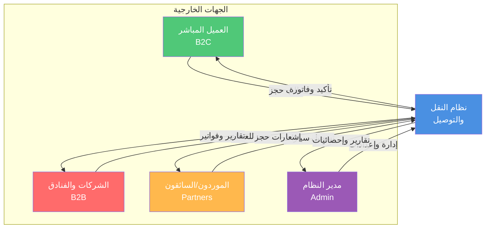

يمثل العميل المباشر الكيان الخارجي الأول الذي يتفاعل مع النظام بشكل مستقل لحجز خدمات النقل لاستخدامه الشخصي. يرسل هذا العميل إلى النظام طلبات حجز تتضمن تفاصيل الرحلة المطلوبة ونوع الخدمة المفضل وفئة المركبة والتاريخ والوقت المحددين، بالإضافة إلى معلومات الدفع اللازمة لإتمام المعاملة. يستقبل العميل من النظام تأكيداً فورياً للحجز يتضمن رقماً مرجعياً فريداً وملخصاً لتفاصيل الطلب، يتبعه لاحقاً إشعارات بالموافقة الإدارية ومعلومات السائق والمركبة المخصصة عند اقتراب موعد الخدمة، وأخيراً الفاتورة النهائية بعد إتمام الرحلة.

تمثل الشركات والفنادق الكيان الخارجي الثاني الذي يتعامل مع النظام نيابة عن عملائها أو ضيوفها. تقدم هذه المؤسسات طلبات حجز متعددة لصالح أطراف ثالثة، وتطلب تسهيلات دفع خاصة مثل الفواتير الموحدة والدفع الآجل ضمن حدود ائتمانية متفق عليها. يزود النظام هذه المؤسسات بتأكيدات فورية للحجوزات مع أرقام مرجعية يمكن تسليمها للعملاء النهائيين، وفواتير شهرية شاملة تجمع جميع المعاملات في وثيقة واحدة منظمة، بالإضافة إلى تقارير تحليلية تساعدهم على فهم أنماط استخدام الخدمة وإدارة ميزانياتهم بفعالية.

يشكل الموردون والسائقون الشركاء الكيان الخارجي الثالث الذي يزود النظام بالقدرات التشغيلية اللازمة. يقوم هؤلاء الموردون بتسجيل مركباتهم في المنصة مع كافة التفاصيل والمستندات المطلوبة، ويقبلون أو يرفضون الحجوزات المعروضة عليهم بناءً على توفرهم وجداولهم. يرسل النظام إلى الموردين إشعارات فورية بالحجوزات الجديدة التي تطابق مواصفات مركباتهم ومواقعهم، ويزودهم بكافة المعلومات اللازمة لتنفيذ الخدمة بنجاح بما في ذلك بيانات الاتصال بالعميل والمواقع التفصيلية والتعليمات الخاصة. يقدم النظام للموردين أيضاً كشوف حساب شهرية تفصيلية توضح المستحقات المالية والعمولات المطبقة والمدفوعات المنجزة والأرصدة المتبقية.

تمثل الإدارة الكيان الخارجي الرابع المسؤول عن الإشراف على العمليات التشغيلية والمالية للمنصة بأكملها. يرسل فريق الإدارة إلى النظام قرارات الموافقة أو الرفض على الحجوزات الواردة، ويدخل التعديلات على إعدادات التشغيل والتسعير والصلاحيات حسب الحاجة، ويصدر أوامر الربط بين الحجوزات والسائقين المتاحين. يزود النظام الإدارة بتقارير شاملة ومحدثة باستمرار عن جميع جوانب العمليات، وإحصائيات أداء تتضمن مؤشرات رئيسية مثل عدد الحجوزات والإيرادات ومعدلات الإتمام ومتوسطات التقييم، وتنبيهات فورية عن أي مشكلات تشغيلية أو استثناءات تتطلب تدخلاً إدارياً.

### 7.2 مخططات تدفق البيانات

#### 7.2.1 المستوى الصفري

يوسع مخطط تدفق البيانات من المستوى الصفري النظرة الشاملة التي يوفرها مخطط السياق من خلال تفكيك النظام إلى عملياته الأساسية الستة التي تعمل معاً لتقديم الوظائف الكاملة للمنصة. يوضح هذا المخطط كيفية تدفق البيانات بين الكيانات الخارجية والعمليات الداخلية ومخازن البيانات المختلفة، مما يوفر فهماً واضحاً للبنية المنطقية للنظام.

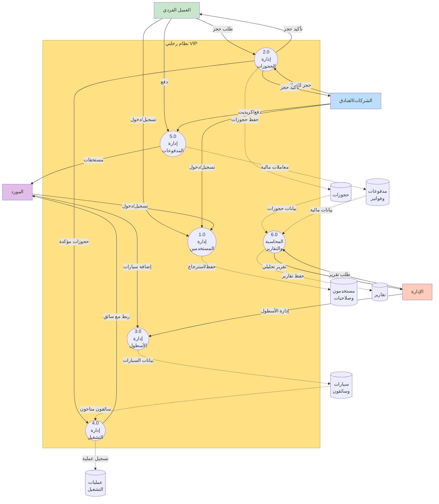

تتولى عملية إدارة الحسابات المسؤولية عن جميع الأنشطة المتعلقة بتسجيل المستخدمين من مختلف الفئات والمصادقة عليهم وإدارة ملفاتهم الشخصية. تستقبل هذه العملية طلبات التسجيل من العملاء الأفراد والشركات والموردين، وتتحقق من صحة المعلومات المقدمة وفرادتها، ثم تحفظ البيانات في مخزن المستخدمين والصلاحيات بعد التشفير المناسب للمعلومات الحساسة. تصدر العملية تأكيدات التسجيل إلى المستخدمين الجدد مع رموز التحقق اللازمة، وتدير عمليات تسجيل الدخول اللاحقة من خلال التحقق من بيانات الاعتماد وإصدار الرموز المميزة للجلسات النشطة.

تركز عملية إدارة الحجوزات على دورة حياة الحجز الكاملة من لحظة الإنشاء وحتى التأكيد والربط بالتشغيل. تستقبل هذه العملية طلبات الحجز من العملاء الأفراد والشركات مع كافة التفاصيل المطلوبة، وتتواصل مع عملية التسعير لحساب التكلفة الدقيقة بناءً على المعايير المختلفة، ثم تعرض السعر للعميل للموافقة عليه. عند قبول العميل للسعر، تحفظ العملية الحجز في مخزن الحجوزات بحالة انتظار التأكيد، وترسل التفاصيل إلى الإدارة للمراجعة. بعد الموافقة الإدارية، تحدث العملية حالة الحجز إلى مؤكد وتنقل المعلومات إلى عملية التشغيل للمعالجة اللاحقة.

تدير عملية التشغيل جميع الأنشطة المتعلقة بربط الحجوزات المؤكدة بالسائقين والمركبات المناسبة ومتابعة تنفيذ الخدمات. تستقبل هذه العملية الحجوزات المؤكدة من عملية إدارة الحجوزات، وتبحث في مخزن السيارات والسائقين عن المركبات المتاحة التي تطابق المواصفات المطلوبة والموقع الجغرافي، ثم تربط الحجز بالمورد الأنسب بناءً على خوارزميات محددة. تحفظ العملية معلومات الربط في مخزن عمليات التشغيل، وترسل إشعارات فورية إلى كل من المورد والعميل بتفاصيل الترتيبات النهائية. تتابع العملية حالة التنفيذ من خلال التحديثات التي يقدمها السائق، وتنقل الحجوزات المكتملة إلى المرحلة النهائية للمراجعة والإقفال.

تعالج عملية إدارة المدفوعات جميع المعاملات المالية بأنواعها المختلفة وتضمن سلامة العمليات المالية وتوافقها مع القواعد التجارية. تستقبل هذه العملية معلومات الدفع من العملاء بطرق متنوعة تشمل الدفع الإلكتروني عبر البوابات المعتمدة والتحويلات البنكية المرفقة بإثباتات والنقد المسجل من قبل السائقين، وتتحقق من صحة المعاملات ونجاحها. تحفظ العملية سجلات شاملة لجميع المعاملات في مخزن المدفوعات والفواتير، وتحسب المستحقات لكل طرف بناءً على نسب العمولات المتفق عليها. تولد العملية الفواتير الضريبية المتوافقة مع متطلبات الهيئة الحكومية، وتدير حسابات الكريديت للشركات بما في ذلك تتبع الحدود المستخدمة والمتاحة.

تشرف عملية إدارة السيارات على جميع الأنشطة المتعلقة بتسجيل المركبات ومراجعتها وتفعيلها وتتبع توفرها. تستقبل هذه العملية طلبات تسجيل المركبات من الموردين مع كافة المعلومات والمستندات المطلوبة، وتعرضها على الإدارة للمراجعة والموافقة. تحفظ العملية تفاصيل المركبات المعتمدة في مخزن السيارات والسائقين مع ربطها بالموردين المالكين، وتدير حالة كل مركبة من حيث التفعيل والتوفر الحالي. تزود العملية عملية التشغيل بمعلومات محدثة باستمرار عن المركبات المتاحة لاستخدامها في عملية الربط.

تركز عملية إنشاء التقارير على استخلاص رؤى ذات معنى من البيانات المتراكمة في مخازن النظام المختلفة وتقديمها بأشكال مفيدة وقابلة للفهم. تستقبل هذه العملية طلبات التقارير من الإدارة مع معايير محددة مثل الفترة الزمنية والمنطقة الجغرافية ونوع التحليل المطلوب، وتستعلم عن البيانات ذات الصلة من مخازن الحجوزات والمدفوعات والسيارات، ثم تعالجها وتحللها لاستخلاص الإحصائيات والاتجاهات والأنماط. تولد العملية التقارير بتنسيقات متعددة قابلة للطباعة والمشاركة، وتحفظ نسخاً منها في مخزن التقارير للرجوع إليها مستقبلاً.

#### 7.2.2 المستوى الأول

يوفر مخطط تدفق البيانات من المستوى الأول تفصيلاً أعمق لعمليات محددة من المستوى الصفري، مع التركيز على إدارة الحجوزات وإدارة التشغيل باعتبارهما العمليتين الأكثر تعقيداً وأهمية في النظام.

تتفرع عملية إدارة الحجوزات إلى ست عمليات فرعية متتالية تشكل معاً تدفق العمل الكامل للحجز. تبدأ الرحلة بعملية اختيار نوع الخدمة حيث يتصفح العميل الخيارات المتاحة ويختار النوع الأنسب لاحتياجاته من بين التوصيل والإيجار بالساعة والجولات المختلفة. تنقل هذه العملية اختيار العميل إلى العملية الفرعية التالية مع المعلومات السياقية اللازمة.

تتولى عملية اختيار نوع السيارة عرض الفئات المختلفة المتاحة للخدمة المختارة مع معلومات وافية عن كل فئة، وتسجل اختيار العميل للفئة المفضلة. تمرر هذه العملية المعلومات المجمعة حتى الآن إلى المرحلة التالية التي تطلب التفاصيل الدقيقة.

تركز عملية إدخال بيانات الحجز على جمع كافة المعلومات التفصيلية اللازمة لتنفيذ الخدمة، وتتكيف الحقول المطلوبة ديناميكياً بناءً على نوع الخدمة المختار. تتحقق هذه العملية من صحة واكتمال البيانات المدخلة قبل السماح بالمتابعة، وتقدم رسائل توجيهية واضحة عند وجود أخطاء أو نواقص.

تستلم عملية حساب السعر جميع تفاصيل الحجز المكتملة وتتواصل مع مخزن الأسعار لاسترجاع المعدلات المطبقة على الفئة والمنطقة والخدمة المحددة. تطبق العملية القواعد الحسابية المناسبة سواء كانت تعتمد على المسافة أو المدة أو سعراً ثابتاً، وتضيف النسب المئوية المقررة والضرائب، ثم تطبق أي خصومات مستحقة للعميل بناءً على ولائه أو عروض نشطة. تعرض النتيجة النهائية بشكل مفصل وشفاف للعميل مع توضيح مكونات السعر المختلفة.

تدير عملية إدارة السلة قائمة الحجوزات التي يرغب العميل في إجرائها، وتتيح إضافة حجوزات متعددة ومراجعتها وتعديلها وحذفها بمرونة. تحسب هذه العملية المجموع الكلي لجميع العناصر في السلة وتنشئ رقم حجز عام موحد يربطها معاً، مع الاحتفاظ بأرقام فرعية فريدة لكل حجز فردي لتسهيل الإدارة التفصيلية.

تتولى عملية تأكيد الحجز الخطوة النهائية في دورة الإنشاء، حيث تحفظ جميع التفاصيل في مخزن الحجوزات بحالة انتظار الموافقة الإدارية. تولد هذه العملية رسائل تأكيد فورية للعميل تتضمن الرقم المرجعي وملخص الطلب وتوقعات الخطوات التالية، وترسل إشعارات للإدارة بوصول حجز جديد يتطلب المراجعة.

تتفرع عملية إدارة التشغيل بدورها إلى عمليات فرعية تغطي مراحل التشغيل المختلفة من الاستقبال وحتى الإقفال. تستقبل عملية استقبال الحجوزات الطلبات المؤكدة من قبل الإدارة وتنظمها في قوائم حسب التاريخ والمنطقة والأولوية، مع عرض واضح لجميع التفاصيل الضرورية لاتخاذ قرارات الربط.

تطبق عملية الموافقة على التشغيل فحوصات نهائية للتأكد من استيفاء جميع المتطلبات قبل الانتقال إلى مرحلة الربط الفعلي، وتسجل موافقة المشرف المسؤول مع الوقت والتاريخ لأغراض التدقيق والمساءلة.

تنفذ عملية الفلترة والربط مع السائق الخوارزمية المعقدة التي تبحث عن أفضل تطابق بين متطلبات الحجز والموارد المتاحة، مع الأخذ في الاعتبار عوامل متعددة مثل القرب الجغرافي والتوفر الزمني ومطابقة المواصفات والتقييم التاريخي للسائق. تسجل العملية تفاصيل الربط في مخزن عمليات التشغيل وتحدث حالة المركبة لتعكس عدم توفرها خلال الفترة المحجوزة.

تولد عملية إرسال الإشعارات الرسائل المناسبة لكل طرف معني بناءً على قوالب محددة مسبقاً، وترسلها عبر القنوات المفضلة لكل مستخدم سواء كانت رسائل نصية أو واتساب أو إشعارات داخل التطبيق. تتضمن الرسائل كافة المعلومات التي يحتاجها كل طرف للاستعداد وتنفيذ الخدمة بنجاح.

تراقب عملية متابعة التنفيذ حالة الخدمات النشطة وتتلقى التحديثات من السائقين والعملاء، وتنبه المشرفين عند حدوث تأخيرات أو مشكلات تتطلب التدخل. تحفظ العملية سجلاً زمنياً كاملاً لجميع الأحداث والتحديثات المتعلقة بكل حجز لأغراض المراجعة وحل النزاعات المحتملة.

تدير عملية الإقفال النهائي المرحلة الختامية لدورة الحياة، حيث تتحقق من إتمام الخدمة واستلام الدفع وتطبيق الخصومات وحساب العمولات، ثم تقفل الحجز بشكل نهائي يمنع أي تعديلات لاحقة إلا بصلاحيات خاصة. تولد هذه العملية الفاتورة الضريبية النهائية وتحفظها في النظام، وتحدث الأرصدة المالية لجميع الأطراف لتعكس هذه المعاملة.

### 7.3 مخططات تدفق العمليات

#### 7.3.1 عملية الحجز للعميل المباشر

يوضح مخطط تدفق عملية الحجز للعميل المباشر المسار الكامل الذي يسلكه العميل الفردي من لحظة فتح التطبيق وحتى استلام تأكيد الحجز النهائي، مع توضيح جميع نقاط القرار والمسارات البديلة الممكنة.

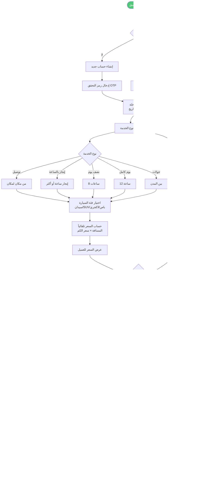

تبدأ الرحلة عندما يفتح العميل التطبيق ويواجه نقطة قرار أولى حول حالة تسجيله. إذا كان العميل مسجلاً مسبقاً ولديه حساب نشط، يدخل اسم المستخدم وكلمة المرور للوصول إلى حسابه الشخصي الذي يحفظ تفضيلاته وتاريخه وطرق الدفع المحفوظة. إذا لم يكن مسجلاً، يواجه خيارين رئيسيين إما المتابعة كضيف للحصول على خدمة سريعة دون التزام طويل الأمد، أو إنشاء حساب جديد للاستفادة من المزايا الإضافية مثل تتبع السجل وبرامج الولاء والحجز السريع في المرات القادمة.

عند اختيار إنشاء حساب جديد، ينتقل التدفق إلى مسار فرعي يتطلب إدخال المعلومات الأساسية ثم التحقق من رقم الجوال عبر رمز يصل في رسالة نصية قصيرة. يجب على العميل إدخال هذا الرمز خلال فترة صلاحيته القصيرة لإتمام التسجيل، وإلا سيحتاج إلى طلب رمز جديد. بعد التحقق الناجح، يندمج هذا المسار مع المسارات الأخرى للانتقال إلى مرحلة اختيار التفاصيل.

بغض النظر عن طريقة الوصول المختارة، يصل جميع العملاء إلى نقطة مشتركة حيث يطلب منهم اختيار المنطقة أو الفرع الذي سيبدأ منه الخدمة من قائمة المناطق المخدومة حالياً. يؤدي هذا الاختيار إلى تفعيل شاشة الخدمات التي تعرض جميع أنواع الخدمات المتاحة في تلك المنطقة المحددة مع الأسعار التقريبية لكل منها.

يصل العميل بعد ذلك إلى نقطة قرار حاسمة حول نوع الخدمة التي يحتاجها، ويتفرع التدفق إلى خمسة مسارات محتملة حسب الاختيار. إذا اختار خدمة التوصيل من مكان لمكان، ينتقل إلى شاشة متخصصة تطلب منه تحديد نقطة الانطلاق والوجهة بدقة باستخدام الخرائط التفاعلية، ويحسب النظام المسافة تلقائياً باستخدام واجهة خرائط جوجل ثم يطبق سعر الكيلومتر المحدد للوصول إلى السعر الأساسي. إذا اختار أحد خيارات الإيجار بالوقت سواء بالساعة أو لثماني ساعات أو لاثنتي عشرة ساعة، ينتقل مباشرة إلى عرض السعر الثابت المحدد مسبقاً لتلك الفئة من الخدمات في المنطقة المختارة. تندمج جميع هذه المسارات عند نقطة حساب السعر النهائي.

يطبق النظام في مرحلة حساب السعر جميع المعادلات والقواعد ذات الصلة، بما في ذلك إضافة النسبة المئوية المقررة التي تغطي التكاليف التشغيلية والهامش الربحي، وتطبيق الضرائب الحكومية المطلوبة، وخصم أي تخفيضات مستحقة للعميل بناءً على حسابه أو عروض نشطة. يعرض النظام السعر النهائي بشكل واضح مع تفصيل شفاف لمكوناته المختلفة، مما يتيح للعميل فهماً كاملاً لما يدفعه ولماذا.

يواجه العميل بعد ذلك نقطة قرار حول ما إذا كان راضياً عن السعر المعروض أم لا. إذا رفض السعر أو رغب في تعديل التفاصيل، يعود التدفق إلى نقطة اختيار الخدمة للسماح بإجراء تغييرات والحصول على عرض سعر جديد. إذا وافق على السعر، يواجه قراراً آخر حول ما إذا كان يرغب في إضافة حجوزات إضافية إلى نفس الطلب أم لا.

عند اختيار إضافة حجوزات متعددة، يعود التدفق إلى نقطة اختيار الخدمة للسماح بإنشاء حجز آخر يضاف إلى السلة الموحدة. يمكن تكرار هذه الحلقة عدة مرات حسب حاجة العميل حتى يكمل جميع الحجوزات المطلوبة. عند الانتهاء، ينتقل التدفق إلى عرض السلة الشاملة التي تجمع جميع الحجوزات المضافة مع رقم حجز عام موحد ومجموع إجمالي واضح.

يتأكد العميل من صحة جميع التفاصيل في السلة ثم ينقر على زر تأكيد الحجز للانتقال إلى مرحلة الدفع الحاسمة. 
يصل العميل إلى نقطة قرار مهمة حول طريقة الدفع المفضلة، ويتفرع التدفق إلى أربعة مسارات رئيسية حسب الاختيار. إذا اختار الدفع النقدي مع السائق، يسجل النظام هذا الخيار ويضع إشارة على الحجز بأن الدفع سيتم لاحقاً عند تقديم الخدمة، وينتقل مباشرة إلى مرحلة الإرسال للإدارة. إذا اختار الدفع الإلكتروني عبر بطاقات مدى أو فيزا، يوجهه النظام إلى بوابة الدفع الآمنة حيث يدخل تفاصيل البطاقة وتعالج المعاملة فوراً، وينتظر النظام استجابة البوابة لتحديد ما إذا نجحت العملية أم فشلت.

عند نجاح الدفع الإلكتروني، يحفظ النظام رقم المعاملة والإيصال الإلكتروني ويربطهما بالحجز، ثم يندمج هذا المسار مع مسار الدفع النقدي للانتقال المشترك إلى مرحلة الإرسال للإدارة. أما في حالة فشل الدفع الإلكتروني لأي سبب مثل عدم كفاية الرصيد أو خطأ في البيانات أو رفض من البنك، يعرض النظام رسالة توضح السبب ويسأل العميل عما إذا كان يرغب في المحاولة مرة أخرى بنفس الطريقة أو اختيار طريقة دفع بديلة. يعود التدفق في هذه الحالة إلى نقطة اختيار طريقة الدفع للسماح بخيار جديد.

إذا اختار العميل التحويل البنكي، يعرض النظام التفاصيل المصرفية الكاملة للشركة بما في ذلك اسم البنك ورقم الحساب ورمز الآيبان، ويطلب من العميل إجراء التحويل ثم رفع صورة من إيصال التحويل كإثبات. يحفظ النظام الإيصال المرفوع ويضع الحجز في حالة انتظار التحقق من الدفع، حيث سيراجع الفريق المالي الإيصال لاحقاً ويؤكد استلام المبلغ قبل المتابعة في معالجة الحجز. ينتقل هذا المسار أيضاً إلى مرحلة الإرسال للإدارة لكن مع إشارة خاصة تدل على انتظار التحقق المالي.

بالنسبة لخيار الدفع الآجل أو الكريديت، فهو متاح فقط للشركات والمؤسسات التي لديها حسابات معتمدة مع حدود ائتمانية محددة. يتحقق النظام تلقائياً من أن المبلغ المطلوب لا يتجاوز الحد المتاح، فإذا كان ضمن الحد المسموح، يسجل المعاملة على حساب الشركة ويخصم المبلغ من الحد المتاح، ثم يندمج مع المسارات الأخرى للانتقال إلى الإدارة. أما إذا تجاوز الحد المتاح، يعرض النظام رسالة توضح الموقف ويطلب من المستخدم اختيار طريقة دفع بديلة.

تندمج جميع المسارات الناجحة عند نقطة إرسال الحجز إلى الإدارة، حيث ينقل النظام جميع تفاصيل الطلب إلى شاشة استقبال الحجوزات التي يراقبها فريق التشغيل. يستلم العميل في نفس اللحظة رسالة نصية وإشعار داخل التطبيق يؤكد استلام طلبه ويزوده برقم مرجعي فريد يمكن استخدامه للاستفسار عن الحالة أو إجراء تعديلات لاحقاً.

يراجع مدير التشغيل أو المشرف المختص الحجز الوارد ويتخذ قراراً بالموافقة عليه أو رفضه بناءً على عدة عوامل مثل توفر الموارد ومعقولية الطلب وصحة المعلومات. إذا رفض الحجز لأي سبب، يدخل المشرف ملاحظات توضح السبب ويرسل النظام إشعاراً فورياً للعميل بالرفض مع شرح السبب، وينتهي التدفق عند هذه النقطة. في حالة الرفض لسبب يتعلق بالدفع المسبق، يتم أيضاً رد المبلغ إذا كان قد تم خصمه فعلاً.

أما إذا وافق المشرف على الحجز، فينقل النظام الطلب تلقائياً إلى قائمة الحجوزات المؤكدة ويرسل إشعاراً آخر للعميل يؤكد الموافقة النهائية ويطمئنه بأن طلبه قيد المعالجة وسيتم تعيين سائق له قبل موعد الخدمة بوقت كافٍ. ينتهي هذا الجزء من التدفق بانتظار مرحلة التشغيل اللاحقة، ويحفظ النظام سجلاً كاملاً لجميع الخطوات والقرارات لأغراض التتبع والمراجعة والتحليل المستقبلي.

#### 7.3.2 عملية التشغيل الإداري

يوضح مخطط تدفق عملية التشغيل الإداري المراحل المتعددة التي يمر بها الحجز بعد الموافقة الإدارية الأولية وحتى الإقفال النهائي، مع التركيز على الإجراءات التي يتخذها الفريق التشغيلي والقرارات الحرجة التي تؤثر على نجاح تقديم الخدمة.

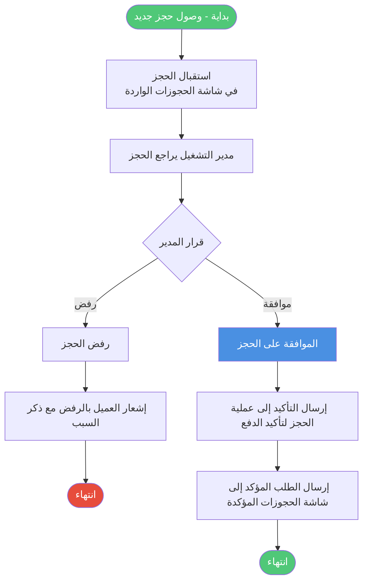

تبدأ العملية عند وصول حجز جديد إلى شاشة استقبال الحجوزات التي تعمل كنقطة دخول مركزية لجميع الطلبات الواردة من التطبيق والموقع الإلكتروني. يعرض النظام الحجوزات بترتيب زمني حسب وقت الاستلام، مع تمييز بصري واضح للحجوزات العاجلة أو ذات القيمة العالية أو التي تحمل متطلبات خاصة. يراجع المشرف المختص تفاصيل كل حجز بعناية، ويتحقق من اكتمال المعلومات ومعقولية الطلب وصحة بيانات الدفع إن وجدت.

يصل المشرف إلى نقطة قرار أولى حاسمة حول ما إذا كان سيوافق على الحجز أم سيرفضه. تعتمد هذه الموافقة على عدة معايير تشمل توفر الموارد المبدئي، ومطابقة الطلب لسياسات الشركة، وعدم وجود تعارض مع التزامات سابقة، وصحة معلومات الدفع خاصة بالنسبة للدفع الآجل. إذا وجد المشرف أي مشكلة تمنع الموافقة مثل عدم توفر مركبات من الفئة المطلوبة أو تجاوز حد الكريديت أو عدم تطابق تواريخ التوفر، يختار رفض الحجز ويدخل سبباً واضحاً ومفصلاً للرفض.

عند الرفض، يرسل النظام إشعاراً فورياً للعميل عبر رسالة نصية ورسالة داخل التطبيق توضح أن طلبه لم يتم قبوله مع ذكر السبب بلغة مهذبة ومفهومة. إذا كان الرفض لسبب يمكن معالجته مثل اختيار فئة مركبة غير متوفرة، يقترح الإشعار بدائل ممكنة ويوفر رابطاً سريعاً لتعديل الحجز وإعادة تقديمه. في حالة الدفع المسبق، يبدأ النظام تلقائياً عملية استرجاع المبلغ المدفوع إلى نفس الوسيلة التي استخدمت في الدفع، وينتهي التدفق عند هذه النقطة بتسجيل كامل للحجز المرفوض وأسبابه للتحليل المستقبلي.

أما إذا وافق المشرف على الحجز، فيضغط على زر الموافقة الواضح الذي ينقل الحجز فوراً إلى حالة جديدة ويسجل اسم الموافق والتاريخ والوقت الدقيق للموافقة. يرسل النظام إشعار تأكيد محدث للعميل يطمئنه بأن حجزه معتمد رسمياً وقيد المعالجة، وينتقل الحجز تلقائياً إلى قائمة الحجوزات المؤكدة التي تمثل المرحلة التالية في سلسلة التشغيل.

تعرض شاشة الحجوزات المؤكدة جميع الطلبات المعتمدة مرتبة حسب تاريخ ووقت الخدمة المطلوبة، مع أدوات فلترة قوية تسمح للمشرفين بتضييق القائمة حسب المنطقة أو الفئة أو التاريخ أو أي معيار آخر ذي صلة. تبقى الحجوزات في هذه القائمة حتى يحين الوقت المناسب لتجهيزها وربطها بالسائقين، وهو عادة قبل موعد الخدمة بفترة كافية تتراوح بين اثنتي عشرة وأربع وعشرين ساعة حسب نوع الخدمة وتعقيدها.

يراقب النظام جميع الحجوزات المؤكدة باستمرار ويتحقق من الوقت المتبقي لكل منها. عندما يدخل حجز محدد في النافذة الزمنية المناسبة للتجهيز، ينقله النظام تلقائياً إلى شاشة قيد التجهيز وينبه المشرف المسؤول عن المنطقة ذات الصلة. تعرض هذه الشاشة فقط الحجوزات التي يجب العمل عليها خلال الفترة القادمة القريبة، مما يساعد على تركيز الانتباه على الأولويات الفعلية دون تشتت.

يصل التدفق إلى نقطة قرار حرجة تتعلق بتوفر السائقين والمركبات. يبحث مشرف المنطقة في قاعدة البيانات عن المركبات المتاحة التي تطابق فئة الحجز والموقع الجغرافي والفترة الزمنية المطلوبة. إذا لم يجد أي خيارات متاحة في الوقت الحالي بسبب انشغال جميع المركبات المناسبة، يواجه قراراً حول كيفية التعامل مع هذا الموقف.

في حالة عدم توفر سائق مناسب، يمكن للمشرف وضع الحجز في قائمة انتظار خاصة مع إرسال إشعار للعميل يوضح الموقف بصراحة ويطمئنه بأن الفريق يعمل على إيجاد حل ويعتذر عن التأخير. يستمر النظام في البحث الدوري عن سائقين يصبحون متاحين، ويتم إعطاء الأولوية للحجوزات الأقدم في قائمة الانتظار. ينتهي هذا المسار مؤقتاً بانتظار تغير في الظروف، مع تسجيل كامل للموقف لتحليل أسباب نقص الموارد ومعالجتها على المدى الطويل.

أما إذا وجد المشرف سائقاً متاحاً ومناسباً، فينتقل التدفق إلى عملية الربط الفعلية. يختار المشرف السائق الأنسب من بين الخيارات المتاحة بناءً على عدة عوامل مثل القرب من موقع الانطلاق، والتقييم التاريخي، والتفضيلات الخاصة للعميل مثل الجنسية إن حددت، وعدد الرحلات المسندة مسبقاً لتحقيق توزيع عادل للعمل. يؤكد المشرف اختياره ويضغط على زر الربط الذي يقوم بعدة إجراءات متزامنة.

يسجل النظام تفاصيل الربط الكاملة في قاعدة البيانات مع ربط معرف الحجز بمعرف السائق والمركبة وتسجيل من قام بالربط ومتى. يحدث النظام حالة المركبة لتعكس انشغالها خلال الفترة المحجوزة، مما يمنع ربطها بحجوزات متداخلة زمنياً. يولد النظام إشعارات مخصصة لكل طرف معني بناءً على قوالب محددة مسبقاً تضمن تضمين جميع المعلومات الضرورية بلغة واضحة واحترافية.

تصل رسالة نصية ورسالة واتساب وإشعار داخل التطبيق إلى العميل تتضمن اسم السائق الكامل ورقم جواله ونوع المركبة وماركتها وموديلها ولونها ورقم اللوحة الكامل، مع جملة ترحيبية تطمئن العميل وتشجعه على التواصل مع السائق مباشرة إذا احتاج أي توضيحات. تصل في نفس الوقت رسائل مماثلة إلى السائق تتضمن اسم العميل ورقم جواله ونوع الخدمة المطلوبة وتفاصيل الموقع والوجهة والتاريخ والوقت المحددين، مع أي ملاحظات خاصة أدخلها العميل مثل رقم الرحلة أو رقم الغرفة أو احتياجات خاصة.

ينتقل الحجز بعد الربط الناجح تلقائياً إلى شاشة قيد التنفيذ التي تعرض فقط الحجوزات المجدولة لليوم الحالي أو الأربع والعشرين ساعة القادمة. توفر هذه الشاشة رؤية فورية لجميع الخدمات النشطة مع معلومات عن حالة كل منها مثل في الطريق إلى نقطة الانطلاق، أو بدأ الخدمة، أو قيد التنفيذ، أو اكتمل. يراقب مشرفو المناطق هذه الشاشة عن كثب للتأكد من سير جميع الخدمات بسلاسة والتدخل السريع عند حدوث أي مشكلات.

يبلغ السائق عن بدء الرحلة عند وصوله لنقطة الانطلاق واستلام العميل، مما يحدث حالة الحجز في النظام ويسجل التوقيت الفعلي للبداية. تستمر الخدمة وفق الخطة المحددة، ويمكن للسائق إرسال تحديثات أو طلبات مساعدة من خلال التطبيق إذا واجه أي تحديات أو تغييرات غير متوقعة. عند إتمام الخدمة والوصول إلى الوجهة النهائية أو انتهاء الفترة المحجوزة، يبلغ السائق بذلك من خلال الضغط على زر الإنهاء في تطبيقه، مما ينقل الحجز إلى المرحلة الأخيرة.

تظهر الحجوزات المكتملة في شاشة المراجعة والإقفال حيث يقوم المشرف المالي أو المحاسب بمراجعة نهائية شاملة قبل الإقفال الدائم. يتحقق المراجع من أن الدفع قد تم واستلم فعلاً، سواء كان نقداً سلمه السائق أو دفعاً إلكترونياً تم تأكيده أو تحويلاً بنكياً تم التحقق منه. يطبق المراجع أي خصومات مستحقة لم تطبق تلقائياً مسبقاً، ويحدد نسبة العمولة النهائية للمورد بناءً على الاتفاق المبرم معه.

يضغط المراجع على زر الإقفال النهائي الذي يقوم بسلسلة من الإجراءات التلقائية المتكاملة. يحسب النظام عمولة المورد الدقيقة بتطبيق النسبة المحددة على المبلغ الأساسي بعد الخصومات، ويحسب صافي ربح الشركة بطرح العمولة من المبلغ الإجمالي. يحدث النظام حسابات كلا الطرفين ليعكس هذه المعاملة، بإضافة المستحق للمورد في رصيده القابل للسحب وإضافة الربح لإيرادات الشركة. يولد النظام الفاتورة الضريبية النهائية بصيغة بي دي إف تتوافق مع متطلبات هيئة الزكاة والضريبة والجمارك، متضمنة جميع التفاصيل المطلوبة ورمز الاستجابة السريعة الذي يسمح بالتحقق الإلكتروني من صحة الفاتورة.

يقفل النظام الحجز بشكل نهائي ويمنع أي تعديلات لاحقة عليه إلا بصلاحيات خاصة جداً مقتصرة على مدير النظام أو المدير المالي في حالات استثنائية موثقة بعناية. يرسل النظام الفاتورة النهائية للعميل عبر البريد الإلكتروني إذا كان مسجلاً، أو يتيحها للتنزيل من خلال التطبيق أو الموقع. ينتهي التدفق بحفظ سجل كامل ودائم لجميع مراحل الحجز وجميع الإجراءات المتخذة بشأنه، مما يوفر مساراً تدقيقياً شفافاً يمكن الرجوع إليه عند الحاجة لحل نزاعات أو إجراء تحليلات أو الامتثال لمتطلبات تنظيمية.

#### 7.3.3 عملية الحجوزات المؤكدة

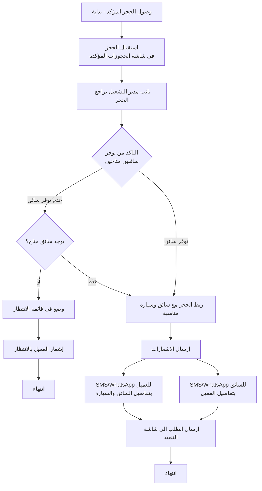

تبدأ هذه العملية عند وصول حجز مؤكد من الإدارة إلى شاشة الحجوزات المؤكدة، والتي تعمل كمستودع مؤقت لجميع الطلبات المعتمدة التي تنتظر دورها للتجهيز والربط بالسائقين. يراجع نائب مدير التشغيل أو المشرف المختص الحجز للتأكد من اكتمال جميع التفاصيل الضرورية واستعداده للمرحلة التالية.

يصل التدفق إلى نقطة التحقق الأولى من توفر السائقين المتاحين. يبحث المشرف في النظام عن مركبات تطابق المواصفات المطلوبة من حيث الفئة والموقع الجغرافي والتوفر الزمني، مع مراعاة أي تفضيلات خاصة أدخلها العميل. إذا وجد خيارات متاحة، ينتقل التدفق مباشرة إلى عملية الربط. أما إذا لم تتوفر خيارات مناسبة في الوقت الحالي، يواجه المشرف قراراً حول كيفية التعامل مع هذا الموقف.

في حالة عدم التوفر، يختار المشرف وضع الحجز في قائمة انتظار مخصصة مع تسجيل سبب التأخير والوقت المتوقع للتوفر. يرسل النظام إشعاراً تلقائياً للعميل يشرح الموقف بشفافية ويعتذر عن أي إزعاج، مع طمأنته بأن الفريق يعمل على إيجاد حل في أسرع وقت ممكن. ينتهي هذا المسار مؤقتاً مع استمرار المراقبة الدورية لتوفر الموارد.

عندما يتوفر سائق مناسب سواء فوراً أو بعد فترة انتظار، ينتقل التدفق إلى عملية الربط الفعلية. يختار المشرف السائق الأمثل من الخيارات المتاحة ويؤكد الربط، مما يسجل جميع التفاصيل في قاعدة البيانات ويحدث حالات جميع السجلات ذات الصلة. يقوم النظام بإرسال الإشعارات تلقائياً إلى كل من العميل والسائق عبر قنوات متعددة تتضمن الرسائل النصية القصيرة ورسائل واتساب والإشعارات داخل التطبيق، لضمان وصول المعلومات الحيوية بشكل موثوق وسريع.

تتضمن رسالة العميل الترحيبية جميع معلومات السائق الضرورية وتشجعه على حفظ رقم الجوال للتواصل المباشر عند الحاجة. تتضمن رسالة السائق جميع تفاصيل المهمة وتحثه على التواصل مع العميل لتأكيد الترتيبات النهائية وضمان الوضوح الكامل حول التوقعات والمتطلبات.

ينقل النظام الحجز تلقائياً بعد إرسال الإشعارات الناجح إلى شاشة قيد التنفيذ، مكملاً بذلك دور شاشة الحجوزات المؤكدة كمرحلة انتقالية حيوية بين التأكيد الإداري والتنفيذ الفعلي على أرض الواقع. ينتهي هذا الجزء من التدفق مع الانتقال السلس إلى مرحلة المتابعة التشغيلية اللاحقة.

#### 7.3.4 عملية متابعة التنفيذ

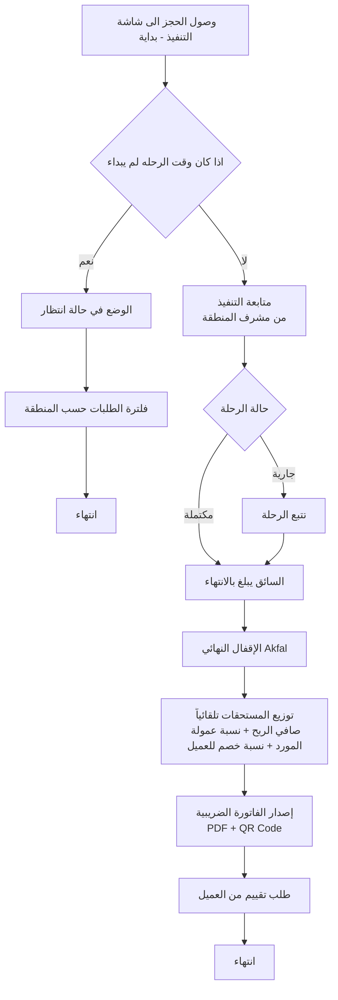

تبدأ هذه المرحلة الحرجة عندما يصل حجز مربوط بسائق إلى شاشة قيد التنفيذ، التي تعمل كمركز تحكم فوري لجميع الخدمات النشطة خلال الأربع والعشرين ساعة القادمة. يواجه النظام نقطة فحص زمنية مهمة تحدد ما إذا كان الوقت مناسباً لبدء المتابعة الفعلية أم أن الحجز لا يزال بعيداً زمنياً.

إذا كان وقت الرحلة المجدول لا يزال بعيداً ولم يدخل بعد في النافذة الزمنية النشطة، يضع النظام الحجز في حالة انتظار مع مراقبة دورية حتى يقترب الموعد. يطبق النظام فلترة تلقائية تعرض فقط الطلبات التي تقع ضمن إطار زمني ضيق يسهل إدارته، عادة الأربع والعشرين ساعة القادمة، مما يمنع إغراق المشرفين بمعلومات عن حجوزات بعيدة لا تتطلب اهتماماً فورياً. ينتهي هذا المسار مؤقتاً مع الاحتفاظ بالحجز في النظام حتى يحين وقته.


أما إذا دخل الحجز في النافذة الزمنية النشطة، فينتقل إلى مرحلة المتابعة التشغيلية الدقيقة من قبل مشرف المنطقة المختص. يتولى المشرف مراقبة الخدمة عن كثب من خلال الشاشة المخصصة التي تعرض حالة الحجز الفورية وتحديثات السائق وأي معلومات أخرى ذات صلة بالتنفيذ السلس.

يتتبع النظام حالة الرحلة من خلال عدة مراحل متتابعة تبدأ بمرحلة الاستعداد حيث يكون السائق في طريقه إلى نقطة الانطلاق المحددة. يمكن للسائق تحديث حالته من خلال التطبيق المخصص له، مما يوفر معلومات فورية للمشرف والعميل على حد سواء. عند وصول السائق واستلام العميل، يبلغ بذلك من خلال الضغط على زر واضح في التطبيق، مما يسجل وقت البداية الفعلي ويحول حالة الحجز إلى "جارية".

تستمر الرحلة وفق الخطة المرسومة، مع إمكانية إرسال تحديثات دورية أو عند حدوث أي تطورات مهمة. يراقب المشرف جميع الرحلات النشطة من خلال لوحة تحكم شاملة توفر رؤية فورية للوضع العام، وتنبهه تلقائياً عند حدوث تأخيرات غير مبررة أو انحرافات عن الخطة المتوقعة أو طلبات مساعدة من السائقين.

عند إتمام الخدمة بنجاح والوصول إلى الوجهة النهائية أو انتهاء الفترة الزمنية المحجوزة، يبلغ السائق بإنهاء المهمة من خلال تطبيقه. يسجل النظام وقت الإنهاء الدقيق ويحول الحجز تلقائياً إلى شاشة المراجعة والإقفال، مما يمثل الانتقال من مرحلة التنفيذ النشطة إلى مرحلة المعالجة المالية والإدارية النهائية.

يصل التدفق إلى مرحلة الإقفال المالي الحاسمة حيث يتولى المحاسب أو المشرف المالي مراجعة شاملة لجميع جوانب المعاملة. يتحقق المراجع أولاً من أن الدفع قد تم فعلاً واستلم بالطريقة المحددة عند الحجز، سواء كان نقداً سلمه السائق للصندوق أو دفعاً إلكترونياً تم تأكيده من البوابة أو تحويلاً بنكياً تم التحقق من وصوله أو كريديت مسجل على حساب الشركة.

يطبق المراجع بعد ذلك أي خصومات نهائية لم تطبق تلقائياً مسبقاً، والتي قد تتضمن تخفيضات خاصة للعملاء الأفراد المميزين أو خصومات تعاقدية للشركات والفنادق بناءً على حجم استخدامهم أو اتفاقيات خاصة مبرمة معهم. يحدد المراجع نسبة عمولة المورد النهائية بناءً على الاتفاق المسجل في النظام، والتي قد تختلف من مورد لآخر حسب شروط الشراكة والأداء التاريخي.

يحسب النظام تلقائياً المبالغ المالية الدقيقة لجميع الأطراف بتطبيق النسب والخصومات المحددة. يحسب مستحقات المورد بضرب المبلغ الأساسي بعد الخصومات في نسبة العمولة المتفق عليها، ويحسب صافي إيرادات الشركة بطرح عمولة المورد من المبلغ الإجمالي الذي دفعه أو سيدفعه العميل. يسجل النظام هذه الأرقام في السجلات المالية لكلا الطرفين، مضيفاً المستحقات لرصيد المورد القابل للسحب ومضيفاً الإيرادات لحسابات الشركة.

يولد النظام الفاتورة الضريبية النهائية المتوافقة تماماً مع متطلبات الفوترة الإلكترونية في المملكة العربية السعودية. تتضمن الفاتورة جميع العناصر المطلوبة نظامياً بما في ذلك معلومات الشركة الكاملة مع الرقم الضريبي، ومعلومات العميل إذا كان مسجلاً، وتفاصيل الخدمة المقدمة بوضوح، وتفصيل المبالغ قبل وبعد الضريبة، ورمز الاستجابة السريعة المشفر الذي يسمح للهيئة بالتحقق الإلكتروني الفوري من صحة الفاتورة وعدم التلاعب بها.

يقفل المراجع الحجز بشكل نهائي وغير قابل للتراجع من خلال الضغط على زر الإقفال النهائي، مما يحول حالة السجل إلى "مقفل" ويمنع أي تعديلات لاحقة عليه إلا بصلاحيات استثنائية محدودة جداً وموثقة بعناية. يسجل النظام من قام بالإقفال ومتى بالضبط، مما يوفر مساراً تدقيقياً كاملاً لكل إجراء.

يرسل النظام الفاتورة النهائية للعميل فوراً عبر البريد الإلكتروني إذا كان متوفراً، أو يتيحها للتنزيل من خلال حساب العميل في التطبيق أو الموقع الإلكتروني. يرسل النظام أيضاً طلباً مهذباً للعميل لتقييم الخدمة التي تلقاها، مع رابط مباشر لنموذج تقييم مبسط يستغرق دقيقة أو دقيقتين فقط لإكماله. تساعد هذه التقييمات على مراقبة جودة الخدمة وتحديد فرص التحسين وتقدير أداء السائقين والموردين بشكل موضوعي.

ينتهي التدفق بحفظ دائم لجميع البيانات والوثائق المتعلقة بالحجز في قاعدة البيانات، مع فهرسة مناسبة تسهل استرجاعها لاحقاً عند الحاجة لأغراض المحاسبة أو التدقيق أو حل النزاعات أو التحليل الإحصائي.

#### 7.3.5 عملية تسجيل مورد جديد

يوضح مخطط تدفق عملية تسجيل مورد جديد جميع الخطوات التفصيلية التي يمر بها السائق أو صاحب المركبة الراغب في الانضمام إلى شبكة رحلتي VIP كشريك، بدءاً من الوصول الأولي إلى منصة التسجيل وحتى الموافقة النهائية وتفعيل الحساب.

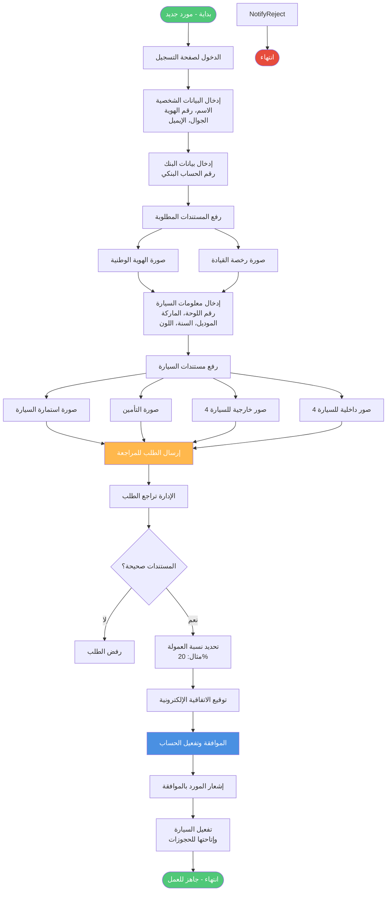

تبدأ الرحلة عندما يصل مورد محتمل إلى صفحة التسجيل المخصصة للشركاء، والتي يمكن الوصول إليها من خلال قسم خاص في الموقع الإلكتروني أو من خلال رابط مباشر يوزع في الحملات التسويقية الموجهة لجذب موردين جدد. تعرض الصفحة شرحاً موجزاً عن فوائد الشراكة ومتطلبات الانضمام وعملية الموافقة المتوقعة، مما يساعد المورد على تكوين توقعات واقعية قبل بدء العملية الفعلية.

يبدأ المورد بإدخال بياناته الشخصية الأساسية في نموذج مصمم بعناية ليكون واضحاً وسهل الاستخدام. تتضمن هذه البيانات الاسم الكامل كما يظهر في الهوية الوطنية، ورقم الهوية الوطنية الذي يستخدم للتحقق من الشخصية ومنع التسجيل المكرر، ورقم الجوال الذي سيستخدم كوسيلة اتصال رئيسية ومعرف للدخول، وعنوان البريد الإلكتروني للمراسلات الرسمية والفواتير.

يتحقق النظام فورياً من عدم استخدام رقم الهوية أو رقم الجوال سابقاً في تسجيلات أخرى، ويعرض رسالة تنبيه واضحة إذا وجد تطابقاً يشير إلى محاولة تسجيل مكررة. يطلب النموذج أيضاً تحديد نوع المورد سواء كان "داخلياً" يعمل بشكل وثيق مع الشركة أو "خارجياً" يعمل بشكل أكثر استقلالية، وهو تصنيف يؤثر على شروط الشراكة ونسب العمولات ومستويات الدعم المقدمة.

ينتقل المورد بعد ذلك إلى قسم المعلومات البنكية الذي يطلب اسم البنك ورقم الحساب البنكي الكامل ورمز الآيبان الدولي الذي سيستخدم لتحويل المستحقات المالية بشكل دوري. يتحقق النظام من صحة تنسيق رمز الآيبان رياضياً قبل قبوله، مما يقلل من احتمالية الأخطاء التي قد تؤدي لفشل التحويلات المستقبلية.

يصل التدفق إلى مرحلة حاسمة تتطلب رفع المستندات الثبوتية الضرورية للتحقق من هوية المورد وشرعية عمله. يطلب النظام صورة واضحة لوجهي الهوية الوطنية تظهر جميع المعلومات بوضوح، وصورة لرخصة القيادة السارية التي تثبت أهلية المورد لقيادة المركبات التي سيسجلها. يوفر النظام واجهة سلسة لرفع الصور إما من خلال التقاط صور فورية باستخدام كاميرا الجهاز أو اختيار صور موجودة مسبقاً في معرض الصور. يطبق النظام فحصاً تلقائياً للتأكد من وضوح الصور وقابليتها للقراءة، وينبه المستخدم إذا كانت الجودة غير كافية ويطلب إعادة التقاط الصورة.

ينتقل التدفق بعد ذلك إلى إدخال معلومات المركبة التفصيلية التي تشمل رقم اللوحة الكامل بأجزائه المختلفة، والماركة أو الشركة المصنعة من قائمة محددة مسبقاً، والموديل المحدد، وسنة الصنع، واللون الخارجي، وفئة المركبة مثل سيدان أو اس يو في أو باص أو لاكجري، وعدد المقاعد المتوفرة للركاب. يستخدم النظام هذه المعلومات لاحقاً في عملية مطابقة الحجوزات مع المركبات المناسبة، لذا من المهم جداً أن تكون دقيقة وصحيحة.

تتطلب المرحلة التالية رفع مستندات المركبة الرسمية التي تثبت ملكيتها وشرعية تشغيلها. يرفع المورد صورة واضحة لاستمارة المركبة السارية الصادرة من الإدارة العامة للمرور، وصورة لوثيقة التأمين الشامل السارية التي تغطي المسؤولية المدنية على الأقل. يتحقق النظام من تاريخ انتهاء صلاحية كلا الوثيقتين ويرفض المتابعة إذا كانتا منتهيتين، مع عرض رسالة واضحة تطلب تجديدهما أولاً.

تأتي بعد ذلك خطوة مهمة ومميزة تتطلب رفع ثماني صور عالية الجودة للمركبة تعرض حالتها ونظافتها ومستوى صيانتها. يجب على المورد التقاط أربع صور خارجية تغطي جميع جوانب المركبة من الأمام والخلف واليمين واليسار، وأربع صور داخلية تظهر المقاعد الأمامية والخلفية ولوحة القيادة والصندوق الخلفي. توفر هذه الصور للعملاء رؤية واقعية لما سيحصلون عليه، وتساعد فريق المراجعة على تقييم مدى مناسبة المركبة لمعايير الخدمة الفاخرة التي تلتزم بها المنصة.

يصل التدفق إلى المرحلة الختامية من التسجيل حيث يراجع المورد جميع المعلومات التي أدخلها ويؤكد صحتها واكتمالها. يعرض النظام ملخصاً شاملاً لجميع البيانات والمستندات المقدمة، مع إمكانية العودة لتعديل أي قسم قبل الإرسال النهائي. عند الرضا التام عن المعلومات المقدمة، يضغط المورد على زر واضح يحمل عنوان "إرسال للمراجعة" الذي يقوم بعدة إجراءات متزامنة.

يحفظ النظام جميع البيانات والمستندات في قاعدة البيانات بحالة "قيد المراجعة"، ويولد رقماً مرجعياً فريداً للطلب يمكن للمورد استخدامه للاستفسار عن حالة طلبه. يرسل النظام رسالة تأكيد فورية للمورد عبر الجوال والبريد الإلكتروني تؤكد استلام طلبه وتزوده بالرقم المرجعي وتقدير للوقت المتوقع للمراجعة والرد، وهو عادة من يومين إلى خمسة أيام عمل. ترسل رسالة إشعار أخرى لفريق المراجعة في الإدارة تنبههم بوصول طلب شريك جديد يتطلب اهتمامهم.

ينتقل التدفق من جانب المورد إلى جانب الإدارة حيث يقوم أحد أعضاء فريق المراجعة بفتح الطلب من خلال شاشة مخصصة تعرض جميع التفاصيل بشكل منظم وسهل المراجعة. يفحص المراجع جميع المعلومات المقدمة بعناية، ويتحقق من صحة أرقام الهوية والرخصة واستمارة المركبة، ويدقق في جودة ووضوح جميع الصور المرفوعة، ويقيم الحالة العامة للمركبة من خلال الصور الداخلية والخارجية.

يصل المراجع إلى نقطة قرار حاسمة حول ما إذا كان سيوافق على الطلب أم سيرفضه. إذا وجد أي مشكلات جوهرية مثل مستندات غير صحيحة أو منتهية الصلاحية، أو صور غير واضحة لا تسمح بالتقييم الدقيق، أو حالة سيئة للمركبة لا تتناسب مع معايير الخدمة الفاخرة، أو تناقضات في المعلومات المقدمة، يختار رفض الطلب ويدخل سبباً واضحاً ومفصلاً للرفض في حقل مخصص.

عند الرفض، يرسل النظام إشعاراً فورياً للمورد عبر جميع القنوات المتاحة يوضح أن طلبه لم يتم قبوله مع ذكر السبب بلغة مهذبة واحترافية. إذا كان سبب الرفض قابلاً للمعالجة مثل انتهاء صلاحية التأمين أو عدم وضوح بعض الصور، يشجع الإشعار المورد على معالجة المشكلة وإعادة تقديم الطلب بعد ذلك. ينتهي هذا المسار مع حفظ سجل كامل للطلب المرفوض وأسبابه لأغراض المراجعة والتحليل.

أما إذا وجد المراجع أن جميع المتطلبات مستوفاة والمعلومات صحيحة والمركبة تلبي المعايير المطلوبة، فينتقل إلى تحديد شروط الشراكة المحددة لهذا المورد. يحدد نسبة العمولة التي ستطبق على حجوزاته، والتي قد تختلف من مورد لآخر حسب نوع الشراكة وفئة المركبة وحجم الأسطول وعوامل أخرى ذات صلة. النسبة القياسية هي عشرون بالمائة، لكن يمكن تعديلها صعوداً أو هبوطاً حسب الظروف الخاصة.

يوافق المراجع رسمياً على الطلب من خلال الضغط على زر الموافقة، مما يحول حالة السجل من "قيد المراجعة" إلى "مقبول" ويسجل اسم الموافق والتاريخ والوقت. يفعل النظام حساب المورد تلقائياً ويمنحه الوصول إلى التطبيق أو البوابة المخصصة للشركاء، ويسجل المركبة في قاعدة البيانات بحالة "نشطة" ومتاحة لربطها بالحجوزات الواردة.

يرسل النظام إشعار قبول مبهج للمورد الجديد عبر رسالة نصية ورسالة واتساب وبريد إلكتروني، يهنئه على قبوله في شبكة رحلتي VIP ويزوده ببيانات الدخول الأولية ونسبة العمولة المحددة له ورابط لتنزيل تطبيق الشركاء إذا لم يكن مثبتاً مسبقاً، وتعليمات مختصرة حول كيفية البدء في استقبال الحجوزات.

تصبح المركبة المسجلة متاحة فوراً في النظام لربطها بالحجوزات المناسبة، وينتهي التدفق بنجاح مع إضافة شريك جديد إلى الشبكة يوسع القدرات التشغيلية للمنصة ويزيد من قدرتها على تلبية الطلب المتنامي على الخدمات.

#### 7.3.6 عملية الدفع

يفصل مخطط تدفق عملية الدفع جميع السيناريوهات والمسارات المختلفة التي يمكن أن يسلكها العميل عند إتمام دفع حجزه، مع توضيح التعامل مع كل طريقة دفع والتحديات المحتملة المرتبطة بها.

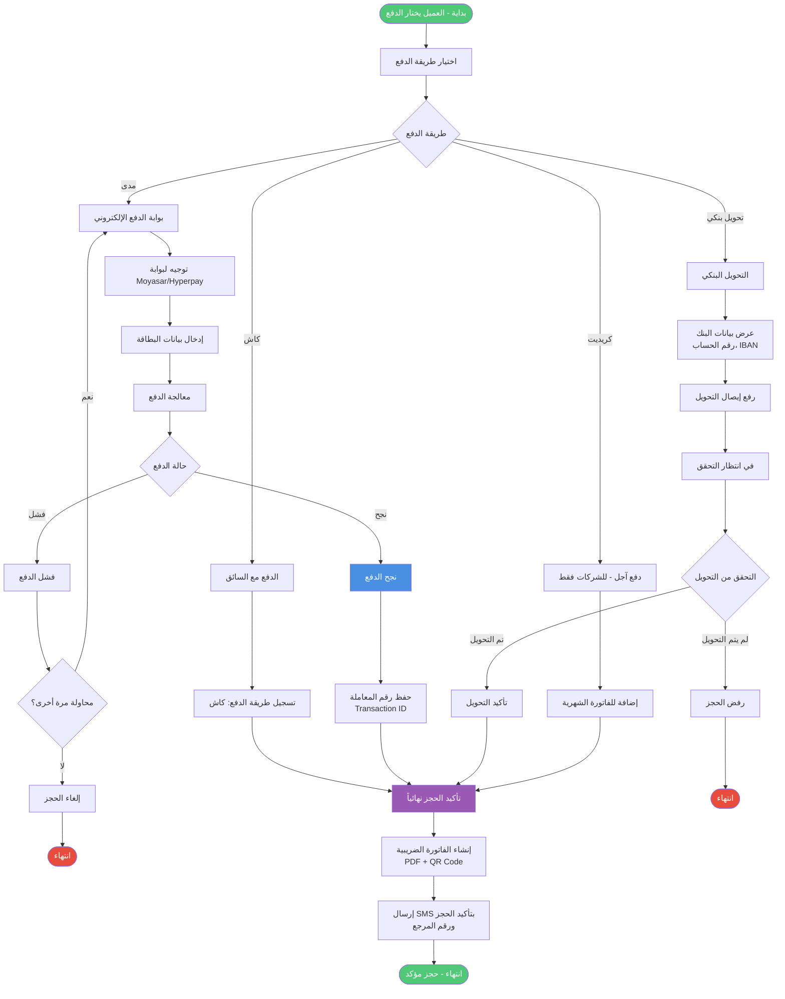

تبدأ عملية الدفع بعد أن يراجع العميل تفاصيل حجزه النهائية في السلة ويؤكد رغبته في المتابعة. يعرض النظام شاشة اختيار طريقة الدفع التي تقدم أربعة خيارات رئيسية مصممة لتلبية احتياجات وتفضيلات مختلفة للعملاء، مع شرح موجز لكل خيار ومتى يكون الأنسب.

يصل التدفق إلى نقطة قرار رئيسية حيث يختار العميل طريقة الدفع المفضلة لديه من بين الخيارات المتاحة. إذا اختار الدفع النقدي مع السائق، وهو خيار شائع خاصة بين العملاء الذين يفضلون عدم مشاركة معلومات مالية إلكترونياً أو الذين لا يملكون بطاقات إلكترونية، يسجل النظام هذا الاختيار في قاعدة البيانات ويضع إشارة واضحة على الحجز بأن الدفع سيتم نقداً عند تقديم الخدمة.

ينتقل هذا المسار مباشرة إلى مرحلة تأكيد الحجز دون الحاجة لأي معالجة مالية فورية، حيث أن الدفع الفعلي سيتم لاحقاً. يرسل النظام تأكيداً للعميل يوضح أن حجزه قد تم استلامه بنجاح وأنه سيحتاج إلى دفع المبلغ المحدد نقداً للسائق عند أو بعد تقديم الخدمة. يتلقى السائق أيضاً إشعاراً واضحاً بأن هذا الحجز يتطلب تحصيل نقدي، مع تذكير بضرورة تسليم المبلغ للإدارة في نهاية نوبة العمل أو في أقرب وقت ممكن.

إذا اختار العميل الدفع الإلكتروني عبر بطاقات مدى أو فيزا، وهو الخيار المفضل للعديد من العملاء لسرعته وأمانه، يوجهه النظام فوراً إلى بوابة الدفع الإلكترونية الآمنة والمتكاملة مع المنصة. تعمل هذه البوابة التي توفرها شركة مختصة مثل مويسر أو هايبر باي كوسيط موثوق يعالج المعاملة دون أن يحتاج نظام رحلتي VIP لتخزين تفاصيل البطاقات الحساسة، مما يقلل من المخاطر الأمنية والمسؤوليات التنظيمية.

يدخل العميل تفاصيل بطاقته في نموذج آمن ومشفر تماماً توفره البوابة، بما في ذلك رقم البطاقة وتاريخ الانتهاء ورمز التحقق الموجود على ظهر البطاقة. تتحقق البوابة من صحة البيانات المدخلة وتحاول معالجة المعاملة من خلال التواصل مع البنك المصدر للبطاقة. تستغرق هذه العملية عادة بضع ثوان فقط، لكن يعرض النظام شاشة انتظار واضحة تطلب من العميل عدم إغلاق النافذة أو الضغط على زر الرجوع لتجنب تعطيل المعاملة.


تستلم البوابة رداً من البنك يحدد ما إذا نجحت المعاملة أم فشلت، ويصل التدفق إلى نقطة فرعية حاسمة. في حالة نجاح المعاملة، تصدر البوابة رقم معاملة فريداً ووقت الدفع الدقيق وإيصالاً إلكترونياً يثبت إتمام العملية. يحفظ النظام جميع هذه المعلومات في سجل الحجز ويربطها به بشكل دائم، مما يوفر إثباتاً واضحاً للدفع يمكن الرجوع إليه عند الحاجة. يندمج هذا المسار الناجح مع مسار الدفع النقدي للانتقال المشترك إلى مرحلة تأكيد الحجز النهائية.

أما في حالة فشل المعاملة الإلكترونية، فتوفر البوابة سبباً محدداً للفشل قد يتضمن عدم كفاية الرصيد في الحساب المرتبط بالبطاقة، أو انتهاء صلاحية البطاقة، أو خطأ في إدخال بيانات البطاقة مثل رمز التحقق، أو رفض من البنك لأسباب أمنية، أو مشكلة تقنية مؤقتة في التواصل مع النظام البنكي. يعرض النظام رسالة واضحة ومفهومة للعميل توضح سبب الفشل وتقترح الحلول المناسبة حسب طبيعة المشكلة.

يواجه العميل في هذه الحالة خياراً حول ما إذا كان يرغب في المحاولة مرة أخرى أم اختيار طريقة دفع بديلة. إذا اختار المحاولة مرة أخرى وكان السبب متعلقاً بخطأ في الإدخال، يعود إلى نموذج البطاقة لتصحيح المعلومات وإعادة المحاولة. إذا اختار طريقة بديلة أو كان سبب الفشل يشير إلى استحالة نجاح المحاولة الإلكترونية مثل عدم كفاية الرصيد، يعود التدفق إلى نقطة اختيار طريقة الدفع الرئيسية للسماح باختيار مختلف.

بالنسبة لخيار التحويل البنكي، الذي يناسب العملاء الذين يفضلون الدفع من حساباتهم البنكية مباشرة دون استخدام بطاقات، يعرض النظام شاشة مفصلة تتضمن جميع المعلومات المصرفية اللازمة لإتمام التحويل. تشمل هذه المعلومات اسم الشركة القانوني الكامل، واسم البنك الذي تحتفظ فيه بحساباتها، ورقم الحساب البنكي الدقيق، ورمز الآيبان الدولي الذي يضمن وصول التحويل بشكل صحيح، والمبلغ المحدد المطلوب تحويله.

يقوم العميل بإجراء التحويل من خلال تطبيق البنك الإلكتروني الخاص به أو بزيارة أحد فروع البنك أو أجهزة الصراف الآلي التي توفر خدمة التحويل. بعد إتمام التحويل، يحصل العميل على إيصال إلكتروني أو ورقي يثبت العملية ويتضمن تفاصيلها المهمة. يطلب النظام من العميل التقاط صورة لهذا الإيصال أو رفع نسخة إلكترونية منه كإثبات للدفع.

يوفر النظام واجهة سلسة لرفع صورة الإيصال إما من خلال التقاط صورة مباشرة باستخدام كاميرا الجهاز أو اختيار صورة موجودة مسبقاً. يتحقق النظام من وضوح الصورة وقابليتها للقراءة قبل قبولها، وينبه المستخدم إذا كانت الجودة غير كافية. بعد رفع الإيصال بنجاح، يضع النظام الحجز في حالة خاصة تسمى انتظار التحقق من الدفع، حيث سيقوم الفريق المالي لاحقاً بمراجعة الإيصال والتأكد من وصول المبلغ فعلاً إلى حساب الشركة قبل المتابعة في معالجة الحجز.

يرسل النظام تأكيداً أولياً للعميل يوضح أن طلبه قد تم استلامه بنجاح وأن فريق المحاسبة سيتحقق من الدفع خلال فترة زمنية محددة عادة لا تتجاوز يوم عمل واحد، وسيتم إرسال تأكيد نهائي بمجرد التحقق من وصول المبلغ. يندمج هذا المسار مع المسارات الأخرى للانتقال إلى الإدارة، لكن مع إشارة خاصة تميزه كحجز في انتظار التحقق المالي.

يختلف خيار الدفع الآجل أو الكريديت عن الخيارات السابقة في كونه متاحاً حصرياً للعملاء المؤسسيين الذين وقعوا اتفاقيات مسبقة مع الشركة ومنحوا حدوداً ائتمانية محددة. عند اختيار هذا الخيار، يتحقق النظام تلقائياً من هوية المستخدم وصلاحيته لاستخدام الكريديت، ويسترجع معلومات حساب الشركة بما في ذلك الحد الائتماني الإجمالي الممنوح والمبلغ المستخدم حالياً والرصيد المتاح.

يصل التدفق إلى فحص حاسم لتحديد ما إذا كان المبلغ المطلوب للحجز الحالي يقع ضمن الحد المتاح أم يتجاوزه. يحسب النظام ذلك بطرح المبلغ المستخدم حالياً من الحد الإجمالي للحصول على الرصيد المتاح، ثم يقارنه بمبلغ الحجز الجديد. إذا كان المبلغ المطلوب أكبر من الرصيد المتاح، يعرض النظام رسالة واضحة توضح الموقف وتخبر المستخدم بالحد المتاح الفعلي، وتطلب منه إما تقليل قيمة الحجز إذا كان ذلك ممكناً أو اختيار طريقة دفع بديلة. يعود التدفق في هذه الحالة إلى نقطة اختيار طريقة الدفع.

أما إذا كان المبلغ المطلوب ضمن الحد المتاح، فيسجل النظام المعاملة على حساب الشركة ويخصم المبلغ من الرصيد المتاح فوراً لضمان عدم تجاوز الحد من خلال حجوزات متزامنة. يحفظ النظام تفاصيل المعاملة الكاملة في سجل حساب الشركة، وسيتم تضمينها في الفاتورة الشهرية الموحدة التي تصدر في نهاية دورة الفوترة المتفق عليها. يندمج هذا المسار الناجح مع المسارات الأخرى للمتابعة.

تتلاقى جميع المسارات الناجحة من طرق الدفع المختلفة عند نقطة واحدة حيث يرسل النظام الحجز المكتمل إلى شاشة استقبال الحجوزات في لوحة التحكم الإدارية. يستلم العميل في نفس اللحظة رسالة تأكيد شاملة عبر رسالة نصية قصيرة وإشعار داخل التطبيق وبريد إلكتروني إذا كان متوفراً، تتضمن رقم الحجز المرجعي الفريد وملخص تفاصيل الطلب وطريقة الدفع المستخدمة والمبلغ الإجمالي وتوقعات الخطوات التالية.

ينتقل الحجز إلى قائمة الحجوزات الواردة التي يراقبها فريق التشغيل، في انتظار المراجعة والموافقة الإدارية كما تم توضيحه في مخططات التدفق السابقة. ينتهي هذا الجزء من عملية الحجز الشاملة بنجاح، مع حفظ سجل كامل لجميع خطوات الدفع والقرارات المتخذة والنتائج، مما يوفر مساراً تدقيقياً واضحاً لأغراض المحاسبة وحل النزاعات المحتملة والامتثال للمتطلبات التنظيمية.

### 7.4 المخططات التسلسلية

#### 7.4.1 حجز عميل مباشر

يوضح المخطط التسلسلي لحجز عميل مباشر التفاعلات الزمنية بين المكونات المختلفة للنظام والأطراف المعنية خلال عملية حجز نموذجية من البداية وحتى النهاية، مع التركيز على تسلسل الرسائل والاستجابات بين الكيانات المشاركة.

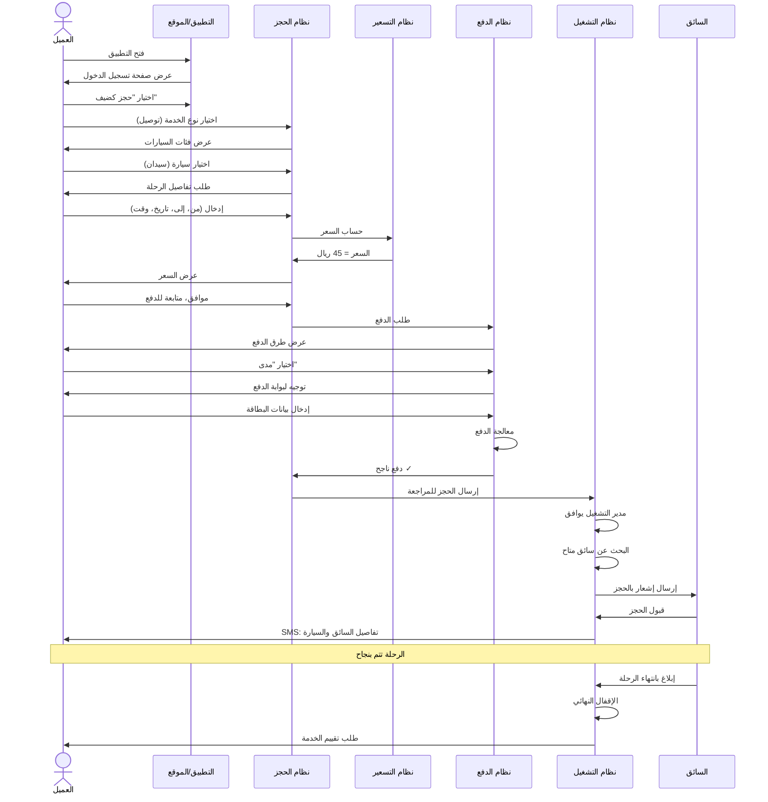

تبدأ السلسلة عندما يفتح العميل التطبيق أو الموقع الإلكتروني، مما يرسل طلباً إلى واجهة المستخدم لعرض الشاشة الرئيسية. تستجيب الواجهة بعرض شاشة السيارات المتحركة التي تستعرض جميع الفئات المتاحة بطريقة جذابة بصرياً. يتفاعل العميل مع هذه الشاشة ويختار سيارة معينة ثم ينقر على زر أطلب الآن، مما يرسل طلباً للانتقال إلى شاشة الخدمات.

تستجيب واجهة المستخدم بعرض شاشة اختيار الخدمة التي تقدم الخيارات المختلفة. يختار العميل المنطقة أولاً ثم نوع الخدمة المطلوب، وهذا الاختيار يرسل إلى نظام الحجز الذي يبدأ في بناء سجل الحجز الجديد. إذا اختار العميل خدمة التوصيل، يطلب منه النظام إدخال الموقع والوجهة، وترسل هذه المعلومات إلى واجهة برمجية لخرائط جوجل لحساب المسافة بينهما.

تعالج خرائط جوجل الطلب وتحسب المسافة الدقيقة مع مراعاة طبيعة الطرق والمسارات المتاحة، وترجع النتيجة إلى نظام الحجز. يرسل نظام الحجز طلباً إلى نظام التسعير لحساب السعر النهائي، متضمناً المعلومات الضرورية مثل المسافة المحسوبة وفئة السيارة المختارة والمنطقة وتاريخ الخدمة.

يسترجع نظام التسعير المعدلات المناسبة من قاعدة البيانات، ويطبق المعادلات المحددة لحساب السعر الأساسي، ثم يضيف النسبة المئوية المقررة والضرائب، ويطبق أي خصومات مستحقة للعميل. يرجع السعر النهائي المحسوب إلى نظام الحجز، الذي يعرضه بدوره للعميل من خلال واجهة المستخدم بشكل واضح ومفصل.

يراجع العميل السعر ويوافق عليه، ثم يختار إضافة الحجز إلى السلة أو المتابعة مباشرة للدفع حسب ما إذا كان يخطط لحجوزات إضافية. عند الجاهزية للدفع، يختار العميل طريقة الدفع المفضلة، ولنفترض في هذا السيناريو أنه اختار الدفع بالبطاقة الإلكترونية. يرسل نظام الحجز طلباً إلى نظام الدفع لبدء معاملة إلكترونية.

يوجه نظام الدفع العميل إلى بوابة الدفع الخارجية الآمنة، حيث يدخل تفاصيل بطاقته. تعالج البوابة المعلومات وتتواصل مع البنك المصدر للتحقق من صحة البطاقة ومعالجة الخصم. يرد البنك بتأكيد النجاح أو الفشل، وتعيد البوابة هذه النتيجة إلى نظام الدفع الخاص بالمنصة.

عند نجاح الدفع، يحفظ نظام الدفع رقم المعاملة والإيصال الإلكتروني، ويخبر نظام الحجز بنجاح العملية. يحفظ نظام الحجز جميع تفاصيل الطلب في قاعدة البيانات بحالة في انتظار الموافقة الإدارية، ويرسل إشعاراً فورياً إلى نظام التشغيل بوصول حجز جديد يتطلب المراجعة. يرسل نظام الحجز أيضاً معلومات التأكيد إلى نظام الإشعارات.

يولد نظام الإشعارات رسائل مناسبة بناءً على قوالب محددة مسبقاً، ويرسلها إلى العميل عبر خدمات الرسائل النصية وواتساب. يستلم العميل تأكيداً أولياً بنجاح عملية الحجز والدفع مع رقم مرجعي وملخص التفاصيل، وتوقعات بشأن الخطوات التالية والإطار الزمني المتوقع للموافقة الإدارية.

في نفس الوقت، يرسل نظام التشغيل إشعاراً لمدير التشغيل أو المشرف المختص بوصول حجز جديد يتطلب الانتباه. يفتح المشرف الحجز من خلال لوحة التحكم الإدارية، ويراجع جميع التفاصيل بعناية، ثم يتخذ قرار الموافقة بالنقر على الزر المخصص. يسجل نظام التشغيل هذه الموافقة ويحدث حالة الحجز في قاعدة البيانات إلى مؤكد.

يخبر نظام التشغيل نظام الإشعارات بالموافقة، فيولد الأخير رسائل تأكيد محدثة ويرسلها للعميل تخبره بقبول حجزه رسمياً. يبحث نظام التشغيل في قاعدة البيانات عن سائقين متاحين يطابقون المتطلبات، ويختار المشرف السائق الأنسب ويربط الحجز به. يحفظ النظام تفاصيل الربط ويحدث حالات السجلات ذات الصلة.

يرسل نظام التشغيل طلبات إلى نظام الإشعارات لإرسال رسائل لكل من العميل والسائق بتفاصيل الترتيبات النهائية. يولد نظام الإشعارات رسائل مخصصة لكل طرف ويرسلها عبر القنوات المناسبة. يستلم العميل معلومات السائق الكاملة، بينما يستلم السائق تفاصيل المهمة وبيانات العميل اللازمة.

تتم الرحلة بنجاح وفق الخطة المحددة، ويبلغ السائق بإتمام الخدمة من خلال تطبيقه. يسجل نظام التشغيل الإتمام وينقل الحجز إلى مرحلة المراجعة والإقفال. يقوم المحاسب أو المشرف المالي بمراجعة نهائية شاملة، ويتحقق من الدفع ويطبق الخصومات ويحدد العمولات، ثم يقفل الحجز بشكل نهائي.

يطلب نظام التشغيل من قاعدة البيانات تحديث جميع الأرصدة المالية لتعكس هذه المعاملة المكتملة. يولد النظام الفاتورة الضريبية النهائية بصيغة بي دي إف ويحفظها، ويرسل طلباً لنظام الإشعارات لإرسالها للعميل مع طلب تقييم الخدمة. ينتهي التسلسل بإرسال الفاتورة والتقييم للعميل، مكملاً بذلك دورة الحجز الكاملة من البداية وحتى النهاية.

#### 7.4.2 تسجيل مورد جديد

يعرض المخطط التسلسلي لتسجيل مورد جديد التفاعلات الزمنية بين المورد المحتمل ونظام التسجيل وقاعدة البيانات وفريق المراجعة الإدارية ونظام الإشعارات، مع التركيز على تدفق المعلومات والقرارات من لحظة بدء التسجيل وحتى التفعيل النهائي للحساب.

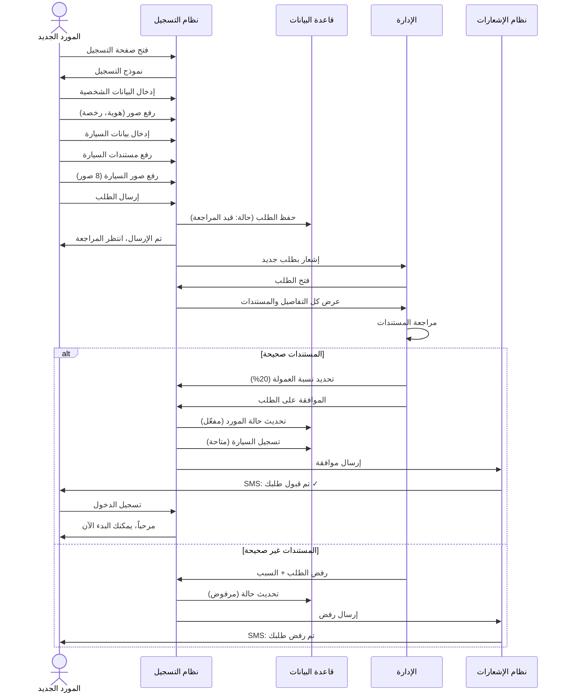

يبدأ التسلسل عندما يصل المورد المحتمل إلى صفحة التسجيل المخصصة للشركاء، مما يرسل طلباً لنظام التسجيل لعرض النموذج الأولي. يستجيب النظام بعرض شاشة ترحيبية توضح فوائد الانضمام والمتطلبات الأساسية، ثم يقدم النموذج الفعلي لإدخال البيانات.

يبدأ المورد بإدخال معلوماته الشخصية في الحقول المخصصة، بما في ذلك الاسم ورقم الهوية ورقم الجوال والبريد الإلكتروني ونوع الشراكة المفضل. بعد إكمال هذا القسم، يرسل النظام طلباً لقاعدة البيانات للتحقق من عدم وجود تسجيلات سابقة بنفس رقم الهوية أو رقم الجوال.

تستعلم قاعدة البيانات عن السجلات الموجودة وترجع النتيجة إلى نظام التسجيل. إذا وجد تطابق، يعرض النظام رسالة تنبيه واضحة للمورد تخبره بأن المعلومات مستخدمة مسبقاً وتمنع المتابعة. إذا لم يوجد تطابق، يسمح النظام بالمتابعة إلى القسم التالي.

يدخل المورد معلوماته البنكية بما في ذلك اسم البنك ورقم الحساب ورمز الآيبان. يتحقق نظام التسجيل من صحة تنسيق الآيبان رياضياً قبل قبوله، ويعرض رسالة خطأ إذا كان التنسيق غير صحيح ويطلب التصحيح. بعد التحقق الناجح، ينتقل النموذج إلى قسم تفاصيل المركبة.

يدخل المورد جميع معلومات المركبة التفصيلية، ثم ينتقل إلى رفع المستندات المطلوبة. لكل مستند يرفعه المورد، يرسل نظام التسجيل الملف إلى نظام التخزين السحابي الذي يحفظه بشكل آمن ويرجع رابطاً للوصول إليه. يحفظ نظام التسجيل هذا الرابط مع بقية معلومات الطلب.

يصل المورد إلى مرحلة رفع صور المركبة الثمانية المطلوبة، وتتكرر عملية الرفع والحفظ لكل صورة. يتحقق النظام من جودة كل صورة ووضوحها قبل قبولها، وينبه المورد إذا كانت أي صورة غير مقبولة ويطلب إعادة التقاطها.

بعد إكمال جميع الأقسام بنجاح، يراجع المورد الملخص الشامل ويؤكد صحة المعلومات، ثم يضغط على زر إرسال للمراجعة. يرسل نظام التسجيل جميع البيانات إلى قاعدة البيانات لحفظها بحالة قيد المراجعة، وتؤكد قاعدة البيانات نجاح الحفظ وتولد رقماً مرجعياً فريداً للطلب.

يرسل نظام التسجيل طلباً لنظام الإشعارات لإبلاغ كل من المورد والإدارة بالطلب الجديد. يولد نظام الإشعارات رسالتين مختلفتين، الأولى للمورد تؤكد استلام طلبه وتزوده بالرقم المرجعي والتوقعات الزمنية، والثانية للإدارة تنبههم بوصول طلب شريك جديد يتطلب المراجعة. ترسل كلتا الرسالتين عبر القنوات المناسبة.

يفتح أحد أعضاء فريق المراجعة الطلب من خلال لوحة التحكم الإدارية، مما يرسل طلباً لنظام التسجيل لاسترجاع جميع التفاصيل. يستعلم نظام التسجيل عن البيانات من قاعدة البيانات ويسترجع روابط المستندات والصور من نظام التخزين، ثم يعرض كل شيء بشكل منظم وسهل المراجعة.

يفحص المراجع جميع المعلومات بعناية ويقيم مدى استيفاء الطلب للمعايير المطلوبة، ثم يتخذ قراراً إما بالموافقة أو الرفض. لنفترض في هذا السيناريو أن المراجع وافق على الطلب بعد التحقق من صحة جميع المعلومات ومناسبة المركبة للمعايير المطلوبة.

يدخل المراجع نسبة العمولة المحددة لهذا المورد، ثم يضغط على زر الموافقة. يرسل نظام التسجيل طلباً لقاعدة البيانات لتحديث حالة المورد إلى مقبول وتسجيل نسبة العمولة والموافق والتاريخ، وتؤكد قاعدة البيانات إتمام التحديث بنجاح. يرسل النظام طلباً آخر لقاعدة البيانات لتسجيل المركبة بحالة نشطة ومتاحة للربط بالحجوزات.

يرسل نظام التسجيل طلباً لنظام الإشعارات لإبلاغ المورد بالقبول. يولد نظام الإشعارات رسالة مبهجة تهنئ المورد على قبوله وتزوده ببيانات الدخول ونسبة العمولة المحددة وتعليمات البدء، وترسلها عبر جميع القنوات المتاحة. ينتهي التسلسل باستلام المورد الجديد للتأكيد وجاهزيته لبدء استقبال الحجوزات من خلال المنصة.

#### 7.4.3 حجز موظف فندق لعميل

يوضح المخطط التسلسلي لحجز موظف فندق نيابة عن عميل التفاعلات المميزة التي تحدث في سياق العملاء المؤسسيين، مع التركيز على كيفية تعامل النظام مع الحجز بالنيابة والدفع الآجل وإدارة الحدود الائتمانية.

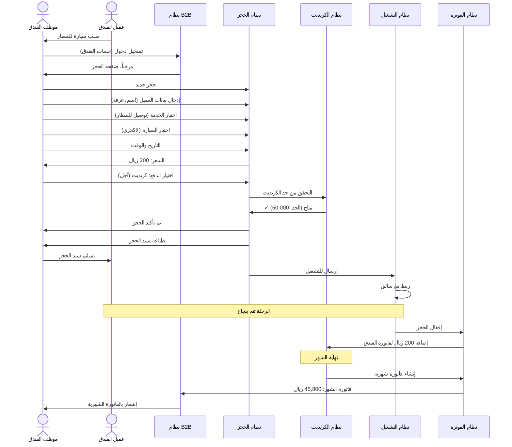

يبدأ التسلسل عندما يتواصل ضيف الفندق مع موظف الاستقبال أو الكونسيرج طالباً خدمة نقل إلى المطار أو وجهة أخرى. يسجل الموظف دخوله إلى نظام رحلتي VIP باستخدام حساب الفندق المؤسسي، مما يرسل طلب مصادقة إلى نظام إدارة الحسابات.

يتحقق نظام الحسابات من بيانات الاعتماد المقدمة ومن أن الحساب نشط ولديه الصلاحيات المناسبة للحجز نيابة عن الضيوف، ثم يصدر رمزاً مميزاً للجلسة ويسمح بالوصول إلى واجهة الحجز المؤسسية. تعرض هذه الواجهة المخصصة معلومات إضافية ذات صلة بالفنادق مثل الرصيد الائتماني المتاح وعدد الحجوزات النشطة والفواتير المعلقة.

يبدأ الموظف بإنشاء حجز جديد ويدخل معلومات العميل النهائي وهو ضيف الفندق، بما في ذلك الاسم الكامل ورقم الغرفة الذي سيستخدم لتحديد الموقع والاتصال عند الحاجة، ورقم الجوال للتواصل المباشر، ورقم الرحلة الجوية إذا كانت الوجهة مطاراً لتمكين تتبع حالة الرحلة والتنسيق الدقيق للتوقيت.

يختار الموظف نوع الخدمة المطلوب من القائمة المتاحة، ولنفترض في هذا السيناريو أنه اختار خدمة التوصيل إلى المطار. يدخل تفاصيل الرحلة بما في ذلك نقطة الانطلاق وهي الفندق والوجهة وهي مطار الملك عبدالعزيز الدولي، والتاريخ والوقت المطلوبين، ويختار فئة المركبة المناسبة وهي في هذا المثال سيارة فاخرة لاكجري تناسب مستوى الخدمة المتوقع.

يرسل نظام الحجز هذه المعلومات إلى نظام التسعير لحساب السعر النهائي. يستعلم نظام التسعير عن معدلات الأسعار من قاعدة البيانات، ويحسب المسافة باستخدام خرائط جوجل، ثم يطبق نسبة الخصم الخاصة بالفندق بناءً على الاتفاق المبرم معه. لنفترض أن السعر الأساسي كان مئتي ريال وأن الفندق يحصل على خصم عشرة بالمائة، فيصبح السعر النهائي مئة وثمانين ريالاً.

يعرض نظام الحجز السعر المحسوب للموظف مع التفصيل الكامل بما في ذلك السعر الأساسي ونسبة الخصم المطبقة والسعر النهائي. يوافق الموظف على السعر ويتابع إلى مرحلة اختيار طريقة الدفع، حيث يختار الدفع الآجل أو الكريديت الذي يمثل الطريقة المفضلة للعملاء المؤسسيين.

يرسل نظام الحجز طلباً إلى نظام إدارة الكريديت للتحقق من توفر الحد الائتماني الكافي لهذا الحجز. يستعلم نظام الكريديت عن تفاصيل حساب الفندق من قاعدة البيانات، بما في ذلك الحد الإجمالي الممنوح والمبلغ المستخدم حالياً والرصيد المتاح.

لنفترض أن الفندق لديه حد ائتماني إجمالي قدره خمسون ألف ريال، وقد استخدم منه حتى الآن عشرة آلاف ريال في حجوزات سابقة خلال الشهر الجاري، مما يترك رصيداً متاحاً قدره أربعون ألف ريال. بما أن الحجز الحالي بقيمة مئة وثمانين ريالاً فقط، فإنه يقع بوضوح ضمن الحد المتاح.

يرد نظام الكريديت إلى نظام الحجز بالموافقة على استخدام الكريديت لهذه المعاملة. يرسل نظام الحجز طلباً لقاعدة البيانات لتسجيل الحجز بجميع تفاصيله وطريقة الدفع الآجلة، ولزيادة المبلغ المستخدم من حد الكريديت بقيمة الحجز الجديد. تؤكد قاعدة البيانات إتمام جميع التحديثات بنجاح وتولد رقماً مرجعياً فريداً للحجز.

يرسل نظام الحجز طلباً لنظام الإشعارات لإرسال تأكيد للموظف يمكنه طباعته أو إرساله للضيف. يولد نظام الإشعارات سند حجز يتضمن الرقم المرجعي وتفاصيل الخدمة الكاملة ومعلومات الدفع، ويعرضه للموظف على الشاشة مع خيارات للطباعة أو الإرسال الإلكتروني.

يطبع الموظف نسخة من سند الحجز ويسلمها للضيف، مما يكمل تفاعله المباشر مع النظام. يرسل نظام الحجز الحجز الجديد إلى نظام التشغيل لإدراجه في قائمة الحجوزات الواردة التي تنتظر المراجعة الإدارية، تماماً كأي حجز آخر.

تجري العملية بعد ذلك كما في السيناريوهات السابقة، حيث يراجع المشرف الحجز ويوافق عليه، ثم يبحث نظام التشغيل عن سائق متاح ويربط الحجز به. يرسل نظام الإشعارات رسائل لكل من الضيف مباشرة على رقم جواله وللسائق بتفاصيل الترتيبات النهائية.

تتم الرحلة بنجاح وفق الخطة، وعند الإتمام يقفل الحجز مالياً بالطريقة المعتادة. الفرق الرئيسي هنا هو أن المبلغ لا يدفع فوراً بل يسجل في حساب الفندق كمستحق ضمن الفاتورة الشهرية.

في نهاية دورة الفوترة المتفق عليها، عادة نهاية كل شهر، يرسل نظام المحاسبة طلباً لقاعدة البيانات لاسترجاع جميع معاملات الفندق خلال الفترة. يستعلم عن جميع الحجوزات المكتملة والمقفلة التي تم إجراؤها بالكريديت، ويجمع المبالغ ويحسب الإجمالي.

يولد نظام المحاسبة فاتورة شهرية موحدة شاملة تتضمن جدولاً تفصيلياً لجميع المعاملات مع التواريخ والأرقام المرجعية وأسماء الضيوف والخدمات المقدمة والمبالغ، بالإضافة إلى المجموع الكلي المستحق. في هذا المثال، لنفترض أن الفاتورة الشهرية بلغت خمسة وأربعين ألفاً وثمانمئة ريال تشمل جميع حجوزات الشهر بما فيها هذا الحجز.

يرسل نظام المحاسبة الفاتورة إلى نظام الإشعارات الذي يرسلها للفندق عبر البريد الإلكتروني وأيضاً يتيحها للتنزيل من خلال حساب الفندق في النظام. يستلم القسم المالي في الفندق الفاتورة ويراجعها ويعالج الدفع وفق شروط الاتفاق، عادة خلال أسبوعين من تاريخ الإصدار.

بعد استلام الدفع وتأكيده، يرسل القسم المالي في رحلتي VIP طلباً لنظام الكريديت لإعادة تعيين العداد وتحرير الحد المستخدم ليصبح متاحاً مرة أخرى لحجوزات الشهر الجديد. ينتهي التسلسل بتحديث قاعدة البيانات وإرسال إشعار للفندق يؤكد استلام الدفع ويوضح الحد الائتماني المتاح للدورة القادمة.

### 7.5 حالات الاستخدام

#### 7.5.1 مخطط حالات الاستخدام العام

يوفر مخطط حالات الاستخدام العام رؤية شاملة لجميع الوظائف الرئيسية التي يقدمها نظام رحلتي VIP، مجمعة حسب الفئات المستخدمة لها، مع توضيح العلاقات بين الحالات المختلفة والجهات الفاعلة التي تتفاعل معها.

يتفاعل مع النظام أربع فئات رئيسية من الجهات الفاعلة، كل منها لها مجموعة محددة من حالات الاستخدام التي تعكس احتياجاتها وأدوارها. تمثل الفئة الأولى العميل المباشر أو الفرد الذي يحجز لنفسه، وترتبط هذه الفئة بتسع حالات استخدام أساسية تغطي دورة حياة تفاعله الكاملة مع المنصة.

تبدأ حالات استخدام العميل المباشر بتسجيل حساب جديد الذي يتيح للعميل إنشاء ملف شخصي دائم يحفظ معلوماته وتفضيلاته. توفر حالة الحجز كضيف بديلاً أسرع للعملاء الذين يفضلون عدم إنشاء حساب والحصول على خدمة فورية لمرة واحدة. تشكل حالة اختيار نوع الخدمة نقطة قرار حاسمة حيث يحدد العميل طبيعة الخدمة المطلوبة من بين الخيارات المتاحة.

تتيح حالة اختيار نوع السيارة للعميل تحديد فئة المركبة التي تناسب احتياجاته وميزانيته، بينما توفر حالة إدخال بيانات الحجز الحقول الضرورية لإدخال التفاصيل التي تمكن من تنفيذ الخدمة بنجاح. تعرض حالة عرض السعر التكلفة المحسوبة بشفافية كاملة قبل الالتزام، مما يمنح العميل القدرة على اتخاذ قرار مستنير.

تدير حالة الدفع عملية إتمام المعاملة المالية بطرق متعددة تناسب تفضيلات مختلفة، بينما تتيح حالة إضافة حجوزات متعددة للعملاء الذين يخططون لرحلات متعددة إدارتها من مكان واحد. أخيراً، توفر حالة عرض الحجوزات السابقة للعملاء المسجلين إمكانية الوصول إلى سجلهم الكامل للمراجعة أو إعادة الحجز بسهولة.

تمثل الفئة الثانية موظفي الشركات والفنادق الذين يحجزون نيابة عن عملائهم أو ضيوفهم، وترتبط بأربع حالات استخدام متخصصة. تبدأ بحالة طلب حساب شركة التي تتيح للمؤسسات التقدم للحصول على حساب مؤسسي بميزات خاصة. تمكن حالة الحجز باسم العملاء الموظفين من إنشاء حجوزات لصالح أطراف ثالثة مع ربطها بحساب المؤسسة.

توفر حالة طلب كريديت آلية للشركات المعتمدة للحصول على حد ائتماني يسمح بالدفع الآجل، بينما تتيح حالة عرض الفواتير الشهرية للمؤسسات مراجعة تفاصيل استخدامها الشهري وتخطيط مدفوعاتها.

تتفاعل الفئة الثالثة وهي الموردون والسائقون الشركاء مع سبع حالات استخدام تغطي دورة حياة شراكتهم. تبدأ بحالة التسجيل كمورد التي تتيح لمالكي المركبات الانضمام إلى الشبكة، وتتبعها حالة إرفاق المستندات التي تجمع الإثباتات الضرورية للتحقق والموافقة.

تتيح حالة تسجيل سيارة جديدة للموردين إضافة مركبات إضافية إلى ملفهم بعد الموافقة الأولية، بينما توفر حالة استلام إشعارات الحجز آلية فورية لإبلاغ الموردين بالحجوزات المتاحة التي تطابق مواصفات مركباتهم. تمكن حالة تأكيد أو رفض الحجز الموردين من ممارسة السيطرة على جداولهم من خلال قبول أو رفض المهام المعروضة.

توفر حالة عرض كشف الحساب شفافية كاملة حول المعاملات المالية والمستحقات، بينما تمكن حالة متابعة المستحقات الموردين من تتبع حالة دفعاتهم المنتظرة والمكتملة.

تتعامل الفئة الرابعة وهي الإدارة مع سبع حالات استخدام قوية تمنحها السيطرة الكاملة على العمليات. تبدأ بحالة إدارة المستخدمين التي تتيح إضافة وتعديل وحذف حسابات المستخدمين من جميع الفئات، وتتبعها حالة إدارة السيارات التي توفر رؤية شاملة وتحكماً في جميع المركبات المسجلة.

تمكن حالة إدارة الأسعار الإدارة من تحديث معدلات الأسعار حسب الفئات والمناطق والخدمات، بينما توفر حالة عرض التقارير وصولاً إلى تحليلات شاملة عن جميع جوانب العمليات. تتيح حالة إدارة الصلاحيات تخصيص مستويات الوصول لكل مستخدم إداري حسب دوره ومسؤولياته.

توفر حالة تخصيص الهوية البصرية أدوات لتعديل شعار الشركة وألوانها وعناصر العلامة التجارية الأخرى، بينما تمكن حالة إدارة اللغات الإدارة من إضافة أو تعديل الترجمات لدعم لغات إضافية مستقبلاً.

تربط عدة علاقات بين حالات الاستخدام المختلفة توضح التبعيات والتضمينات. على سبيل المثال، تتضمن حالة الدفع دائماً حالة عرض السعر كخطوة سابقة ضرورية، بينما تتضمن حالة إضافة حجوزات متعددة تكرار حالات اختيار نوع الخدمة واختيار نوع السيارة. تشبه حالة الحجز باسم العملاء للشركات بشكل كبير حالة اختيار نوع الخدمة للعملاء الأفراد من حيث الوظيفة الأساسية.

تتطلب حالة ربط حجز مع سائق إتمام حالة فلترة الحجوزات أولاً لتحديد الخيارات المتاحة، وتتبعها دائماً حالة إرسال الإشعارات لإبلاغ الأطراف المعنية. تتطلب حالة الإقفال النهائي إتمام حالة متابعة التنفيذ أولاً للتأكد من اكتمال الخدمة الفعلية.

يوفر هذا المخطط الشامل فهماً واضحاً لنطاق النظام الكامل والوظائف المتاحة لكل فئة من المستخدمين، مما يساعد على ضمان تغطية جميع المتطلبات الوظيفية وعدم إغفال أي حاجة مهمة.

#### 7.5.2 حالات الاستخدام التفصيلية

تقدم حالات الاستخدام التفصيلية وصفاً نصياً شاملاً لكل حالة مهمة، متضمنة الممثلين المعنيين والشروط المسبقة والتدفق الأساسي والتدفقات البديلة والاستثناءات والشروط اللاحقة، مما يوفر فهماً عميقاً لكيفية تفاعل المستخدمين مع النظام في سيناريوهات مختلفة.

**حالة الاستخدام 1: تسجيل حساب جديد (عميل مباشر)**

**المعرف:** UC-C-001  
**الاسم:** تسجيل حساب جديد  
**الممثل الرئيسي:** عميل مباشر جديد  
**مستوى:** هدف المستخدم  
**الأولوية:** عالية

**الشروط المسبقة:**
- يمتلك العميل جهازاً ذكياً أو حاسوباً متصلاً بالإنترنت
- لم يسجل العميل مسبقاً بنفس رقم الجوال

**الشروط اللاحقة عند النجاح:**
- تم إنشاء حساب نشط للعميل في النظام
- تم التحقق من رقم جوال العميل
- يمكن للعميل تسجيل الدخول واستخدام جميع ميزات الحساب المسجل

**التدفق الأساسي:**
1. يفتح العميل التطبيق أو الموقع الإلكتروني
2. يختار العميل خيار "إنشاء حساب جديد"
3. يعرض النظام نموذج التسجيل
4. يدخل العميل الاسم الكامل (عربي أو إنجليزي)
5. يدخل العميل رقم الجوال (بتنسيق سعودي صحيح)
6. يدخل العميل عنوان بريد إلكتروني اختياري
7. يدخل العميل كلمة مرور تلبي معايير القوة المحددة
8. يؤكد العميل كلمة المرور بإعادة إدخالها
9. يوافق العميل على الشروط والأحكام
10. يضغط العميل على زر "تسجيل"
11. يتحقق النظام من عدم استخدام رقم الجوال مسبقاً
12. يحفظ النظام بيانات العميل بحالة "غير محقق"
13. يولد النظام رمز تحقق مكون من ستة أرقام
14. يرسل النظام الرمز عبر رسالة نصية قصيرة إلى رقم الجوال
15. يعرض النظام شاشة إدخال رمز التحقق
16. يدخل العميل الرمز المستلم
17. يتحقق النظام من صحة الرمز
18. يحدث النظام حالة الحساب إلى "نشط ومحقق"
19. يصدر النظام رمزاً مميزاً للجلسة ويسجل دخول العميل تلقائياً
20. يعرض النظام رسالة ترحيب ويوجه العميل للصفحة الرئيسية

**التدفقات البديلة:**

*3أ. العميل يختار التسجيل عبر حساب جوجل أو أبل:*
- 3أ1. يختار العميل خيار "تسجيل بواسطة جوجل/أبل"
- 3أ2. يوجه النظام العميل لصفحة مصادقة الطرف الثالث
- 3أ3. يوافق العميل على مشاركة معلوماته الأساسية
- 3أ4. يستلم النظام المعلومات من الطرف الثالث
- 3أ5. يتابع التدفق من الخطوة 11

*11أ. رقم الجوال مستخدم مسبقاً:*
- 11أ1. يعرض النظام رسالة "رقم الجوال مسجل مسبقاً"
- 11أ2. يقترح النظام تسجيل الدخول أو استرجاع كلمة المرور
- 11أ3. ينتهي التدفق

*16أ. الرمز المدخل غير صحيح:*
- 16أ1. يعرض النظام رسالة خطأ
- 16أ2. يسمح بمحاولتين إضافيتين
- 16أ3. إذا فشلت جميع المحاولات، يعود لإرسال رمز جديد

*16ب. انتهت صلاحية الرمز (أكثر من 5 دقائق):*
- 16ب1. يعرض النظام رسالة انتهاء الصلاحية
- 16ب2. يوفر خيار "إرسال رمز جديد"
- 16ب3. يتابع من الخطوة 13

**الاستثناءات:**

*في أي وقت. انقطاع الاتصال بالإنترنت:*
- يعرض النظام رسالة خطأ واضحة
- يحفظ البيانات المدخلة مؤقتاً إن أمكن
- يطلب من العميل المحاولة مرة أخرى عند عودة الاتصال

*الخطوة 14. فشل إرسال الرسالة النصية:*
- يحاول النظام الإرسال مرة أخرى بعد 30 ثانية
- إذا فشل مرتين، يقترح إرسال الرمز عبر مكالمة صوتية
- يسجل الخطأ للمراجعة الفنية

**القواعد التجارية:**
- BR001: يجب أن تحتوي كلمة المرور على 8 أحرف على الأقل بما في ذلك حرف كبير وحرف صغير ورقم
- BR002: رمز التحقق صالح لمدة 5 دقائق فقط
- BR003: لا يسمح بأكثر من 3 محاولات خاطئة لإدخال رمز التحقق
- BR004: كل رقم جوال يمكن ربطه بحساب واحد فقط

**المتطلبات الخاصة:**
- NFR001: يجب أن تكتمل عملية التسجيل بأكملها في أقل من دقيقتين في ظروف الشبكة العادية
- NFR002: يجب تشفير كلمة المرور باستخدام خوارزمية Bcrypt قبل الحفظ
- NFR003: يجب أن تكون جميع الحقول والرسائل متاحة باللغتين العربية والإنجليزية

**ملاحظات:**
- يجب أن تكون واجهة التسجيل بسيطة وخالية من التعقيدات لتشجيع التسجيل
- يمكن إضافة معلومات اختيارية إضافية لاحقاً من خلال الملف الشخصي
- يتم حفظ تاريخ ووقت التسجيل لأغراض التحليل والدعم

---

**حالة الاستخدام 2: إنشاء حجز جديد (عميل مباشر)**

**المعرف:** UC-C-002  
**الاسم:** إنشاء حجز جديد  
**الممثل الرئيسي:** عميل مباشر (مسجل أو ضيف)  
**مستوى:** هدف المستخدم  
**الأولوية:** حرجة

**الشروط المسبقة:**
- العميل قام بتسجيل الدخول أو اختار المتابعة كضيف
- توجد خدمات متاحة في المنطقة المطلوبة
- توجد مركبات متاحة من الفئة المطلوبة
---

## 8. تصميم معمارية النظام (System Architecture Design)

يمثل تصميم المعمارية حجر الأساس الذي يحدد كيفية تنظيم مكونات النظام وتفاعلها لتحقيق الأهداف المطلوبة. تم تصميم معمارية نظام رحلتي VIP وفق أفضل الممارسات الصناعية لضمان تحقيق أعلى مستويات الأداء والأمان والقابلية للتوسع والصيانة. تعتمد المعمارية على مبادئ هندسية مجربة تضمن فصل الاهتمامات وتعزيز إعادة الاستخدام وتسهيل التطوير المستقبلي.

### 8.1 المعمارية الكلية (Overall Architecture)

تتبع معمارية النظام نمط العميل-الخادم متعدد الطبقات، مع توزيع واضح للمسؤوليات بين المكونات المختلفة. تم تصميم هذه المعمارية لتحقيق التوازن الأمثل بين البساطة في التطوير والمرونة في التشغيل والقدرة على التوسع المستقبلي.

تتكون المعمارية من أربع طبقات رئيسية تعمل بشكل متناسق ومتكامل. تشكل كل طبقة وحدة مستقلة نسبياً يمكن تطويرها واختبارها وصيانتها بشكل منفصل، مما يسهل عملية التطوير ويقلل من التعقيد الكلي للنظام.

الطبقة الأولى تمثل طبقة العرض التي يتفاعل معها المستخدمون مباشرة. تضم هذه الطبقة ثلاثة تطبيقات رئيسية مصممة لخدمة احتياجات مختلفة. تطبيق الموبايل المطور بتقنية React Native يوفر تجربة أصلية سلسة على أجهزة iOS وAndroid، مع الاستفادة من قاعدة كود موحدة تقلل من تكاليف التطوير والصيانة. الموقع الإلكتروني المطور بتقنية React يوفر واجهة ويب قوية للعملاء الذين يفضلون استخدام الحواسيب الشخصية، مع تصميم متجاوب يتكيف مع أحجام الشاشات المختلفة. لوحة التحكم الإدارية المطورة أيضاً بتقنية React توفر واجهة شاملة لفريق الإدارة مع أدوات متقدمة لإدارة جميع جوانب النظام.

الطبقة الثانية هي طبقة البوابة التي تعمل كنقطة دخول موحدة لجميع الطلبات القادمة من طبقة العرض. تتولى هذه الطبقة مسؤوليات حيوية تشمل توزيع الأحمال عبر خوادم التطبيق المتعددة، والتحقق من صحة الرموز المميزة للمصادقة، وتطبيق قواعد الأمان الأولية، وتوجيه الطلبات إلى الخدمات المناسبة. استخدام بوابة موحدة يوفر نقطة تحكم مركزية تسهل تطبيق السياسات الأمنية ومراقبة حركة البيانات وتحسين الأداء من خلال التخزين المؤقت للاستجابات المتكررة.

الطبقة الثالثة تمثل طبقة الخدمات التي تحتوي على منطق الأعمال والعمليات الأساسية للنظام. تم تقسيم هذه الطبقة إلى خدمات متعددة منفصلة، كل منها مسؤول عن مجال وظيفي محدد. خدمة الحجز تتولى جميع العمليات المتعلقة بإنشاء الحجوزات وإدارتها، بينما تركز خدمة الدفع على معالجة المعاملات المالية والتكامل مع بوابات الدفع الخارجية. خدمة التشغيل تدير عمليات ربط الحجوزات بالسائقين ومتابعة تنفيذ الرحلات، فيما تتولى خدمة المحاسبة حساب العمولات وإصدار الفواتير. هذا الفصل بين الخدمات يتيح تطوير وتحديث كل خدمة بشكل مستقل دون التأثير على الخدمات الأخرى.

الطبقة الرابعة هي طبقة البيانات التي توفر آليات تخزين واسترجاع المعلومات. تتكون من قاعدة البيانات الرئيسية PostgreSQL التي تحفظ جميع البيانات الدائمة والهامة، ونظام التخزين المؤقت Redis الذي يحسن الأداء من خلال الاحتفاظ بالبيانات المستخدمة بكثرة في الذاكرة، ونظام تخزين الملفات AWS S3 الذي يحفظ الصور والمستندات والفواتير بشكل آمن وقابل للتوسع.

تعمل هذه الطبقات معاً من خلال واجهات برمجية محددة بوضوح تستخدم بروتوكولات قياسية مثل REST وJSON. يتواصل كل مكون مع المكونات الأخرى من خلال هذه الواجهات فقط، دون الحاجة لمعرفة التفاصيل الداخلية لتلك المكونات. هذا الفصل الواضح بين الواجهات والتنفيذ يوفر مرونة كبيرة في تطوير وتحديث المكونات المختلفة.

### 8.2 معمارية الطبقات (Layered Architecture)

تعتمد المعمارية الداخلية لكل خدمة على نمط الطبقات المتعددة، حيث يتم تقسيم كل خدمة إلى ثلاث طبقات فرعية متميزة تعمل بشكل متدرج ومنظم.

#### 8.2.1 طبقة العرض (Presentation Layer)

تمثل طبقة العرض الواجهة الخارجية للخدمة، وهي المسؤولة عن استقبال الطلبات من العملاء ومعالجتها وإرجاع الاستجابات المناسبة. تركز هذه الطبقة على جوانب الاتصال والتحويل بين تنسيقات البيانات المختلفة، دون الانشغال بتفاصيل منطق الأعمال.

تستقبل المتحكمات في هذه الطبقة الطلبات القادمة عبر بروتوكول HTTP وتقوم بتحليلها للتحقق من صحة البيانات الواردة. يتم التحقق من وجود جميع الحقول المطلوبة وصحة تنسيقاتها وتوافقها مع القيود المحددة. عند اكتشاف أي أخطاء في البيانات الواردة، تقوم الطبقة بإرجاع استجابة خطأ واضحة تحدد المشكلة بدقة، مما يساعد العميل على تصحيح طلبه.

بعد التحقق من صحة البيانات، تقوم المتحكمات بتمرير الطلب إلى طبقة منطق الأعمال للمعالجة الفعلية. تنتظر الطبقة استلام النتيجة من طبقة منطق الأعمال، ثم تقوم بتحويلها إلى تنسيق JSON المناسب لإرساله للعميل. يتم تضمين رموز الحالة المناسبة في الاستجابات، مثل 200 للنجاح، و201 للإنشاء الناجح، و400 لأخطاء البيانات، و401 لمشاكل المصادقة، و500 لأخطاء الخادم.

تتولى هذه الطبقة أيضاً مسؤولية المصادقة الأولية من خلال التحقق من صحة الرموز المميزة المرفقة مع الطلبات. عند استلام أي طلب، تستخرج الطبقة الرمز المميز من الترويسة المخصصة وتتحقق من صحته وصلاحيته. إذا كان الرمز غير صحيح أو منتهي الصلاحية، يتم رفض الطلب فوراً دون المتابعة لطبقات أعمق. هذا الفحص المبكر يحمي موارد النظام من الطلبات غير المصرح بها.

#### 8.2.2 طبقة منطق الأعمال (Business Logic Layer)

تحتوي طبقة منطق الأعمال على جوهر وظائف الخدمة وقواعد العمل التي تحكم سلوكها. تركز هذه الطبقة على تنفيذ المنطق الخاص بالمجال دون الانشغال بتفاصيل العرض أو الوصول للبيانات.

تتكون هذه الطبقة من مجموعة من الفئات والوحدات المنظمة التي تمثل الكيانات الأساسية في المجال وتنفذ العمليات المطلوبة عليها. كل كيان يحتوي على البيانات المرتبطة به والسلوكيات التي يمكنه تنفيذها. على سبيل المثال، يحتوي كيان الحجز على معلومات مثل رقم الحجز وتاريخه وحالته، ويوفر وظائف مثل حساب السعر الإجمالي أو التحقق من إمكانية الإلغاء.

تطبق هذه الطبقة جميع قواعد الأعمال المعقدة التي تحكم عمليات النظام. عند معالجة طلب حجز جديد، تتحقق الطبقة من توفر السيارة المطلوبة في التاريخ والوقت المحددين، وتحسب السعر بناءً على عوامل متعددة مثل المسافة ونوع الخدمة والخصومات المطبقة، وتتأكد من عدم تعارض الحجز مع حجوزات أخرى. تنفذ هذه القواعد بشكل متسق بغض النظر عن مصدر الطلب أو طريقة الوصول.

تستخدم هذه الطبقة نمط الخدمات لتنظيم منطق الأعمال في وحدات منطقية. كل خدمة تركز على مجموعة محددة من العمليات المترابطة. خدمة الحجز تتولى جميع العمليات المتعلقة بدورة حياة الحجز من الإنشاء إلى الإلغاء، بينما تركز خدمة التسعير على حساب الأسعار بناءً على القواعد المعقدة. هذا التقسيم يسهل فهم الكود وصيانته ويقلل من التعقيد.

تتعامل الطبقة مع المعاملات بشكل صحيح لضمان تناسق البيانات. عند تنفيذ عملية تتطلب تحديث عدة جداول في قاعدة البيانات، تضمن الطبقة أن جميع التحديثات تتم بنجاح أو لا تتم أبداً. على سبيل المثال، عند تأكيد حجز، يجب تحديث حالة الحجز وخصم المبلغ من حد الائتمان للشركة وحجز وقت السائق. إذا فشلت أي من هذه العمليات، يتم التراجع عن جميع التغييرات لتجنب حالة غير متسقة.

#### 8.2.3 طبقة الوصول للبيانات (Data Access Layer)

تعزل طبقة الوصول للبيانات تفاصيل التفاعل مع قاعدة البيانات عن بقية الطبقات. توفر هذه الطبقة واجهة نظيفة ومبسطة لعمليات القراءة والكتابة، مما يسمح لطبقة منطق الأعمال بالتركيز على المنطق دون القلق بشأن تفاصيل SQL أو بنية الجداول.

تستخدم هذه الطبقة نمط المستودع الذي يوفر مجموعة من العمليات القياسية للتعامل مع كل كيان. يوفر مستودع الحجوزات وظائف مثل إنشاء حجز جديد، والبحث عن حجز بالرقم، واسترجاع جميع حجوزات عميل معين، وتحديث حالة حجز، وحذف حجز. تخفي هذه الواجهة البسيطة التعقيد الكامن في استعلامات SQL ومعالجة الأخطاء وتحويل البيانات.

تعتمد الطبقة على أداة تعيين علائقي كائني ORM توفر طبقة تجريد بين الكود والقاعدة. في بيئة Node.js، يمكن استخدام Sequelize أو TypeORM التي توفر واجهة برمجية نظيفة للتفاعل مع PostgreSQL. تسمح هذه الأدوات بتعريف نماذج البيانات ككائنات JavaScript والتعامل معها بشكل طبيعي دون كتابة SQL يدوياً. تتولى الأداة توليد استعلامات SQL المحسنة تلقائياً وتعيين النتائج إلى كائنات.

تطبق هذه الطبقة تحسينات الأداء مثل التحميل المسبق للعلاقات عند الحاجة، والتخزين المؤقت للاستعلامات المتكررة، واستخدام الفهارس بشكل فعال. عند استرجاع حجز مع تفاصيل العميل والسيارة، تستخدم الطبقة استعلامات ربط فعالة بدلاً من استعلامات متعددة، مما يقلل من عدد الرحلات إلى قاعدة البيانات ويحسن وقت الاستجابة.

### 8.3 معمارية الخدمات (Service-Oriented Architecture)

تتبنى معمارية النظام نهج الخدمات الموجهة الذي يقسم الوظائف إلى خدمات مستقلة تتواصل عبر واجهات محددة. يوفر هذا النهج مرونة كبيرة في التطوير والنشر والصيانة.

تم تصميم كل خدمة لتكون مستقلة ذاتياً قدر الإمكان، مع قاعدة كود منفصلة وإمكانية النشر المستقل. خدمة الحجز مثلاً يمكن تطويرها وتحديثها ونشرها دون التأثير على خدمة الدفع أو التشغيل. هذه الاستقلالية تتيح للفرق المختلفة العمل بشكل متوازٍ على خدمات مختلفة، مما يسرع عملية التطوير الكلية.

تتواصل الخدمات فيما بينها عبر واجهات REST API محددة بوضوح. عندما تحتاج خدمة الحجز لمعالجة دفعة، تستدعي واجهة برمجية في خدمة الدفع وتنتظر النتيجة. تستخدم جميع الاستدعاءات بروتوكول HTTP وتنسيق JSON، مما يضمن التوافق والوضوح. كل واجهة برمجية موثقة بشكل تفصيلي يوضح المعاملات المتوقعة والاستجابات المحتملة ورموز الأخطاء.

لضمان موثوقية الاتصال بين الخدمات، يطبق النظام آليات معالجة الأخطاء وإعادة المحاولة. عند فشل استدعاء لخدمة معينة بسبب مشكلة مؤقتة في الشبكة، تعيد الخدمة الطالبة المحاولة تلقائياً بعد فترة انتظار قصيرة. يتم تطبيق حد أقصى لعدد المحاولات لتجنب الحلقات اللانهائية. إذا استمر الفشل بعد جميع المحاولات، يتم تسجيل الخطأ وإعلام المشرفين للتدخل.

تستخدم بعض العمليات نمط الطوابير للاتصال غير المتزامن بين الخدمات. عند إتمام حجز، بدلاً من إرسال الإشعارات بشكل متزامن، تضع خدمة الحجز رسالة في طابور مخصص. تستلم خدمة الإشعارات هذه الرسالة وتعالجها بشكل مستقل. هذا النهج يمنع تأخر الاستجابة للعميل في حال كانت خدمة الإشعارات بطيئة أو متعطلة مؤقتاً.

### 8.4 الاتصال بين المكونات (Component Communication)

يعتمد التواصل بين مكونات النظام المختلفة على بروتوكولات ومعايير واضحة تضمن التفاهم المتبادل والتشغيل السلس.

تستخدم طبقة العرض بروتوكول HTTPS لجميع الاتصالات مع البوابة. يضمن التشفير الكامل للاتصالات حماية البيانات الحساسة مثل معلومات المصادقة وتفاصيل الدفع من الاعتراض أثناء النقل. تطبق الشهادات الرقمية الصادرة عن جهات موثوقة لضمان صحة هوية الخادم ومنع هجمات الوسيط.

تتبع جميع واجهات REST API معايير تصميم موحدة تجعلها متوقعة وسهلة الاستخدام. تستخدم الأفعال HTTP القياسية بشكل صحيح، حيث يستخدم GET لاسترجاع البيانات، وPOST لإنشاء موارد جديدة، وPUT أو PATCH لتحديث موارد موجودة، وDELETE لحذف موارد. تتبع عناوين URL بنية منطقية هرمية تعكس العلاقات بين الموارد، مثل bookings/:id لحجز محدد وbookings/:id/items لعناصر الحجز.

تستخدم الواجهات البرمجية رموز حالة HTTP بشكل دقيق لتوصيل نتيجة كل طلب. النجاح يُعبر عنه بالرمز 200 للعمليات العادية أو 201 عند إنشاء مورد جديد. أخطاء العميل تُعبر عنها برموز 4xx مثل 400 للبيانات غير الصحيحة، و401 لمشاكل المصادقة، و403 لنقص الصلاحيات، و404 لموارد غير موجودة. أخطاء الخادم تُعبر عنها برموز 5xx مثل 500 للأخطاء العامة و503 عندما تكون الخدمة غير متاحة مؤقتاً.

تستخدم جميع الاستجابات تنسيق JSON المنظم الذي يسهل معالجته من قبل العملاء. تتبع بنية الاستجابة نمطاً موحداً يتضمن حقول data للبيانات الفعلية، وmessage لرسالة توضيحية، وerrors لتفاصيل الأخطاء إن وجدت، وmeta لمعلومات إضافية مثل الترقيم. هذا التوحيد يبسط معالجة الاستجابات من جانب العميل.

تطبق البوابة آلية توزيع الأحمال بين خوادم التطبيق المتعددة لضمان الاستفادة المثلى من الموارد المتاحة وتجنب اكتظاظ خادم واحد. تستخدم خوارزمية Round Robin البسيطة التي توزع الطلبات بالتساوي على الخوادم المتاحة، مع مراقبة مستمرة لصحة كل خادم لتجنب إرسال طلبات إلى خوادم معطلة أو بطيئة.

### 8.5 خريطة النظام الكاملة (Complete System Map)

```mermaid
graph TB
    subgraph Users["المستخدمون النهائيون"]
        Customer[العملاء الأفراد<br/>B2C]
        Corporate[الشركات والفنادق<br/>B2B]
        Partner[الموردون والسائقون<br/>Partners]
        Admin[المشرفون<br/>Admin Users]
    end
    
    subgraph Frontend["الواجهات الأمامية - Frontend Layer"]
        WebSite[الموقع الإلكتروني<br/>Next.js 13+ with SSR/SSG<br/>React 18 + TypeScript]
        MobileApp[تطبيق الجوال<br/>React Native 0.72+<br/>iOS & Android]
        AdminPanel[لوحة التحكم الإدارية<br/>React 18 + TypeScript<br/>Redux Toolkit + React Query]
    end
    
    subgraph CDN["شبكة توصيل المحتوى"]
        Cloudflare[Cloudflare CDN<br/>تسريع الصور والملفات الثابتة<br/>DDoS Protection]
    end
    
    subgraph LoadBalancer["موازن الأحمال"]
        Nginx[Nginx Load Balancer<br/>SSL Termination<br/>توزيع الطلبات]
    end
    
    subgraph Backend["طبقة الخادم - Backend API Layer"]
        API[API Server<br/>Node.js 20 LTS + Express.js<br/>TypeScript]
        Auth[نظام المصادقة والترخيص<br/>JWT + Refresh Tokens<br/>Bcrypt Password Hashing<br/>RBAC Permissions]
        BookingSys[نظام الحجز<br/>منطق الحجوزات المتعددة<br/>حساب الأسعار التلقائي<br/>إدارة السلة]
        PaymentSys[نظام الدفع<br/>تكامل بوابات الدفع<br/>معالجة المعاملات<br/>إدارة الكريديت]
        OperationSys[نظام التشغيل<br/>ربط الحجوزات بالسائقين<br/>إدارة دورة الحجز<br/>الإقفال المحاسبي]
        NotifSys[نظام الإشعارات<br/>إدارة قوائم الانتظار<br/>إرسال متعدد القنوات]
        ReportSys[نظام التقارير<br/>تحليلات البيانات<br/>توليد PDF<br/>تصدير Excel]
    end
    
    subgraph MessageQueue["نظام قوائم الانتظار"]
        RabbitMQ[RabbitMQ / Bull<br/>مهام غير متزامنة<br/>معالجة الإشعارات<br/>توليد التقارير]
    end
    
    subgraph Cache["طبقة التخزين المؤقت"]
        Redis[Redis 7+ Cluster<br/>Session Storage<br/>API Response Cache<br/>Rate Limiting Data]
    end
    
    subgraph Database["طبقة قاعدة البيانات"]
        PostgreSQL[(PostgreSQL 14+<br/>Primary Database<br/>ACID Transactions<br/>Advanced Indexing)]
        Replica[(PostgreSQL Replica<br/>Read Operations<br/>Backup & Recovery)]
    end
    
    subgraph Storage["التخزين السحابي"]
        S3[AWS S3 / Minio<br/>صور السيارات<br/>المستندات<br/>الفواتير PDF]
    end
    
    subgraph External["الخدمات الخارجية - Third-Party Services"]
        GoogleMaps[Google Maps API<br/>حساب المسافات<br/>Geocoding<br/>عرض الخرائط]
        PaymentGW[Moyasar / Hyperpay<br/>بوابة الدفع الإلكتروني<br/>مدى وفيزا<br/>PCI DSS Compliant]
        SMS[Twilio / Unifonic<br/>إرسال رسائل SMS<br/>OTP Verification]
        WhatsApp[WhatsApp Business API<br/>رسائل واتساب<br/>إشعارات العملاء]
        FCM[Firebase Cloud Messaging<br/>Push Notifications<br/>للتطبيق الجوال]
    end
    
    subgraph Monitoring["المراقبة والتسجيل"]
        Grafana[Grafana + Prometheus<br/>مراقبة الأداء<br/>Metrics & Alerts]
        ELK[ELK Stack<br/>Elasticsearch + Logstash + Kibana<br/>تسجيل مركزي للأحداث]
    end
    
    %% علاقات المستخدمين بالواجهات
    Customer --> MobileApp
    Customer --> WebSite
    Corporate --> WebSite
    Corporate --> AdminPanel
    Partner --> MobileApp
    Admin --> AdminPanel
    
    %% علاقات الواجهات بـ CDN والـ Load Balancer
    WebSite --> Cloudflare
    MobileApp --> Cloudflare
    AdminPanel --> Cloudflare
    
    Cloudflare --> Nginx
    Nginx --> API
    
    %% علاقات API بالأنظمة الداخلية
    API --> Auth
    API --> BookingSys
    API --> PaymentSys
    API --> OperationSys
    API --> NotifSys
    API --> ReportSys
    
    %% علاقات الأنظمة الداخلية بقاعدة البيانات
    Auth --> PostgreSQL
    BookingSys --> PostgreSQL
    PaymentSys --> PostgreSQL
    OperationSys --> PostgreSQL
    ReportSys --> PostgreSQL
    
    %% النسخ المتماثل لقاعدة البيانات
    PostgreSQL -.->|Streaming Replication<br/>نسخ تلقائي| Replica
    Replica -.->|Read Queries| API
    
    %% علاقات API بالـ Cache
    API --> Redis
    Auth --> Redis
    BookingSys --> Redis
    
    %% علاقات نظام الإشعارات بقوائم الانتظار
    NotifSys --> RabbitMQ
    ReportSys --> RabbitMQ
    
    %% علاقات قوائم الانتظار بالخدمات الخارجية
    RabbitMQ --> SMS
    RabbitMQ --> WhatsApp
    RabbitMQ --> FCM
    
    %% علاقات الأنظمة بالتخزين السحابي
    BookingSys --> S3
    OperationSys --> S3
    ReportSys --> S3
    
    %% علاقات الأنظمة بالخدمات الخارجية
    BookingSys --> GoogleMaps
    PaymentSys --> PaymentGW
    
    %% علاقات المراقبة
    API --> Grafana
    PostgreSQL --> Grafana
    Redis --> Grafana
    RabbitMQ --> Grafana
    
    API --> ELK
    PostgreSQL --> ELK
    
    %% تنسيق الألوان
    style Users fill:#E8F5E9,stroke:#4CAF50,stroke-width:3px
    style Frontend fill:#E3F2FD,stroke:#2196F3,stroke-width:3px
    style Backend fill:#FFF3E0,stroke:#FF9800,stroke-width:3px
    style Database fill:#F3E5F5,stroke:#9C27B0,stroke-width:3px
    style External fill:#FCE4EC,stroke:#E91E63,stroke-width:3px
    style CDN fill:#E0F7FA,stroke:#00BCD4,stroke-width:2px
    style LoadBalancer fill:#FFF9C4,stroke:#FBC02D,stroke-width:2px
    style Cache fill:#FFE0B2,stroke:#FF9800,stroke-width:2px
    style Storage fill:#D1C4E9,stroke:#673AB7,stroke-width:2px
    style MessageQueue fill:#C8E6C9,stroke:#66BB6A,stroke-width:2px
    style Monitoring fill:#FFCCBC,stroke:#FF7043,stroke-width:2px
    
    style API fill:#FFD54F,stroke:#F57C00,stroke-width:3px
    style PostgreSQL fill:#CE93D8,stroke:#7B1FA2,stroke-width:3px
    style Redis fill:#FFAB91,stroke:#E64A19,stroke-width:2px
    
```

توفر خريطة النظام الكاملة رؤية شاملة لجميع المكونات والخدمات وكيفية ترابطها في بيئة التشغيل الفعلية. تظهر الخريطة البنية التحتية الكاملة بما في ذلك الخوادم والشبكات وأنظمة التخزين والخدمات الخارجية.

في مقدمة المعمارية تقع شبكة توصيل المحتوى CDN التي توزع الملفات الثابتة مثل الصور وملفات JavaScript وCSS عبر خوادم متعددة حول العالم. يحسن استخدام CDN أوقات التحميل للمستخدمين بشكل كبير من خلال خدمتهم من خوادم قريبة جغرافياً. يقلل أيضاً من الحمل على خوادم التطبيق الرئيسية من خلال التعامل مع طلبات المحتوى الثابت بشكل منفصل.

خلف CDN يقع موزع الأحمال الرئيسي الذي يستقبل جميع الطلبات الديناميكية ويوجهها إلى خوادم التطبيق المناسبة. يعمل موزع الأحمال على ضمان توزيع متوازن للطلبات ويوفر آلية للتعامل مع فشل أي خادم من خلال إعادة توجيه طلباته تلقائياً إلى خوادم أخرى. يطبق أيضاً بعض قواعد الأمان الأولية مثل منع الطلبات المشبوهة أو محاولات الهجوم.

تعمل عدة نسخ من خوادم التطبيق بشكل متوازٍ، كل منها قادر على معالجة أي نوع من الطلبات. تحتوي كل نسخة على جميع الخدمات اللازمة وتتصل بنفس قواعد البيانات المشتركة. يسمح هذا التصميم بزيادة أو تقليل عدد الخوادم بسهولة حسب الحمل، مما يوفر قابلية توسع أفقية ممتازة. يمكن إضافة خوادم إضافية خلال أوقات الذروة وإزالتها عند انخفاض الحمل.

تستخدم خوادم التطبيق نظام Redis للتخزين المؤقت المشترك. يحفظ Redis البيانات المستخدمة بكثرة في الذاكرة لتسريع الوصول إليها وتقليل الحمل على قاعدة البيانات الرئيسية. تشمل البيانات المخزنة مؤقتاً جلسات المستخدمين، ونتائج الاستعلامات المتكررة، وإعدادات النظام، وقوائم الأسعار. يستخدم Redis أيضاً كوسيط للرسائل بين الخدمات المختلفة.

قاعدة البيانات PostgreSQL الرئيسية تحفظ جميع البيانات الدائمة للنظام. تعمل نسخة رئيسية تتلقى جميع عمليات الكتابة، مع نسخة أو أكثر للقراءة فقط تتزامن تلقائياً مع الرئيسية. توزع عمليات القراءة على النسخ المتعددة لتقليل الحمل على النسخة الرئيسية وتحسين الأداء. في حال فشل النسخة الرئيسية، يمكن ترقية إحدى نسخ القراءة لتصبح رئيسية جديدة، مما يوفر تحمل الأخطاء.

يستخدم نظام تخزين الملفات AWS S3 لحفظ جميع الملفات الكبيرة مثل صور السيارات ومستندات الموردين والفواتير الصادرة. يوفر S3 متانة عالية جداً للبيانات من خلال نسخها عبر مراكز بيانات متعددة، ويتيح تخزين كميات غير محدودة من البيانات مع تكلفة معقولة. يتكامل بسلاسة مع باقي خدمات AWS ويوفر واجهات برمجية سهلة الاستخدام.

تتكامل خوادم التطبيق مع عدة خدمات خارجية حيوية. تستخدم خرائط Google لحساب المسافات والمسارات وعرض المواقع على الخرائط التفاعلية. 

تتصل ببوابات الدفع المحلية مثل Moyasar أو Hyperpay لمعالجة المدفوعات الإلكترونية بشكل آمن ومتوافق مع المعايير المحلية. تستخدم خدمات الرسائل النصية مثل Twilio أو Unifonic لإرسال إشعارات SMS، وتتكامل مع WhatsApp Business API لإرسال رسائل واتساب. كل هذه التكاملات تتم عبر واجهات REST API آمنة مع آليات إعادة المحاولة ومعالجة الأخطاء.

تعمل طبقة المراقبة والتسجيل بشكل مستمر لجمع وتحليل بيانات الأداء والأخطاء. تستخدم أدوات Grafana وPrometheus لمراقبة الأداء الحي وعرض المؤشرات الحيوية مثل عدد الطلبات في الثانية، وأزمنة الاستجابة، واستهلاك الموارد، ومعدلات الأخطاء. يرسل النظام تنبيهات تلقائية عند تجاوز أي مؤشر للحدود المقبولة، مما يتيح التدخل السريع قبل تأثر المستخدمين.

يستخدم مكدس ELK (Elasticsearch, Logstash, Kibana) لجمع وتحليل السجلات من جميع المكونات. تجمع جميع رسائل السجلات في مكان مركزي حيث يمكن البحث فيها وتحليلها واستخراج أنماط مفيدة. يساعد هذا في تتبع المشاكل وفهم سلوك المستخدمين وتحديد فرص التحسين.

---
# 9. تصميم قاعدة البيانات (Database Design)

يمثل تصميم قاعدة البيانات أحد أهم جوانب النظام، حيث تشكل البيانات الأساس الذي تبنى عليه جميع الوظائف. تم تصميم قاعدة البيانات وفق أفضل الممارسات لضمان سلامة البيانات، والأداء العالي، والقابلية للصيانة والتوسع المستقبلي.

## 9.1 مخطط العلاقات بين الكائنات (ERD)

يوضح مخطط العلاقات بين الكيانات البنية المنطقية الكاملة لقاعدة البيانات، بما في ذلك جميع الجداول والحقول والعلاقات والقيود.

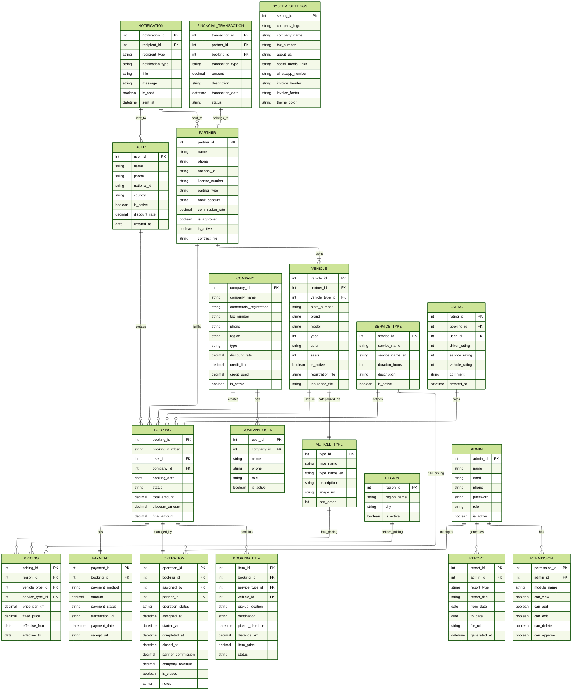

يتكون نموذج البيانات من عدة مجموعات منطقية من الجداول، كل مجموعة تخدم مجالاً وظيفياً محدداً. تم تنظيم الجداول بطريقة تقلل من التكرار وتضمن التناسق، مع اتباع مبادئ التطبيع حتى المستوى الثالث على الأقل.

المجموعة الأولى تتعلق بإدارة المستخدمين والصلاحيات. يمثل جدول المستخدمين users العملاء الأفراد الذين يستخدمون النظام مباشرة. يحتوي على معلوماتهم الشخصية وبيانات المصادقة والتفضيلات. يرتبط هذا الجدول بجدول الحجوزات من خلال علاقة واحد إلى متعدد، حيث يمكن لكل مستخدم إنشاء حجوزات متعددة.

جدول الشركات companies يمثل العملاء المؤسسيين من فنادق وشركات. يحتوي على معلومات تسجيلهم التجاري وحدود الائتمان الممنوحة لهم. يرتبط هذا الجدول بجدول company_users الذي يحفظ بيانات موظفي الشركة المخولين باستخدام النظام. هذا الفصل يسمح لكل شركة بإنشاء عدة حسابات لموظفيها مع صلاحيات مختلفة.

جدول الموردين partners يحفظ بيانات الشركاء الذين يقدمون السيارات والسائقين. يحتوي على معلوماتهم الشخصية والمالية ونسب العمولة المتفق عليها. يرتبط بجدول السيارات vehicles من خلال علاقة واحد إلى متعدد، حيث يمكن لكل مورد تسجيل سيارات متعددة.

جدول المشرفين admins يحفظ بيانات الفريق الإداري الذي يدير النظام. يرتبط بجدول الصلاحيات permissions الذي يحدد بدقة ما يمكن لكل مشرف فعله في كل وحدة من وحدات النظام.

المجموعة الثانية تتعلق بالحجوزات والعمليات التشغيلية. جدول الحجوزات bookings يمثل القلب التشغيلي للنظام. يحتوي على المعلومات الأساسية لكل حجز مثل رقمه وتاريخه وحالته والمبالغ المالية. يرتبط بعدة جداول أخرى لتشكيل صورة كاملة للحجز.

جدول booking_items يحفظ العناصر الفردية لكل حجز. نظراً لأن النظام يدعم إضافة خدمات متعددة تحت حجز واحد، فإن هذا الجدول يخزن تفاصيل كل خدمة منفصلة مع المواقع والأوقات والأسعار الخاصة بها. يسمح هذا التصميم بمرونة كبيرة في إدارة الحجوزات المعقدة.

جدول العمليات operations يتتبع الجانب التشغيلي لكل حجز. يسجل متى تم ربط الحجز مع سائق، ومتى بدأت الرحلة، ومتى اكتملت، ومتى أُقفل الحجز نهائياً. يحسب أيضاً توزيع الإيرادات بين المورد والشركة.

المجموعة الثالثة تتعلق بالأسطول والتسعير. جدول السيارات vehicles يحفظ معلومات كل سيارة مسجلة في النظام. يرتبط بجدول أنواع السيارات vehicle_types الذي يصنف السيارات إلى فئات رئيسية مثل سيدان وSUV ولاكجري. يرتبط أيضاً بجدول vehicle_images الذي يحفظ روابط صور كل سيارة.

جدول أنواع الخدمات service_types يعرف الخدمات المختلفة المتاحة مثل التوصيل والإيجار بالساعة والجولات. يرتبط بجدول الأسعار pricing الذي يحدد تكلفة كل نوع خدمة لكل فئة سيارة في كل منطقة. هذا التصميم المرن يسمح بتحديد أسعار مختلفة لنفس الخدمة في مناطق مختلفة.

المجموعة الرابعة تتعلق بالمدفوعات والمحاسبة. جدول المدفوعات payments يسجل كل معاملة دفع مرتبطة بحجز. يحفظ طريقة الدفع والمبلغ وحالة المعاملة ومعرف المعاملة من بوابة الدفع إن وجد.

جدول المعاملات المالية financial_transactions يتتبع الحركة المالية لكل مورد. يسجل العمولات المستحقة والمدفوعات المستلمة والتسويات، مع حساب الرصيد قبل وبعد كل معاملة. يوفر هذا شفافية كاملة ويسهل تدقيق الحسابات.

المجموعة الخامسة تشمل الجداول المساعدة. جدول التقييمات ratings يحفظ تقييمات العملاء للخدمات المستلمة. جدول الإشعارات notifications يتتبع جميع الإشعارات المرسلة للمستخدمين. جدول التقارير reports يحفظ معلومات عن التقارير المولدة. جدول إعدادات النظام system_settings يخزن التكوينات والإعدادات القابلة للتعديل.

تم تصميم جميع العلاقات بعناية لضمان سلامة الإحالات. تستخدم المفاتيح الأجنبية foreign keys لفرض القيود المرجعية، مما يمنع حذف أو تعديل سجلات يعتمد عليها سجلات أخرى. تطبق أيضاً قواعد CASCADE المناسبة عند الحاجة، بحيث يؤدي حذف سجل رئيسي إلى حذف تلقائي للسجلات التابعة.

## 9.2 قاموس البيانات (Data Dictionary)

يوفر قاموس البيانات وصفاً تفصيلياً وشاملاً لكل جدول وعمود في قاعدة البيانات. تم استبدال أكواد SQL بجداول منسقة تسهل القراءة والفهم.

### 9.2.1 جداول إدارة المستخدمين

**جدول: users (المستخدمون الأفراد)**

| اسم العمود | النوع | الحجم | القيود | القيمة الافتراضية | الوصف |
|-----------|-------|-------|--------|-------------------|-------|
| user_id | INT | - | PRIMARY KEY, AUTO_INCREMENT | - | المعرف الفريد للمستخدم |
| name | VARCHAR | 100 | NOT NULL | - | الاسم الكامل للمستخدم |
| phone | VARCHAR | 20 | NOT NULL, UNIQUE | - | رقم الجوال |
| email | VARCHAR | 100 | NULL | NULL | البريد الإلكتروني |
| national_id | VARCHAR | 20 | NULL | NULL | رقم الهوية الوطنية |
| country | VARCHAR | 50 | NULL | 'Saudi Arabia' | الدولة |
| password_hash | VARCHAR | 255 | NULL | NULL | كلمة المرور المشفرة |
| is_verified | BOOLEAN | - | NOT NULL | FALSE | حالة التحقق من الحساب |
| is_active | BOOLEAN | - | NOT NULL | TRUE | حالة تفعيل الحساب |
| discount_rate | DECIMAL | (5,2) | NULL | 0.00 | نسبة الخصم المخصصة |
| created_at | TIMESTAMP | - | NOT NULL | CURRENT_TIMESTAMP | تاريخ التسجيل |
| updated_at | TIMESTAMP | - | NOT NULL | CURRENT_TIMESTAMP | تاريخ آخر تحديث |
| last_login | TIMESTAMP | - | NULL | NULL | تاريخ آخر تسجيل دخول |

**الفهارس:**
- INDEX idx_phone على (phone)
- INDEX idx_email على (email)
- INDEX idx_is_active على (is_active)

**الملاحظات:**
- رقم الجوال يستخدم كمعرف فريد للمستخدم في عملية المصادقة
- كلمة المرور تخزن بعد التشفير باستخدام Bcrypt أو Argon2
- العملاء الضيوف لا يحتاجون إلى سجل في هذا الجدول

---

**جدول: companies (الشركات والفنادق)**

| اسم العمود | النوع | الحجم | القيود | القيمة الافتراضية | الوصف |
|-----------|-------|-------|--------|-------------------|-------|
| company_id | INT | - | PRIMARY KEY, AUTO_INCREMENT | - | المعرف الفريد للشركة |
| company_name | VARCHAR | 200 | NOT NULL | - | اسم الشركة |
| commercial_registration | VARCHAR | 50 | NOT NULL, UNIQUE | - | رقم السجل التجاري |
| tax_number | VARCHAR | 50 | NULL | NULL | الرقم الضريبي |
| phone | VARCHAR | 20 | NOT NULL | - | رقم الهاتف |
| email | VARCHAR | 100 | NULL | NULL | البريد الإلكتروني |
| region | VARCHAR | 100 | NOT NULL | - | المنطقة/المدينة |
| address | TEXT | - | NULL | NULL | العنوان الكامل |
| company_type | ENUM | - | NOT NULL | - | نوع الكيان (hotel, corporate, travel_agency) |
| client_type | ENUM | - | NOT NULL | - | نوع العميل (internal, external) |
| discount_rate | DECIMAL | (5,2) | NULL | 0.00 | نسبة الخصم المخصصة |
| credit_limit | DECIMAL | (12,2) | NULL | 0.00 | حد الائتمان الممنوح |
| credit_used | DECIMAL | (12,2) | NULL | 0.00 | المبلغ المستخدم من الائتمان |
| is_active | BOOLEAN | - | NOT NULL | FALSE | حالة التفعيل |
| contract_file | VARCHAR | 255 | NULL | NULL | رابط ملف العقد |
| approved_by | INT | - | NULL | NULL | معرف المشرف الذي وافق |
| approved_at | TIMESTAMP | - | NULL | NULL | تاريخ الموافقة |
| created_at | TIMESTAMP | - | NOT NULL | CURRENT_TIMESTAMP | تاريخ التسجيل |

**الفهارس:**
- INDEX idx_company_name على (company_name)
- INDEX idx_is_active على (is_active)
- INDEX idx_commercial_reg على (commercial_registration)

**العلاقات:**
- FOREIGN KEY (approved_by) REFERENCES admins(admin_id)

**الملاحظات:**
- السجل التجاري يستخدم كمعرف فريد للشركة
- credit_used يجب ألا يتجاوز credit_limit
- الشركات تحتاج لموافقة إدارية قبل التفعيل

---

**جدول: company_users (موظفو الشركات)**

| اسم العمود | النوع | الحجم | القيود | القيمة الافتراضية | الوصف |
|-----------|-------|-------|--------|-------------------|-------|
| user_id | INT | - | PRIMARY KEY, AUTO_INCREMENT | - | المعرف الفريد للموظف |
| company_id | INT | - | NOT NULL | - | معرف الشركة التابع لها |
| name | VARCHAR | 100 | NOT NULL | - | اسم الموظف |
| phone | VARCHAR | 20 | NOT NULL | - | رقم الجوال |
| email | VARCHAR | 100 | NULL | NULL | البريد الإلكتروني |
| password_hash | VARCHAR | 255 | NOT NULL | - | كلمة المرور المشفرة |
| role | VARCHAR | 50 | NULL | 'employee' | دور الموظف في الشركة |
| is_active | BOOLEAN | - | NOT NULL | TRUE | حالة تفعيل الحساب |
| created_at | TIMESTAMP | - | NOT NULL | CURRENT_TIMESTAMP | تاريخ إنشاء الحساب |

**الفهارس:**
- INDEX idx_company_id على (company_id)
- INDEX idx_phone على (phone)

**العلاقات:**
- FOREIGN KEY (company_id) REFERENCES companies(company_id)

**الملاحظات:**
- كل موظف يرتبط بشركة واحدة فقط
- الموظفون يمكنهم إنشاء حجوزات نيابة عن شركتهم

---

**جدول: partners (الموردون/الشركاء)**

| اسم العمود | النوع | الحجم | القيود | القيمة الافتراضية | الوصف |
|-----------|-------|-------|--------|-------------------|-------|
| partner_id | INT | - | PRIMARY KEY, AUTO_INCREMENT | - | المعرف الفريد للمورد |
| name | VARCHAR | 100 | NOT NULL | - | اسم المورد |
| phone | VARCHAR | 20 | NOT NULL, UNIQUE | - | رقم الجوال |
| email | VARCHAR | 100 | NULL | NULL | البريد الإلكتروني |
| national_id | VARCHAR | 20 | NOT NULL | - | رقم الهوية الوطنية |
| national_id_file | VARCHAR | 255 | NULL | NULL | رابط صورة الهوية |
| license_number | VARCHAR | 50 | NOT NULL | - | رقم رخصة القيادة |
| license_file | VARCHAR | 255 | NULL | NULL | رابط صورة الرخصة |
| partner_type | ENUM | - | NOT NULL | - | نوع المورد (internal, external) |
| bank_name | VARCHAR | 100 | NULL | NULL | اسم البنك |
| bank_account | VARCHAR | 50 | NULL | NULL | رقم الحساب البنكي |
| iban | VARCHAR | 50 | NULL | NULL | رقم الآيبان |
| commission_rate | DECIMAL | (5,2) | NOT NULL | 20.00 | نسبة العمولة |
| is_approved | BOOLEAN | - | NOT NULL | FALSE | حالة الموافقة |
| is_active | BOOLEAN | - | NOT NULL | TRUE | حالة التفعيل |
| contract_file | VARCHAR | 255 | NULL | NULL | رابط ملف العقد |
| approved_by | INT | - | NULL | NULL | معرف المشرف الذي وافق |
| approved_at | TIMESTAMP | - | NULL | NULL | تاريخ الموافقة |
| created_at | TIMESTAMP | - | NOT NULL | CURRENT_TIMESTAMP | تاريخ التسجيل |

**الفهارس:**
- INDEX idx_phone على (phone)
- INDEX idx_is_active على (is_active)
- INDEX idx_is_approved على (is_approved)

**العلاقات:**
- FOREIGN KEY (approved_by) REFERENCES admins(admin_id)

**الملاحظات:**
- الموردون يحتاجون لموافقة إدارية قبل التفعيل
- commission_rate تحدد نسبة العمولة لكل حجز
- partner_type يميز بين الموردين الداخليين والخارجيين

---

**جدول: admins (المشرفون الإداريون)**

| اسم العمود | النوع | الحجم | القيود | القيمة الافتراضية | الوصف |
|-----------|-------|-------|--------|-------------------|-------|
| admin_id | INT | - | PRIMARY KEY, AUTO_INCREMENT | - | المعرف الفريد للمشرف |
| name | VARCHAR | 100 | NOT NULL | - | اسم المشرف |
| email | VARCHAR | 100 | NOT NULL, UNIQUE | - | البريد الإلكتروني |
| phone | VARCHAR | 20 | NOT NULL | - | رقم الجوال |
| password_hash | VARCHAR | 255 | NOT NULL | - | كلمة المرور المشفرة |
| role | ENUM | - | NOT NULL | - | الدور (super_admin, operations_manager, accountant, support) |
| is_active | BOOLEAN | - | NOT NULL | TRUE | حالة التفعيل |
| last_login | TIMESTAMP | - | NULL | NULL | تاريخ آخر تسجيل دخول |
| created_at | TIMESTAMP | - | NOT NULL | CURRENT_TIMESTAMP | تاريخ إنشاء الحساب |

**الفهارس:**
- INDEX idx_email على (email)
- INDEX idx_role على (role)
- INDEX idx_is_active على (is_active)

**الملاحظات:**
- البريد الإلكتروني يستخدم لتسجيل الدخول
- super_admin لديه صلاحيات كاملة على النظام
- يجب تطبيق المصادقة الثنائية للحسابات الإدارية

---

**جدول: permissions (الصلاحيات)**

| اسم العمود | النوع | الحجم | القيود | القيمة الافتراضية | الوصف |
|-----------|-------|-------|--------|-------------------|-------|
| permission_id | INT | - | PRIMARY KEY, AUTO_INCREMENT | - | المعرف الفريد للصلاحية |
| admin_id | INT | - | NOT NULL | - | معرف المشرف |
| module_name | VARCHAR | 50 | NOT NULL | - | اسم الوحدة |
| can_view | BOOLEAN | - | NOT NULL | FALSE | صلاحية العرض |
| can_add | BOOLEAN | - | NOT NULL | FALSE | صلاحية الإضافة |
| can_edit | BOOLEAN | - | NOT NULL | FALSE | صلاحية التعديل |
| can_delete | BOOLEAN | - | NOT NULL | FALSE | صلاحية الحذف |
| can_approve | BOOLEAN | - | NOT NULL | FALSE | صلاحية الموافقة |
| can_reopen | BOOLEAN | - | NOT NULL | FALSE | صلاحية فتح المقفل |
| created_at | TIMESTAMP | - | NOT NULL | CURRENT_TIMESTAMP | تاريخ الإنشاء |

**الفهارس:**
- INDEX idx_admin_id على (admin_id)
- UNIQUE KEY unique_admin_module على (admin_id, module_name)

**العلاقات:**
- FOREIGN KEY (admin_id) REFERENCES admins(admin_id) ON DELETE CASCADE

**الملاحظات:**
- لكل مشرف صلاحيات منفصلة لكل وحدة
- can_reopen خاصة بالحجوزات المقفلة

### 9.2.2 جداول الحجوزات والعمليات

**جدول: bookings (الحجوزات)**

| اسم العمود | النوع | الحجم | القيود | القيمة الافتراضية | الوصف |
|-----------|-------|-------|--------|-------------------|-------|
| booking_id | INT | - | PRIMARY KEY, AUTO_INCREMENT | - | المعرف الفريد للحجز |
| booking_number | VARCHAR | 20 | NOT NULL, UNIQUE | - | رقم الحجز القابل للقراءة |
| user_id | INT | - | NULL | NULL | معرف العميل الفردي |
| company_id | INT | - | NULL | NULL | معرف الشركة |
| booked_by_type | ENUM | - | NOT NULL | - | نوع الحاجز (customer, company, guest) |
| booking_date | DATE | - | NOT NULL | - | تاريخ إنشاء الحجز |
| status | ENUM | - | NOT NULL | 'pending' | حالة الحجز |
| total_amount | DECIMAL | (10,2) | NOT NULL | 0.00 | المبلغ الإجمالي |
| discount_rate | DECIMAL | (5,2) | NULL | 0.00 | نسبة الخصم المطبقة |
| discount_amount | DECIMAL | (10,2) | NULL | 0.00 | قيمة الخصم |
| final_amount | DECIMAL | (10,2) | NOT NULL | 0.00 | المبلغ النهائي بعد الخصم |
| notes | TEXT | - | NULL | NULL | ملاحظات إضافية |
| created_at | TIMESTAMP | - | NOT NULL | CURRENT_TIMESTAMP | تاريخ الإنشاء |
| updated_at | TIMESTAMP | - | NOT NULL | CURRENT_TIMESTAMP | تاريخ آخر تحديث |

**قيم ENUM للحالة (status):**
- pending: في انتظار التأكيد
- confirmed: مؤكد
- in_preparation: قيد التجهيز
- in_progress: قيد التنفيذ
- completed: مكتمل
- cancelled: ملغي
- closed: مقفل نهائياً

**الفهارس:**
- INDEX idx_booking_number على (booking_number)
- INDEX idx_user_id على (user_id)
- INDEX idx_company_id على (company_id)
- INDEX idx_status على (status)
- INDEX idx_booking_date على (booking_date)

**العلاقات:**
- FOREIGN KEY (user_id) REFERENCES users(user_id)
- FOREIGN KEY (company_id) REFERENCES companies(company_id)

**الملاحظات:**
- يجب أن يكون إما user_id أو company_id موجوداً، وليس كلاهما
- booking_number يتم توليده تلقائياً بنمط معين
- المبالغ المالية تحسب من مجموع العناصر في booking_items

---

**جدول: booking_items (عناصر الحجز)**

| اسم العمود | النوع | الحجم | القيود | القيمة الافتراضية | الوصف |
|-----------|-------|-------|--------|-------------------|-------|
| item_id | INT | - | PRIMARY KEY, AUTO_INCREMENT | - | المعرف الفريد للعنصر |
| booking_id | INT | - | NOT NULL | - | معرف الحجز الأساسي |
| service_type_id | INT | - | NOT NULL | - | معرف نوع الخدمة |
| region_id | INT | - | NOT NULL | - | معرف المنطقة |
| vehicle_type_id | INT | - | NOT NULL | - | معرف فئة السيارة |
| vehicle_id | INT | - | NULL | NULL | معرف السيارة المخصصة |
| passenger_name | VARCHAR | 100 | NOT NULL | - | اسم الراكب |
| passenger_phone | VARCHAR | 20 | NOT NULL | - | رقم جوال الراكب |
| room_number | VARCHAR | 20 | NULL | NULL | رقم الغرفة للفنادق |
| flight_number | VARCHAR | 20 | NULL | NULL | رقم الرحلة للمطارات |
| pickup_location | VARCHAR | 255 | NOT NULL | - | موقع الانطلاق |
| pickup_latitude | DECIMAL | (10,8) | NULL | NULL | خط العرض للانطلاق |
| pickup_longitude | DECIMAL | (11,8) | NULL | NULL | خط الطول للانطلاق |
| destination | VARCHAR | 255 | NULL | NULL | الوجهة |
| destination_latitude | DECIMAL | (10,8) | NULL | NULL | خط العرض للوجهة |
| destination_longitude | DECIMAL | (11,8) | NULL | NULL | خط الطول للوجهة |
| pickup_datetime | DATETIME | - | NOT NULL | - | تاريخ ووقت الانطلاق |
| distance_km | DECIMAL | (8,2) | NULL | NULL | المسافة بالكيلومتر |
| duration_hours | INT | - | NULL | NULL | المدة بالساعات |
| base_price | DECIMAL | (10,2) | NOT NULL | - | السعر الأساسي |
| item_price | DECIMAL | (10,2) | NOT NULL | - | سعر العنصر النهائي |
| status | ENUM | - | NOT NULL | 'pending' | حالة العنصر |
| created_at | TIMESTAMP | - | NOT NULL | CURRENT_TIMESTAMP | تاريخ الإنشاء |

**قيم ENUM للحالة (status):**
- pending: في انتظار التأكيد
- confirmed: مؤكد
- assigned: تم التعيين
- in_progress: قيد التنفيذ
- completed: مكتمل
- cancelled: ملغي

**الفهارس:**
- INDEX idx_booking_id على (booking_id)
- INDEX idx_status على (status)
- INDEX idx_pickup_datetime على (pickup_datetime)
- INDEX idx_vehicle_id على (vehicle_id)

**العلاقات:**
- FOREIGN KEY (booking_id) REFERENCES bookings(booking_id) ON DELETE CASCADE
- FOREIGN KEY (service_type_id) REFERENCES service_types(service_id)
- FOREIGN KEY (region_id) REFERENCES regions(region_id)
- FOREIGN KEY (vehicle_type_id) REFERENCES vehicle_types(type_id)
- FOREIGN KEY (vehicle_id) REFERENCES vehicles(vehicle_id)

**الملاحظات:**
- يمكن أن يحتوي الحجز الواحد على عدة عناصر (خدمات متعددة)
- distance_km يحسب تلقائياً لخدمات التوصيل
- duration_hours يكون NULL لخدمات التوصيل ومحدداً للخدمات الزمنية

---

**جدول: operations (العمليات التشغيلية)**

| اسم العمود | النوع | الحجم | القيود | القيمة الافتراضية | الوصف |
|-----------|-------|-------|--------|-------------------|-------|
| operation_id | INT | - | PRIMARY KEY, AUTO_INCREMENT | - | المعرف الفريد للعملية |
| booking_id | INT | - | NOT NULL, UNIQUE | - | معرف الحجز |
| partner_id | INT | - | NOT NULL | - | معرف المورد المعين |
| vehicle_id | INT | - | NOT NULL | - | معرف السيارة المعينة |
| assigned_by | INT | - | NOT NULL | - | معرف المشرف الذي عين |
| operation_status | ENUM | - | NOT NULL | 'assigned' | حالة العملية |
| assigned_at | TIMESTAMP | - | NOT NULL | CURRENT_TIMESTAMP | تاريخ التعيين |
| driver_confirmed_at | TIMESTAMP | - | NULL | NULL | تاريخ تأكيد السائق |
| started_at | TIMESTAMP | - | NULL | NULL | تاريخ بدء الرحلة |
| completed_at | TIMESTAMP | - | NULL | NULL | تاريخ إتمام الرحلة |
| reviewed_at | TIMESTAMP | - | NULL | NULL | تاريخ المراجعة |
| closed_at | TIMESTAMP | - | NULL | NULL | تاريخ الإقفال النهائي |
| closed_by | INT | - | NULL | NULL | معرف المشرف الذي أقفل |
| partner_commission_rate | DECIMAL | (5,2) | NOT NULL | - | نسبة عمولة المورد |
| partner_commission | DECIMAL | (10,2) | NOT NULL | 0.00 | قيمة عمولة المورد |
| company_revenue | DECIMAL | (10,2) | NOT NULL | 0.00 | صافي ربح الشركة |
| is_closed | BOOLEAN | - | NOT NULL | FALSE | حالة الإقفال النهائي |
| notes | TEXT | - | NULL | NULL | ملاحظات تشغيلية |

**قيم ENUM للحالة (operation_status):**
- assigned: تم التعيين
- driver_confirmed: أكد السائق
- in_progress: قيد التنفيذ
- completed: مكتمل
- under_review: قيد المراجعة
- closed: مقفل

**الفهارس:**
- INDEX idx_booking_id على (booking_id)
- INDEX idx_partner_id على (partner_id)
- INDEX idx_operation_status على (operation_status)
- INDEX idx_is_closed على (is_closed)
- INDEX idx_assigned_at على (assigned_at)

**العلاقات:**
- FOREIGN KEY (booking_id) REFERENCES bookings(booking_id)
- FOREIGN KEY (partner_id) REFERENCES partners(partner_id)
- FOREIGN KEY (vehicle_id) REFERENCES vehicles(vehicle_id)
- FOREIGN KEY (assigned_by) REFERENCES admins(admin_id)
- FOREIGN KEY (closed_by) REFERENCES admins(admin_id)

**الملاحظات:**
- علاقة واحد لواحد مع bookings (كل حجز له عملية واحدة)
- is_closed عندما يكون TRUE يمنع أي تعديل على البيانات المالية
- partner_commission_rate يحفظ النسبة المطبقة وقت الإقفال للمرجعية

---

### 9.2.3 جداول السيارات والتسعير

**جدول: vehicles (السيارات)**

| اسم العمود | النوع | الحجم | القيود | القيمة الافتراضية | الوصف |
|-----------|-------|-------|--------|-------------------|-------|
| vehicle_id | INT | - | PRIMARY KEY, AUTO_INCREMENT | - | المعرف الفريد للسيارة |
| partner_id | INT | - | NOT NULL | - | معرف المورد المالك |
| vehicle_type_id | INT | - | NOT NULL | - | معرف فئة السيارة |
| plate_number | VARCHAR | 20 | NOT NULL, UNIQUE | - | رقم اللوحة |
| brand | VARCHAR | 50 | NOT NULL | - | الماركة |
| model | VARCHAR | 50 | NOT NULL | - | الموديل |
| year | INT | - | NOT NULL | - | سنة الصنع |
| color | VARCHAR | 30 | NOT NULL | - | اللون |
| seats | INT | - | NOT NULL | 5 | عدد المقاعد |
| registration_file | VARCHAR | 255 | NULL | NULL | رابط صورة الاستمارة |
| insurance_file | VARCHAR | 255 | NULL | NULL | رابط صورة التأمين |
| is_active | BOOLEAN | - | NOT NULL | FALSE | حالة التفعيل |
| created_at | TIMESTAMP | - | NOT NULL | CURRENT_TIMESTAMP | تاريخ التسجيل |

**الفهارس:**
- INDEX idx_partner_id على (partner_id)
- INDEX idx_vehicle_type على (vehicle_type_id)
- INDEX idx_is_active على (is_active)
- INDEX idx_plate_number على (plate_number)

**العلاقات:**
- FOREIGN KEY (partner_id) REFERENCES partners(partner_id)
- FOREIGN KEY (vehicle_type_id) REFERENCES vehicle_types(type_id)

**الملاحظات:**
- plate_number فريد على مستوى النظام
- السيارة تحتاج لموافقة إدارية قبل التفعيل
- is_active يحدد إمكانية استقبال حجوزات جديدة

---

**جدول: vehicle_images (صور السيارات)**

| اسم العمود | النوع | الحجم | القيود | القيمة الافتراضية | الوصف |
|-----------|-------|-------|--------|-------------------|-------|
| image_id | INT | - | PRIMARY KEY, AUTO_INCREMENT | - | المعرف الفريد للصورة |
| vehicle_id | INT | - | NOT NULL | - | معرف السيارة |
| image_url | VARCHAR | 255 | NOT NULL | - | رابط الصورة |
| image_type | ENUM | - | NOT NULL | - | نوع الصورة (exterior, interior) |
| sort_order | INT | - | NULL | 0 | ترتيب العرض |
| created_at | TIMESTAMP | - | NOT NULL | CURRENT_TIMESTAMP | تاريخ الإضافة |

**الفهارس:**
- INDEX idx_vehicle_id على (vehicle_id)
- INDEX idx_sort_order على (sort_order)

**العلاقات:**
- FOREIGN KEY (vehicle_id) REFERENCES vehicles(vehicle_id) ON DELETE CASCADE

**الملاحظات:**
- يوصى بـ 4 صور خارجية و4 صور داخلية لكل سيارة
- sort_order يحدد ترتيب عرض الصور للعملاء

---

**جدول: vehicle_types (فئات السيارات)**

| اسم العمود | النوع | الحجم | القيود | القيمة الافتراضية | الوصف |
|-----------|-------|-------|--------|-------------------|-------|
| type_id | INT | - | PRIMARY KEY, AUTO_INCREMENT | - | المعرف الفريد للفئة |
| type_name | VARCHAR | 50 | NOT NULL | - | اسم الفئة بالعربية |
| type_name_en | VARCHAR | 50 | NOT NULL | - | اسم الفئة بالإنجليزية |
| description | TEXT | - | NULL | NULL | وصف الفئة |
| image_url | VARCHAR | 255 | NULL | NULL | رابط صورة تمثيلية |
| sort_order | INT | - | NULL | 0 | ترتيب العرض |
| is_active | BOOLEAN | - | NOT NULL | TRUE | حالة التفعيل |
| created_at | TIMESTAMP | - | NOT NULL | CURRENT_TIMESTAMP | تاريخ الإنشاء |

**الفهارس:**
- INDEX idx_is_active على (is_active)
- INDEX idx_sort_order على (sort_order)

**الملاحظات:**
- الفئات الأساسية: سيدان، SUV، باص، لاكجري
- sort_order يحدد ترتيب العرض في واجهة الحجز

---

**جدول: service_types (أنواع الخدمات)**

| اسم العمود | النوع | الحجم | القيود | القيمة الافتراضية | الوصف |
|-----------|-------|-------|--------|-------------------|-------|
| service_id | INT | - | PRIMARY KEY, AUTO_INCREMENT | - | المعرف الفريد للخدمة |
| service_name | VARCHAR | 100 | NOT NULL | - | اسم الخدمة بالعربية |
| service_name_en | VARCHAR | 100 | NOT NULL | - | اسم الخدمة بالإنجليزية |
| service_code | VARCHAR | 20 | NOT NULL, UNIQUE | - | رمز الخدمة |
| duration_hours | INT | - | NULL | NULL | المدة بالساعات (للخدمات الزمنية) |
| description | TEXT | - | NULL | NULL | وصف الخدمة |
| is_active | BOOLEAN | - | NOT NULL | TRUE | حالة التفعيل |
| sort_order | INT | - | NULL | 0 | ترتيب العرض |
| created_at | TIMESTAMP | - | NOT NULL | CURRENT_TIMESTAMP | تاريخ الإنشاء |

**الفهارس:**
- INDEX idx_service_code على (service_code)
- INDEX idx_is_active على (is_active)
- INDEX idx_sort_order على (sort_order)

**الملاحظات:**
- الخدمات الأساسية: TRANSFER (توصيل), HOURLY (بالساعة), TOUR_8 (8 ساعات), FULL_DAY (12 ساعة), EXTRA_HOUR (ساعة زائدة)
- duration_hours يكون NULL لخدمة التوصيل

---

**جدول: regions (المناطق)**

| اسم العمود | النوع | الحجم | القيود | القيمة الافتراضية | الوصف |
|-----------|-------|-------|--------|-------------------|-------|
| region_id | INT | - | PRIMARY KEY, AUTO_INCREMENT | - | المعرف الفريد للمنطقة |
| region_name | VARCHAR | 100 | NOT NULL | - | اسم المنطقة |
| city | VARCHAR | 100 | NULL | NULL | المدينة |
| is_active | BOOLEAN | - | NOT NULL | TRUE | حالة التفعيل |
| sort_order | INT | - | NULL | 0 | ترتيب العرض |
| created_at | TIMESTAMP | - | NOT NULL | CURRENT_TIMESTAMP | تاريخ الإنشاء |

**الفهارس:**
- INDEX idx_is_active على (is_active)
- INDEX idx_sort_order على (sort_order)

**الملاحظات:**
- المناطق الأساسية: جدة، مكة المكرمة، الرياض، العلا
- يمكن إضافة مناطق جديدة بسهولة

---

**جدول: pricing (الأسعار)**

| اسم العمود | النوع | الحجم | القيود | القيمة الافتراضية | الوصف |
|-----------|-------|-------|--------|-------------------|-------|
| pricing_id | INT | - | PRIMARY KEY, AUTO_INCREMENT | - | المعرف الفريد للسعر |
| region_id | INT | - | NOT NULL | - | معرف المنطقة |
| vehicle_type_id | INT | - | NOT NULL | - | معرف فئة السيارة |
| service_type_id | INT | - | NOT NULL | - | معرف نوع الخدمة |
| price_per_km | DECIMAL | (8,2) | NULL | NULL | سعر الكيلومتر (للتوصيل) |
| fixed_price | DECIMAL | (10,2) | NULL | NULL | السعر الثابت (للخدمات الزمنية) |
| effective_from | DATE | - | NOT NULL | - | تاريخ بداية السريان |
| effective_to | DATE | - | NULL | NULL | تاريخ نهاية السريان |
| is_active | BOOLEAN | - | NOT NULL | TRUE | حالة التفعيل |
| created_at | TIMESTAMP | - | NOT NULL | CURRENT_TIMESTAMP | تاريخ الإنشاء |
| updated_at | TIMESTAMP | - | NOT NULL | CURRENT_TIMESTAMP | تاريخ آخر تحديث |

**الفهارس:**
- INDEX idx_region_vehicle_service على (region_id, vehicle_type_id, service_type_id)
- INDEX idx_is_active على (is_active)
- INDEX idx_effective_dates على (effective_from, effective_to)

**العلاقات:**
- FOREIGN KEY (region_id) REFERENCES regions(region_id)
- FOREIGN KEY (vehicle_type_id) REFERENCES vehicle_types(type_id)
- FOREIGN KEY (service_type_id) REFERENCES service_types(service_id)

**الملاحظات:**
- لخدمة التوصيل: يستخدم price_per_km ويكون fixed_price = NULL
- للخدمات الزمنية: يستخدم fixed_price ويكون price_per_km = NULL
- يمكن تحديد أسعار مختلفة لنفس الخدمة في مناطق مختلفة
- effective_to = NULL يعني أن السعر ساري حتى إشعار آخر

---

### 9.2.4 جداول المدفوعات والمحاسبة

**جدول: payments (المدفوعات)**

| اسم العمود | النوع | الحجم | القيود | القيمة الافتراضية | الوصف |
|-----------|-------|-------|--------|-------------------|-------|
| payment_id | INT | - | PRIMARY KEY, AUTO_INCREMENT | - | المعرف الفريد للدفعة |
| booking_id | INT | - | NOT NULL | - | معرف الحجز |
| payment_method | ENUM | - | NOT NULL | - | طريقة الدفع |
| amount | DECIMAL | (10,2) | NOT NULL | - | المبلغ المدفوع |
| payment_status | ENUM | - | NOT NULL | 'pending' | حالة الدفع |
| transaction_id | VARCHAR | 100 | NULL | NULL | معرف المعاملة من البوابة |
| receipt_url | VARCHAR | 255 | NULL | NULL | رابط إيصال الدفع |
| payment_date | DATETIME | - | NULL | NULL | تاريخ إتمام الدفع |
| verified_by | INT | - | NULL | NULL | معرف المشرف الذي تحقق |
| verified_at | TIMESTAMP | - | NULL | NULL | تاريخ التحقق |
| notes | TEXT | - | NULL | NULL | ملاحظات إضافية |
| created_at | TIMESTAMP | - | NOT NULL | CURRENT_TIMESTAMP | تاريخ الإنشاء |

**قيم ENUM لطريقة الدفع (payment_method):**
- cash: نقدي مع السائق
- card: بطاقة إلكترونية (مدى/فيزا)
- bank_transfer: تحويل بنكي
- credit: دفع آجل (للشركات)

**قيم ENUM لحالة الدفع (payment_status):**
- pending: في انتظار الدفع
- completed: مكتمل
- failed: فشل
- refunded: مسترد

**الفهارس:**
- INDEX idx_booking_id على (booking_id)
- INDEX idx_payment_status على (payment_status)
- INDEX idx_payment_method على (payment_method)
- INDEX idx_payment_date على (payment_date)

**العلاقات:**
- FOREIGN KEY (booking_id) REFERENCES bookings(booking_id)
- FOREIGN KEY (verified_by) REFERENCES admins(admin_id)

**الملاحظات:**
- transaction_id يحفظ رقم المعاملة من بوابة الدفع للمدفوعات الإلكترونية
- receipt_url يحفظ رابط صورة الإيصال للتحويلات البنكية
- للدفع الآجل (credit)، يضاف المبلغ لفاتورة الشركة الشهرية

---

**جدول: financial_transactions (المعاملات المالية للموردين)**

| اسم العمود | النوع | الحجم | القيود | القيمة الافتراضية | الوصف |
|-----------|-------|-------|--------|-------------------|-------|
| transaction_id | INT | - | PRIMARY KEY, AUTO_INCREMENT | - | المعرف الفريد للمعاملة |
| partner_id | INT | - | NOT NULL | - | معرف المورد |
| booking_id | INT | - | NULL | NULL | معرف الحجز المرتبط |
| transaction_type | ENUM | - | NOT NULL | - | نوع المعاملة |
| amount | DECIMAL | (10,2) | NOT NULL | - | المبلغ |
| balance_before | DECIMAL | (12,2) | NOT NULL | - | الرصيد قبل المعاملة |
| balance_after | DECIMAL | (12,2) | NOT NULL | - | الرصيد بعد المعاملة |
| description | TEXT | - | NULL | NULL | وصف المعاملة |
| transaction_date | DATETIME | - | NOT NULL | CURRENT_TIMESTAMP | تاريخ المعاملة |
| status | ENUM | - | NOT NULL | 'completed' | حالة المعاملة |
| processed_by | INT | - | NULL | NULL | معرف المشرف الذي عالج |

**قيم ENUM لنوع المعاملة (transaction_type):**
- commission: عمولة من حجز
- payment: دفعة للمورد
- adjustment: تسوية أو تعديل
- refund: استرداد

**قيم ENUM للحالة (status):**
- pending: معلقة
- completed: مكتملة
- cancelled: ملغاة

**الفهارس:**
- INDEX idx_partner_id على (partner_id)
- INDEX idx_booking_id على (booking_id)
- INDEX idx_transaction_date على (transaction_date)
- INDEX idx_status على (status)

**العلاقات:**
- FOREIGN KEY (partner_id) REFERENCES partners(partner_id)
- FOREIGN KEY (booking_id) REFERENCES bookings(booking_id)
- FOREIGN KEY (processed_by) REFERENCES admins(admin_id)

**الملاحظات:**
- يسجل كل حركة مالية مع الرصيد قبل وبعد للشفافية الكاملة
- عند إقفال حجز، تسجل معاملة commission تلقائياً
- عند دفع مستحقات المورد، تسجل معاملة payment

---

### 9.2.5 جداول الإشعارات والتقارير

**جدول: notifications (الإشعارات)**

| اسم العمود | النوع | الحجم | القيود | القيمة الافتراضية | الوصف |
|-----------|-------|-------|--------|-------------------|-------|
| notification_id | INT | - | PRIMARY KEY, AUTO_INCREMENT | - | المعرف الفريد للإشعار |
| recipient_id | INT | - | NOT NULL | - | معرف المستلم |
| recipient_type | ENUM | - | NOT NULL | - | نوع المستلم |
| notification_type | ENUM | - | NOT NULL | - | نوع الإشعار |
| title | VARCHAR | 200 | NOT NULL | - | عنوان الإشعار |
| message | TEXT | - | NOT NULL | - | نص الرسالة |
| booking_id | INT | - | NULL | NULL | معرف الحجز المرتبط |
| is_read | BOOLEAN | - | NOT NULL | FALSE | حالة القراءة |
| sent_via | ENUM | - | NOT NULL | - | قناة الإرسال |
| sent_at | TIMESTAMP | - | NOT NULL | CURRENT_TIMESTAMP | تاريخ الإرسال |
| read_at | TIMESTAMP | - | NULL | NULL | تاريخ القراءة |

**قيم ENUM لنوع المستلم (recipient_type):**
- customer: عميل فردي
- partner: مورد
- admin: مشرف
- company_user: موظف شركة

**قيم ENUM لنوع الإشعار (notification_type):**
- booking_confirmation: تأكيد حجز
- booking_assignment: تعيين حجز
- booking_cancellation: إلغاء حجز
- payment_reminder: تذكير بالدفع
- rating_request: طلب تقييم
- general: إشعار عام

**قيم ENUM لقناة الإرسال (sent_via):**
- sms: رسالة نصية
- whatsapp: واتساب
- app: إشعار داخل التطبيق
- email: بريد إلكتروني

**الفهارس:**
- INDEX idx_recipient على (recipient_id, recipient_type)
- INDEX idx_is_read على (is_read)
- INDEX idx_sent_at على (sent_at)
- INDEX idx_booking_id على (booking_id)

**العلاقات:**
- FOREIGN KEY (booking_id) REFERENCES bookings(booking_id)

**الملاحظات:**
- recipient_id يشير إلى السجل في الجدول المناسب حسب recipient_type
- يمكن إرسال نفس الإشعار عبر قنوات متعددة (سجلات منفصلة)

---

**جدول: ratings (التقييمات)**

| اسم العمود | النوع | الحجم | القيود | القيمة الافتراضية | الوصف |
|-----------|-------|-------|--------|-------------------|-------|
| rating_id | INT | - | PRIMARY KEY, AUTO_INCREMENT | - | المعرف الفريد للتقييم |
| booking_id | INT | - | NOT NULL, UNIQUE | - | معرف الحجز |
| user_id | INT | - | NOT NULL | - | معرف العميل |
| partner_id | INT | - | NOT NULL | - | معرف المورد |
| driver_rating | INT | - | NOT NULL | - | تقييم السائق (1-5) |
| service_rating | INT | - | NOT NULL | - | تقييم الخدمة (1-5) |
| vehicle_rating | INT | - | NOT NULL | - | تقييم السيارة (1-5) |
| overall_rating | DECIMAL | (3,2) | GENERATED | - | المتوسط الإجمالي (محسوب تلقائياً) |
| comment | TEXT | - | NULL | NULL | تعليق العميل |
| created_at | TIMESTAMP | - | NOT NULL | CURRENT_TIMESTAMP | تاريخ التقييم |

**القيود:**
- CHECK (driver_rating BETWEEN 1 AND 5)
- CHECK (service_rating BETWEEN 1 AND 5)
- CHECK (vehicle_rating BETWEEN 1 AND 5)
- overall_rating AS ((driver_rating + service_rating + vehicle_rating) / 3.0)

**الفهارس:**
- INDEX idx_booking_id على (booking_id)
- INDEX idx_partner_id على (partner_id)
- INDEX idx_created_at على (created_at)

**العلاقات:**
- FOREIGN KEY (booking_id) REFERENCES bookings(booking_id)
- FOREIGN KEY (user_id) REFERENCES users(user_id)
- FOREIGN KEY (partner_id) REFERENCES partners(partner_id)

**الملاحظات:**
- علاقة واحد لواحد مع bookings (تقييم واحد لكل حجز)
- overall_rating يحسب تلقائياً كمتوسط التقييمات الثلاثة
- التقييمات تستخدم لحساب متوسط تقييم كل مورد

---

**جدول: reports (التقارير)**

| اسم العمود | النوع | الحجم | القيود | القيمة الافتراضية | الوصف |
|-----------|-------|-------|--------|-------------------|-------|
| report_id | INT | - | PRIMARY KEY, AUTO_INCREMENT | - | المعرف الفريد للتقرير |
| admin_id | INT | - | NOT NULL | - | معرف المشرف الذي أنشأ |
| report_type | ENUM | - | NOT NULL | - | نوع التقرير |
| report_title | VARCHAR | 200 | NOT NULL | - | عنوان التقرير |
| from_date | DATE | - | NOT NULL | - | تاريخ البداية |
| to_date | DATE | - | NOT NULL | - | تاريخ النهاية |
| filters | JSON | - | NULL | NULL | الفلاتر المطبقة |
| file_url | VARCHAR | 255 | NULL | NULL | رابط ملف التقرير |
| generated_at | TIMESTAMP | - | NOT NULL | CURRENT_TIMESTAMP | تاريخ إنشاء التقرير |

**قيم ENUM لنوع التقرير (report_type):**
- bookings: تقرير الحجوزات
- revenue: تقرير الإيرادات
- partners: تقرير الموردين
- customers: تقرير العملاء
- custom: تقرير مخصص

**الفهارس:**
- INDEX idx_admin_id على (admin_id)
- INDEX idx_report_type على (report_type)
- INDEX idx_generated_at على (generated_at)
- INDEX idx_date_range على (from_date, to_date)

**العلاقات:**
- FOREIGN KEY (admin_id) REFERENCES admins(admin_id)

**الملاحظات:**
- filters يحفظ الفلاتر المطبقة بصيغة JSON للمرجعية
- file_url يشير لملف PDF أو Excel المولد

---

### 9.2.6 جداول الإعدادات والصلاحيات

**جدول: system_settings (إعدادات النظام)**

| اسم العمود | النوع | الحجم | القيود | القيمة الافتراضية | الوصف |
|-----------|-------|-------|--------|-------------------|-------|
| setting_id | INT | - | PRIMARY KEY, AUTO_INCREMENT | - | المعرف الفريد للإعداد |
| setting_key | VARCHAR | 100 | NOT NULL, UNIQUE | - | مفتاح الإعداد |
| setting_value | TEXT | - | NULL | NULL | قيمة الإعداد |
| setting_type | ENUM | - | NOT NULL | 'text' | نوع البيانات |
| description | TEXT | - | NULL | NULL | وصف الإعداد |
| updated_by | INT | - | NULL | NULL | معرف المشرف الذي حدّث |
| updated_at | TIMESTAMP | - | NOT NULL | CURRENT_TIMESTAMP | تاريخ آخر تحديث |

**قيم ENUM لنوع البيانات (setting_type):**
- text: نص
- number: رقم
- boolean: منطقي
- json: كائن JSON
- file: ملف/رابط

**الفهارس:**
- INDEX idx_setting_key على (setting_key)

**العلاقات:**
- FOREIGN KEY (updated_by) REFERENCES admins(admin_id)

**الإعدادات الأساسية المتوقعة:**
- company_name: اسم الشركة
- company_logo: شعار الشركة
- tax_number: الرقم الضريبي
- whatsapp_number: رقم الواتساب
- theme_color: اللون الأساسي للنظام
- invoice_header: ترويسة الفاتورة
- invoice_footer: ذيل الفاتورة
- default_commission_rate: نسبة العمولة الافتراضية

**الملاحظات:**
- يسمح بإضافة إعدادات جديدة ديناميكياً دون تعديل البنية
- setting_value يحفظ كنص ويحول للنوع المناسب عند الاستخدام

---

## 9.3 الفهارس والقيود (Indexes & Constraints)

تلعب الفهارس والقيود دوراً حاسماً في ضمان سلامة البيانات والأداء العالي لقاعدة البيانات.

### استراتيجية الفهرسة

تم تصميم استراتيجية فهرسة شاملة تغطي جميع الحالات الشائعة للوصول للبيانات. تشمل الفهارس الأساسية:

**فهارس المفاتيح الأساسية:** تنشأ تلقائياً على جميع أعمدة المفاتيح الأساسية (PRIMARY KEY) لضمان الفرادة والوصول السريع.

**فهارس المفاتيح الأجنبية:** تنشأ على جميع أعمدة المفاتيح الأجنبية (FOREIGN KEY) لتسريع عمليات الربط (JOIN) والحفاظ على سلامة الإحالات.

**فهارس الأعمدة المستخدمة بكثرة في البحث:** مثل أرقام الهواتف، عناوين البريد الإلكتروني، أرقام الحجوزات، وحالات الحجوزات والعمليات.

**فهارس التواريخ:** على أعمدة التواريخ المستخدمة بكثرة في الفلترة والترتيب مثل booking_date وpickup_datetime وcreated_at.

**فهارس مركبة:** على مجموعات أعمدة تستخدم معاً بكثرة، مثل (region_id, vehicle_type_id, service_type_id) في جدول pricing.

**فهارس فريدة:** على الأعمدة التي يجب أن تكون قيمها فريدة مثل phone في users وpartners، وbooking_number في bookings.

### أنواع القيود المطبقة

**قيود المفاتيح الأساسية (PRIMARY KEY):** تضمن فرادة كل سجل في الجدول وتمنع القيم NULL.

**قيود المفاتيح الأجنبية (FOREIGN KEY):** تضمن سلامة الإحالات بين الجداول وتمنع حذف أو تعديل سجلات يعتمد عليها سجلات أخرى. تطبق مع قواعد CASCADE المناسبة:
- ON DELETE CASCADE: لحذف السجلات التابعة تلقائياً عند حذف السجل الرئيسي (مثل booking_items عند حذف booking)
- ON DELETE RESTRICT: لمنع حذف سجل رئيسي إذا كانت هناك سجلات تابعة (السلوك الافتراضي)

**قيود الفرادة (UNIQUE):** تمنع تكرار القيم في أعمدة محددة مثل phone وemail وcommercial_registration.

**قيود عدم القبول بـ NULL (NOT NULL):** تفرض إدخال قيمة للأعمدة الإلزامية.

**قيود الفحص (CHECK):** تفرض قواعد صحة على القيم المدخلة، مثل:
- التقييمات يجب أن تكون بين 1 و5
- credit_used يجب ألا يتجاوز credit_limit
- النسب المئوية يجب أن تكون بين 0 و100

**قيود القيم الافتراضية (DEFAULT):** تحدد قيماً افتراضية معقولة للأعمدة عند عدم تحديد قيمة صريحة.

### تحسينات الأداء عبر الفهرسة

**تغطية الاستعلامات الشائعة:** تم تحديد الاستعلامات الأكثر تكراراً وإنشاء فهارس مخصصة لتغطيتها بكفاءة.

**الفهارس الجزئية (Partial Indexes):** على سجلات معينة فقط، مثل فهرس على الحجوزات النشطة فقط (status != 'closed') لتقليل حجم الفهرس وزيادة كفاءته.

**الفهارس المشتقة:** على الحقول المحسوبة مثل overall_rating لتسريع الاستعلامات التي تفرز أو تبحث بناءً عليها.

**تجنب الإفراط في الفهرسة:** لم تنشأ فهارس على الأعمدة نادرة الاستخدام في البحث لتجنب الأثر السلبي على أداء عمليات الإدخال والتحديث.

### صيانة الفهارس

تخضع الفهارس لصيانة دورية تشمل:
- إعادة بناء الفهارس المجزأة شهرياً
- تحديث إحصائيات الفهارس أسبوعياً
- مراقبة استخدام الفهارس وحذف غير المستخدمة
- تحليل خطط التنفيذ وإضافة فهارس جديدة عند الحاجة

---

## 9.4 استراتيجية التقسيم والأرشفة (Partitioning & Archiving)

مع نمو البيانات بمرور الوقت، تصبح استراتيجية التقسيم والأرشفة ضرورية للحفاظ على الأداء العالي.

### التقسيم الزمني للجداول الكبيرة

**جدول bookings:** يقسم بناءً على booking_date إلى أقسام ربع سنوية. كل ربع سنة يحفظ في قسم منفصل، مما يسمح بالاستعلام السريع على البيانات الحديثة دون مسح السجلات القديمة.

```
- bookings_2025_q1 (يناير - مارس 2025)
- bookings_2025_q2 (أبريل - يونيو 2025)
- bookings_2025_q3 (يوليو - سبتمبر 2025)
- bookings_2025_q4 (أكتوبر - ديسمبر 2025)
```

**جدول booking_items:** يتبع نفس استراتيجية تقسيم جدول bookings الأساسي.

**جدول operations:** يقسم بناءً على assigned_at بنفس النمط الزمني.

**جدول financial_transactions:** يقسم بناءً على transaction_date إلى أقسام شهرية نظراً لحجم المعاملات المتوقع.

**جدول notifications:** يقسم إلى أقسام شهرية بناءً على sent_at.

### فوائد التقسيم

**تحسين الأداء:** تركز معظم الاستعلامات على البيانات الحديثة (آخر شهر أو ربع سنة)، والتقسيم يسمح للمحسن بمسح قسم صغير فقط بدلاً من الجدول الكامل.

**سهولة الصيانة:** يمكن إجراء عمليات الصيانة (إعادة بناء الفهارس، تحديث الإحصائيات) على قسم واحد دون التأثير على الأقسام الأخرى.

**أرشفة فعالة:** يمكن نقل أقسام كاملة قديمة إلى جداول أرشيف منفصلة أو تخزين بطيء أقل تكلفة.

**حذف سريع:** عند الحاجة لحذف بيانات قديمة، يمكن حذف قسم كامل بعملية واحدة سريعة بدلاً من حذف ملايين السجلات فردياً.

### استراتيجية الأرشفة

**معايير الأرشفة:** تنقل البيانات للأرشيف بناءً على عمرها وحالتها:
- الحجوزات المكتملة والمقفلة التي مر عليها أكثر من سنتين
- الإشعارات الأقدم من ستة أشهر
- السجلات المحذوفة منطقياً (soft deleted) الأقدم من سنة

**عملية الأرشفة:**
1. يحدد القسم المستهدف للأرشفة
2. تنسخ البيانات إلى جداول الأرشيف
3. يتحقق من نجاح النسخ ومطابقة البيانات
4. يحذف القسم من الجداول الرئيسية
5. تضغط بيانات الأرشيف لتوفير المساحة

**جداول الأرشيف:** تحتفظ بنفس بنية الجداول الأصلية لكن بمحسنات للقراءة فقط:
- bookings_archive
- booking_items_archive
- operations_archive
- notifications_archive

**الوصول للبيانات المؤرشفة:** يبقى ممكناً عند الحاجة لكن عبر استعلامات منفصلة أو views موحدة تجمع البيانات النشطة والمؤرشفة.

### جدولة عمليات الأرشفة

تجري عمليات الأرشفة بشكل آلي وفق جدول محدد:
- يومياً: أرشفة الإشعارات القديمة جداً
- أسبوعياً: مراجعة وأرشفة السجلات المحذوفة منطقياً
- شهرياً: أرشفة الحجوزات والعمليات القديمة
- ربع سنوياً: مراجعة شاملة واستراتيجية الأرشفة

تنفذ جميع العمليات خلال ساعات منخفضة الاستخدام لتقليل التأثير على المستخدمين.

---

## 9.5 اعتبارات الأداء والتحسين

تم تطبيق مجموعة شاملة من التحسينات لضمان أداء عالٍ ومستدام لقاعدة البيانات.

### تحسين الاستعلامات

**استخدام المعلمات:** جميع الاستعلامات تستخدم معلمات بدلاً من بناء استعلامات ديناميكية، مما يسمح بإعادة استخدام خطط التنفيذ المحسنة ويمنع حقن SQL.

**تحديد الأعمدة المطلوبة:** تجنب استخدام SELECT * وتحديد الأعمدة المطلوبة فقط لتقليل كمية البيانات المنقولة.

**استخدام LIMIT:** تحديد عدد السجلات المطلوبة عند الاستعلام عن قوائم طويلة، مع تطبيق ترقيم صفحات (pagination) فعال.

**تجنب الاستعلامات الفرعية المعقدة:** استبدالها بـ JOINs عند الإمكان، أو تقسيمها لاستعلامات أبسط.

**استخدام EXISTS بدلاً من COUNT:** عند التحقق من وجود سجلات فقط دون الحاجة لعددها الدقيق.

### استراتيجية التخزين المؤقت

**تخزين الاستعلامات المتكررة:** النتائج التي لا تتغير بكثرة مثل قوائم الخدمات والمناطق وفئات السيارات تخزن في Redis لمدة ساعة.

**تخزين حسابات معقدة:** مثل متوسطات التقييمات وإحصائيات الموردين تخزن وتحدث دورياً بدلاً من حسابها في كل استعلام.

**إبطال التخزين الذكي:** عند تحديث بيانات، تبطل البيانات المخزنة المرتبطة تلقائياً لضمان الاتساق.

**تخزين الجلسات:** بيانات الجلسات تخزن في Redis بدلاً من قاعدة البيانات لسرعة الوصول.

### تحسين العمليات الكتابية

**المعاملات (Transactions):** تجمع العمليات المترابطة في معاملة واحدة لضمان الاتساق وتقليل عدد الاتصالات بقاعدة البيانات.

**Batch Inserts:** عند إدخال سجلات متعددة، تجمع في عملية إدخال دفعة واحدة بدلاً من إدخالها فردياً.

**Async Updates:** التحديثات غير الحرجة تنفذ بشكل غير متزامن عبر قوائم الانتظار لتجنب إبطاء الاستجابة للمستخدم.

### مراقبة الأداء

**تسجيل الاستعلامات البطيئة:** أي استعلام يأخذ أكثر من ثانية واحدة يسجل تلقائياً للمراجعة والتحسين.

**تحليل خطط التنفيذ:** تراجع خطط تنفيذ الاستعلامات البطيئة دورياً باستخدام EXPLAIN لتحديد نقاط الاختناق.

**مراقبة استخدام الموارد:** تتبع استخدام CPU والذاكرة والقرص لقاعدة البيانات لاكتشاف المشاكل المحتملة مبكراً.

**مقاييس الأداء:** تجمع مقاييس شاملة تشمل:
- متوسط زمن الاستجابة لكل نوع استعلام
- عدد الاستعلامات في الثانية
- معدل نجاح الاتصالات
- حجم البيانات ومعدل النمو

### التحسينات المستقبلية

**Read Replicas:** إضافة نسخ للقراءة فقط لتوزيع حمل الاستعلامات القرائية عن النسخة الأساسية.

**Sharding:** عند النمو الكبير، تقسيم البيانات أفقياً عبر عدة خوادم بناءً على المنطقة الجغرافية.

**تحسين مستمر:** مراجعة ربع سنوية للأداء وتطبيق التحسينات بناءً على أنماط الاستخدام الفعلية.

---

</div>