## 1. مخطط السياق المبسط (Context Diagram)

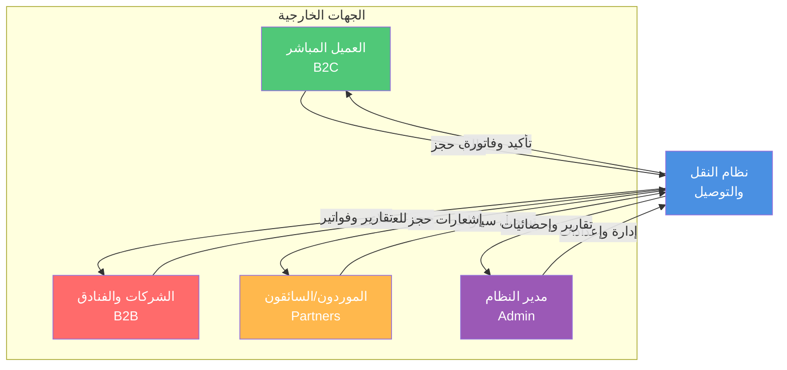

---

## 2. مخطط تدفق عملية الحجز للعميل المباشر

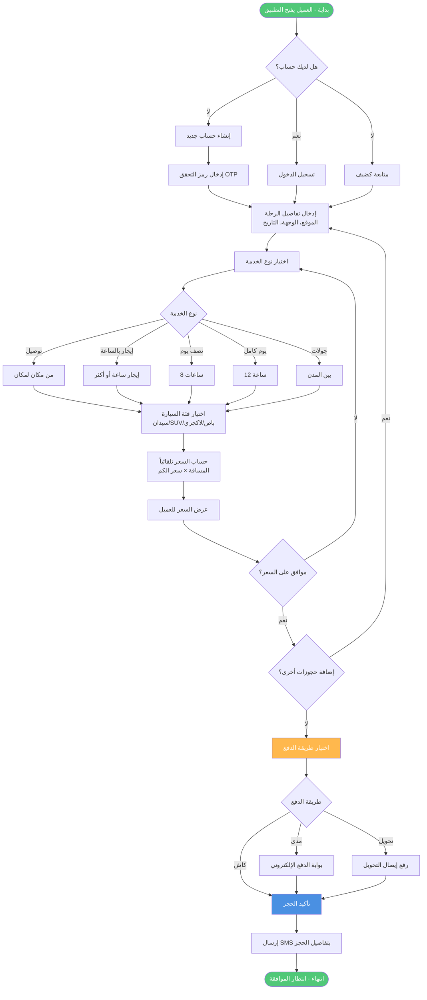
---

## 3. مخطط تدفق عملية التشغيل (للإدارة)
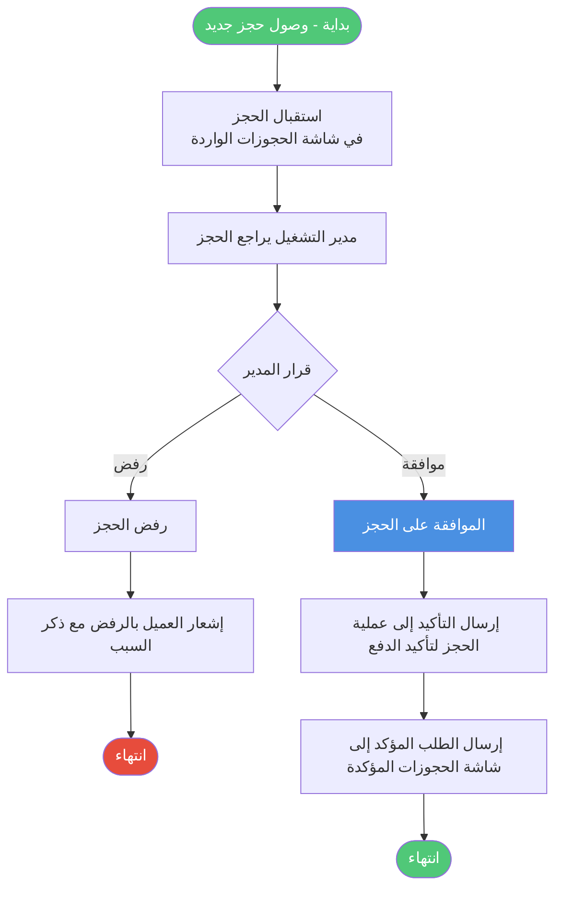
---
## 4.
مخطط تدفق
الحجوزات المؤكدة
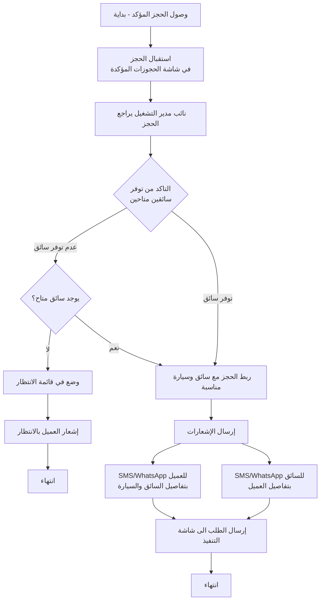
## 5. مخطط تدفق متابعة التنفيذ
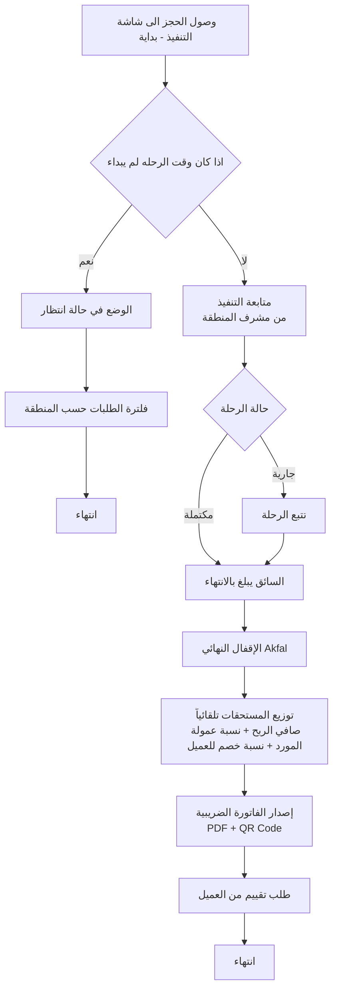

## 4. مخطط تدفق تسجيل مورد جديد

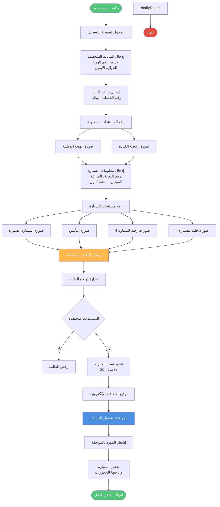

---

## 5. مخطط تدفق عملية الدفع
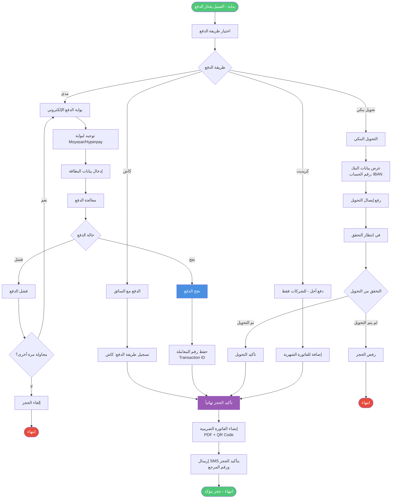

---

## 6. مخطط تسلسلي مبسط: حجز عميل مباشر (Sequence Diagram)

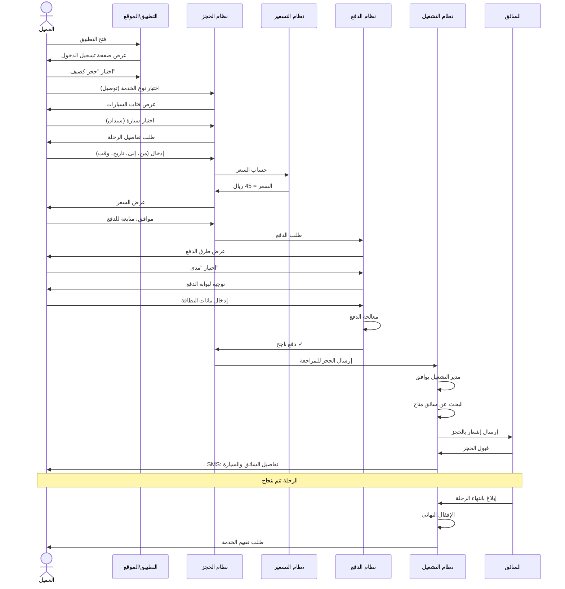

---

## 7. مخطط تسلسلي: تسجيل مورد جديد

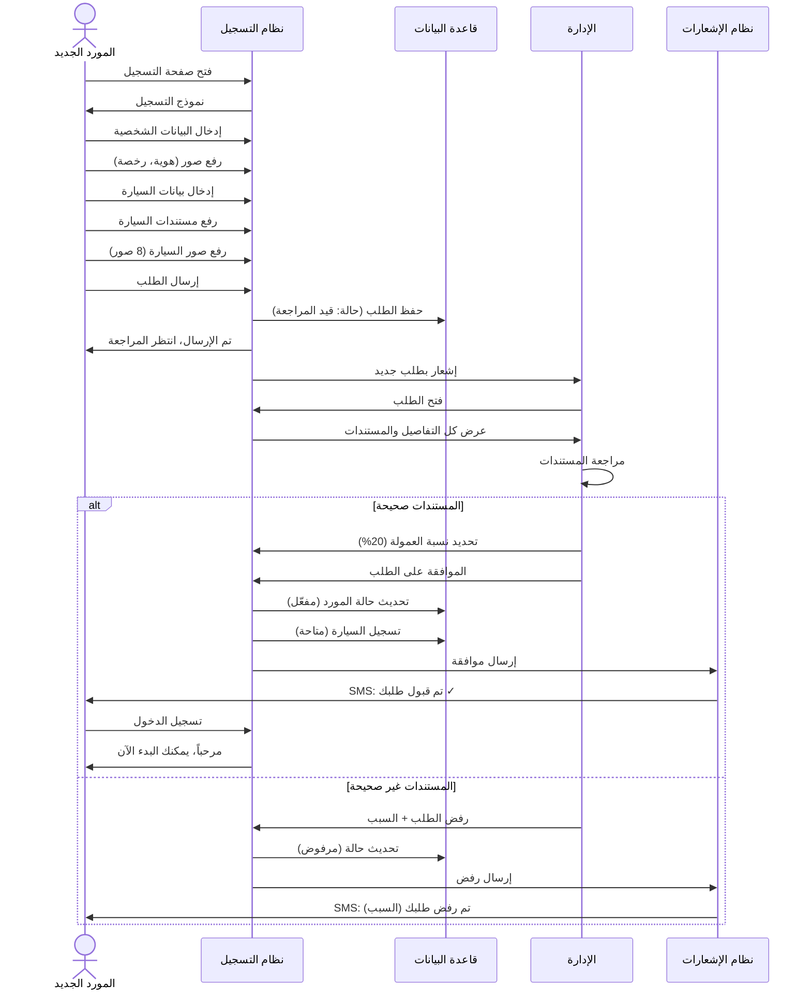

---

## 8. مخطط تسلسلي: موظف فندق يحجز لعميل

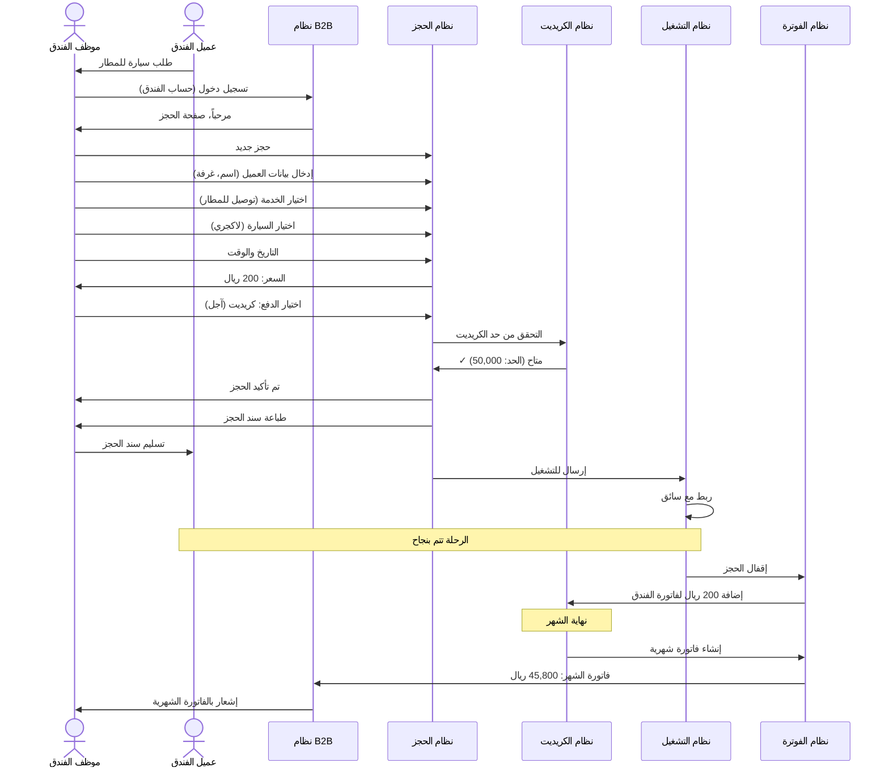

---

## 9. مخطط بسيط للعلاقات بين الكائنات (Simplified ERD)

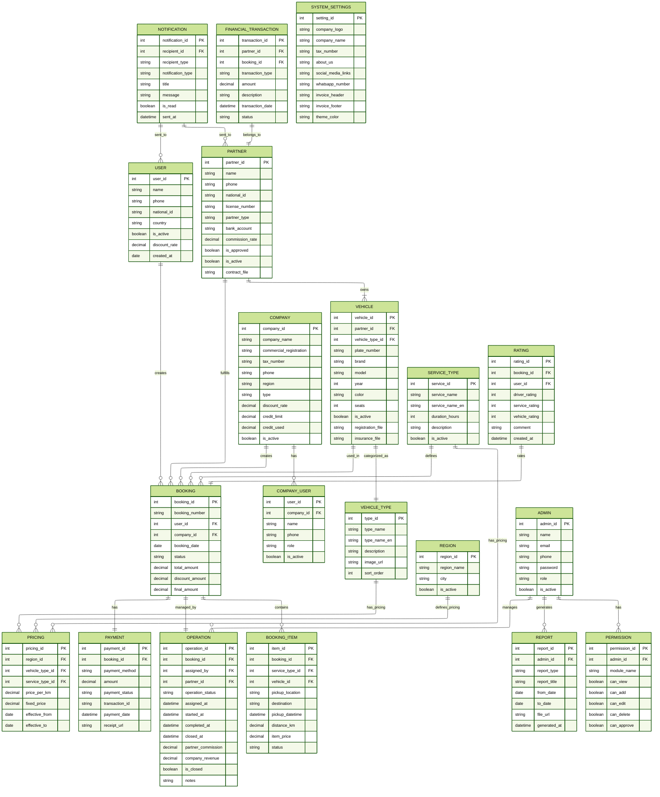
---

## 10. خريطة النظام الكاملة (System Map)

```mermaid
graph TB
    subgraph Frontend["الواجهات الأمامية"]
        WebApp[تطبيق الويب<br/>React.js]
        MobileApp[تطبيق الجوال<br/>React Native]
        AdminPanel[لوحة التحكم<br/>React.js]
    end
    
    subgraph Backend["الخادم Backend"]
        API[API Server<br/>Node.js/Laravel]
        Auth[نظام المصادقة<br/>JWT]
        BookingSys[نظام الحجز]
        PaymentSys[نظام الدفع]
        OperationSys[نظام التشغيل]
        NotifSys[نظام الإشعارات]
    end
    
    subgraph Database["قاعدة البيانات"]
        MySQL[(MySQL<br/>البيانات الرئيسية)]
        Redis[(Redis<br/>الكاش)]
    end
    
    subgraph External["خدمات خارجية"]
        GoogleMaps[Google Maps API<br/>الخرائط والمسافات]
        PaymentGW[Moyasar/Hyperpay<br/>بوابة الدفع]
        SMS[Twilio/Unifonic<br/>إرسال SMS]
        WhatsApp[WhatsApp API<br/>رسائل واتساب]
    end
    
    WebApp --> API
    MobileApp --> API
    AdminPanel --> API
    
    API --> Auth
    API --> BookingSys
    API --> PaymentSys
    API --> OperationSys
    API --> NotifSys
    
    BookingSys --> MySQL
    PaymentSys --> MySQL
    OperationSys --> MySQL
    Auth --> MySQL
    
    API --> Redis
    
    BookingSys --> GoogleM