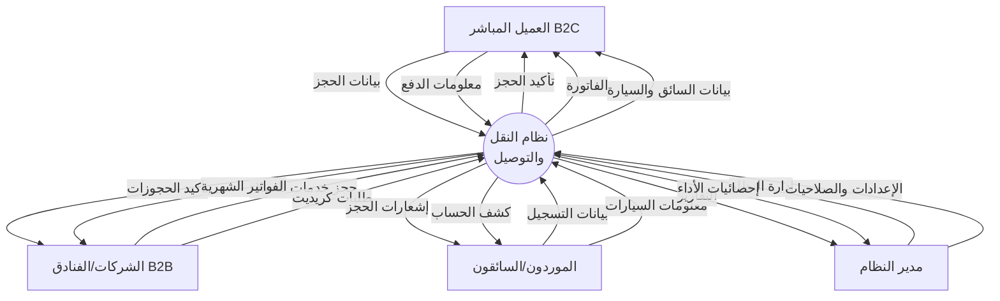
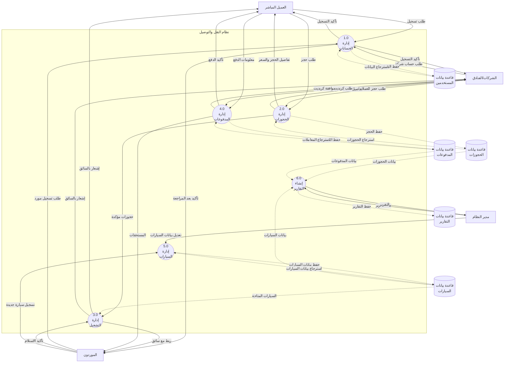
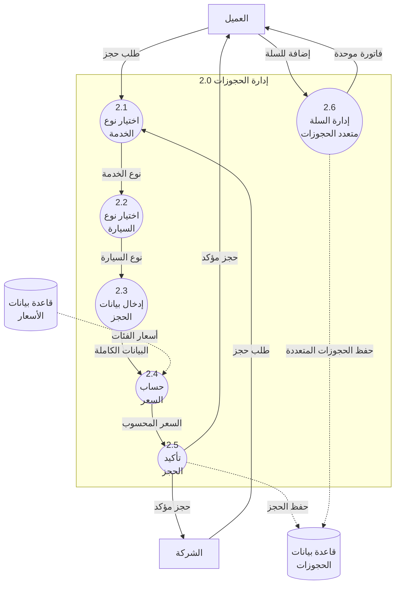
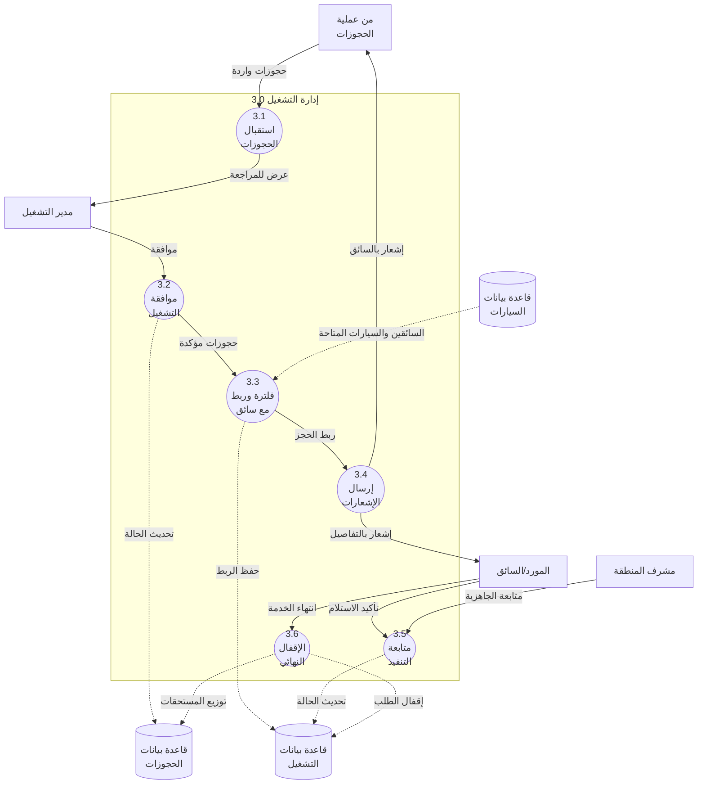
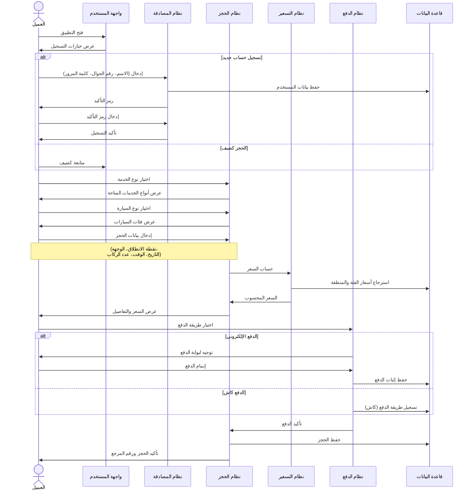
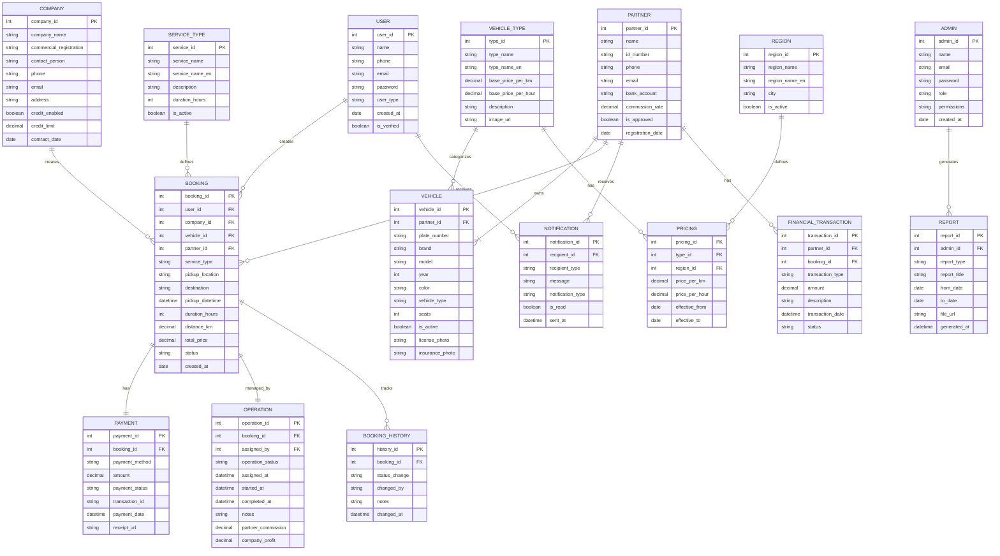

# تحليل وتصميم نظام لموقع إلكتروني خاص بخدمات النقل والتوصيل

**الإصدار الأول من وثيقة التحليل**

---

## المقدمة

نهدف من هذا العمل إلى تخطيط كامل للمشروع حيث نوضح فكرة المشروع والمشكلة التي توجد في الأنظمة الحالية ونحاول تفاديها بحلول مقترحة للنظام الذي نقوم بتصميمه وتنفيذه وتحديد أهداف المشروع والتحديات التي يمكن أن تواجهنا في تنفيذ المشروع والخطة الزمنية.

---

## التعرف على المشكلة

من أبرز المشاكل في خدمات النقل والتوصيل في السوق السعودي:

1. **عدم وجود نظام موحد** يخدم العملاء المباشرين والشركات والموردين في منصة واحدة
2. **صعوبة إدارة الحجوزات المتعددة** وربطها بالسائقين والسيارات المتاحة
3. **غياب آليات الدفع المرنة** التي تناسب احتياجات الشركات والفنادق (الدفع الآجل)
4. **عدم وجود نظام متابعة فعال** لعمليات التشغيل والرحلات الجوية
5. **صعوبة إدارة المواسم المزدحمة** مثل رمضان والحج والعمرة
6. **نقص الشفافية** في توزيع العمولات والمستحقات المالية بين الأطراف

---

## الحل المقترح

بعد حصر المشكلات التي توجد في إدارة خدمات النقل والتوصيل بالطرق التقليدية، توصلنا للحل المقترح وهو بناء نظام إلكتروني متكامل لإدارة خدمات النقل والتوصيل بالشكل التالي:

1. **نظام حجز B2C** للعملاء المباشرين مع إمكانية التسجيل كضيف أو إنشاء حساب
2. **نظام حجز B2B** للشركات والفنادق وشركات السياحة مع آليات دفع آجل
3. **نظام إدارة الموردين** لتسجيل السيارات والسائقين وإدارة حساباتهم المالية
4. **لوحة تحكم إدارية** لإدارة الحجوزات والسيارات والتقارير والإعدادات
5. **نظام تشغيل متطور** لربط الحجوزات بالسائقين وإدارة العمليات
6. **نظام دفع متعدد** يدعم الكاش، التحويل البنكي، مدى، والكريديت

---

## فكرة المشروع

إنشاء نظام معلومات متكامل لإدارة خدمات النقل والتوصيل في السوق السعودي، متخصص في إدارة الحجوزات، السيارات، الموردين، عمليات التشغيل، والتقارير المالية، ويتيح تصفحه عبر شبكة الإنترنت من أي مكان في العالم.

---

## الغاية والأهداف

1. **تحسين تجربة العملاء** من خلال نظام حجز سريع وسهل الاستخدام
2. **توفير خدمات متخصصة للشركات** مع آليات دفع مرنة
3. **تمكين الموردين** من إدارة أسطولهم وحساباتهم بكفاءة
4. **أتمتة عمليات التشغيل** وربط الحجوزات بالسائقين تلقائياً
5. **توفير الوقت والجهد** في إدارة العمليات اليومية
6. **نظام آمن وسريع** يضمن حماية البيانات والمعاملات المالية
7. **قابلية التطوير المستقبلي** لإضافة خدمات ومزايا جديدة

---

## الصعوبات

1. **تصميم وبرمجة النظام** باستخدام لغات برمجة متعددة ومتطورة
2. **التكامل مع بوابات الدفع** الإلكترونية المحلية والدولية
3. **إدارة المواسم المزدحمة** وضمان توفر السيارات
4. **التكامل مع أنظمة خارجية** مثل خرائط Google وبيانات الرحلات الجوية
5. **ضمان السرعة والاستجابة** مع عدد كبير من المستخدمين المتزامنين
6. **عدم اختبار النظام بشكل دقيق** في جميع السيناريوهات الممكنة

---

## عرض وتحليل نتائج الدراسات السابقة

### الموقع الأول: Uber
**الرابط:** https://www.uber.com

**المميزات:**
- نظام حجز سريع وسهل الاستخدام
- تتبع السائق في الوقت الفعلي
- تقييم السائقين والعملاء
- دعم طرق دفع متعددة

**نقاط التطوير في نظامنا:**
- إضافة خدمات B2B متخصصة
- دعم الدفع الآجل للشركات
- خدمات إيجار بالساعة واليوم

### الموقع الثاني: Careem
**الرابط:** https://www.careem.com

**المميزات:**
- واجهة باللغة العربية
- دعم السوق السعودي
- خدمات متنوعة

**نقاط التطوير في نظامنا:**
- نظام إدارة الموردين الشامل
- خدمات الجولات السياحية
- آليات دفع آجل

### الموقع الثالث: Limo
**الرابط:** https://www.limo.sa

**المميزات:**
- متخصص في السوق السعودي
- خدمات VIP

**نقاط التطوير في نظامنا:**
- تنوع أكبر في أنواع الخدمات
- نظام B2B متكامل
- لوحة تحكم شاملة

---

## مرحلة تحليل النظام المقترح

### مقدمة عن طرق تحليل البيانات

تمثل نظم المعلومات الرقمية المكونات المتكاملة التي تعمل على جمع وتخزين ومعالجة البيانات من أجل توفير المعلومات والمعرفة والخدمات الرقمية. لا يمكن للشركات والمؤسسات الاستغناء عنها فهي تحتاجها لإدارة عملياتها وتنفيذها.

يتم تطوير أنظمة المعلومات وصيانتها وفق عملية منهجية تسمى "دورة حياة النظام" والمتكونة من المراحل الآتية: دراسة الجدوى، وتحليل النظام، وتصميم النظام، والبرمجة والاختبار، والتثبيت والتشغيل والصيانة.

### مفهوم تحليل النظم

يشير مفهوم تحليل النظم إلى العملية التي يتم من خلالها حل المشكلات، فهي تعمل على تقسيم النظام إلى الأجزاء المكونة له بغرض دراسة مدى فاعلية عمل هذه الأجزاء لإنجاز الغرض المطلوب منها.

### طرق جمع البيانات لتحليل النظام

تم اتباع نموذج الشلال وفق الخطوات الآتية:

1. **تحديد المشكلات:** تحديد الأهداف والمتطلبات المحددة بشكل واضح لتلبية متطلبات المشروع
2. **تحليل المشكلات:** فهم المشكلات ومتطلبات أصحاب المصلحة ودراستها وطرح الحلول المناسبة
3. **تحليل المتطلبات:** تحديد الشروط التي يجب الوفاء بها
4. **التصميم المنطقي:** تصميم النظام وإيجاد العلاقات المنطقية بين الكائنات المكونة للنظام
5. **تحليل القرار:** اتخاذ القرار النهائي قبل البدء في مرحلة تصميم النظام
6. **تصميم حالات الاستخدام:** تصميم حالات الاستخدام Use Cases للتعبير عن متطلبات النظام الوظيفية

---

## دورة حياة النظام (SDLC)

في هندسة النظم ونظم المعلومات وهندسة البرمجيات، دورة حياة تطوير البرمجيات (SDLC) هي عملية التخطيط والخلق والاختبار والنشر لنظام المعلومات.

عادة ما تكون هناك ست مراحل في هذه الدورة: تحليل المتطلبات والتصميم والتطوير والاختبار والتنفيذ والتوثيق والتقييم.

### نموذج الشلال

هو عملية تصميم متتالية عادة ما تستخدم في عمليات تطوير البرمجيات، ويكون التقدم في سير العمل على هيئة قطع ثابتة متدفقة من أعلى إلى أسفل (مثل الشلال) من خلال المراحل:

**التخطيط ← التحليل ← التصميم ← التنفيذ ← الاختبار ← الصيانة**

### أسباب استخدام نموذج الشلال

1. نموذج سهل للفهم
2. سهل الإدارة
3. المراحل تكتمل وتعالج مرحلة تلو الأخرى
4. مناسب للمشروع المتوسط الحجم

---

## مخطط تدفق البيانات (DFD)

### مخطط السياق (Context Diagram)

يوضح الشكل التالي العمليات الأساسية التي تحدث بالنظام ويوجد أربعة كيانات رئيسية:

- **العميل المباشر (B2C)**
- **الشركات/الفنادق (B2B)**
- **الموردون/الشركاء**
- **مدير النظام**

والعملية بالمنتصف تمثل نظام النقل والتوصيل الذي نملكه.

### مخطط تدفق البيانات المستوى الصفري (Level 0 DFD)

### مخطط تدفق البيانات المستوى الأول (Level 1 DFD)

#### عملية إدارة الحجوزات (2.0)

#### عملية إدارة التشغيل (3.0)

---

## حالات الاستخدام (Use Cases)

### مخطط حالات الاستخدام العام

```mermaid
graph TB
    subgraph Actors[الجهات الفاعلة]
        Client[العميل المباشر]
        BusinessUser[موظف الشركة/الفندق]
        Partner[المورد/السائق]
        OpManager[مدير التشغيل]
        Supervisor[مشرف المنطقة]
        Admin[مدير النظام]
    end
    
    subgraph System[نظام النقل والتوصيل]
        subgraph ClientUC[حالات العميل]
            UC1[تسجيل حساب جديد]
            UC2[الحجز كضيف]
            UC3[اختيار نوع الخدمة]
            UC4[اختيار نوع السيارة]
            UC5[إدخال بيانات الحجز]
            UC6[عرض السعر]
            UC7[الدفع]
            UC8[إضافة حجوزات متعددة]
            UC9[عرض الحجوزات السابقة]
        end
        
        subgraph BusinessUC[حالات الشركات]
            UC10[طلب حساب شركة]
            UC11[الحجز باسم العملاء]
            UC12[طلب كريديت]
            UC13[عرض الفواتير الشهرية]
        end
        
        subgraph PartnerUC[حالات الموردين]
            UC14[التسجيل كمورد]
            UC15[إرفاق المستندات]
            UC16[تسجيل سيارة جديدة]
            UC17[استلام إشعارات الحجز]
            UC18[تأكيد/رفض الحجز]
            UC19[عرض كشف الحساب]
            UC20[متابعة المستحقات]
        end
        
        subgraph OperationUC[حالات التشغيل]
            UC21[استقبال الحجوزات]
            UC22[الموافقة على الحجز]
            UC23[فلترة الحجوزات]
            UC24[ربط حجز مع سائق]
            UC25[إرسال الإشعارات]
            UC26[متابعة التنفيذ]
            UC27[الإقفال النهائي]
            UC28[متابعة الرحلات الجوية]
        end
        
        subgraph AdminUC[حالات الإدارة]
            UC29[إدارة المستخدمين]
            UC30[إدارة السيارات]
            UC31[إدارة الأسعار]
            UC32[عرض التقارير]
            UC33[إدارة الصلاحيات]
            UC34[تخصيص الهوية البصرية]
            UC35[إدارة اللغات]
        end
    end
    
    Client --> UC1
    Client --> UC2
    Client --> UC3
    Client --> UC4
    Client --> UC5
    Client --> UC6
    Client --> UC7
    Client --> UC8
    Client --> UC9
    
    BusinessUser --> UC10
    BusinessUser --> UC11
    BusinessUser --> UC12
    BusinessUser --> UC13
    
    Partner --> UC14
    Partner --> UC15
    Partner --> UC16
    Partner --> UC17
    Partner --> UC18
    Partner --> UC19
    Partner --> UC20
    
    OpManager --> UC21
    OpManager --> UC22
    OpManager --> UC23
    OpManager --> UC24
    OpManager --> UC25
    
    Supervisor --> UC26
    Supervisor --> UC28
    
    OpManager --> UC27
    
    Admin --> UC29
    Admin --> UC30
    Admin --> UC31
    Admin --> UC32
    Admin --> UC33
    Admin --> UC34
    Admin --> UC35
    
    UC7 -.->|يتضمن| UC6
    UC8 -.->|يتضمن| UC3
    UC8 -.->|يتضمن| UC4
    UC11 -.->|يشبه| UC3
    UC24 -.->|يتطلب| UC23
    UC25 -.->|يتبع| UC24
    UC27 -.->|يتطلب| UC26
```

### حالة استخدام تفصيلية: عملية الحجز للعميل المباشر

---

## مخطط ارتباط الكائنات (Entity Relationship Diagram)

---

## تصميم قاعدة البيانات (Database Schema)

### الجداول الرئيسية

#### 1. جدول المستخدمين (Users)
- **user_id** (Primary Key): معرف المستخدم
- **name**: اسم المستخدم
- **phone**: رقم الجوال
- **email**: البريد الإلكتروني
- **password**: كلمة المرور (مشفرة)
- **user_type**: نوع المستخدم (customer, business, partner, admin)
- **created_at**: تاريخ التسجيل
- **is_verified**: حالة التحقق من الحساب

#### 2. جدول الشركات (Companies)
- **company_id** (Primary Key): معرف الشركة
- **company_name**: اسم الشركة
- **commercial_registration**: السجل التجاري
- **contact_person**: الشخص المسؤول
- **phone**: رقم الهاتف
- **email**: البريد الإلكتروني
- **address**: العنوان
- **credit_enabled**: تفعيل الكريديت
- **credit_limit**: حد الكريديت
- **contract_date**: تاريخ العقد

#### 3. جدول الموردين/الشركاء (Partners)
- **partner_id** (Primary Key): معرف المورد
- **name**: اسم المورد
- **id_number**: رقم الهوية
- **phone**: رقم الجوال
- **email**: البريد الإلكتروني
- **bank_account**: الحساب البنكي
- **commission_rate**: نسبة العمولة
- **is_approved**: حالة الموافقة
- **registration_date**: تاريخ التسجيل

#### 4. جدول السيارات (Vehicles)
- **vehicle_id** (Primary Key): معرف السيارة
- **partner_id** (Foreign Key): معرف المورد
- **plate_number**: رقم اللوحة
- **brand**: الماركة
- **model**: الموديل
- **year**: سنة الصنع
- **color**: اللون
- **vehicle_type**: فئة السيارة
- **seats**: عدد المقاعد
- **is_active**: حالة التفعيل
- **license_photo**: صورة الرخصة
- **insurance_photo**: صورة التأمين

#### 5. جدول الحجوزات (Bookings)
- **booking_id** (Primary Key): معرف الحجز
- **user_id** (Foreign Key): معرف المستخدم
- **company_id** (Foreign Key): معرف الشركة
- **vehicle_id** (Foreign Key): معرف السيارة
- **partner_id** (Foreign Key): معرف المورد
- **service_type**: نوع الخدمة
- **pickup_location**: موقع الانطلاق
- **destination**: الوجهة
- **pickup_datetime**: تاريخ ووقت الانطلاق
- **duration_hours**: عدد الساعات
- **distance_km**: المسافة بالكيلومتر
- **total_price**: السعر الإجمالي
- **status**: حالة الحجز
- **created_at**: تاريخ الإنشاء

#### 6. جدول المدفوعات (Payments)
- **payment_id** (Primary Key): معرف الدفعة
- **booking_id** (Foreign Key): معرف الحجز
- **payment_method**: طريقة الدفع
- **amount**: المبلغ
- **payment_status**: حالة الدفع
- **transaction_id**: رقم المعاملة
- **payment_date**: تاريخ الدفع
- **receipt_url**: رابط الإيصال

---

## الواجهات الرئيسية (User Interfaces)

### 1. واجهة العميل المباشر (B2C)

#### الصفحة الرئيسية
- شعار التطبيق
- زر تسجيل الدخول / إنشاء حساب
- زر الحجز كضيف
- خيارات اللغة (عربي/إنجليزي)

#### شاشة الحجز
- قائمة منسدلة لاختيار نوع الخدمة
- عرض فئات السيارات مع الصور والأسعار
- حقول إدخال:
  - موقع الانطلاق (مع خريطة)
  - الوجهة (مع خريطة)
  - التاريخ والوقت
  - عدد الركاب
- زر حساب السعر
- عرض السعر التقديري
- زر إضافة للسلة / الحجز المباشر

#### شاشة السلة
- قائمة الحجوزات المضافة
- السعر الإجمالي
- زر المتابعة للدفع

#### شاشة الدفع
- اختيار طريقة الدفع:
  - كاش مع السائق
  - مدى
  - تحويل بنكي
- زر تأكيد الحجز

#### شاشة تفاصيل الحجز
- رقم الحجز
- معلومات السائق (الاسم، الصورة، رقم الجوال)
- معلومات السيارة (الماركة، الموديل، اللون، رقم اللوحة)
- زر تتبع السيارة على الخريطة
- زر الاتصال بالسائق
- زر إلغاء الحجز

### 2. واجهة الشركات (B2B)

#### لوحة التحكم
- إحصائيات سريعة (عدد الحجوزات، المبالغ، رصيد الكريديت)
- الحجوزات النشطة
- زر حجز جديد

#### شاشة الحجز للعملاء
- نفس شاشة الحجز للعميل المباشر
- حقل إضافي: اسم العميل/رقم الغرفة/رقم الرحلة
- خيار الدفع الآجل (Deferred Payment)

#### شاشة الفواتير
- قائمة الفواتير الشهرية
- تفاصيل كل فاتورة
- زر تحميل الفاتورة PDF
- حالة السداد

### 3. واجهة الموردين/الشركاء

#### لوحة التحكم
- إحصائيات الأداء (عدد الرحلات، الأرباح)
- الحجوزات الواردة
- الحجوزات النشطة
- كشف الحساب

#### شاشة تسجيل السيارة
- معلومات السيارة الأساسية
- رفع صور السيارة (4 داخلية + 4 خارجية)
- رفع المستندات (رخصة القيادة، استمارة السيارة، التأمين)

#### شاشة الحجوزات الواردة
- قائمة الحجوزات الجديدة
- تفاصيل كل حجز
- زر قبول / رفض

#### شاشة الحجوزات النشطة
- قائمة الرحلات الجارية
- معلومات العميل
- الموقع على الخريطة
- زر إنهاء الرحلة

#### شاشة كشف الحساب
- قائمة المعاملات المالية
- المبالغ المستحقة
- المبالغ المدفوعة
- الرصيد الحالي

### 4. لوحة التحكم الإدارية

#### الصفحة الرئيسية
- Dashboard مع إحصائيات شاملة:
  - عدد الحجوزات اليوم/الأسبوع/الشهر
  - الإيرادات
  - عدد العملاء النشطين
  - عدد السيارات العاملة
  - معدل إنجاز الرحلات

#### شاشة الحجوزات الواردة
- جدول بجميع الحجوزات الجديدة
- فلاتر (التاريخ، المنطقة، نوع الخدمة، الحالة)
- زر الموافقة / الرفض لكل حجز

#### شاشة الحجوزات المؤكدة
- جدول بالحجوزات المؤكدة
- فلاتر متقدمة
- إمكانية البحث عن سائق متاح
- زر ربط الحجز مع سائق

#### شاشة التشغيل
- خريطة تفاعلية تعرض:
  - السيارات المتاحة
  - الحجوزات النشطة
  - السائقين في الطريق
- لوحة جانبية بتفاصيل كل رحلة

#### شاشة السيارات
- جدول بجميع السيارات
- معلومات تفصيلية لكل سيارة
- حالة التفعيل
- زر تعديل / حذف

#### شاشة الموردين
- جدول بجميع الموردين
- معلومات الاتصال
- السيارات المسجلة
- نسبة العمولة
- كشف الحساب

#### شاشة العملاء
- جدول بالعملاء (B2C و B2B)
- معلومات الحساب
- سجل الحجوزات
- حالة الحساب

#### شاشة الأسعار
- جدول فئات السيارات مع الأسعار
- تعديل السعر لكل منطقة
- تاريخ سريان الأسعار

#### شاشة التقارير
- تقارير جاهزة:
  - تقرير الحجوزات
  - تقرير الإيرادات
  - تقرير أداء السائقين
  - تقرير رضا العملاء
- فلاتر التاريخ والمنطقة
- زر تصدير (PDF, Excel)

#### شاشة الإعدادات
- إعدادات الهوية البصرية (الشعار، الألوان)
- إعدادات اللغات
- إدارة الصلاحيات
- إعدادات بوابات الدفع
- إعدادات الإشعارات

---

## المتطلبات الوظيفية (Functional Requirements)

### 1. إدارة المستخدمين
- تسجيل حساب جديد للعملاء (اسم، جوال، كلمة مرور)
- التحقق من رقم الجوال عبر رمز التأكيد (OTP)
- تسجيل الدخول وإدارة الجلسات
- استعادة كلمة المرور
- الحجز كضيف دون تسجيل
- إنشاء حسابات الشركات بعد المراجعة الإدارية
- تسجيل الموردين مع إرفاق المستندات المطلوبة

### 2. إدارة الحجوزات
- اختيار نوع الخدمة (توصيل، إيجار بالساعة، نصف يوم، يوم كامل، جولات بين المدن)
- اختيار فئة السيارة (سيدان، SUV، باصات، لاكجري)
- إدخال تفاصيل الرحلة (الانطلاق، الوجهة، التاريخ، الوقت)
- حساب السعر تلقائياً بناءً على المسافة ونوع السيارة والمنطقة
- عرض السعر قبل التأكيد
- إضافة حجوزات متعددة في سلة واحدة
- دعم الحجز لنفس العميل في أوقات مختلفة
- تأكيد الحجز بعد الدفع أو الموافقة الإدارية

### 3. إدارة المدفوعات
- دعم طرق دفع متعددة:
  - كاش مع السائق
  - بطاقة مدى عبر بوابة دفع محلية
  - تحويل بنكي مع رفع الإيصال
  - كريديت (آجل) للشركات والفنادق
- إصدار فاتورة ضريبية PDF مع QR Code
- متابعة حالة الدفع
- إدارة المستحقات للموردين
- توزيع العمولات تلقائياً بعد الإقفال

### 4. إدارة التشغيل
- استقبال الحجوزات الواردة في شاشة خاصة
- موافقة مدير التشغيل على الحجوزات
- فلترة الحجوزات حسب التاريخ والمنطقة
- البحث عن سائقين وسيارات متاحة
- ربط الحجز مع سائق وسيارة
- إرسال إشعارات SMS/WhatsApp للعميل والسائق
- متابعة حالة التنفيذ من قبل مشرفي المناطق
- إقفال الطلب بعد إتمام الخدمة
- منع التعديل بعد الإقفال إلا بصلاحيات عليا

### 5. إدارة السيارات والموردين
- تسجيل سيارات جديدة مع التفاصيل الكاملة
- رفع صور السيارة والمستندات المطلوبة
- مراجعة واعتماد السيارات المسجلة
- تفعيل/إيقاف السيارات
- تحديد نسبة عمولة لكل مورد
- عرض كشف حساب تفصيلي لكل مورد

### 6. التقارير والإحصائيات
- تقارير الحجوزات (يومية، أسبوعية، شهرية)
- تقارير الإيرادات والأرباح
- تقارير أداء السائقين
- تقارير رضا العملاء
- فلترة التقارير حسب التاريخ والمنطقة
- تصدير التقارير PDF و Excel

### 7. الإشعارات والتنبيهات
- إشعارات تأكيد الحجز للعميل
- إشعارات إسناد الرحلة للسائق
- إشعارات بيانات السائق والسيارة للعميل
- إشعارات الدفع المستحق
- تنبيهات التأخير أو المشاكل
- إشعارات التقييم بعد إنهاء الرحلة

---

## المتطلبات غير الوظيفية (Non-Functional Requirements)

### 1. الأداء (Performance)
- وقت استجابة الصفحات لا يتجاوز 2 ثانية
- دعم 1000 مستخدم متزامن كحد أدنى
- القدرة على معالجة 100 حجز في الدقيقة
- سرعة تحميل الخرائط والمواقع

### 2. الأمان (Security)
- تشفير كلمات المرور (Hashing)
- استخدام HTTPS لجميع الاتصالات
- حماية من هجمات SQL Injection و XSS
- مصادقة ثنائية للحسابات الإدارية
- تسجيل جميع العمليات الحساسة (Audit Log)

### 3. قابلية الاستخدام (Usability)
- واجهة مستخدم بسيطة وسهلة
- دعم اللغة العربية والإنجليزية
- تصميم متجاوب (Responsive) للجوال والحاسوب
- إمكانية الوصول للمعاقين (Accessibility)

### 4. الموثوقية (Reliability)
- توفر النظام 99.9% من الوقت
- نظام نسخ احتياطي يومي للبيانات
- آلية استرجاع البيانات عند الأعطال
- معالجة الأخطاء بشكل سلس

### 5. قابلية التوسع (Scalability)
- إمكانية إضافة مناطق جديدة بسهولة
- إمكانية إضافة أنواع خدمات جديدة
- إمكانية إضافة فئات سيارات جديدة
- دعم تعدد اللغات دون تعديل الكود

### 6. التوافق (Compatibility)
- دعم المتصفحات الحديثة (Chrome, Firefox, Safari, Edge)
- دعم أنظمة iOS و Android
- التكامل مع خرائط Google
- التكامل مع بوابات الدفع المحلية والدولية

---

## التقنيات المقترحة (Proposed Technologies)

### Frontend (واجهة المستخدم)
- **React.js** لبناء واجهة ويب تفاعلية
- **React Native** لتطبيقات الجوال (iOS & Android)
- **Tailwind CSS** للتصميم والأنماط
- **Redux** لإدارة الحالة (State Management)
- **Google Maps API** للخرائط والمواقع

### Backend (الخادم)
- **Node.js + Express.js** أو **Laravel (PHP)** لبناء API
- **JWT** للمصادقة والترخيص
- **Socket.io** للإشعارات الفورية
- **Redis** للتخزين المؤقت (Caching)

### Database (قاعدة البيانات)
- **MySQL** أو **PostgreSQL** لقاعدة البيانات الرئيسية
- **MongoDB** للبيانات غير المهيكلة (اختياري)

### Payment Gateway (بوابة الدفع)
- **Moyasar** أو **Hyperpay** للدفع الإلكتروني في السعودية
- **Stripe** كخيار دولي

### Hosting & Infrastructure
- **AWS** أو **Google Cloud** للاستضافة السحابية
- **Docker** للحاويات (Containers)
- **Nginx** كخادم ويب
- **SSL Certificate** للتشفير

### Notifications
- **Twilio** أو **Unifonic** لإرسال SMS
- **WhatsApp Business API** لإرسال رسائل WhatsApp
- **Firebase Cloud Messaging** للإشعارات داخل التطبيق

### Monitoring & Analytics
- **Google Analytics** لتحليل سلوك المستخدمين
- **Sentry** لمراقبة الأخطاء
- **Grafana** لمراقبة الأداء

---

## خطة التنفيذ (Implementation Plan)

### المرحلة الأولى: التحليل والتصميم (4 أسابيع)
- إعداد تقرير التحليل الشامل ✓
- تصميم مخططات قاعدة البيانات
- تصميم الواجهات (UI/UX Wireframes)
- إعداد نموذج أولي تفاعلي (Prototype)
- تحديد قائمة الأولويات (MVP)

### المرحلة الثانية: تطوير MVP (8 أسابيع)
- إعداد البنية التحتية والبيئة التطويرية
- تطوير قاعدة البيانات
- تطوير APIs الأساسية
- تطوير واجهة العميل (B2C)
- تطوير لوحة التحكم الأساسية
- دمج بوابة الدفع
- دمج خرائط Google

### المرحلة الثالثة: التطوير الكامل (12 أسبوع)
- تطوير واجهة الشركات (B2B)
- تطوير واجهة الموردين
- تطوير نظام التشغيل الكامل
- تطوير نظام التقارير
- تطوير نظام الإشعارات
- تطوير تطبيقات الجوال

### المرحلة الرابعة: الاختبار (4 أسابيع)
- اختبار الوحدات (Unit Testing)
- اختبار التكامل (Integration Testing)
- اختبار الأداء (Performance Testing)
- اختبار الأمان (Security Testing)
- اختبار قبول المستخدم (UAT)

### المرحلة الخامسة: النشر والإطلاق (2 أسبوع)
- نشر النظام على الخوادم
- تدريب الموظفين
- إطلاق تجريبي (Beta)
- معالجة المشاكل والملاحظات
- الإطلاق الرسمي

### المرحلة السادسة: الصيانة والدعم (مستمرة)
- مراقبة الأداء
- معالجة الأخطاء
- إضافة مزايا جديدة
- تحديثات الأمان
- الدعم الفني للمستخدمين

---

## مؤشرات الأداء الرئيسية (KPIs)

1. **عدد الحجوزات اليومية/الشهرية**
2. **معدل تحويل الزوار إلى عملاء**
3. **معدل إتمام الحجوزات بنجاح**
4. **متوسط وقت ربط الحجز مع سائق**
5. **معدل رضا العملاء (Customer Satisfaction)**
6. **معدل إلغاء الحجوزات**
7. **الإيرادات الشهرية**
8. **عدد المستخدمين النشطين**
9. **معدل استخدام التطبيق (DAU/MAU)**
10. **متوسط قيمة الحجز**

---

## التحديات المتوقعة والحلول

### 1. إدارة المواسم المزدحمة
**التحدي:** زيادة الطلب في رمضان والحج والعمرة
**الحل:** 
- نظام طابور انتظار للحجوزات
- إشعار العميل بأن الحجز قيد المراجعة
- زيادة عدد الموردين والسيارات المتاحة

### 2. دقة حساب المسافة والوقت
**التحدي:** الاعتماد على Google Maps قد يعطي تقديرات غير دقيقة
**الحل:**
- استخدام خوارزميات متطورة لحساب المسافة
- احتساب وقت إضافي للزحام المروري
- إمكانية تعديل السعر النهائي بعد إتمام الرحلة

### 3. إدارة النزاعات
**التحدي:** نزاعات بين العملاء والسائقين
**الحل:**
- نظام تقييم ثنائي الاتجاه
- تسجيل تفاصيل الرحلة والمواقع GPS
- قسم دعم عملاء متخصص
- سياسات واضحة للإلغاء والاسترجاع

### 4. أمان البيانات والمدفوعات
**التحدي:** حماية البيانات الحساسة ومعلومات الدفع
**الحل:**
- استخدام معايير PCI DSS لأمان الدفع
- تشفير جميع البيانات الحساسة
- مصادقة ثنائية للحسابات
- مراجعات أمنية دورية

### 5. التكامل مع الأنظمة الخارجية
**التحدي:** التكامل مع بوابات الدفع وخرائط Google ومعلومات الرحلات
**الحل:**
- استخدام APIs موثوقة ومستقرة
- بناء طبقة تكامل قابلة للتوسع
- معالجة الأخطاء بشكل فعال
- خطة بديلة عند تعطل الخدمات الخارجية

---

## معايير الجودة (Quality Standards)

### 1. معايير الكود (Coding Standards)
- اتباع معايير كتابة الكود الخاصة بكل لغة برمجة
- كتابة تعليقات توضيحية للكود
- مراجعة الكود (Code Review) قبل الدمج
- استخدام Git للتحكم في الإصدارات

### 2. معايير الاختبار (Testing Standards)
- تغطية 80% من الكود بالاختبارات
- اختبار جميع السيناريوهات المحتملة
- اختبارات أداء تحت ضغط
- اختبارات أمان شاملة

### 3. معايير الواجهات (UI/UX Standards)
- تصميم متجاوب لجميع الأجهزة
- سهولة الاستخدام والتنقل
- وقت تحميل سريع للصفحات
- تجربة مستخدم سلسة

### 4. معايير الأمان (Security Standards)
- تشفير جميع الاتصالات (HTTPS)
- حماية من الهجمات الشائعة
- سياسة كلمات مرور قوية
- نسخ احتياطي يومي

---

## سيناريوهات الاستخدام التفصيلية

### سيناريو 1: عميل مباشر يحجز رحلة توصيل من مكان لمكان

**الخطوات:**
1. العميل يفتح التطبيق أو الموقع
2. يختار "تسجيل دخول" أو "حجز كضيف"
3. يختار نوع الخدمة: "توصيل من مكان لمكان"
4. يختار فئة السيارة: "سيدان"
5. يدخل موقع الانطلاق: "مطار جدة"
6. يدخل الوجهة: "فندق موفنبيك جدة"
7. يختار التاريخ والوقت
8. النظام يحسب المسافة (25 كم) والسعر (37.5 ريال)
9. العميل يوافق على السعر ويضغط "متابعة"
10. يختار طريقة الدفع: "مدى"
11. يتم توجيهه لبوابة الدفع ويدخل بيانات البطاقة
12. يتم تأكيد الدفع والحجز
13. يستلم رسالة SMS بتفاصيل الحجز ورقم المرجع
14. مدير التشغيل يراجع الحجز ويوافق عليه
15. يتم ربط الحجز مع سائق متاح
16. العميل يستلم إشعار ببيانات السائق والسيارة
17. السائق يصل في الموعد المحدد ويقوم بالتوصيل
18. بعد إنهاء الرحلة، يطلب من العميل تقييم الخدمة

### سيناريو 2: موظف فندق يحجز لعميل مع دفع آجل

**الخطوات:**
1. موظف الفندق يسجل دخول بحسابه المعتمد
2. يختار "حجز جديد"
3. يدخل معلومات العميل (الاسم، رقم الغرفة)
4. يختار نوع الخدمة: "إيجار يوم كامل"
5. يختار فئة السيارة: "لاكجري"
6. يدخل التاريخ والوقت
7. النظام يحسب السعر (سعر ثابت 12 ساعة)
8. يختار طريقة الدفع: "كريديت (آجل)"
9. يتم تأكيد الحجز مباشرة
10. يطبع سند الحجز للعميل
11. يتم إضافة المبلغ لفاتورة الفندق الشهرية
12. باقي الخطوات تتم كالسيناريو الأول

### سيناريو 3: مورد يسجل سيارة جديدة

**الخطوات:**
1. المورد يسجل دخول لحسابه
2. يختار "إضافة سيارة جديدة"
3. يدخل معلومات السيارة:
   - رقم اللوحة: ABC 1234
   - الماركة: تويوتا
   - الموديل: كامري
   - سنة الصنع: 2023
   - اللون: أبيض
   - فئة السيارة: سيدان
   - عدد المقاعد: 5
4. يرفع صور السيارة (4 داخلية + 4 خارجية)
5. يرفع المستندات:
   - صورة رخصة القيادة
   - صورة الهوية
   - صورة استمارة السيارة
   - صورة التأمين
6. يضغط "إرسال للمراجعة"
7. الإدارة تراجع البيانات والمستندات
8. يتم تحديد نسبة العمولة (مثلاً 20%)
9. يتم الموافقة وتفعيل السيارة
10. المورد يستلم إشعار بالموافقة
11. السيارة تصبح متاحة للحجوزات

---

## نموذج الأعمال (Business Model)

### مصادر الدخل

1. **عمولة على كل حجز:**
   - نسبة من قيمة كل رحلة (15-25%)
   - تختلف حسب فئة السيارة ونوع الخدمة

2. **رسوم الاشتراك للموردين:**
   - رسوم شهرية أو سنوية لكل سيارة مسجلة (اختياري)

3. **رسوم إضافية للشركات:**
   - رسوم إدارة حسابات B2B
   - رسوم على خدمة الكريديت

4. **رسوم الإلغاء المتأخر:**
   - نسبة من قيمة الحجز عند الإلغاء بعد فترة معينة

5. **خدمات إضافية:**
   - خدمات VIP مميزة
   - تأمين إضافي على الرحلة
   - خدمات استقبال المطار الفاخرة

### هيكل التكاليف

1. **تكاليف التطوير:**
   - فريق التطوير (مطورين، مصممين، محللين)
   - البنية التحتية التقنية
   - الرخص والأدوات

2. **تكاليف التشغيل:**
   - استضافة الخوادم
   - رسوم بوابات الدفع (2-3% من كل معاملة)
   - رسوم Google Maps API
   - رسوم SMS و WhatsApp

3. **تكاليف التسويق:**
   - الإعلانات الرقمية
   - التسويق عبر وسائل التواصل
   - عروض وخصومات للعملاء الجدد

4. **تكاليف الدعم:**
   - فريق خدمة العملاء
   - فريق التشغيل
   - الصيانة والتحديثات

---

## استراتيجية التسويق

### 1. المرحلة الأولى: الإطلاق
- حملة إعلانية مكثفة على وسائل التواصل الاجتماعي
- عروض خاصة للعملاء الأوائل (خصم 50% على أول رحلة)
- التعاون مع المؤثرين في السعودية
- إعلانات Google و Facebook المستهدفة

### 2. المرحلة الثانية: النمو
- برنامج إحالة (Referral): خصم للعميل والصديق المُحال
- شراكات مع الفنادق والشركات السياحية
- المشاركة في المعارض والفعاليات
- تطوير محتوى تسويقي (مقالات، فيديوهات)

### 3. المرحلة الثالثة: التوسع
- فتح فروع في مدن جديدة
- إضافة خدمات جديدة
- برامج ولاء للعملاء الدائمين
- التوسع الإقليمي (دول الخليج)

### القنوات التسويقية

1. **الإعلانات الرقمية:**
   - Google Ads
   - Facebook & Instagram Ads
   - Snapchat Ads (مهم في السوق السعودي)
   - Twitter/X Ads

2. **التسويق بالمحتوى:**
   - مدونة تقدم نصائح السفر
   - فيديوهات تعريفية على YouTube
   - قصص نجاح العملاء

3. **التسويق بالبريد الإلكتروني:**
   - نشرة إخبارية شهرية
   - عروض خاصة للمشتركين
   - تذكير بالعروض الموسمية

4. **العلاقات العامة:**
   - البيانات الصحفية
   - المقابلات مع وسائل الإعلام
   - رعاية الفعاليات

---

## الخلاصة

تم تقديم تحليل شامل ومتكامل لنظام النقل والتوصيل المقترح، يغطي جميع جوانب المشروع من التحليل والتصميم إلى التنفيذ والتشغيل. النظام مصمم ليكون:

- **شامل:** يخدم ثلاث فئات رئيسية (B2C, B2B, الموردين)
- **مرن:** يدعم أنواع خدمات متعددة وطرق دفع متنوعة
- **قابل للتوسع:** يمكن إضافة مناطق وخدمات جديدة بسهولة
- **آمن:** يحافظ على خصوصية البيانات وأمان المعاملات
- **فعال:** يوفر الوقت والجهد في إدارة العمليات

تم اتباع نموذج الشلال في التحليل والتصميم، واستخدام مخططات تدفق البيانات (DFD) وحالات الاستخدام (Use Cases) ومخططات ارتباط الكائنات (ERD) لتوضيح بنية النظام وعملياته.

المشروع جاهز للانتقال إلى مرحلة التطوير الفعلي بعد الموافقة على التصميم والخطة الزمنية والميزانية المقترحة.

---

## المراجع

1. أنظمة النقل الذكية في المملكة العربية السعودية
2. دراسات سوق تطبيقات النقل في الخليج العربي
3. معايير أمان الدفع الإلكتروني PCI DSS
4. أفضل الممارسات في تصميم أنظمة الحجز
5. دراسات تجربة المستخدم في تطبيقات النقل

---

## الملاحق

### ملحق أ: قاموس البيانات (Data Dictionary)

يحتوي على تعريف تفصيلي لجميع الحقول في قاعدة البيانات، أنواع البيانات، القيود، والعلاقات.

### ملحق ب: واجهات API

قائمة تفصيلية بجميع واجهات API المطلوبة، معاملاتها، وأنواع الاستجابات.

### ملحق ج: رسائل الخطأ

قائمة شاملة برسائل الخطأ المتوقعة وكيفية معالجتها.

### ملحق د: دليل المستخدم

دليل مفصل لاستخدام النظام لجميع الفئات (عملاء، شركات، موردين، إدارة).

---

**تاريخ إعداد التقرير:** أكتوبر 2025  
**الإصدار:** 1.0  
**حالة المستند:** نهائي للمراجعة