---
**الإصدار الثاني من وثيقة التحليل**
# تحليل وتصميم نظام شامل لإدارة شركات النقل والتوصيل الفاخرة
## نظام رحلتي VIP

**مادة: تحليل وتصميم نظم المعلومات**

**تاريخ الإعداد:** أكتوبر 2025  
**الإصدار:** 2.0 - النسخة النهائية الشاملة

---

## المحتويات

1. المقدمة العامة
2. نظرة عامة على النظام
3. التعرف على المشكلة
4. الحل المقترح
5. فكرة المشروع وأهدافه
6. متطلبات الاستدامة وطول الأمد
7. مرحلة التحليل
8. المخططات التفصيلية
9. تصميم قاعدة البيانات
10. الواجهات والمكونات
11. المتطلبات الوظيفية وغير الوظيفية
12. البنية التقنية المستدامة
13. خطة التنفيذ والتطوير
14. الخلاصة والتوصيات

---

## 1. المقدمة العامة

نهدف من هذا العمل إلى تقديم تحليل وتصميم متكامل لنظام **رحلتي VIP** - وهو نظام متقدم لإدارة شركات النقل والتوصيل الفاخرة في السوق السعودي. يتميز هذا النظام بقدرته على خدمة ثلاث فئات رئيسية من المستخدمين (العملاء الأفراد، الشركات والفنادق، والموردين الشركاء) من خلال منصة موحدة وقوية.

تم تصميم النظام بعناية فائقة ليكون **مستداماً وقابلاً للتطور** لمدة لا تقل عن **10 سنوات** قادمة، مع مراعاة أحدث التقنيات والمعايير العالمية في تطوير الأنظمة.

---

## 2. نظرة عامة على النظام

### 2.1 الهوية والعلامة التجارية

**اسم النظام:** رحلتي VIP  
**الشعار:** تصميم عصري باللون البرتقالي الذهبي مع خط أنيق  
**الشعار:** "استقبل طلبات عملائك بكل سهولة - قم بإدارة سياراتك والسيارات الخارجية"

### 2.2 الفئات المستهدفة

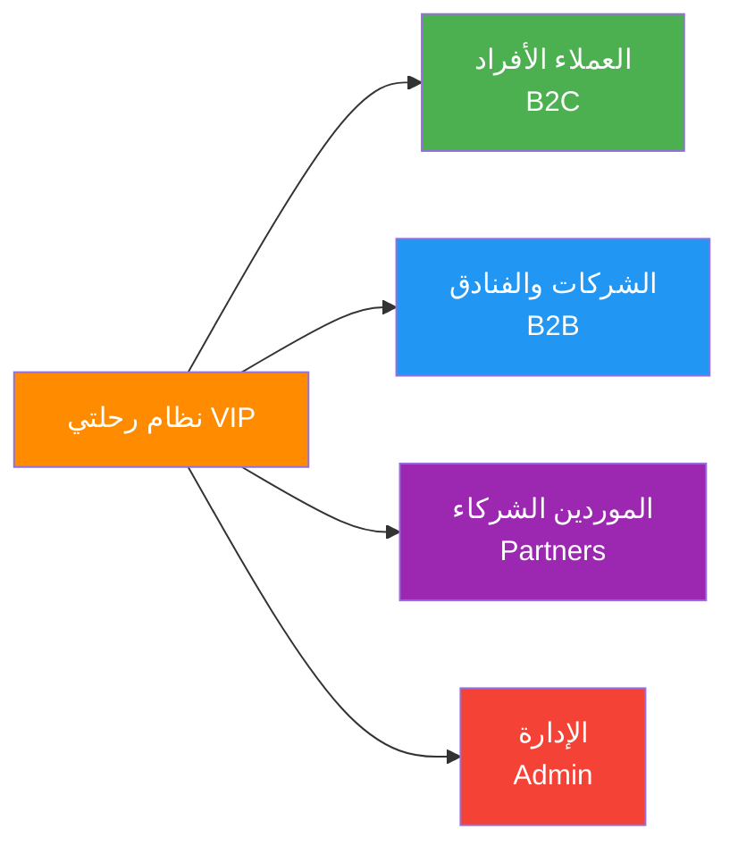

### 2.3 المميزات الرئيسية للنظام

#### حجز مباشر من طرف العميل بدون الحاجة لموظفين
- الحجز مباشرة دون التواصل مع الموظفين
- مرونة الاختيار بين السيارات والأسعار
- إمكانية تعديل الحجز من وقت لآخر
- اختيار جنسية السائق

#### برنامج شامل
- لا يحتاج للعديد من الموظفين للإدارة
- يدير أسطول السيارات والتنسيق مع السائقين
- تصميم عصري حديث

#### سهولة التسجيل
- نموذج تسجيل بسيط وسهل
- معايير لعدم تكرار البيانات الشخصية عند إعادة الحجز

#### طرق دفع متعددة
- كاش مع السائق
- تحويل بنكي
- بطاقة مدى / فيزا
- دفع آجل للشركات (كريديت)

#### نظام رسائل SMS وإشعارات للتطبيق
- إشعارات مع العميل في حالات: تأكيد الحجز، إلغاء الحجز، تعديل الحجز
- استخدام بيانات الحجز المؤكد أو إلغاء الحجز

---

## 3. التعرف على المشكلة

### 3.1 المشكلات الحالية في السوق

من خلال دراسة السوق السعودي لخدمات النقل والتوصيل الفاخرة، تم رصد المشكلات التالية:

1. **عدم وجود نظام متكامل** يجمع بين إدارة الأسطول الداخلي والشركاء الخارجيين
2. **صعوبة إدارة الحجوزات** للشركات والفنادق مع آليات دفع مرنة
3. **نقص الشفافية** في الأسعار والعمولات
4. **غياب نظام متابعة فعال** للحجوزات من لحظة الطلب حتى الإقفال
5. **تعقيد عمليات المحاسبة** وإصدار الفواتير الضريبية
6. **صعوبة إدارة المواسم** مثل رمضان والحج والعمرة
7. **عدم وجود تقارير شاملة** للأداء المالي والتشغيلي

### 3.2 الفجوات في الأنظمة الموجودة

معظم الأنظمة الحالية:
- تركز فقط على العملاء الأفراد B2C
- لا توفر إدارة شاملة للموردين والشركاء
- تفتقر لنظام محاسبة متكامل
- لا تدعم الدفع الآجل للشركات
- غير مصممة للاستدامة طويلة الأمد

---

## 4. الحل المقترح

### 4.1 نظرة شاملة

نقترح بناء **نظام متكامل ومستدام** يشمل:

1. **تطبيق جوال متقدم** (iOS & Android) للعملاء والموردين
2. **موقع إلكتروني احترافي** للحجز والاستعراض
3. **لوحة تحكم إدارية شاملة** لإدارة جميع جوانب العمل
4. **نظام محاسبة متكامل** مع إصدار فواتير ضريبية
5. **نظام تقارير تحليلية** لدعم اتخاذ القرار
6. **بنية تقنية قابلة للتوسع** لضمان الاستدامة 10+ سنوات

### 4.2 المكونات الأساسية

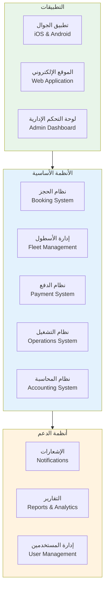

---

## 5. فكرة المشروع وأهدافه

### 5.1 فكرة المشروع

إنشاء **نظام معلومات متكامل ومستدام** لإدارة شركات النقل والتوصيل الفاخرة، يتميز بـ:

- **التكامل الشامل:** يدير جميع جوانب العمل من منصة واحدة
- **المرونة:** يخدم ثلاث فئات مختلفة بكفاءة
- **الشفافية:** أسعار واضحة وعمولات محددة
- **الأتمتة:** تقليل الحاجة لموظفين كثيرين
- **الاستدامة:** مصمم للعمل 10+ سنوات بكفاءة
- **قابلية التطوير:** سهولة إضافة مناطق وخدمات جديدة

### 5.2 الأهداف الاستراتيجية

#### أهداف قصيرة المدى (السنة الأولى)
1. إطلاق النظام في 3 مدن رئيسية (جدة، مكة، الرياض)
2. تسجيل 100+ مورد شريك
3. تحقيق 1000+ حجز شهري
4. توقيع 20+ عقد مع فنادق وشركات
5. تحقيق رضا عملاء 90%+

#### أهداف متوسطة المدى (3-5 سنوات)
1. التوسع لجميع مناطق المملكة
2. إضافة خدمات جديدة (طيران خاص، يخوت)
3. تطوير تطبيق خاص للسائقين
4. دمج الذكاء الاصطناعي في التشغيل
5. تحقيق 100,000+ حجز سنوي

#### أهداف طويلة المدى (10+ سنوات)
1. التوسع لدول الخليج
2. أن نكون الخيار الأول للنقل الفاخر
3. بناء أسطول خاص من السيارات الفاخرة
4. إطلاق برنامج ولاء متقدم
5. الحفاظ على تقنية حديثة ومحدثة

### 5.3 الغايات والأهداف التفصيلية

1. **تحسين تجربة العميل**
   - حجز سريع وسهل خلال دقائق
   - شفافية كاملة في الأسعار
   - متابعة الرحلة لحظياً
   - خيارات دفع متنوعة

2. **تمكين الشركات والفنادق**
   - حسابات مخصصة مع خصومات
   - دفع آجل (كريديت) مع حد ائتماني
   - تقارير شهرية تفصيلية
   - واجهة سهلة للموظفين

3. **دعم الموردين الشركاء**
   - عملية تسجيل واضحة
   - عمولات عادلة ومحددة
   - دفعات منتظمة وشفافة
   - إدارة احترافية للحسابات

4. **أتمتة العمليات التشغيلية**
   - تقليل التدخل اليدوي
   - ربط تلقائي مع السائقين
   - إشعارات تلقائية
   - إقفال محاسبي تلقائي

5. **توفير رؤية إدارية شاملة**
   - لوحات معلومات تفاعلية
   - تقارير تحليلية متقدمة
   - مؤشرات أداء KPIs
   - دعم اتخاذ القرار

6. **ضمان الأمان والموثوقية**
   - حماية البيانات
   - معاملات آمنة
   - نسخ احتياطي مستمر
   - توفر عالي 99.9%

---

## 6. متطلبات الاستدامة وطول الأمد

### 6.1 مبادئ التصميم المستدام

لضمان عمل النظام بكفاءة لمدة **10+ سنوات**، تم اعتماد المبادئ التالية:

#### 1. البنية المعمارية المرنة (Modular Architecture)

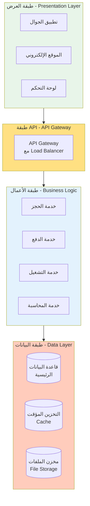

**الفوائد:**
- إمكانية تحديث أي جزء دون التأثير على الباقي
- سهولة إضافة خدمات جديدة
- قابلية استبدال التقنيات القديمة

#### 2. قاعدة البيانات القابلة للتطور

**استراتيجية قاعدة البيانات:**
- استخدام **PostgreSQL** أو **MySQL 8.0+** مع ميزات التقسيم (Partitioning)
- تصميم مرن يسمح بإضافة حقول جديدة
- استخدام **Database Versioning** (Flyway/Liquibase)
- نسخ احتياطي يومي تلقائي مع الاحتفاظ بـ 3 سنوات من البيانات

#### 3. التقنيات الحديثة والمستقرة

| المكون | التقنية المقترحة | سبب الاختيار |
|--------|------------------|--------------|
| Backend API | Node.js + Express أو Laravel | مستقرة، مجتمع كبير، دعم طويل الأمد |
| Frontend Web | React.js أو Next.js | محدثة باستمرار، أداء عالي |
| Mobile App | React Native أو Flutter | تطوير متعدد المنصات بكود واحد |
| Database | PostgreSQL 14+ | ميزات متقدمة، استقرار عالي |
| Cache | Redis 7+ | أداء ممتاز، موثوقية عالية |
| Message Queue | RabbitMQ أو Apache Kafka | معالجة غير متزامنة، قابلية توسع |
| Storage | AWS S3 أو Minio | تخزين موثوق ومستدام |

#### 4. الاستضافة والبنية التحتية

**نموذج السحابة الهجين (Hybrid Cloud):**

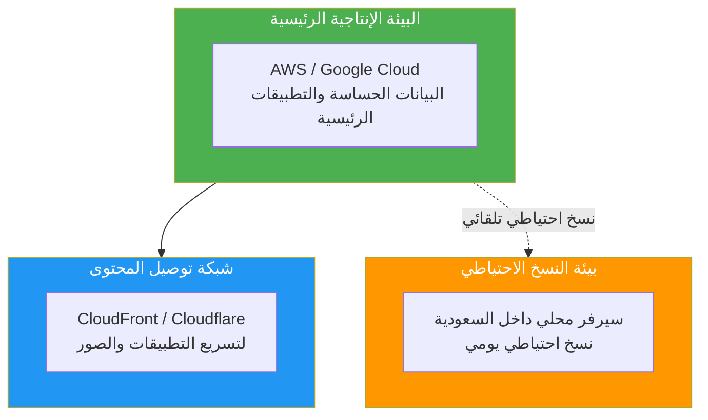

**المزايا:**
- **توفر عالي:** 99.9% uptime
- **قابلية التوسع:** زيادة الموارد حسب الحاجة
- **أمان:** بيانات محمية بأحدث المعايير
- **كفاءة التكلفة:** دفع حسب الاستخدام

#### 5. نظام التحديثات والصيانة

**استراتيجية التحديثات:**
- تحديثات أمنية شهرية إلزامية
- تحديثات الميزات كل 3 أشهر
- إعادة تقييم التقنيات سنوياً
- خطة ترقية كبرى كل 3 سنوات

**فريق الصيانة المقترح:**
- 2 مطور Backend
- 1 مطور Frontend/Mobile
- 1 مسؤول قواعد بيانات (DBA)
- 1 مهندس DevOps
- 1 مدير نظام

### 6.2 معايير الجودة والأداء

#### مؤشرات الأداء المستهدفة

| المؤشر | الهدف | طريقة القياس |
|--------|-------|-------------|
| وقت الاستجابة | < 2 ثانية | متوسط زمن تحميل الصفحات |
| التوفر | 99.9% | نسبة الوقت المتاح سنوياً |
| المستخدمون المتزامنون | 5000+ | قدرة الخوادم على التحمل |
| معدل النجاح في المعاملات | > 99% | نسبة المعاملات الناجحة |
| وقت النسخ الاحتياطي | < 2 ساعة | زمن استرجاع البيانات |

#### معايير الأمان

- **تشفير البيانات:** SSL/TLS 1.3+
- **تشفير كلمات المرور:** Bcrypt أو Argon2
- **المصادقة:** JWT مع Refresh Tokens
- **الصلاحيات:** RBAC (Role-Based Access Control)
- **مراجعة الأمان:** Penetration Testing سنوياً

### 6.3 خطة الاستدامة المالية

**نموذج التكلفة السنوية (تقديري):**

| البند | السنة الأولى | السنة الخامسة | السنة العاشرة |
|------|-------------|---------------|---------------|
| الاستضافة والبنية التحتية | 50,000 ر.س | 100,000 ر.س | 150,000 ر.س |
| الصيانة والتطوير | 200,000 ر.س | 250,000 ر.س | 300,000 ر.س |
| التراخيص والخدمات الخارجية | 30,000 ر.س | 40,000 ر.س | 50,000 ر.س |
| **الإجمالي** | **280,000 ر.س** | **390,000 ر.س** | **500,000 ر.س** |

---

## 7. مرحلة تحليل النظام المقترح

### 7.1 مقدمة عن طرق تحليل البيانات

تمثل نظم المعلومات الرقمية المكونات المتكاملة التي تعمل على جمع وتخزين ومعالجة البيانات من أجل توفير المعلومات والمعرفة والخدمات الرقمية. يتم تطوير أنظمة المعلومات وصيانتها وفق عملية منهجية تسمى "دورة حياة النظام" (SDLC).

### 7.2 نموذج التطوير المعتمد

**نموذج الشلال المعدل (Modified Waterfall)** مع عناصر من **Agile:**

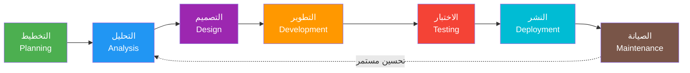

**سبب الاختيار:**
- واضح ومنظم للعميل
- يسمح بالتغذية الراجعة
- مناسب للمشاريع المتوسطة والكبيرة

---

## 8. المخططات التفصيلية

### 8.1 مخطط السياق (Context Diagram)

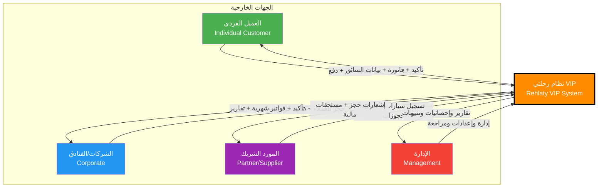

### 8.2 مخطط تدفق البيانات المستوى الصفري (Level 0 DFD)

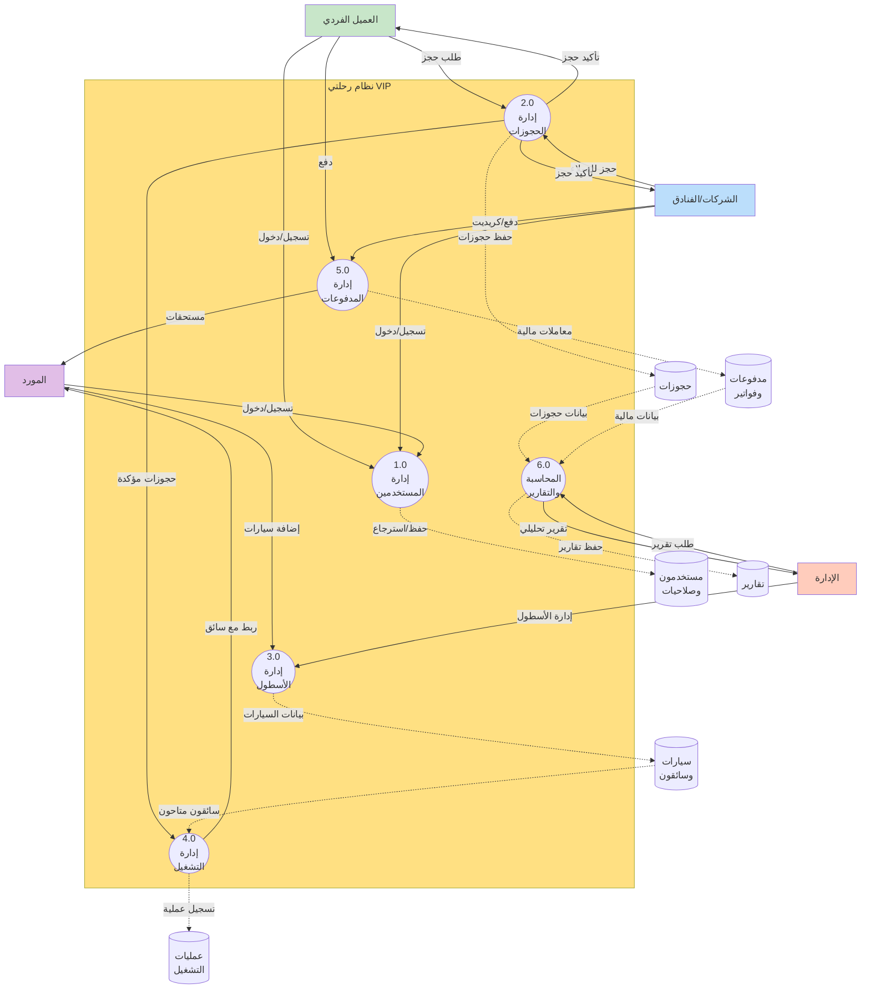

### 8.3 مخطط عملية الحجز (Booking Flow)

```mermaid
flowchart TD
    Start([العميل يفتح التطبيق]) --> Auth{مسجل دخول؟}
    
    Auth -->|لا| Guest[متابعة كضيف]
    Auth -->|لا| Register[إنشاء حساب]
    Auth -->|نعم| SelectBranch
    
    Register --> OTP[إدخال OTP]
    OTP --> SelectBranch[اختيار المنطقة/الفرع<br/>جدة - مكة - الرياض - العلا]
    Guest --> SelectBranch
    
    SelectBranch --> ViewCars[عرض جميع السيارات<br/>شاشة متحركة للسيارات]
    
    ViewCars --> SelectCar[اختيار سيارة معينة<br/>عرض تفاصيلها]
    
    SelectCar --> OrderNow[أطلب الآن]
    
    OrderNow --> ServiceScreen[شاشة الخدمات]
    
    ServiceScreen --> SelectService[اختيار نوع الخدمة]
    
    SelectService --> S1{نوع الخدمة}
    
    S1 -->|توصيل| Delivery[خدمة التوصيل<br/>من - إلى]
    S1 -->|بالساعة| Hourly[إيجار بالساعة<br/>سعر ثابت]
    S1 -->|8 ساعات| Tour8[جولة سياحية 8 ساعات<br/>سعر ثابت]
    S1 -->|12 ساعة| Day[إيجار يوم كامل 12 ساعة<br/>سعر ثابت]
    S1 -->|ساعة انتظار| Wait[ساعة انتظار/زائدة<br/>بعد الخدمة]
    
    Delivery --> EnterLocations[إدخال الموقع والوجهة<br/>Google Maps API]
    EnterLocations --> CalcDistance[حساب المسافة تلقائياً]
    CalcDistance --> CalcPrice
    
    Hourly --> CalcPrice[حساب السعر<br/>حسب الفئة + المنطقة + النسبة]
    Tour8 --> CalcPrice
    Day --> CalcPrice
    Wait --> CalcPrice
    
    CalcPrice --> ShowPrice[عرض السعر للعميل]
    
    ShowPrice --> AddMore{إضافة خدمات أخرى؟}
    
    AddMore -->|نعم| SelectService
    AddMore -->|لا| ShowBasket[عرض السلة<br/>حجوزات متعددة برقم حجز عام]
    
    ShowBasket --> ConfirmBooking[تأكيد الحجز]
    
    ConfirmBooking --> SelectPayment[اختيار طريقة الدفع]
    
    SelectPayment --> PaymentType{طريقة الدفع}
    
    PaymentType -->|كاش| CashPayment[دفع نقدي مع السائق]
    PaymentType -->|مدى/فيزا| CardPayment[بوابة الدفع الإلكتروني]
    PaymentType -->|تحويل| BankTransfer[تحويل بنكي<br/>رفع الإيصال]
    PaymentType -->|كريديت| CreditPayment[دفع آجل<br/>للشركات فقط]
    
    CashPayment --> SendToAdmin
    CardPayment --> ProcessCard[معالجة الدفع]
    BankTransfer --> PendingVerify[انتظار التحقق]
    CreditPayment --> CheckLimit{ضمن حد الكريديت؟}
    
    ProcessCard --> PaymentSuccess{نجح؟}
    PaymentSuccess -->|نعم| SendToAdmin
    PaymentSuccess -->|لا| SelectPayment
    
    PendingVerify --> SendToAdmin
    
    CheckLimit -->|نعم| SendToAdmin
    CheckLimit -->|لا| SelectPayment
    
    SendToAdmin[إرسال للإدارة<br/>شاشة استقبال الحجوزات]
    
    SendToAdmin --> AdminReview[Admin يراجع]
    
    AdminReview --> AdminDecision{قرار الإدارة}
    
    AdminDecision -->|مؤكد| ConfirmedBooking[نقل لشاشة الحجوزات المؤكدة]
    AdminDecision -->|غير مؤكد| Rejected[رفض الحجز]
    
    Rejected --> NotifyRejection[إشعار العميل بالرفض]
    NotifyRejection --> End1([انتهاء])
    
    ConfirmedBooking --> SMS1[إرسال SMS + WhatsApp<br/>تأكيد للعميل]
    
    SMS1 --> End2([انتظار التجهيز])
    
    style Start fill:#4CAF50,color:#fff
    style End1 fill:#F44336,color:#fff
    style End2 fill:#2196F3,color:#fff
    style OrderNow fill:#FF8C00,color:#fff
    style SendToAdmin fill:#9C27B0,color:#fff
```

### 8.4 مخطط عملية التشغيل (Operations Flow)

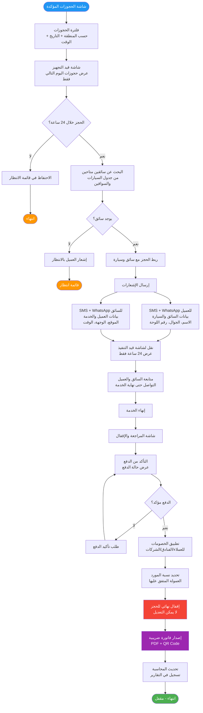

### 8.5 مخطط تسلسلي: حجز عميل فردي كامل

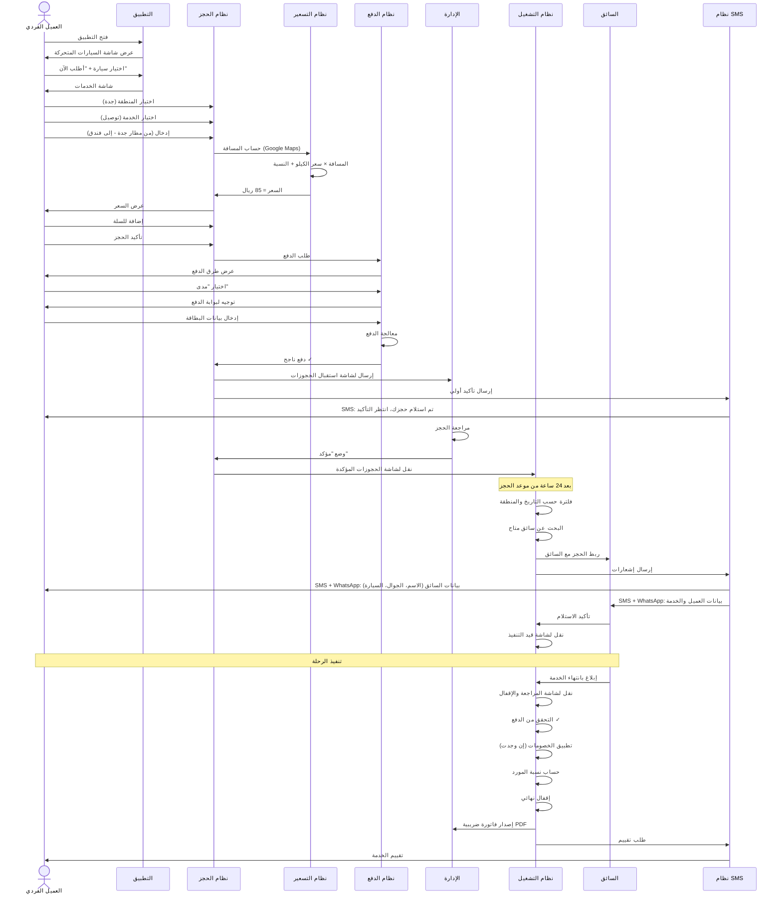

### 8.6 مخطط ارتباط الكائنات الكامل (Complete ERD)

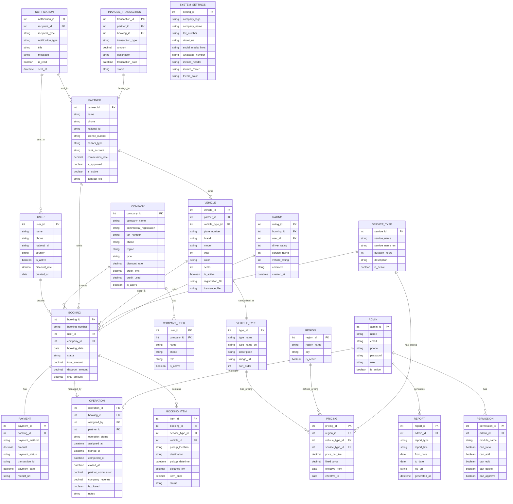

---

## 9. تصميم قاعدة البيانات المفصل

### 9.1 الجداول الرئيسية بالتفصيل

#### جدول المستخدمين الأفراد (users)

```sql
CREATE TABLE users (
    user_id INT PRIMARY KEY AUTO_INCREMENT,
    name VARCHAR(100) NOT NULL,
    phone VARCHAR(20) NOT NULL UNIQUE,
    email VARCHAR(100),
    national_id VARCHAR(20),
    country VARCHAR(50) DEFAULT 'Saudi Arabia',
    password_hash VARCHAR(255),
    is_verified BOOLEAN DEFAULT FALSE,
    is_active BOOLEAN DEFAULT TRUE,
    discount_rate DECIMAL(5,2) DEFAULT 0.00,
    created_at TIMESTAMP DEFAULT CURRENT_TIMESTAMP,
    updated_at TIMESTAMP DEFAULT CURRENT_TIMESTAMP ON UPDATE CURRENT_TIMESTAMP,
    last_login TIMESTAMP NULL,
    
    INDEX idx_phone (phone),
    INDEX idx_email (email),
    INDEX idx_is_active (is_active)
);
```

#### جدول الشركات والفنادق (companies)

```sql
CREATE TABLE companies (
    company_id INT PRIMARY KEY AUTO_INCREMENT,
    company_name VARCHAR(200) NOT NULL,
    commercial_registration VARCHAR(50) NOT NULL UNIQUE,
    tax_number VARCHAR(50),
    phone VARCHAR(20) NOT NULL,
    email VARCHAR(100),
    region VARCHAR(100) NOT NULL,
    address TEXT,
    company_type ENUM('hotel', 'corporate', 'travel_agency') NOT NULL,
    client_type ENUM('internal', 'external') NOT NULL,
    discount_rate DECIMAL(5,2) DEFAULT 0.00,
    credit_limit DECIMAL(12,2) DEFAULT 0.00,
    credit_used DECIMAL(12,2) DEFAULT 0.00,
    is_active BOOLEAN DEFAULT FALSE,
    contract_file VARCHAR(255),
    approved_by INT,
    approved_at TIMESTAMP NULL,
    created_at TIMESTAMP DEFAULT CURRENT_TIMESTAMP,
    
    INDEX idx_company_name (company_name),
    INDEX idx_is_active (is_active),
    INDEX idx_commercial_reg (commercial_registration)
);
```

#### جدول موظفي الشركات (company_users)

```sql
CREATE TABLE company_users (
    user_id INT PRIMARY KEY AUTO_INCREMENT,
    company_id INT NOT NULL,
    name VARCHAR(100) NOT NULL,
    phone VARCHAR(20) NOT NULL,
    email VARCHAR(100),
    password_hash VARCHAR(255) NOT NULL,
    role VARCHAR(50) DEFAULT 'employee',
    is_active BOOLEAN DEFAULT TRUE,
    created_at TIMESTAMP DEFAULT CURRENT_TIMESTAMP,
    
    FOREIGN KEY (company_id) REFERENCES companies(company_id),
    INDEX idx_company_id (company_id),
    INDEX idx_phone (phone)
);
```

#### جدول الموردين/الشركاء (partners)

```sql
CREATE TABLE partners (
    partner_id INT PRIMARY KEY AUTO_INCREMENT,
    name VARCHAR(100) NOT NULL,
    phone VARCHAR(20) NOT NULL UNIQUE,
    email VARCHAR(100),
    national_id VARCHAR(20) NOT NULL,
    national_id_file VARCHAR(255),
    license_number VARCHAR(50) NOT NULL,
    license_file VARCHAR(255),
    partner_type ENUM('internal', 'external') NOT NULL,
    bank_name VARCHAR(100),
    bank_account VARCHAR(50),
    iban VARCHAR(50),
    commission_rate DECIMAL(5,2) NOT NULL DEFAULT 20.00,
    is_approved BOOLEAN DEFAULT FALSE,
    is_active BOOLEAN DEFAULT TRUE,
    contract_file VARCHAR(255),
    approved_by INT,
    approved_at TIMESTAMP NULL,
    created_at TIMESTAMP DEFAULT CURRENT_TIMESTAMP,
    
    INDEX idx_phone (phone),
    INDEX idx_is_active (is_active),
    INDEX idx_is_approved (is_approved)
);
```

#### جدول السيارات (vehicles)

```sql
CREATE TABLE vehicles (
    vehicle_id INT PRIMARY KEY AUTO_INCREMENT,
    partner_id INT NOT NULL,
    vehicle_type_id INT NOT NULL,
    plate_number VARCHAR(20) NOT NULL UNIQUE,
    brand VARCHAR(50) NOT NULL,
    model VARCHAR(50) NOT NULL,
    year INT NOT NULL,
    color VARCHAR(30) NOT NULL,
    seats INT NOT NULL DEFAULT 5,
    registration_file VARCHAR(255),
    insurance_file VARCHAR(255),
    is_active BOOLEAN DEFAULT FALSE,
    created_at TIMESTAMP DEFAULT CURRENT_TIMESTAMP,
    
    FOREIGN KEY (partner_id) REFERENCES partners(partner_id),
    FOREIGN KEY (vehicle_type_id) REFERENCES vehicle_types(type_id),
    INDEX idx_partner_id (partner_id),
    INDEX idx_vehicle_type (vehicle_type_id),
    INDEX idx_is_active (is_active),
    INDEX idx_plate_number (plate_number)
);
```

#### جدول صور السيارات (vehicle_images)

```sql
CREATE TABLE vehicle_images (
    image_id INT PRIMARY KEY AUTO_INCREMENT,
    vehicle_id INT NOT NULL,
    image_url VARCHAR(255) NOT NULL,
    image_type ENUM('exterior', 'interior') NOT NULL,
    sort_order INT DEFAULT 0,
    created_at TIMESTAMP DEFAULT CURRENT_TIMESTAMP,
    
    FOREIGN KEY (vehicle_id) REFERENCES vehicles(vehicle_id) ON DELETE CASCADE,
    INDEX idx_vehicle_id (vehicle_id)
);
```

#### جدول فئات السيارات (vehicle_types)

```sql
CREATE TABLE vehicle_types (
    type_id INT PRIMARY KEY AUTO_INCREMENT,
    type_name VARCHAR(50) NOT NULL,
    type_name_en VARCHAR(50) NOT NULL,
    description TEXT,
    image_url VARCHAR(255),
    sort_order INT DEFAULT 0,
    is_active BOOLEAN DEFAULT TRUE,
    created_at TIMESTAMP DEFAULT CURRENT_TIMESTAMP,
    
    INDEX idx_is_active (is_active)
);
```

#### جدول أنواع الخدمات (service_types)

```sql
CREATE TABLE service_types (
    service_id INT PRIMARY KEY AUTO_INCREMENT,
    service_name VARCHAR(100) NOT NULL,
    service_name_en VARCHAR(100) NOT NULL,
    service_code VARCHAR(20) NOT NULL UNIQUE,
    duration_hours INT NULL,
    description TEXT,
    is_active BOOLEAN DEFAULT TRUE,
    sort_order INT DEFAULT 0,
    created_at TIMESTAMP DEFAULT CURRENT_TIMESTAMP,
    
    INDEX idx_service_code (service_code),
    INDEX idx_is_active (is_active)
);

-- إدخال أنواع الخدمات الأساسية
INSERT INTO service_types (service_name, service_name_en, service_code, duration_hours, sort_order) VALUES
('توصيل من مكان لمكان', 'Point to Point Transfer', 'TRANSFER', NULL, 1),
('إيجار بالساعة', 'Hourly Rental', 'HOURLY', 1, 2),
('جولة سياحية 8 ساعات', '8-Hour Tour', 'TOUR_8', 8, 3),
('إيجار يوم كامل 12 ساعة', 'Full Day 12-Hour Rental', 'FULL_DAY', 12, 4),
('ساعة انتظار/زائدة', 'Extra/Waiting Hour', 'EXTRA_HOUR', 1, 5);
```

#### جدول المناطق (regions)

```sql
CREATE TABLE regions (
    region_id INT PRIMARY KEY AUTO_INCREMENT,
    region_name VARCHAR(100) NOT NULL,
    city VARCHAR(100),
    is_active BOOLEAN DEFAULT TRUE,
    sort_order INT DEFAULT 0,
    created_at TIMESTAMP DEFAULT CURRENT_TIMESTAMP,
    
    INDEX idx_is_active (is_active)
);

-- إدخال المناطق الأساسية
INSERT INTO regions (region_name, city, sort_order) VALUES
('جدة', 'Jeddah', 1),
('مكة المكرمة', 'Makkah', 2),
('الرياض', 'Riyadh', 3),
('العلا', 'AlUla', 4);
```

#### جدول الأسعار (pricing)

```sql
CREATE TABLE pricing (
    pricing_id INT PRIMARY KEY AUTO_INCREMENT,
    region_id INT NOT NULL,
    vehicle_type_id INT NOT NULL,
    service_type_id INT NOT NULL,
    price_per_km DECIMAL(8,2) NULL,
    fixed_price DECIMAL(10,2) NULL,
    effective_from DATE NOT NULL,
    effective_to DATE NULL,
    is_active BOOLEAN DEFAULT TRUE,
    created_at TIMESTAMP DEFAULT CURRENT_TIMESTAMP,
    updated_at TIMESTAMP DEFAULT CURRENT_TIMESTAMP ON UPDATE CURRENT_TIMESTAMP,
    
    FOREIGN KEY (region_id) REFERENCES regions(region_id),
    FOREIGN KEY (vehicle_type_id) REFERENCES vehicle_types(type_id),
    FOREIGN KEY (service_type_id) REFERENCES service_types(service_id),
    INDEX idx_region_vehicle_service (region_id, vehicle_type_id, service_type_id),
    INDEX idx_is_active (is_active)
);
```

#### جدول الحجوزات (bookings)

```sql
CREATE TABLE bookings (
    booking_id INT PRIMARY KEY AUTO_INCREMENT,
    booking_number VARCHAR(20) NOT NULL UNIQUE,
    user_id INT NULL,
    company_id INT NULL,
    booked_by_type ENUM('customer', 'company', 'guest') NOT NULL,
    booking_date DATE NOT NULL,
    status ENUM('pending', 'confirmed', 'in_preparation', 'in_progress', 'completed', 'cancelled', 'closed') NOT NULL DEFAULT 'pending',
    total_amount DECIMAL(10,2) NOT NULL DEFAULT 0.00,
    discount_rate DECIMAL(5,2) DEFAULT 0.00,
    discount_amount DECIMAL(10,2) DEFAULT 0.00,
    final_amount DECIMAL(10,2) NOT NULL DEFAULT 0.00,
    notes TEXT,
    created_at TIMESTAMP DEFAULT CURRENT_TIMESTAMP,
    updated_at TIMESTAMP DEFAULT CURRENT_TIMESTAMP ON UPDATE CURRENT_TIMESTAMP,
    
    FOREIGN KEY (user_id) REFERENCES users(user_id),
    FOREIGN KEY (company_id) REFERENCES companies(company_id),
    INDEX idx_booking_number (booking_number),
    INDEX idx_user_id (user_id),
    INDEX idx_company_id (company_id),
    INDEX idx_status (status),
    INDEX idx_booking_date (booking_date)
);
```

#### جدول عناصر الحجز (booking_items)

```sql
CREATE TABLE booking_items (
    item_id INT PRIMARY KEY AUTO_INCREMENT,
    booking_id INT NOT NULL,
    service_type_id INT NOT NULL,
    region_id INT NOT NULL,
    vehicle_type_id INT NOT NULL,
    vehicle_id INT NULL,
    passenger_name VARCHAR(100) NOT NULL,
    passenger_phone VARCHAR(20) NOT NULL,
    room_number VARCHAR(20) NULL,
    flight_number VARCHAR(20) NULL,
    pickup_location VARCHAR(255) NOT NULL,
    pickup_latitude DECIMAL(10, 8) NULL,
    pickup_longitude DECIMAL(11, 8) NULL,
    destination VARCHAR(255) NULL,
    destination_latitude DECIMAL(10, 8) NULL,
    destination_longitude DECIMAL(11, 8) NULL,
    pickup_datetime DATETIME NOT NULL,
    distance_km DECIMAL(8,2) NULL,
    duration_hours INT NULL,
    base_price DECIMAL(10,2) NOT NULL,
    item_price DECIMAL(10,2) NOT NULL,
    status ENUM('pending', 'confirmed', 'assigned', 'in_progress', 'completed', 'cancelled') NOT NULL DEFAULT 'pending',
    created_at TIMESTAMP DEFAULT CURRENT_    created_at TIMESTAMP DEFAULT CURRENT_TIMESTAMP,
    
    FOREIGN KEY (booking_id) REFERENCES bookings(booking_id) ON DELETE CASCADE,
    FOREIGN KEY (service_type_id) REFERENCES service_types(service_id),
    FOREIGN KEY (region_id) REFERENCES regions(region_id),
    FOREIGN KEY (vehicle_type_id) REFERENCES vehicle_types(type_id),
    FOREIGN KEY (vehicle_id) REFERENCES vehicles(vehicle_id),
    INDEX idx_booking_id (booking_id),
    INDEX idx_status (status),
    INDEX idx_pickup_datetime (pickup_datetime)
);
```

#### جدول المدفوعات (payments)

```sql
CREATE TABLE payments (
    payment_id INT PRIMARY KEY AUTO_INCREMENT,
    booking_id INT NOT NULL,
    payment_method ENUM('cash', 'card', 'bank_transfer', 'credit') NOT NULL,
    amount DECIMAL(10,2) NOT NULL,
    payment_status ENUM('pending', 'completed', 'failed', 'refunded') NOT NULL DEFAULT 'pending',
    transaction_id VARCHAR(100) NULL,
    receipt_url VARCHAR(255) NULL,
    payment_date DATETIME NULL,
    verified_by INT NULL,
    verified_at TIMESTAMP NULL,
    notes TEXT,
    created_at TIMESTAMP DEFAULT CURRENT_TIMESTAMP,
    
    FOREIGN KEY (booking_id) REFERENCES bookings(booking_id),
    INDEX idx_booking_id (booking_id),
    INDEX idx_payment_status (payment_status),
    INDEX idx_payment_method (payment_method)
);
```

#### جدول العمليات التشغيلية (operations)

```sql
CREATE TABLE operations (
    operation_id INT PRIMARY KEY AUTO_INCREMENT,
    booking_id INT NOT NULL UNIQUE,
    partner_id INT NOT NULL,
    vehicle_id INT NOT NULL,
    assigned_by INT NOT NULL,
    operation_status ENUM('assigned', 'driver_confirmed', 'in_progress', 'completed', 'under_review', 'closed') NOT NULL DEFAULT 'assigned',
    assigned_at TIMESTAMP DEFAULT CURRENT_TIMESTAMP,
    driver_confirmed_at TIMESTAMP NULL,
    started_at TIMESTAMP NULL,
    completed_at TIMESTAMP NULL,
    reviewed_at TIMESTAMP NULL,
    closed_at TIMESTAMP NULL,
    closed_by INT NULL,
    partner_commission_rate DECIMAL(5,2) NOT NULL,
    partner_commission DECIMAL(10,2) NOT NULL DEFAULT 0.00,
    company_revenue DECIMAL(10,2) NOT NULL DEFAULT 0.00,
    is_closed BOOLEAN DEFAULT FALSE,
    notes TEXT,
    
    FOREIGN KEY (booking_id) REFERENCES bookings(booking_id),
    FOREIGN KEY (partner_id) REFERENCES partners(partner_id),
    FOREIGN KEY (vehicle_id) REFERENCES vehicles(vehicle_id),
    FOREIGN KEY (assigned_by) REFERENCES admins(admin_id),
    FOREIGN KEY (closed_by) REFERENCES admins(admin_id),
    INDEX idx_booking_id (booking_id),
    INDEX idx_partner_id (partner_id),
    INDEX idx_operation_status (operation_status),
    INDEX idx_is_closed (is_closed)
);
```

#### جدول المشرفين (admins)

```sql
CREATE TABLE admins (
    admin_id INT PRIMARY KEY AUTO_INCREMENT,
    name VARCHAR(100) NOT NULL,
    email VARCHAR(100) NOT NULL UNIQUE,
    phone VARCHAR(20) NOT NULL,
    password_hash VARCHAR(255) NOT NULL,
    role ENUM('super_admin', 'operations_manager', 'accountant', 'support') NOT NULL,
    is_active BOOLEAN DEFAULT TRUE,
    last_login TIMESTAMP NULL,
    created_at TIMESTAMP DEFAULT CURRENT_TIMESTAMP,
    
    INDEX idx_email (email),
    INDEX idx_role (role),
    INDEX idx_is_active (is_active)
);
```

#### جدول الصلاحيات (permissions)

```sql
CREATE TABLE permissions (
    permission_id INT PRIMARY KEY AUTO_INCREMENT,
    admin_id INT NOT NULL,
    module_name VARCHAR(50) NOT NULL,
    can_view BOOLEAN DEFAULT FALSE,
    can_add BOOLEAN DEFAULT FALSE,
    can_edit BOOLEAN DEFAULT FALSE,
    can_delete BOOLEAN DEFAULT FALSE,
    can_approve BOOLEAN DEFAULT FALSE,
    can_reopen BOOLEAN DEFAULT FALSE,
    created_at TIMESTAMP DEFAULT CURRENT_TIMESTAMP,
    
    FOREIGN KEY (admin_id) REFERENCES admins(admin_id) ON DELETE CASCADE,
    UNIQUE KEY unique_admin_module (admin_id, module_name),
    INDEX idx_admin_id (admin_id)
);
```

#### جدول التقييمات (ratings)

```sql
CREATE TABLE ratings (
    rating_id INT PRIMARY KEY AUTO_INCREMENT,
    booking_id INT NOT NULL UNIQUE,
    user_id INT NOT NULL,
    partner_id INT NOT NULL,
    driver_rating INT NOT NULL CHECK (driver_rating BETWEEN 1 AND 5),
    service_rating INT NOT NULL CHECK (service_rating BETWEEN 1 AND 5),
    vehicle_rating INT NOT NULL CHECK (vehicle_rating BETWEEN 1 AND 5),
    overall_rating DECIMAL(3,2) AS ((driver_rating + service_rating + vehicle_rating) / 3.0),
    comment TEXT,
    created_at TIMESTAMP DEFAULT CURRENT_TIMESTAMP,
    
    FOREIGN KEY (booking_id) REFERENCES bookings(booking_id),
    FOREIGN KEY (user_id) REFERENCES users(user_id),
    FOREIGN KEY (partner_id) REFERENCES partners(partner_id),
    INDEX idx_booking_id (booking_id),
    INDEX idx_partner_id (partner_id)
);
```

#### جدول الإشعارات (notifications)

```sql
CREATE TABLE notifications (
    notification_id INT PRIMARY KEY AUTO_INCREMENT,
    recipient_id INT NOT NULL,
    recipient_type ENUM('customer', 'partner', 'admin', 'company_user') NOT NULL,
    notification_type ENUM('booking_confirmation', 'booking_assignment', 'booking_cancellation', 'payment_reminder', 'rating_request', 'general') NOT NULL,
    title VARCHAR(200) NOT NULL,
    message TEXT NOT NULL,
    booking_id INT NULL,
    is_read BOOLEAN DEFAULT FALSE,
    sent_via ENUM('sms', 'whatsapp', 'app', 'email') NOT NULL,
    sent_at TIMESTAMP DEFAULT CURRENT_TIMESTAMP,
    read_at TIMESTAMP NULL,
    
    INDEX idx_recipient (recipient_id, recipient_type),
    INDEX idx_is_read (is_read),
    INDEX idx_sent_at (sent_at)
);
```

#### جدول المعاملات المالية للموردين (financial_transactions)

```sql
CREATE TABLE financial_transactions (
    transaction_id INT PRIMARY KEY AUTO_INCREMENT,
    partner_id INT NOT NULL,
    booking_id INT NULL,
    transaction_type ENUM('commission', 'payment', 'adjustment', 'refund') NOT NULL,
    amount DECIMAL(10,2) NOT NULL,
    balance_before DECIMAL(12,2) NOT NULL,
    balance_after DECIMAL(12,2) NOT NULL,
    description TEXT,
    transaction_date DATETIME DEFAULT CURRENT_TIMESTAMP,
    status ENUM('pending', 'completed', 'cancelled') NOT NULL DEFAULT 'completed',
    processed_by INT NULL,
    
    FOREIGN KEY (partner_id) REFERENCES partners(partner_id),
    FOREIGN KEY (booking_id) REFERENCES bookings(booking_id),
    FOREIGN KEY (processed_by) REFERENCES admins(admin_id),
    INDEX idx_partner_id (partner_id),
    INDEX idx_transaction_date (transaction_date),
    INDEX idx_status (status)
);
```

#### جدول إعدادات النظام (system_settings)

```sql
CREATE TABLE system_settings (
    setting_id INT PRIMARY KEY AUTO_INCREMENT,
    setting_key VARCHAR(100) NOT NULL UNIQUE,
    setting_value TEXT,
    setting_type ENUM('text', 'number', 'boolean', 'json', 'file') NOT NULL DEFAULT 'text',
    description TEXT,
    updated_by INT NULL,
    updated_at TIMESTAMP DEFAULT CURRENT_TIMESTAMP ON UPDATE CURRENT_TIMESTAMP,
    
    FOREIGN KEY (updated_by) REFERENCES admins(admin_id),
    INDEX idx_setting_key (setting_key)
);

-- إدخال الإعدادات الأساسية
INSERT INTO system_settings (setting_key, setting_value, setting_type, description) VALUES
('company_name', 'رحلتي VIP', 'text', 'اسم الشركة'),
('company_logo', '/uploads/logo.png', 'file', 'شعار الشركة'),
('tax_number', '', 'text', 'الرقم الضريبي'),
('whatsapp_number', '', 'text', 'رقم الواتساب'),
('theme_color', '#FF8C00', 'text', 'اللون الأساسي للنظام'),
('invoice_header', '', 'text', 'ترويسة الفاتورة'),
('invoice_footer', '', 'text', 'ذيل الفاتورة'),
('default_commission_rate', '20.00', 'number', 'نسبة العمولة الافتراضية');
```

#### جدول التقارير (reports)

```sql
CREATE TABLE reports (
    report_id INT PRIMARY KEY AUTO_INCREMENT,
    admin_id INT NOT NULL,
    report_type ENUM('bookings', 'revenue', 'partners', 'customers', 'custom') NOT NULL,
    report_title VARCHAR(200) NOT NULL,
    from_date DATE NOT NULL,
    to_date DATE NOT NULL,
    filters JSON NULL,
    file_url VARCHAR(255) NULL,
    generated_at TIMESTAMP DEFAULT CURRENT_TIMESTAMP,
    
    FOREIGN KEY (admin_id) REFERENCES admins(admin_id),
    INDEX idx_admin_id (admin_id),
    INDEX idx_report_type (report_type),
    INDEX idx_generated_at (generated_at)
);
```

---

## 10. الواجهات والمكونات التفصيلية

### 10.1 التطبيق الجوال - واجهات العميل

#### الشاشة الرئيسية

**المكونات:**
1. شعار "رحلتي VIP" في الأعلى
2. زر القائمة الجانبية (Hamburger Menu)
3. **شاشة متحركة (Carousel)** تعرض جميع السيارات المتاحة
4. لكل سيارة:
   - صورة السيارة
   - اسم السيارة (الماركة + الموديل)
   - الفئة (سيدان، SUV، لاكجري، باص)
   - زر "أطلب الآن" باللون البرتقالي

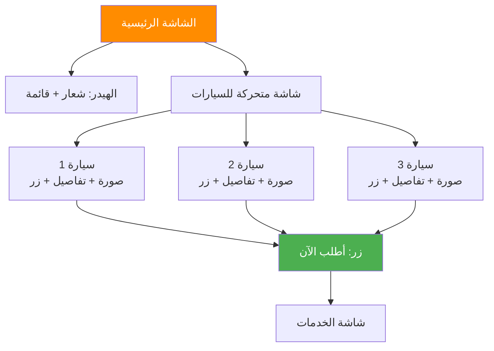

#### شاشة الخدمات

**المكونات:**
1. **اختيار المنطقة/الفرع:**
   - جدة
   - مكة المكرمة
   - الرياض
   - العلا

2. **اختيار نوع الخدمة:**
   - خدمة التوصيل (من - إلى) مع حقول:
     * موقع الانطلاق (مع خريطة)
     * الوجهة (مع خريطة)
     * عرض المسافة تلقائياً
   - خدمة بالساعة (سعر ثابت)
   - جولة سياحية 8 ساعات (سعر ثابت)
   - إيجار يوم كامل 12 ساعة (سعر ثابت)
   - ساعة انتظار/زائدة (سعر ثابت)

3. **معلومات الراكب:**
   - الاسم
   - رقم الجوال
   - رقم الغرفة (للفنادق)
   - رقم الرحلة (للمطارات)
   - رقم الهوية/الجواز (اختياري)

4. **اختيار التاريخ والوقت**

5. **عرض السعر:**
   - السعر الأساسي
   - النسبة المضافة
   - السعر النهائي

6. **أزرار:**
   - إضافة للسلة
   - احجز الآن
   - إضافة خدمة جديدة

#### شاشة السلة

**المكونات:**
1. رقم الحجز العام
2. قائمة الخدمات المضافة (كل خدمة حجز منفصل)
3. لكل خدمة:
   - نوع الخدمة
   - التاريخ والوقت
   - السيارة
   - السعر
   - زر حذف
4. **الإجمالي:**
   - مجموع الأسعار
   - الخصومات (إن وجدت)
   - المبلغ النهائي
5. زر "متابعة للدفع"

#### شاشة الدفع

**المكونات:**
1. ملخص الحجز
2. اختيار طريقة الدفع:
   - كاش مع السائق
   - بطاقة مدى/فيزا
   - تحويل بنكي (مع إمكانية رفع الإيصال)
   - كريديت (للشركات فقط)
3. زر "تأكيد الحجز"

#### شاشة تفاصيل الحجز

**المكونات:**
1. رقم الحجز
2. حالة الحجز (في انتظار التأكيد، مؤكد، قيد التنفيذ، مكتمل)
3. تفاصيل الخدمة
4. معلومات السائق (عند التعيين):
   - اسم السائق
   - صورة السائق
   - رقم الجوال
   - معلومات السيارة (الماركة، الموديل، اللون، رقم اللوحة)
5. زر الاتصال بالسائق
6. زر تتبع الموقع (عند التنفيذ)
7. زر إلغاء الحجز

#### شاشة التقييم

**المكونات:**
1. عنوان: "كيف كانت رحلتك؟"
2. تقييم السائق (1-5 نجوم)
3. تقييم الخدمة (1-5 نجوم)
4. تقييم السيارة (1-5 نجوم)
5. حقل التعليق (اختياري)
6. زر "إرسال التقييم"

### 10.2 التطبيق الجوال - واجهات المورد/السائق

#### شاشة التسجيل

**المكونات:**

**القسم الأول: البيانات الشخصية**
1. الاسم الكامل
2. رقم الجوال
3. البريد الإلكتروني
4. رقم الهوية الوطنية + رفع صورة
5. رقم رخصة القيادة + رفع صورة
6. الجهة (داخلي - خارجي)
7. رقم الحساب البنكي + IBAN

**القسم الثاني: بيانات السيارة**
1. رقم اللوحة
2. الماركة
3. الموديل
4. سنة الصنع
5. اللون
6. الفئة (سيدان، SUV، باص، لاكجري)
7. عدد المقاعد
8. رفع صورة الاستمارة
9. رفع صورة التأمين
10. رفع 4 صور خارجية للسيارة
11. رفع 4 صور داخلية للسيارة

**القسم الثالث: العقد**
1. عرض شروط الاتفاقية
2. تحديد نسبة العمولة
3. رفع العقد الموقع

4. زر "إرسال للمراجعة"

#### لوحة تحكم السائق

**المكونات:**
1. **الإحصائيات السريعة:**
   - عدد الرحلات اليوم
   - عدد الرحلات الشهر
   - الأرباح اليوم
   - الأرباح الشهر
   - التقييم العام

2. **الحجوزات الواردة:**
   - قائمة الحجوزات الجديدة
   - لكل حجز:
     * رقم الحجز
     * نوع الخدمة
     * الموقع والوجهة
     * التاريخ والوقت
     * السعر
     * زر قبول/رفض

3. **الحجوزات النشطة:**
   - الحجوزات المقبولة
   - تفاصيل العميل
   - خريطة التنقل
   - زر بدء الرحلة
   - زر إنهاء الرحلة

4. **كشف الحساب:**
   - المستحقات
   - المدفوعات
   - الرصيد الحالي
   - تاريخ الدفع القادم

### 10.3 الموقع الإلكتروني

#### الصفحة الرئيسية

**المكونات:**
1. **الهيدر:**
   - شعار الشركة
   - القائمة الرئيسية: (الرئيسية - السيارات والأسعار - الحجوزات - من نحن - اتصل بنا)
   - زر تسجيل الدخول

2. **القسم الترويجي:**
   - صورة كبيرة لسيارة فاخرة
   - العنوان: "استقبل طلبات عملائك بكل سهولة"
   - العنوان الفرعي: "قم بإدارة سياراتك والسيارات الخارجية"
   - زر "احجز الآن"

3. **قسم السيارات:**
   - عرض الفئات المختلفة
   - صور السيارات
   - الأسعار الابتدائية

4. **قسم المميزات:**
   - حجز مباشر بدون موظفين
   - برنامج شامل
   - سهولة التسجيل
   - طرق دفع متعددة
   - نظام SMS وإشعارات

5. **الفوتر:**
   - معلومات التواصل
   - روابط وسائل التواصل الاجتماعي
   - حقوق النشر

#### صفحة السيارات والأسعار

**المكونات:**
1. **فلتر المنطقة:**
   - اختيار المنطقة (جدة - مكة - الرياض - العلا)

2. **عرض الفئات:**
   - سيدان
   - SUV
   - باص
   - لاكجري

3. **جدول الأسعار لكل فئة:**

| الخدمة | التفاصيل | السعر |
|-------|---------|------|
| توصيل | سعر الكيلومتر | X ريال/كم |
| بالساعة | سعر ثابت | X ريال/ساعة |
| 8 ساعات | جولة سياحية | X ريال |
| 12 ساعة | يوم كامل | X ريال |
| ساعة زائدة | بعد الخدمة | X ريال/ساعة |

4. زر "احجز الآن" لكل فئة

### 10.4 لوحة التحكم الإدارية

#### القائمة الرئيسية

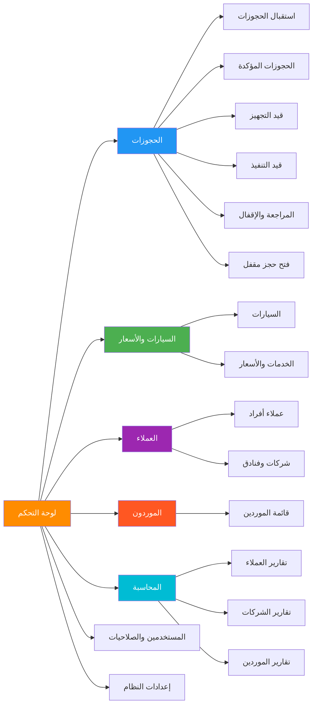

#### 1. شاشة استقبال الحجوزات

**المكونات:**
- جدول يعرض جميع الحجوزات الواردة من التطبيق بشكل لحظي
- الأعمدة:
  * رقم الحجز
  * اسم العميل
  * رقم الجوال
  * نوع العميل (فردي/شركة)
  * عدد الخدمات
  * المبلغ الإجمالي
  * حالة الدفع
  * التاريخ والوقت
  * الإجراء (مؤكد / غير مؤكد)
- **صلاحيات:** Admin فقط
- فلاتر: التاريخ، نوع العميل، حالة الدفع

#### 2. شاشة الحجوزات المؤكدة

**المكونات:**
- جدول الحجوزات المؤكدة من قبل Admin
- نفس أعمدة الشاشة السابقة + حالة "مؤكد"
- **فلاتر متقدمة:**
  * المنطقة
  * التاريخ (من - إلى)
  * الوقت
  * ترتيب تصاعدي/تنازلي
- إمكانية التصدير لـ Excel/PDF

#### 3. شاشة قيد التجهيز

**الوصف:**
- تعرض فقط حجوزات اليوم التالي وما بعده
- لا تعرض حجوزات خلال 24 ساعة الماضية

**المكونات:**
- جدول الحجوزات مرتب حسب:
  * المنطقة
  * التاريخ (من - إلى)
  * الوقت (نظام 24 ساعة)
- **وظائف:**
  * عرض السيارات المتاحة
  * عرض السائقين المتاحين
  * ربط الحجز مع سائق وسيارة
  * إرسال إشعارات تلقائية بعد الربط:
    - للعميل: بيانات السائق والسيارة (SMS + WhatsApp)
    - للسائق: بيانات العميل والخدمة (SMS + WhatsApp)
- زر "ربط الحجز"

#### 4. شاشة قيد التنفيذ

**المكونات:**
- عرض الحجوزات لليوم الحالي فقط (24 ساعة)
- جدول يحتوي على:
  * رقم الحجز
  * العميل
  * السائق
  * السيارة
  * الخدمة
  * الموقع والوجهة
  * الوقت
  * الحالة (في الطريق / قيد التنفيذ / مكتمل)
- **وظائف:**
  * التواصل مع العميل (زر اتصال)
  * التواصل مع السائق (زر اتصال)
  * متابعة حالة الرحلة
  * تحديث الحالة
- بعد الإنهاء: نقل تلقائي لشاشة المراجعة والإقفال

#### 5. شاشة المراجعة والإقفال

**المكونات:**
- عرض الحجوزات المنفذة (اليوم أو شهر سابق كحد أقصى)
- تفاصيل كاملة لكل حجز
- **وظائف المراجعة:**
  * التأكد من الدفع
  * عرض حالة الدفع (مدفوع / غير مدفوع)
  * إرفاق إثبات الدفع (لجميع الطرق)
  * تطبيق خصم للعميل (نسبة مئوية)
  * تطبيق خصم للفنادق/الشركات
  * تحديد نسبة المورد (العمولة)
- **الإقفال النهائي:**
  * زر "إقفال نهائي"
  * بعد الإقفال: لا يمكن التعديل إلا من مدير النظام
  * حساب تلقائي:
    - عمولة المورد
    - صافي ربح الشركة
  * إنشاء فاتورة ضريبية (PDF + QR Code)
  * حفظ في سجلات المحاسبة

#### 6. شاشة فتح حجز مقفل

**الصلاحيات:** مدير النظام (Super Admin) فقط
**الوظائف:**
- عرض الحجوزات المقفلة
- البحث عن حجز محدد
- فتح الحجز للتعديل
- تسجيل سبب الفتح
- إعادة الإقفال بعد التعديل

#### 7. شاشة السيارات

**المكونات:**
- **الفلاتر:**
  * المنطقة/الفرع
  * فئة السيارة
  * حالة التفعيل (مفعل / غير مفعل)
  * المورد

- **جدول السيارات:**
  * رقم اللوحة
  * الماركة والموديل
  * السنة
  * اللون
  * الفئة
  * المورد
  * رقم جوال المورد
  * الحالة (مفعل / غير مفعل)
  * الإجراءات (عرض / تعديل / حذف)

- **إضافة سيارة:**
  * يتم من حساب المورد في التطبيق
  * الإدارة فقط تراجع وتفعل

#### 8. شاشة الخدمات والأسعار

**المكونات:**

**القسم الأول: خدمة التوصيل**
- اختيار المنطقة
- جدول الأسعار حسب الفئة:
  * سيدان: X ريال/كم
  * SUV: X ريال/كم
  * باص: X ريال/كم
  * لاكجري: X ريال/كم
- **حساب تلقائي:** المسافة × سعر الكم (Google Maps API)

**القسم الثاني: الخدمات الأخرى**
جدول لكل فئة سيارة:
| الخدمة | المدة | السعر |
|-------|------|------|
| بالساعة | 1 ساعة | X ريال |
| جولة سياحية | 8 ساعات | X ريال |
| يوم كامل | 12 ساعة | X ريال |
| ساعة زائدة | بعد الخدمة | X ريال |

**وظائف:**
- تعديل الأسعار
- حفظ التغييرات
- تفعيل/إلغاء تفعيل خدمة

#### 9. شاشة العملاء الأفراد

**المكونات:**
- جدول العملاء:
  * الاسم
  * رقم الجوال
  * رقم الهوية
  * المنطقة/الدولة
  * نسبة الخصم
  * الحالة (مفعل / غير مفعل)
  * عدد الحجوزات
  * إجمالي المبالغ
  * الإجراءات

**وظائف:**
- إضافة/تعديل/حذف (من الإدارة أو التطبيق)
- تفعيل/إيقاف العميل
- تطبيق خصم خاص
- عرض سجل الحجوزات

**ملاحظة:** فقط العملاء المفعلين يظهرون في شاشة الحجوزات قيد التجهيز

#### 10. شاشة الشركات والفنادق

**المكونات:**
- جدول الشركات:
  * اسم الشركة/الفندق
  * السجل التجاري
  * الرقم الضريبي
  * رقم الجوال
  * المنطقة
  * النوع (داخلي/خارجي)
  * نسبة الخصم
  * حد الكريديت
  * المستخدم من الكريديت
  * الحالة (مفعل / غير مفعل)
  * الإجراءات

**وظائف:**
- إضافة/تعديل/حذف
- تحديد نسبة خصم لكل شركة
- تحديد حد الكريديت
- عرض الفواتير الشهرية
- تفعيل/إيقاف

**ملاحظة:** فقط الشركات المفعلة تظهر في شاشة التجهيز

#### 11. شاشة الموردين

**المكونات:**
- جدول الموردين:
  * الاسم
  * رقم الجوال
  * رقم الهوية
  * رقم الرخصة
  * الجهة (داخلي/خارجي)
  * نسبة العمولة
  * عدد السيارات
  * الحالة (قيد المراجعة / مقبول / مرفوض / مفعل / موقوف)
  * الإجراءات

**وظائف:**
- عرض التفاصيل الكاملة والمستندات
- مراجعة الطلبات الجديدة
- تحديد نسبة العمولة
- الموافقة/الرفض
- تفعيل/إيقاف
- عرض كشف الحساب
- إضافة/تعديل (يدوياً من الإدارة)

#### 12. المحاسبة - التقارير

**أ. تقارير العملاء الأفراد:**
- اختيار العميل
- اختيار الفترة (من - إلى)
- عرض جميع الحجوزات مع:
  * رقم الحجز
  * التاريخ
  * الخدمة
  * المبلغ
  * حالة الدفع
  * حالة الإقفال
- طباعة الفاتورة (بعد الإقفال)
- تصدير Excel/PDF

**ب. تقارير الشركات والفنادق:**
- اختيار الشركة
- اختيار الفترة
- عرض تقرير شامل:
  * جميع الحجوزات
  * نسبة الخصم في كل حجز
  * حالة الدفع (دائن / مدين)
  * إجمالي المستحق
  * إجمالي المدفوع
  * الرصيد الحالي
- إنشاء فاتورة شهرية موحدة
- تصدير Excel/PDF

**ج. تقارير الموردين:**
- اختيار المورد
- اختيار الفترة
- عرض تقرير شامل:
  * جميع الحجوزات المرتبطة
  * نسبة العمولة في كل حجز
  * المستحقات
  * المدفوعات
  * حالة كل معاملة (دائن / مدين)
  * الرصيد الحالي
- تصدير Excel/PDF

#### 13. المستخدمين والصلاحيات

**المكونات:**
- جدول المستخدمين الإداريين:
  * الاسم
  * البريد الإلكتروني
  * الجوال
  * الدور (مدير عام / مدير تشغيل / محاسب / دعم فني)
  * الحالة (مفعل / غير مفعل)
  * الإجراءات

**تحديد الصلاحيات لكل مستخدم:**
جدول الصلاحيات:

| الشاشة/الوحدة | عرض | إضافة | تعديل | حذف | الموافقة | فتح |
|--------------|-----|-------|-------|------|---------|-----|
| استقبال الحجوزات | ✓ | ✗ | ✓ | ✗ | ✓ | ✗ |
| الحجوزات المؤكدة | ✓ | ✗ | ✓ | ✗ | ✗ | ✗ |
| قيد التجهيز | ✓ | ✗ | ✓ | ✗ | ✗ | ✗ |
| قيد التنفيذ | ✓ | ✗ | ✓ | ✗ | ✗ | ✗ |
| المراجعة والإقفال | ✓ | ✗ | ✓ | ✗ | ✓ | ✗ |
| فتح حجز مقفل | ✓ | ✗ | ✓ | ✗ | ✗ | ✓ |
| السيارات | ✓ | ✓ | ✓ | ✓ | ✓ | ✗ |
| الأسعار | ✓ | ✗ | ✓ | ✗ | ✗ | ✗ |
| العملاء | ✓ | ✓ | ✓ | ✓ | ✗ | ✗ |
| الموردين | ✓ | ✓ | ✓ | ✓ | ✓ | ✗ |
| التقارير | ✓ | ✗ | ✗ | ✗ | ✗ | ✗ |
| الإعدادات | ✓ | ✗ | ✓ | ✗ | ✗ | ✗ |

#### 14. لوحة التحكم - الإعدادات

**أ. إعدادات الهوية البصرية:**
- رفع شعار الشركة
- اختيار اللون الأساسي (Color Picker)
- اختيار اللوغو
- معاينة مباشرة للتطبيق والموقع

**ب. معلومات الشركة:**
- اسم الشركة
- نبذة عن الشركة (تعديل/حذف/إضافة)
- الرقم الضريبي
- العنوان
- أرقام التواصل

**ج. إعدادات التواصل الاجتماعي:**
- رابط فيسبوك
- رابط تويتر/X
- رابط إنستجرام
- رقم الواتساب

**د. إعدادات الفاتورة:**
- ترويسة الفاتورة
- ذيل الفاتورة
- معلومات البنك
- شروط وأحكام الفاتورة

**هـ. إعدادات النظام:**
- نسبة العمولة الافتراضية
- فترة صلاحية الحجز
- وقت إرسال التذكيرات
- تفعيل/إيقاف وضع الموسم

**و. الأهداف:**
- تحديد هدف عدد الحجوزات الشهري
- تحديد هدف الإيرادات
- عرض نسبة الإنجاز
- تقارير الأداء مقابل الأهداف

---

## 11. المتطلبات الوظيفية الكاملة

### 11.1 متطلبات التطبيق الجوال

#### للعميل الفردي:
1. تسجيل حساب جديد (الاسم، الجوال، كلمة المرور)
2. التحقق عبر OTP
3. تسجيل الدخول
4. الحجز كضيف (بدون تسجيل)
5. عرض السيارات في شاشة متحركة
6. اختيار سيارة → "أطلب الآن"
7. اختيار المنطقة/الفرع
8. اختيار نوع الخدمة
9. إدخال تفاصيل الرحلة
10. حساب السعر تلقائياً (Google Maps + نسبة)
11. إضافة خدمات متعددة للسلة
12. عرض فاتورة موحدة برقم حجز عام
13. اختيار طريقة الدفع
14. تأكيد الحجز
15. استلام SMS/WhatsApp بالتأكيد
16. متابعة حالة الحجز
17. استلام بيانات السائق عند التعيين
18. الاتصال بالسائق
19. تتبع الموقع أثناء الرحلة
20. تقييم الخدمة بعد الإنهاء

#### للشركات والفنادق:
1. طلب حساب شركة
2. انتظار الموافقة الإدارية
3. تسجيل دخول موظفي الشركة
4. نفس شاشة الحجز للأفراد
5. إضافة معلومات إضافية (رقم الغرفة/رقم الرحلة)
6. اختيار الدفع الآجل (كريديت)
7. عرض الفواتير الشهرية
8. عرض حد الكريديت والمستخدم

#### للموردين/السائقين:
1. تسجيل كمورد جديد
2. إدخال البيانات الشخصية
3. رفع المستندات المطلوبة
4. إدخال بيانات السيارة
5. رفع صور السيارة (8 صور)
6. إرسال للمراجعة
7. انتظار الموافقة
8. استلام الحجوزات الواردة
9. قبول/رفض الحجوزات
10. استلام بيانات العميل
11. بدء الرحلة
12. إنهاء الرحلة
13. عرض كشف الحساب
14. متابعة المستحقات

### 11.2 متطلبات الموقع الإلكتروني

1. صفحة رئيسية احترافية
2. عرض السيارات والأسعار
3. تحديد الأسعار حسب المنطقة
4. جدول أسعار شامل لكل خدمة
5. نظام حجز مدمج
6. صفحة "من نحن"
7. صفحة "اتصل بنا"
8. روابط وسائل التواصل الاجتماعي
9. نسخة متجاوبة (Responsive) للجوال

### 11.3 متطلبات لوحة التحكم الإدارية

#### إدارة الحجوزات:
1. استقبال حجوزات لحظية من التطبيق
2. موافقة/رفض من Admin
3. فلترة متقدمة (منطقة، تاريخ، وقت)
4. ربط حجز مع سائق وسيارة
5. إرسال إشعارات تلقائية
6. متابعة التنفيذ
7. مراجعة بعد الإنهاء
8. التحقق من الدفع
9. تطبيق الخصومات
10. تحديد نسبة المورد
11. إقفال نهائي (غير قابل للتعديل)
12. إصدار فاتورة ضريبية PDF
13. فتح حجز مقفل (Admin فقط)

#### إدارة الأسطول:
1. عرض جميع السيارات
2. فلترة حسب (منطقة، فئة، مورد، حالة)
3. تفعيل/إيقاف سيارة
4. عرض تفاصيل السيارة
5. عرض صور السيارة
6. إضافة سيارة يدوياً (للطوارئ)

#### إدارة الأسعار:
1. تحديد سعر الكيلومتر لكل فئة في كل منطقة
2. تحديد الأسعار الثابتة للخدمات
3. تعديل الأسعار في أي وقت
4. تاريخ سريان الأسعار

#### إدارة العملاء:
1. عرض جميع العملاء (أفراد وشركات)
2. إضافة/تعديل/حذف
3. تفعيل/إيقاف
4. تطبيق نسبة خصم مخصصة
5. عرض سجل الحجوزات

#### إدارة الموردين:
1. مراجعة طلبات التسجيل
2. عرض المستندات والصور
3. الموافقة/الرفض
4. تحديد نسبة العمولة
5. تفعيل/إيقاف
6. عرض كشف الحساب

#### المحاسبة والتقارير:
1. تقارير تفصيلية للعملاء
2. تقارير تفصيلية للشركات (دائن/مدين)
3. تقارير تفصيلية للموردين (دائن/مدين)
4. فلترة بالتاريخ
5. تصدير Excel/PDF
6. طباعة الفواتير

#### المستخدمين والصلاحيات:
1. إضافة مستخدمين إداريين
2. تحديد الدور لكل مستخدم
3. تخصيص الصلاحيات لكل شاشة
4. تفعيل/إيقاف مستخدم

#### الإعدادات:
1. تغيير الشعار
2. تغيير الألوان
3. تعديل معلومات الشركة
4. إضافة روابط التواصل الاجتماعي
5. تعديل ترويسة وذيل الفاتورة
6. تحديد الأهداف
7. عرض نسبة الإنجاز

---

## 12. المتطلبات غير الوظيفية

### 12.1 الأداء (Performance)

| المتطلب | الهدف | طريقة القياس |
|---------|-------|-------------|
| وقت تحميل الصفحات | < 2 ثانية | Google PageSpeed Insights |
| وقت استجابة API | < 500 ميللي ثانية | Load Testing Tools |
| المستخدمون المتزامنون | 5000+ مستخدم | Stress Testing |
| معدل نجاح المعاملات | > 99% | Transaction Monitoring |
| وقت معالجة الدفع | < 3 ثواني | Payment Gateway Metrics |

### 12.2 الأمان (Security)

**مستوى التطبيق:**
- تشفير HTTPS/SSL لجميع الاتصالات
- تشفير كلمات المرور (Bcrypt/Argon2)
- حماية من SQL Injection
- حماية من XSS Attacks
- حماية من CSRF
- Rate Limiting لمنع DDoS

**مستوى البيانات:**
- تشفير البيانات الحساسة في قاعدة البيانات
- نسخ احتياطي يومي مشفر
- صلاحيات محدودة لقاعدة البيانات
- Audit Log لجميع العمليات الحساسة

**مستوى المصادقة:**
- JWT Tokens مع Refresh Tokens
- انتهاء صلاحية الجلسات (Session Timeout)
- مصادقة ثنائية للحسابات الإدارية (2FA)
- إجبار تغيير كلمة المرور كل 90 يوم

### 12.3 قابلية الاستخدام (Usability)

- واجهة باللغة العربية والإنجليزية
- تصميم متجاوب (Mobile First)
- سهولة التنقل (3 نقرات كحد أقصى لأي إجراء)
- رسائل خطأ واضحة ومفيدة
- مساعدة سياقية (Contextual Help)
- إمكانية الوصول (WCAG 2.1 Level AA)

### 12.4 الموثوقية (Reliability)

- توفر النظام: 99.9% (8.76 ساعة توقف سنوياً كحد أقصى)
- نسخ احتياطي تلقائي كل 24 ساعة
- استرجاع البيانات (RTO): < 4 ساعات
- نقطة استرجاع البيانات (RPO): < 1 ساعة
- خطة استمرارية الأعمال (BCP)
- خطة التعافي من الكوارث (DRP)

### 12.5 قابلية التوسع (Scalability)

**التوسع الأفقي (Horizontal Scaling):**
- إضافة خوادم جديدة بسهولة
- Load Balancing تلقائي
- Auto-scaling حسب الحمل

**التوسع الرأسي (Vertical Scaling):**
- زيادة موارد الخوادم
- ترقية قاعدة البيانات

**قابلية التوسع الوظيفي:**
- إضافة مناطق جديدة بسهولة
- إضافة فئات سيارات جديدة
- إضافة أنواع خدمات جديدة
- إضافة طرق دفع جديدة
- دعم لغات إضافية

### 12.6 التوافق (Compatibility)

**المتصفحات:**
- Chrome 90+
- Firefox 88+
- Safari 14+
- Edge 90+

**الأجهزة المحمولة:**
- iOS 13+
- Android 8+

**الدقة:**
- دعم جميع الدقات من 320px إلى 4K

---

## 13. البنية التقنية المستدامة

### 13.1 معمارية النظام

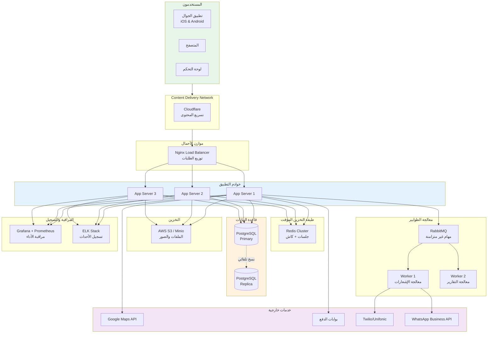

### 13.2 المكدس التقني المقترح (Tech Stack)

#### Frontend
| المكون | التقنية | السبب |
|--------|---------|-------|
| تطبيق الجوال | React Native 0.72+ | كود واحد لـ iOS & Android |
| الموقع | Next.js 13+ | SSR, SEO, أداء عالي |
| لوحة التحكم | React 18+ + TypeScript | مرونة وقوة |
| UI Library | Material-UI / Tailwind CSS | تصميم احترافي جاهز |
| State Management | Redux Toolkit / Zustand | إدارة حالة فعالة |
| Form Handling | React Hook Form + Yup | نماذج قوية ومتحقق منها |

#### Backend
| المكون | التقنية | السبب |
|--------|---------|-------|
| API Framework | Node.js + Express.js | سريع، مرن، مجتمع كبير |
| البديل | Laravel 10+ (PHP) | إطار متكامل، آمن |
| Language | TypeScript | Type-safe, أقل أخطاء |
| API Documentation | Swagger/OpenAPI | توثيق تلقائي |
| Validation | Joi / Class-validator | تحقق من البيانات |

#### Database & Storage
| المكون | التقنية | السبب |
|--------|---------|-------|
| قاعدة البيانات | PostgreSQL 14+ | ميزات متقدمة، استقرار |
| البديل | MySQL 8.0+ | شهرة واسعة |
| Cache | Redis 7+ | أداء ممتاز |
| File Storage | AWS S3 / Minio | موثوق، قابل للتوسع |
| Search | Elasticsearch | بحث متقدم |

#### DevOps & Infrastructure
| المكون | التقنية | السبب |
|--------|---------|-------|
| Containerization | Docker | نشر متسق |
| Orchestration | Kubernetes / Docker Swarm | إدارة الحاويات |
| CI/CD | GitLab CI / GitHub Actions | أتمتة النشر |
| Monitoring | Grafana + Prometheus | مراقبة شاملة |
| Logging | ELK Stack | تسجيل مركزي |
| Version Control | Git + GitLab/GitHub | إدارة الكود |

#### External Services
| الخدمة | المزود | الغرض |
|--------|--------|-------|
| Maps | Google Maps API | حساب المسافات، الخرائط |
| Payment | Moyasar / Hyperpay | بوابة الدفع السعودية |
| SMS | Twilio / Unifonic | إرسال SMS |
| WhatsApp | WhatsApp Business API | رسائل واتساب |
| Email | SendGrid / AWS SES | البريد الإلكتروني |
| Push Notifications | Firebase Cloud Messaging | إشعارات الجوال |

### 13.3 استراتيجية النشر

**بيئات العمل:**
1. **Development:** للتطوير اليومي
2. **Staging:** لاختبار الميزات الجديدة
3. **Production:** البيئة الحية

**عملية النشر:**
```
[Push to Git] → [Automated Tests] → [Build Docker Images] → 
[Deploy to Staging] → [Manual Testing] → [Deploy to Production]
```

**استراتيجية النشر Zero-Downtime:**
- Blue-Green Deployment
- Rolling Updates
- Canary Releases

---

## 14. خطة التنفيذ والتطوير

### 14.1 الجدول الزمني الكامل

#### المرحلة 1: التحليل والتصميم التفصيلي (6 أسابيع)

**الأسبوع 1-2:**
- مراجعة المتطلبات مع العميل ✓
- إعداد وثيقة المتطلبات الوظيفية (FRD)
- إعداد وثيقة المواصفات الفنية (TSD)

**الأسبوع 3-4:**
- تصميم مخططات قاعدة البيانات التفصيلية
- تصميم API Documentation
- تصميم معمارية النظام الكاملة

**الأسبوع 5-6:**
- تصميم واجهات UI/UX (Figma/Adobe XD)
- تصميم Wireframes تفاعلية
- مراجعة نهائية مع العميل

**المخرجات:**
- وثيقة التحليل الكامل ✓
- مخططات قاعدة البيانات
- تصاميم UI/UX
- API Documentation
- خطة التطوير المعتمدة

#### المرحلة 2: إعداد البنية التحتية (2 أسبوع)

**المهام:**
- إعداد خوادم AWS/Google Cloud
- إعداد بيئات (Dev, Staging, Prod)
- إعداد Git Repository
- إعداد CI/CD Pipeline
- إعداد قاعدة البيانات
- إعداد Redis
- إعداد Storage (S3/Minio)

#### المرحلة 3: تطوير Backend API (10 أسابيع)

**الأسبوع 1-2: الأساسيات**
- إعداد مشروع Backend
- تطبيق Authentication & Authorization
- نظام الأدوار والصلاحيات
- إعداد Middleware
- إعداد Error Handling

**الأسبوع 3-4: إدارة المستخدمين**
- APIs تسجيل المستخدمين
- APIs تسجيل الدخول والخروج
- APIs الشركات والفنادق
- APIs الموردين
- APIs المشرفين

**الأسبوع 5-6: نظام الحجوزات**
- APIs إنشاء حجز
- APIs السلة (حجوزات متعددة)
- APIs التسعير والحسابات
- APIs تأكيد الحجز
- APIs إلغاء الحجز

**الأسبوع 7-8: نظام التشغيل**
- APIs استقبال الحجوزات
- APIs الحجوزات المؤكدة
- APIs قيد التجهيز
- APIs ربط مع سائق
- APIs قيد التنفيذ
- APIs المراجعة والإقفال

**الأسبوع 9-10: الأنظمة المساندة**
- نظام المدفوعات وتكامل بوابات الدفع
- نظام الإشعارات (SMS + WhatsApp)
- نظام التقارير
- نظام التقييمات
- Google Maps Integration
- نظام الإعدادات

#### المرحلة 4: تطوير لوحة التحكم الإدارية (8 أسابيع)

**الأسبوع 1-2: الأساسيات والمصادقة**
- إعداد مشروع React
- تسجيل دخول المشرفين
- Dashboard الرئيسي
- القوائم والتنقل

**الأسبوع 3-4: إدارة الحجوزات**
- شاشة استقبال الحجوزات
- شاشة الحجوزات المؤكدة
- شاشة قيد التجهيز
- شاشة قيد التنفيذ
- شاشة المراجعة والإقفال
- شاشة فتح حجز مقفل

**الأسبوع 5-6: إدارة الموارد**
- شاشة السيارات والأسعار
- شاشة العملاء (أفراد وشركات)
- شاشة الموردين
- شاشة الأسطول

**الأسبوع 7-8: المحاسبة والإعدادات**
- شاشات التقارير
- شاشة المستخدمين والصلاحيات
- شاشة الإعدادات
- توليد PDF للفواتير
- التكامل الكامل

#### المرحلة 5: تطوير الموقع الإلكتروني (4 أسابيع)

**الأسبوع 1:**
- الصفحة الرئيسية
- صفحة السيارات والأسعار

**الأسبوع 2:**
- نظام الحجز المدمج
- صفحة من نحن

**الأسبوع 3:**
- صفحة اتصل بنا
- تحسين SEO

**الأسبوع 4:**
- اختبار الأداء
- تحسينات نهائية

#### المرحلة 6: تطوير تطبيق الجوال (12 أسبوع)

**الأسبوع 1-3: للعملاء الأفراد**
- شاشة التسجيل والدخول
- الشاشة الرئيسية (عرض السيارات)
- شاشة الخدمات
- شاشة السلة
- شاشة الدفع
- شاشة تفاصيل الحجز

**الأسبوع 4-6: للشركات والفنادق**
- تسجيل الشركات
- واجهة موظفي الشركات
- الحجز للعملاء
- عرض الفواتير الشهرية

**الأسبوع 7-10: للموردين/السائقين**
- شاشة التسجيل وإدخال البيانات
- رفع المستندات والصور
- لوحة تحكم السائق
- استقبال الحجوزات
- قبول/رفض الحجوزات
- متابعة الرحلات النشطة
- كشف الحساب

**الأسبوع 11-12: التكامل والتحسينات**
- نظام الإشعارات Push
- التكامل مع خرائط Google
- تحسينات الأداء
- تحسينات UX

#### المرحلة 7: الاختبار الشامل (6 أسابيع)

**الأسبوع 1-2: اختبار الوحدات (Unit Testing)**
- اختبار APIs
- اختبار Functions
- اختبار Components

**الأسبوع 3-4: اختبار التكامل**
- اختبار تكامل Backend + Frontend
- اختبار تكامل مع الخدمات الخارجية
- اختبار End-to-End

**الأسبوع 5: اختبار الأداء والأمان**
- Load Testing (5000+ مستخدم متزامن)
- Stress Testing
- Security Testing (Penetration Testing)
- اختبار النسخ الاحتياطي والاسترجاع

**الأسبوع 6: UAT (User Acceptance Testing)**
- اختبار مع مجموعة من المستخدمين الفعليين
- جمع الملاحظات
- إصلاح المشاكل

#### المرحلة 8: النشر والإطلاق (3 أسابيع)

**الأسبوع 1: التحضير**
- نشر على Staging للمراجعة النهائية
- إعداد Production Environment
- إعداد SSL Certificates
- إعداد DNS
- اختبار نهائي شامل

**الأسبوع 2: النشر التدريجي**
- نشر Backend على Production
- نشر لوحة التحكم
- نشر الموقع الإلكتروني
- رفع التطبيق على Stores (TestFlight/Google Play Console)
- اختبار ما بعد النشر

**الأسبوع 3: الإطلاق الرسمي**
- تدريب الفريق الإداري (يومين)
- تدريب فريق التشغيل (يومين)
- تدريب فريق الدعم (يوم)
- الإطلاق الرسمي
- مراقبة مكثفة 24/7

#### المرحلة 9: الصيانة والدعم (مستمرة)

**الشهر الأول بعد الإطلاق:**
- دعم فني مكثف 24/7
- متابعة يومية للأداء
- إصلاح الأخطاء الطارئة
- جمع ملاحظات المستخدمين

**الأشهر 2-3:**
- دعم فني 16/5
- تحديثات أسبوعية
- تحسينات الأداء
- إضافة مميزات صغيرة

**بعد 3 أشهر:**
- دعم فني 8/5
- تحديثات شهرية
- صيانة دورية
- تحسينات مستمرة

### 14.2 الجدول الزمني الإجمالي

| المرحلة | المدة | تاريخ البدء | تاريخ الانتهاء |
|---------|------|------------|----------------|
| التحليل والتصميم | 6 أسابيع | الأسبوع 1 | الأسبوع 6 |
| إعداد البنية التحتية | 2 أسبوع | الأسبوع 7 | الأسبوع 8 |
| تطوير Backend | 10 أسابيع | الأسبوع 7 | الأسبوع 16 |
| تطوير لوحة التحكم | 8 أسابيع | الأسبوع 9 | الأسبوع 16 |
| تطوير الموقع | 4 أسابيع | الأسبوع 13 | الأسبوع 16 |
| تطوير التطبيق | 12 أسبوع | الأسبوع 9 | الأسبوع 20 |
| الاختبار الشامل | 6 أسابيع | الأسبوع 21 | الأسبوع 26 |
| النشر والإطلاق | 3 أسابيع | الأسبوع 27 | الأسبوع 29 |
| **الإجمالي** | **~7 أشهر** | | |

### 14.3 الفريق المطلوب

#### فريق التطوير

| الدور | العدد | المسؤوليات |
|------|------|-----------|
| مدير المشروع | 1 | التنسيق، المتابعة، التواصل مع العميل |
| محلل نظم | 1 | التحليل، توثيق المتطلبات |
| مهندس معماري | 1 | تصميم البنية التقنية |
| Backend Developer | 2 | تطوير APIs والخدمات |
| Frontend Developer | 2 | تطوير لوحة التحكم والموقع |
| Mobile Developer | 2 | تطوير تطبيق الجوال |
| UI/UX Designer | 1 | تصميم الواجهات |
| QA Engineer | 2 | الاختبار وضمان الجودة |
| DevOps Engineer | 1 | البنية التحتية والنشر |
| Database Administrator | 1 | إدارة قواعد البيانات |
| **الإجمالي** | **14 شخص** | |

#### فريق ما بعد الإطلاق

| الدور | العدد | المسؤوليات |
|------|------|-----------|
| Backend Developer | 1 | الصيانة والتطوير |
| Frontend/Mobile Developer | 1 | التحديثات والتحسينات |
| DevOps Engineer | 1 | المراقبة والنشر |
| Database Admin | 1 (Part-time) | الصيانة والتحسين |
| Support Team | 2 | الدعم الفني |
| **الإجمالي** | **5-6 أشخاص** | |

### 14.4 التكلفة التقديرية

#### تكلفة التطوير (مرة واحدة)

| البند | التكلفة التقديرية (ريال سعودي) |
|------|-------------------------------|
| التحليل والتصميم | 80,000 |
| تطوير Backend | 150,000 |
| تطوير لوحة التحكم | 100,000 |
| تطوير الموقع | 50,000 |
| تطوير التطبيق | 180,000 |
| الاختبار والجودة | 70,000 |
| النشر والإطلاق | 30,000 |
| التدريب والدعم الأولي | 40,000 |
| **الإجمالي** | **700,000 ريال** |

#### التكاليف التشغيلية السنوية

| البند | التكلفة السنوية (ريال سعودي) |
|------|------------------------------|
| الاستضافة (AWS/Cloud) | 60,000 |
| قواعد البيانات المدارة | 30,000 |
| بوابة الدفع (رسوم ثابتة) | 10,000 |
| Google Maps API | 20,000 |
| SMS (Twilio/Unifonic) | 30,000 |
| WhatsApp Business API | 15,000 |
| SSL Certificates | 3,000 |
| Monitoring Tools | 5,000 |
| فريق الصيانة | 250,000 |
| تحديثات وتطويرات | 50,000 |
| **الإجمالي السنة الأولى** | **473,000 ريال** |

**ملاحظة:** التكاليف قابلة للتعديل حسب:
- حجم الاستخدام الفعلي
- عدد المعاملات
- حجم البيانات
- متطلبات إضافية

---

## 15. إدارة المخاطر

### 15.1 المخاطر المحتملة وخطط التخفيف

| المخاطرة | الاحتمالية | التأثير | خطة التخفيف |
|----------|-----------|---------|-------------|
| تأخر التطوير | متوسط | عالي | Buffer time 20%، متابعة أسبوعية |
| تغيير المتطلبات | عالي | متوسط | Agile approach، تواصل مستمر |
| مشاكل تقنية | متوسط | عالي | POC للتقنيات الحرجة، فريق خبير |
| مشاكل التكامل | متوسط | متوسط | اختبار مبكر، APIs موثقة |
| تجاوز الميزانية | منخفض | عالي | تقديرات دقيقة، مراقبة مستمرة |
| مشاكل الأداء | منخفض | عالي | Load testing، تحسينات مستمرة |
| مشاكل أمنية | منخفض | عالي جداً | Security testing، مراجعات أمنية |
| فقدان البيانات | منخفض جداً | عالي جداً | نسخ احتياطي يومي، DRP |

### 15.2 خطة الطوارئ

**في حالة تعطل النظام الكامل:**
1. التحويل الفوري للنسخة الاحتياطية
2. إشعار العملاء والشركاء
3. فريق استجابة سريعة
4. استرجاع من آخر نسخة احتياطية
5. تحليل السبب الجذري
6. تطبيق الإصلاحات
7. الوقاية من تكرار المشكلة

**في حالة اختراق أمني:**
1. عزل النظام فوراً
2. تحليل الاختراق
3. إصلاح الثغرات
4. تغيير جميع كلمات المرور
5. إشعار الجهات المختصة
6. إشعار المتأثرين
7. تقرير شامل ودروس مستفادة

---

## 16. الخلاصة والتوصيات

### 16.1 الخلاصة

تم إعداد تحليل وتصميم شامل ومتكامل لنظام **رحلتي VIP** - نظام متقدم لإدارة شركات النقل والتوصيل الفاخرة في السوق السعودي. النظام مصمم ليكون:

✅ **شامل ومتكامل:** يخدم ثلاث فئات رئيسية (B2C, B2B, Partners) من منصة واحدة

✅ **مرن وقابل للتوسع:** يمكن إضافة مناطق وخدمات وميزات جديدة بسهولة

✅ **آمن وموثوق:** يحافظ على أمان البيانات بأعلى المعايير

✅ **مستدام طويل الأمد:** مصمم للعمل بكفاءة لمدة 10+ سنوات

✅ **يدعم الأتمتة:** يقلل الحاجة للموظفين ويزيد الكفاءة

✅ **سهل الاستخدام:** واجهات بسيطة وسلسة لجميع الفئات

### 16.2 الميزات الرئيسية

**للعملاء:**
- حجز سريع وسهل من الجوال
- شاشة متحركة لعرض السيارات
- أسعار شفافة ومحسوبة تلقائياً
- طرق دفع متعددة
- متابعة الحجز لحظياً
- نظام تقييم شامل

**للشركات والفنادق:**
- حسابات مخصصة مع خصومات
- دفع آجل (كريديت) مريح
- تقارير شهرية تفصيلية
- واجهة سهلة للموظفين

**للموردين والسائقين:**
- تسجيل إلكتروني واضح
- استقبال حجوزات تلقائي
- كشف حساب شفاف
- دفعات منتظمة

**للإدارة:**
- لوحة تحكم شاملة
- 6 شاشات لإدارة الحجوزات
- إدارة كاملة للأسطول والأسعار
- نظام محاسبة متكامل
- تقارير تحليلية متقدمة
- صلاحيات مخصصة

### 16.3 التوصيات

#### قصيرة المدى (الأشهر الثلاثة الأولى)

1. **التركيز على التجربة:** الاهتمام بتجربة المستخدم في التطبيق والموقع
2. **الاختبار المكثف:** إجراء اختبارات شاملة قبل الإطلاق
3. **التدريب الجيد:** تدريب الفريق الإداري والتشغيلي بشكل كافٍ
4. **الإطلاق التدريجي:** البدء بمدينة أو اثنتين ثم التوسع
5. **المراقبة المستمرة:** متابعة الأداء والمشاكل بشكل يومي

#### متوسطة المدى (السنة الأولى)

1. **جمع التغذية الراجعة:** الاستماع لملاحظات المستخدمين والتحسين المستمر
2. **التوسع الجغرافي:** إضافة مناطق جديدة تدريجياً
3. **زيادة الموردين:** التعاقد مع موردين إضافيين لضمان التوفر
4. **التسويق النشط:** حملات تسويقية مكثفة لزيادة عدد المستخدمين
5. **الشراكات:** عقد شراكات مع فنادق وشركات كبرى

#### طويلة المدى (10 سنوات)

1. **التطوير المستمر:** إضافة ميزات جديدة بناءً على احتياجات السوق
2. **التوسع الإقليمي:** التوسع لدول الخليج
3. **الذكاء الاصطناعي:** دمج AI في التشغيل والتسعير
4. **خدمات إضافية:** إضافة خدمات مثل الطيران الخاص، اليخوت
5. **الأسطول الخاص:** بناء أسطول خاص من السيارات الفاخرة
6. **البرامج الولاء:** إطلاق برامج ولاء متقدمة
7. **المراجعة التقنية:** مراجعة وتحديث التقنيات كل 3 سنوات

### 16.4 مؤشرات النجاح (KPIs)

#### السنة الأولى

| المؤشر | الهدف |
|--------|-------|
| عدد المستخدمين المسجلين | 10,000+ |
| عدد الحجوزات الشهرية | 1,000+ |
| عدد الموردين النشطين | 100+ |
| عدد عقود الشركات | 20+ |
| معدل رضا العملاء | 90%+ |
| معدل إتمام الحجوزات | 95%+ |
| الإيرادات الشهرية | 200,000+ ريال |

#### السنة الخامسة

| المؤشر | الهدف |
|--------|-------|
| عدد المستخدمين | 100,000+ |
| عدد الحجوزات الشهرية | 10,000+ |
| عدد الموردين | 500+ |
| عدد عقود الشركات | 100+ |
| التوفر (Uptime) | 99.9%+ |
| معدل رضا العملاء | 95%+ |
| الإيرادات السنوية | 30 مليون+ ريال |

### 16.5 العوامل الحاسمة للنجاح

1. ✅ **الجودة أولاً:** التركيز على جودة الخدمة والنظام
2. ✅ **تجربة المستخدم:** واجهات سهلة وسلسة
3. ✅ **الموثوقية:** نظام يعمل 24/7 دون مشاكل
4. ✅ **الشفافية:** أسعار واضحة وعمولات محددة
5. ✅ **الدعم الممتاز:** فريق دعم متاح وفعال
6. ✅ **التطوير المستمر:** تحديثات منتظمة وتحسينات
7. ✅ **الأمان:** حماية بيانات المستخدمين
8. ✅ **السرعة:** استجابة سريعة وأداء عالي

---

## المراجع والمصادر

1. **مراجع تحليل النظم:**
   - System Analysis and Design Methods - Whitten & Bentley
   - Modern Systems Analysis and Design - Hoffer, George & Valacich

2. **مراجع قواعد البيانات:**
   - Database System Concepts - Silberschatz, Korth & Sudarshan
   - PostgreSQL Documentation

3. **مراجع تطوير التطبيقات:**
   - React Native Documentation
   - Node.js Best Practices
   - Laravel Documentation

4. **معايير الأمان:**
   - OWASP Top 10
   - PCI DSS Standards
   - ISO 27001

5. **أفضل الممارسات:**
   - Twelve-Factor App Methodology
   - RESTful API Design Best Practices
   - Mobile App Development Best Practices

---

## الملاحق

### ملحق أ: مسرد المصطلحات

| المصطلح | المعنى |
|---------|--------|
| B2C | Business to Customer - العميل المباشر |
| B2B | Business to Business - الشركات |
| API | Application Programming Interface |
| JWT | JSON Web Token |
| RBAC | Role-Based Access Control |
| SDLC | Software Development Life Cycle |
| MVP | Minimum Viable Product |
| UAT | User Acceptance Testing |
| KPI | Key Performance Indicator |
| SLA | Service Level Agreement |

### ملحق ب: قائمة الاختصارات

- **SMS:** Short Message Service
- **OTP:** One-Time Password
- **PDF:** Portable Document Format
- **QR:** Quick Response
- **UI:** User Interface
- **UX:** User Experience
- **DFD:** Data Flow Diagram
- **ERD:** Entity Relationship Diagram
- **CDN:** Content Delivery Network

### ملحق ج: معلومات الاتصال

**للاستفسارات الفنية:**
- البريد الإلكتروني: tech@rehlaty-vip.com
- الهاتف: +966-XX-XXXX-XXX

**للدعم:**
- البريد الإلكتروني: support@rehlaty-vip.com
- الواتساب: +966-XX-XXXX-XXX

**للشراكات:**
- البريد الإلكتروني: partnerships@rehlaty-vip.com

---

**تم إعداد هذا التحليل بواسطة:** فريق التحليل والتصميم  
**التاريخ:** أكتوبر 2025  
**الإصدار:** 2.0 - النسخة النهائية الشاملة  
**حالة المستند:** جاهز للعرض على العميل والبدء في التطوير

---

## 🎯 ملخص تنفيذي للعميل

عزيزي العميل،

يسعدنا تقديم التحليل والتصميم الكامل لنظام **رحلتي VIP**. النظام الذي صممناه هو حل شامل ومتكامل يلبي جميع احتياجاتك ويضمن لك:

### ✨ ما يميز نظامنا:

1. **نظام متكامل 3 في 1:**
   - تطبيق جوال للعملاء والموردين
   - موقع إلكتروني احترافي
   - لوحة تحكم إدارية شاملة

2. **مصمم للاستدامة:**
   - يعمل بكفاءة لمدة 10+ سنوات
   - تقنيات حديثة ومستقرة
   - قابل للتطوير والتوسع

3. **يوفر الوقت والمال:**
   - أتمتة كاملة للعمليات
   - تقليل الحاجة للموظفين
   - تقارير تلقائية شاملة

4. **آمن وموثوق:**
   - حماية متقدمة للبيانات
   - توفر 99.9%
   - نسخ احتياطي يومي

### 📊 الأرقام الرئيسية:

- **مدة التطوير:** 7 أشهر
- **التكلفة الإجمالية:** 700,000 ريال
- **التكلفة التشغيلية السنوية:** ~473,000 ريال
- **العائد المتوقع السنة الأولى:** 2.4+ مليون ريال

### 🚀 الخطوات القادمة:

1. مراجعة هذا التحليل معكم
2. الموافقة على التصميم والخطة
3. توقيع العقد
4. بدء التطوير فوراً
5. الإطلاق بعد 7 أشهر

نحن جاهزون للبدء في تحويل رؤيتكم إلى واقع! 🎉

---


---